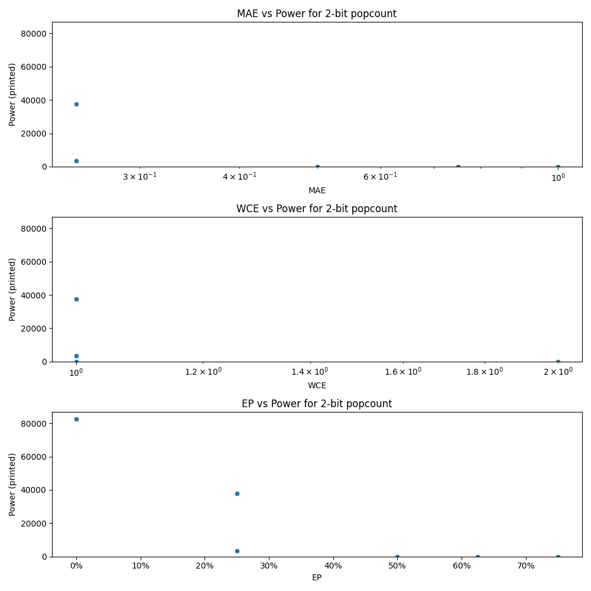

# Generated 2 bit popcount circuit
- __Circuit__: popcount (2 bit to 2.0 bit)

## Parameters of selected circuit
| Circuit         |   MAE |   WCE |    EP |            Area |   Power |       Delay | Download                                                               |
|:----------------|------:|------:|------:|----------------:|--------:|------------:|:-----------------------------------------------------------------------|
| popcount02_l4ww |  1    |     2 | 0.75  |      0          |     0   | 0           | [v](popcount02_l4ww.v) [c](popcount02_l4ww.c) [py](popcount02_l4ww.py) |
| popcount02_44vu |  0.5  |     1 | 0.5   |      0          |     0   | 0           | [v](popcount02_44vu.v) [c](popcount02_44vu.c) [py](popcount02_44vu.py) |
| popcount02_nt7k |  0.75 |     2 | 0.625 |      0          |     0   | 0           | [v](popcount02_nt7k.v) [c](popcount02_nt7k.c) [py](popcount02_nt7k.py) |
| popcount02_4ou5 |  0    |     0 | 0     |      1.2325e+06 | 82629   | 4.14802e+06 | [v](popcount02_4ou5.v) [c](popcount02_4ou5.c) [py](popcount02_4ou5.py) |
| popcount02_4jde |  0.25 |     1 | 0.25  | 563530          | 37703   | 3.14213e+06 | [v](popcount02_4jde.v) [c](popcount02_4jde.c) [py](popcount02_4jde.py) |
| popcount02_gdd7 |  0.25 |     1 | 0.25  | 476280          |  3460.8 | 2.5511e+06  | [v](popcount02_gdd7.v) [c](popcount02_gdd7.c) [py](popcount02_gdd7.py) |

## Parameters 
