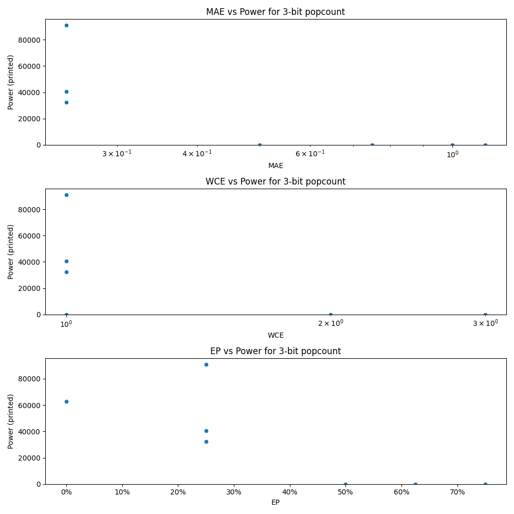

# Generated 3 bit popcount circuit
- __Circuit__: popcount (3 bit to 2.0 bit)

## Parameters of selected circuit
| Circuit         |   MAE |   WCE |    EP |        Area |   Power |       Delay | Download                                                               |
|:----------------|------:|------:|------:|------------:|--------:|------------:|:-----------------------------------------------------------------------|
| popcount03_pjei | 0     |     0 | 0     | 2.6448e+06  |   62962 | 1.02456e+07 | [v](popcount03_pjei.v) [c](popcount03_pjei.c) [py](popcount03_pjei.py) |
| popcount03_r5nl | 0.25  |     1 | 0.25  | 1.65336e+06 |   32378 | 7.59639e+06 | [v](popcount03_r5nl.v) [c](popcount03_r5nl.c) [py](popcount03_r5nl.py) |
| popcount03_fn1p | 0.25  |     1 | 0.25  | 1.96903e+06 |   91048 | 5.25941e+06 | [v](popcount03_fn1p.v) [c](popcount03_fn1p.c) [py](popcount03_fn1p.py) |
| popcount03_w7cr | 0.25  |     1 | 0.25  | 1.86234e+06 |   40501 | 7.9802e+06  | [v](popcount03_w7cr.v) [c](popcount03_w7cr.c) [py](popcount03_w7cr.py) |
| popcount03_o967 | 0.5   |     1 | 0.5   | 0           |       0 | 0           | [v](popcount03_o967.v) [c](popcount03_o967.c) [py](popcount03_o967.py) |
| popcount03_toh8 | 1.125 |     3 | 0.75  | 0           |       0 | 0           | [v](popcount03_toh8.v) [c](popcount03_toh8.c) [py](popcount03_toh8.py) |
| popcount03_ybfi | 1     |     2 | 0.75  | 0           |       0 | 0           | [v](popcount03_ybfi.v) [c](popcount03_ybfi.c) [py](popcount03_ybfi.py) |
| popcount03_0b5p | 0.75  |     2 | 0.625 | 0           |       0 | 0           | [v](popcount03_0b5p.v) [c](popcount03_0b5p.c) [py](popcount03_0b5p.py) |

## Parameters 
