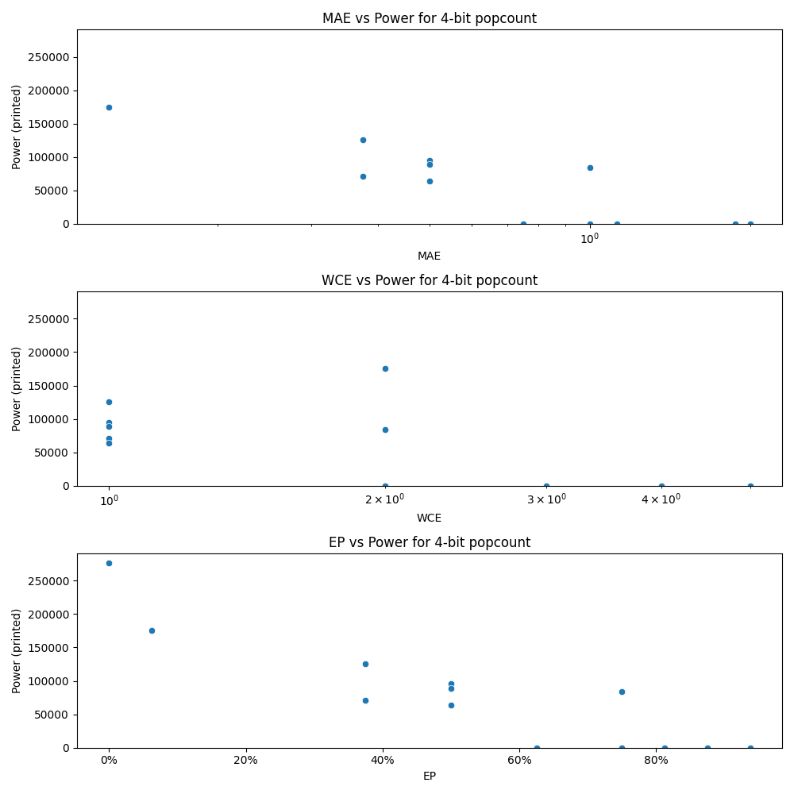

# Generated 4 bit popcount circuit
- __Circuit__: popcount (4 bit to 3.0 bit)

## Parameters of selected circuit
| Circuit         |   MAE |   WCE |     EP |             Area |   Power |       Delay | Download                                                               |
|:----------------|------:|------:|-------:|-----------------:|--------:|------------:|:-----------------------------------------------------------------------|
| popcount04_5abq | 0.125 |     2 | 0.0625 |      4.4838e+06  |  175070 | 1.3161e+07  | [v](popcount04_5abq.v) [c](popcount04_5abq.c) [py](popcount04_5abq.py) |
| popcount04_bwx0 | 0.375 |     1 | 0.375  |      1.74061e+06 |   70894 | 6.90239e+06 | [v](popcount04_bwx0.v) [c](popcount04_bwx0.c) [py](popcount04_bwx0.py) |
| popcount04_kts7 | 0.375 |     1 | 0.375  |      2.61639e+06 |  125760 | 7.50563e+06 | [v](popcount04_kts7.v) [c](popcount04_kts7.c) [py](popcount04_kts7.py) |
| popcount04_k69j | 0.75  |     2 | 0.625  |      0           |       0 | 0           | [v](popcount04_k69j.v) [c](popcount04_k69j.c) [py](popcount04_k69j.py) |
| popcount04_0rag | 2     |     4 | 0.9375 |      0           |       0 | 0           | [v](popcount04_0rag.v) [c](popcount04_0rag.c) [py](popcount04_0rag.py) |
| popcount04_dufb | 1.125 |     3 | 0.75   |      0           |       0 | 0           | [v](popcount04_dufb.v) [c](popcount04_dufb.c) [py](popcount04_dufb.py) |
| popcount04_rgzb | 1.875 |     5 | 0.8125 |      0           |       0 | 0           | [v](popcount04_rgzb.v) [c](popcount04_rgzb.c) [py](popcount04_rgzb.py) |
| popcount04_h8gk | 2     |     5 | 0.875  |      0           |       0 | 0           | [v](popcount04_h8gk.v) [c](popcount04_h8gk.c) [py](popcount04_h8gk.py) |
| popcount04_yhng | 0     |     0 | 0      |      5.50905e+06 |  276750 | 1.2523e+07  | [v](popcount04_yhng.v) [c](popcount04_yhng.c) [py](popcount04_yhng.py) |
| popcount04_zpp2 | 0.5   |     1 | 0.5    |      1.61936e+06 |   64244 | 5.21743e+06 | [v](popcount04_zpp2.v) [c](popcount04_zpp2.c) [py](popcount04_zpp2.py) |
| popcount04_lbeb | 0.5   |     1 | 0.5    |      1.72822e+06 |   95409 | 6.14682e+06 | [v](popcount04_lbeb.v) [c](popcount04_lbeb.c) [py](popcount04_lbeb.py) |
| popcount04_64qz | 0.5   |     1 | 0.5    |      2.36294e+06 |   88905 | 5.6251e+06  | [v](popcount04_64qz.v) [c](popcount04_64qz.c) [py](popcount04_64qz.py) |
| popcount04_jcb7 | 1     |     2 | 0.75   | 867000           |   83839 | 6.45664e+06 | [v](popcount04_jcb7.v) [c](popcount04_jcb7.c) [py](popcount04_jcb7.py) |
| popcount04_9clg | 1     |     2 | 0.75   |      0           |       0 | 0           | [v](popcount04_9clg.v) [c](popcount04_9clg.c) [py](popcount04_9clg.py) |

## Parameters 
