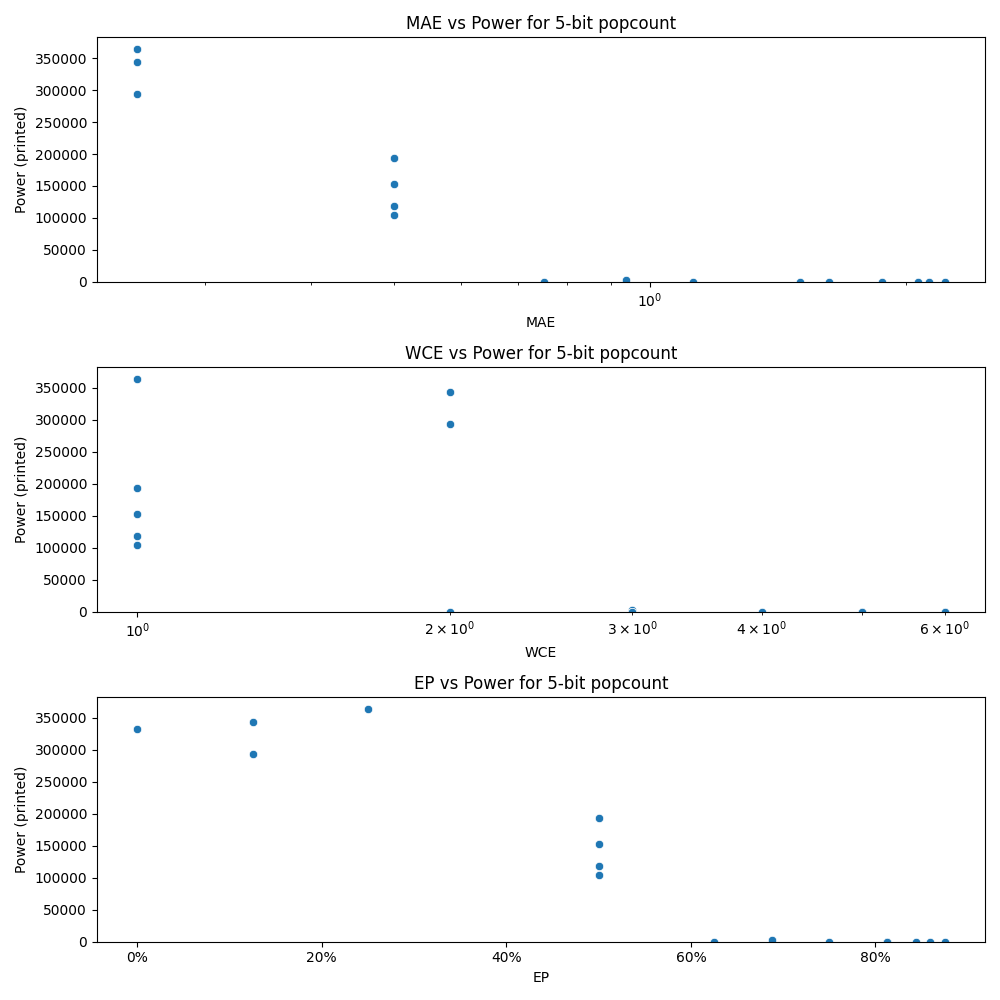

# Generated 5 bit popcount circuit
- __Circuit__: popcount (5 bit to 3.0 bit)

## Parameters of selected circuit
| Circuit         |     MAE |   WCE |       EP |             Area |    Power |       Delay | Download                                                               |
|:----------------|--------:|------:|---------:|-----------------:|---------:|------------:|:-----------------------------------------------------------------------|
| popcount05_7qfg | 0       |     0 | 0        |      6.94044e+06 | 332520   | 2.04377e+07 | [v](popcount05_7qfg.v) [c](popcount05_7qfg.c) [py](popcount05_7qfg.py) |
| popcount05_9dfr | 0.25    |     2 | 0.125    |      7.34238e+06 | 343150   | 1.80237e+07 | [v](popcount05_9dfr.v) [c](popcount05_9dfr.c) [py](popcount05_9dfr.py) |
| popcount05_7bh2 | 0.25    |     2 | 0.125    |      7.37784e+06 | 293050   | 2.11163e+07 | [v](popcount05_7bh2.v) [c](popcount05_7bh2.c) [py](popcount05_7bh2.py) |
| popcount05_iljt | 0.25    |     1 | 0.25     |      8.17129e+06 | 364110   | 1.64346e+07 | [v](popcount05_iljt.v) [c](popcount05_iljt.c) [py](popcount05_iljt.py) |
| popcount05_muxh | 0.5     |     1 | 0.5      |      2.53961e+06 | 152740   | 1.0211e+07  | [v](popcount05_muxh.v) [c](popcount05_muxh.c) [py](popcount05_muxh.py) |
| popcount05_t7an | 0.5     |     1 | 0.5      |      2.15106e+06 | 104880   | 5.16073e+06 | [v](popcount05_t7an.v) [c](popcount05_t7an.c) [py](popcount05_t7an.py) |
| popcount05_u50t | 0.5     |     1 | 0.5      |      1.87986e+06 | 118290   | 6.14639e+06 | [v](popcount05_u50t.v) [c](popcount05_u50t.c) [py](popcount05_u50t.py) |
| popcount05_7crw | 0.5     |     1 | 0.5      |      3.64381e+06 | 193430   | 9.82058e+06 | [v](popcount05_7crw.v) [c](popcount05_7crw.c) [py](popcount05_7crw.py) |
| popcount05_4caz | 0.75    |     2 | 0.625    |      0           |      0   | 0           | [v](popcount05_4caz.v) [c](popcount05_4caz.c) [py](popcount05_4caz.py) |
| popcount05_rjqn | 0.9375  |     3 | 0.6875   |      0           |      0   | 0           | [v](popcount05_rjqn.v) [c](popcount05_rjqn.c) [py](popcount05_rjqn.py) |
| popcount05_xcfx | 0.9375  |     3 | 0.6875   | 476280           |   3460.8 | 2.5511e+06  | [v](popcount05_xcfx.v) [c](popcount05_xcfx.c) [py](popcount05_xcfx.py) |
| popcount05_1d1m | 1.875   |     5 | 0.8125   |      0           |      0   | 0           | [v](popcount05_1d1m.v) [c](popcount05_1d1m.c) [py](popcount05_1d1m.py) |
| popcount05_ri33 | 2.21875 |     6 | 0.84375  |      0           |      0   | 0           | [v](popcount05_ri33.v) [c](popcount05_ri33.c) [py](popcount05_ri33.py) |
| popcount05_w57f | 1.625   |     4 | 0.8125   |      0           |      0   | 0           | [v](popcount05_w57f.v) [c](popcount05_w57f.c) [py](popcount05_w57f.py) |
| popcount05_myqf | 2.125   |     5 | 0.8125   |      0           |      0   | 0           | [v](popcount05_myqf.v) [c](popcount05_myqf.c) [py](popcount05_myqf.py) |
| popcount05_cnv7 | 2.0625  |     6 | 0.859375 |      0           |      0   | 0           | [v](popcount05_cnv7.v) [c](popcount05_cnv7.c) [py](popcount05_cnv7.py) |
| popcount05_r6ft | 1.125   |     3 | 0.75     |      0           |      0   | 0           | [v](popcount05_r6ft.v) [c](popcount05_r6ft.c) [py](popcount05_r6ft.py) |
| popcount05_sftc | 1.5     |     3 | 0.875    |      0           |      0   | 0           | [v](popcount05_sftc.v) [c](popcount05_sftc.c) [py](popcount05_sftc.py) |

## Parameters 
