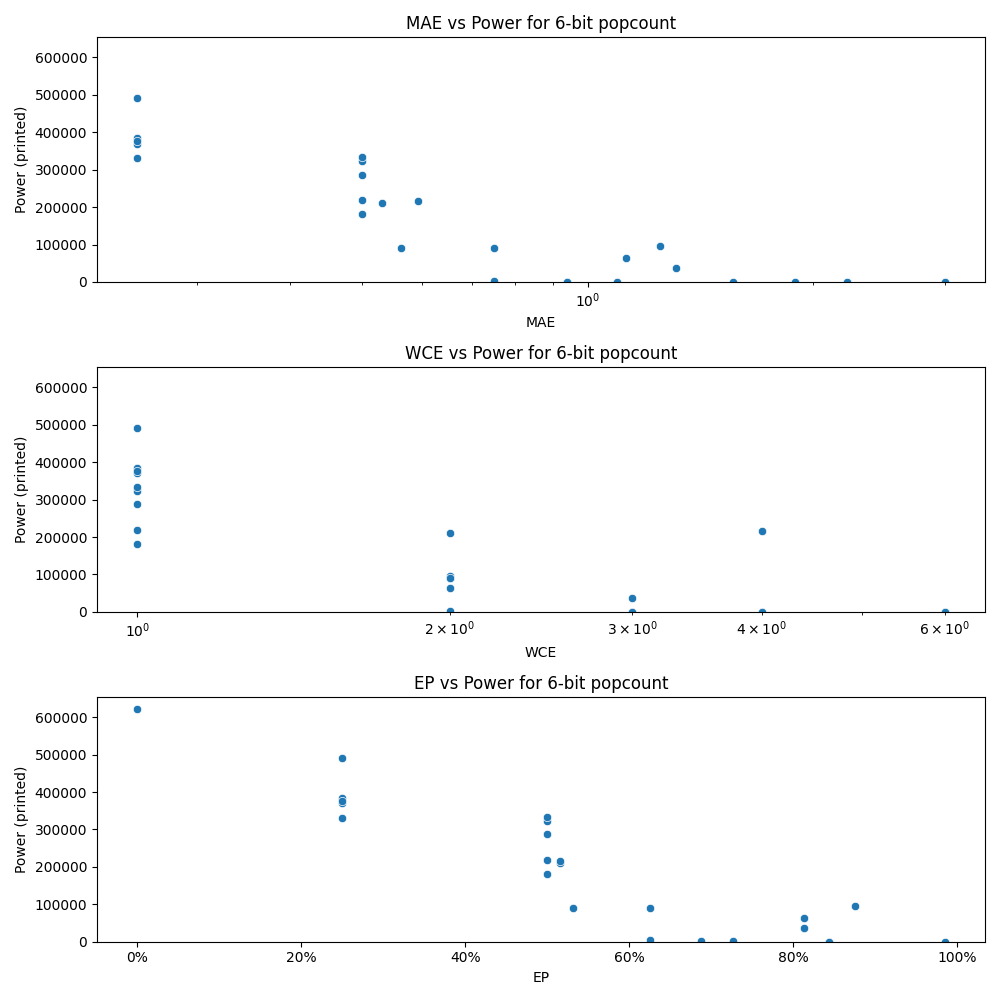

# Generated 6 bit popcount circuit
- __Circuit__: popcount (6 bit to 3.0 bit)

## Parameters of selected circuit
| Circuit         |     MAE |   WCE |       EP |             Area |      Power |            Delay | Download                                                               |
|:----------------|--------:|------:|---------:|-----------------:|-----------:|-----------------:|:-----------------------------------------------------------------------|
| popcount06_yn35 | 0       |     0 | 0        |      9.72086e+06 | 622610     |      2.43359e+07 | [v](popcount06_yn35.v) [c](popcount06_yn35.c) [py](popcount06_yn35.py) |
| popcount06_4akl | 0.25    |     1 | 0.25     |      6.49152e+06 | 331760     |      1.32814e+07 | [v](popcount06_4akl.v) [c](popcount06_4akl.c) [py](popcount06_4akl.py) |
| popcount06_jpv8 | 0.25    |     1 | 0.25     |      9.48353e+06 | 370020     |      2.50462e+07 | [v](popcount06_jpv8.v) [c](popcount06_jpv8.c) [py](popcount06_jpv8.py) |
| popcount06_egbo | 0.25    |     1 | 0.25     |      9.63517e+06 | 490340     |      2.28524e+07 | [v](popcount06_egbo.v) [c](popcount06_egbo.c) [py](popcount06_egbo.py) |
| popcount06_z09q | 0.25    |     1 | 0.25     |      9.65116e+06 | 384270     |      2.84017e+07 | [v](popcount06_z09q.v) [c](popcount06_z09q.c) [py](popcount06_z09q.py) |
| popcount06_se5v | 0.25    |     1 | 0.25     |      9.42619e+06 | 376650     |      2.34306e+07 | [v](popcount06_se5v.v) [c](popcount06_se5v.c) [py](popcount06_se5v.py) |
| popcount06_2awx | 0.5625  |     2 | 0.53125  |      2.39892e+06 |  89805     |      4.915e+06   | [v](popcount06_2awx.v) [c](popcount06_2awx.c) [py](popcount06_2awx.py) |
| popcount06_c4js | 0.5     |     1 | 0.5      |      6.01122e+06 | 287010     |      2.39893e+07 | [v](popcount06_c4js.v) [c](popcount06_c4js.c) [py](popcount06_c4js.py) |
| popcount06_vdxq | 0.53125 |     2 | 0.515625 |      3.82728e+06 | 210450     |      9.82058e+06 | [v](popcount06_vdxq.v) [c](popcount06_vdxq.c) [py](popcount06_vdxq.py) |
| popcount06_02zb | 0.59375 |     4 | 0.515625 |      6.64665e+06 | 216280     |      2.13066e+07 | [v](popcount06_02zb.v) [c](popcount06_02zb.c) [py](popcount06_02zb.py) |
| popcount06_cm4p | 0.5     |     1 | 0.5      |      7.6257e+06  | 322810     |      2.39893e+07 | [v](popcount06_cm4p.v) [c](popcount06_cm4p.c) [py](popcount06_cm4p.py) |
| popcount06_mjbz | 0.9375  |     3 | 0.6875   |      0           |      0     |      0           | [v](popcount06_mjbz.v) [c](popcount06_mjbz.c) [py](popcount06_mjbz.py) |
| popcount06_vzsk | 1.09375 |     4 | 0.726562 | 228420           |    878.448 | 565707           | [v](popcount06_vzsk.v) [c](popcount06_vzsk.c) [py](popcount06_vzsk.py) |
| popcount06_u9j5 | 1.5625  |     4 | 0.84375  |      0           |      0     |      0           | [v](popcount06_u9j5.v) [c](popcount06_u9j5.c) [py](popcount06_u9j5.py) |
| popcount06_scxj | 2.21875 |     6 | 0.84375  |      0           |      0     |      0           | [v](popcount06_scxj.v) [c](popcount06_scxj.c) [py](popcount06_scxj.py) |
| popcount06_tuy2 | 1.89062 |     6 | 0.84375  |      0           |      0     |      0           | [v](popcount06_tuy2.v) [c](popcount06_tuy2.c) [py](popcount06_tuy2.py) |
| popcount06_znhw | 3       |     6 | 0.984375 |      0           |      0     |      0           | [v](popcount06_znhw.v) [c](popcount06_znhw.c) [py](popcount06_znhw.py) |
| popcount06_7m17 | 0.5     |     1 | 0.5      |      3.84672e+06 | 218750     |      1.0212e+07  | [v](popcount06_7m17.v) [c](popcount06_7m17.c) [py](popcount06_7m17.py) |
| popcount06_sfls | 0.5     |     1 | 0.5      |      3.16753e+06 | 181830     |      9.23106e+06 | [v](popcount06_sfls.v) [c](popcount06_sfls.c) [py](popcount06_sfls.py) |
| popcount06_d8wx | 0.5     |     1 | 0.5      |      7.71295e+06 | 333410     |      2.34964e+07 | [v](popcount06_d8wx.v) [c](popcount06_d8wx.c) [py](popcount06_d8wx.py) |
| popcount06_1q08 | 1.25    |     2 | 0.875    |      1.97608e+06 |  95216     |      4.14802e+06 | [v](popcount06_1q08.v) [c](popcount06_1q08.c) [py](popcount06_1q08.py) |
| popcount06_p25c | 0.75    |     2 | 0.625    |      1.96903e+06 |  90723     |      7.60174e+06 | [v](popcount06_p25c.v) [c](popcount06_p25c.c) [py](popcount06_p25c.py) |
| popcount06_1tci | 0.75    |     2 | 0.625    | 476280           |   3460.8   |      2.5511e+06  | [v](popcount06_1tci.v) [c](popcount06_1tci.c) [py](popcount06_1tci.py) |
| popcount06_heju | 1.125   |     2 | 0.8125   |      1.92066e+06 |  63065     |      5.22248e+06 | [v](popcount06_heju.v) [c](popcount06_heju.c) [py](popcount06_heju.py) |
| popcount06_f8k7 | 1.3125  |     3 | 0.8125   | 433500           |  36240     |      3.17226e+06 | [v](popcount06_f8k7.v) [c](popcount06_f8k7.c) [py](popcount06_f8k7.py) |
| popcount06_rwmq | 0.9375  |     3 | 0.6875   | 228420           |    878.448 | 565707           | [v](popcount06_rwmq.v) [c](popcount06_rwmq.c) [py](popcount06_rwmq.py) |

## Parameters 
