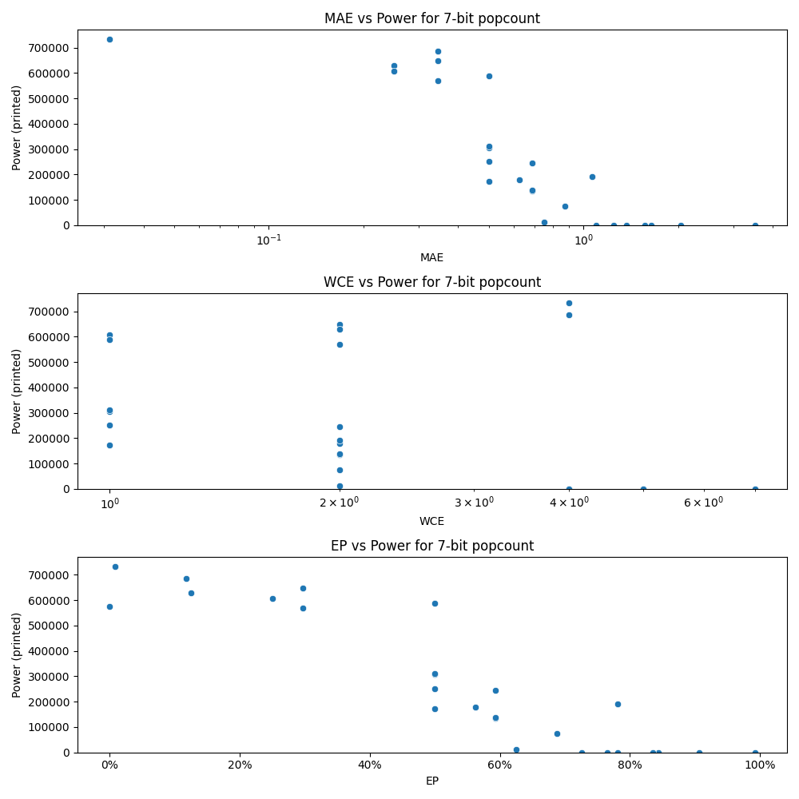

# Generated 7 bit popcount circuit
- __Circuit__: popcount (7 bit to 3.0 bit)

## Parameters of selected circuit
| Circuit         |     MAE |   WCE |        EP |             Area |   Power |       Delay | Download                                                               |
|:----------------|--------:|------:|----------:|-----------------:|--------:|------------:|:-----------------------------------------------------------------------|
| popcount07_5erh | 0.03125 |     4 | 0.0078125 |      1.37927e+07 |  733820 | 2.83723e+07 | [v](popcount07_5erh.v) [c](popcount07_5erh.c) [py](popcount07_5erh.py) |
| popcount07_k9pv | 0.34375 |     2 | 0.296875  |      1.23023e+07 |  649400 | 2.92604e+07 | [v](popcount07_k9pv.v) [c](popcount07_k9pv.c) [py](popcount07_k9pv.py) |
| popcount07_q1qk | 0.25    |     2 | 0.125     |      1.15107e+07 |  629150 | 2.45616e+07 | [v](popcount07_q1qk.v) [c](popcount07_q1qk.c) [py](popcount07_q1qk.py) |
| popcount07_mix5 | 0.25    |     1 | 0.25      |      1.08306e+07 |  607310 | 2.49572e+07 | [v](popcount07_mix5.v) [c](popcount07_mix5.c) [py](popcount07_mix5.py) |
| popcount07_u2va | 0.34375 |     2 | 0.296875  |      1.18093e+07 |  569630 | 2.80743e+07 | [v](popcount07_u2va.v) [c](popcount07_u2va.c) [py](popcount07_u2va.py) |
| popcount07_1ccn | 0.34375 |     4 | 0.117188  |      1.50468e+07 |  685510 | 3.55734e+07 | [v](popcount07_1ccn.v) [c](popcount07_1ccn.c) [py](popcount07_1ccn.py) |
| popcount07_ume1 | 0.6875  |     2 | 0.59375   |      2.71261e+06 |  134250 | 1.07696e+07 | [v](popcount07_ume1.v) [c](popcount07_ume1.c) [py](popcount07_ume1.py) |
| popcount07_c6w4 | 0.6875  |     2 | 0.59375   |      6.66609e+06 |  244890 | 1.93532e+07 | [v](popcount07_c6w4.v) [c](popcount07_c6w4.c) [py](popcount07_c6w4.py) |
| popcount07_nn4c | 0.625   |     2 | 0.5625    |      6.37935e+06 |  178480 | 1.8034e+07  | [v](popcount07_nn4c.v) [c](popcount07_nn4c.c) [py](popcount07_nn4c.py) |
| popcount07_b6x2 | 0.6875  |     2 | 0.59375   |      5.11562e+06 |  138040 | 1.42586e+07 | [v](popcount07_b6x2.v) [c](popcount07_b6x2.c) [py](popcount07_b6x2.py) |
| popcount07_tjhv | 1.09375 |     4 | 0.726562  |      0           |       0 | 0           | [v](popcount07_tjhv.v) [c](popcount07_tjhv.c) [py](popcount07_tjhv.py) |
| popcount07_nscg | 1.25    |     4 | 0.765625  |      0           |       0 | 0           | [v](popcount07_nscg.v) [c](popcount07_nscg.c) [py](popcount07_nscg.py) |
| popcount07_3ljx | 1.36719 |     5 | 0.78125   |      0           |       0 | 0           | [v](popcount07_3ljx.v) [c](popcount07_3ljx.c) [py](popcount07_3ljx.py) |
| popcount07_oguc | 1.5625  |     4 | 0.84375   |      0           |       0 | 0           | [v](popcount07_oguc.v) [c](popcount07_oguc.c) [py](popcount07_oguc.py) |
| popcount07_6uan | 1.64062 |     5 | 0.835938  |      0           |       0 | 0           | [v](popcount07_6uan.v) [c](popcount07_6uan.c) [py](popcount07_6uan.py) |
| popcount07_n158 | 2.03125 |     5 | 0.90625   |      0           |       0 | 0           | [v](popcount07_n158.v) [c](popcount07_n158.c) [py](popcount07_n158.py) |
| popcount07_zb3f | 3.5     |     7 | 0.992188  |      0           |       0 | 0           | [v](popcount07_zb3f.v) [c](popcount07_zb3f.c) [py](popcount07_zb3f.py) |
| popcount07_tn3p | 0       |     0 | 0         |      1.34947e+07 |  576580 | 3.46473e+07 | [v](popcount07_tn3p.v) [c](popcount07_tn3p.c) [py](popcount07_tn3p.py) |
| popcount07_t4xd | 0.5     |     1 | 0.5       |      9.11889e+06 |  306520 | 1.50892e+07 | [v](popcount07_t4xd.v) [c](popcount07_t4xd.c) [py](popcount07_t4xd.py) |
| popcount07_0b62 | 0.5     |     1 | 0.5       |      7.01492e+06 |  251640 | 1.58305e+07 | [v](popcount07_0b62.v) [c](popcount07_0b62.c) [py](popcount07_0b62.py) |
| popcount07_5gp9 | 0.5     |     1 | 0.5       |      5.95073e+06 |  172620 | 1.75559e+07 | [v](popcount07_5gp9.v) [c](popcount07_5gp9.c) [py](popcount07_5gp9.py) |
| popcount07_zxuq | 0.5     |     1 | 0.5       |      1.17073e+07 |  589630 | 2.32351e+07 | [v](popcount07_zxuq.v) [c](popcount07_zxuq.c) [py](popcount07_zxuq.py) |
| popcount07_qgua | 0.5     |     1 | 0.5       |      8.24267e+06 |  311490 | 2.40137e+07 | [v](popcount07_qgua.v) [c](popcount07_qgua.c) [py](popcount07_qgua.py) |
| popcount07_n412 | 0.875   |     2 | 0.6875    |      1.55497e+06 |   75945 | 6.1943e+06  | [v](popcount07_n412.v) [c](popcount07_n412.c) [py](popcount07_n412.py) |
| popcount07_nd8y | 0.75    |     2 | 0.625     | 972000           |   12278 | 4.37146e+06 | [v](popcount07_nd8y.v) [c](popcount07_nd8y.c) [py](popcount07_nd8y.py) |
| popcount07_ywb9 | 1.0625  |     2 | 0.78125   |      4.92589e+06 |  190910 | 9.99169e+06 | [v](popcount07_ywb9.v) [c](popcount07_ywb9.c) [py](popcount07_ywb9.py) |

## Parameters 
