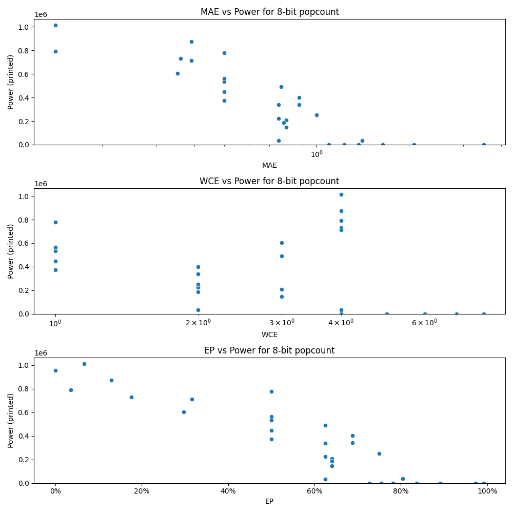

# Generated 8 bit popcount circuit
- __Circuit__: popcount (8 bit to 4.0 bit)

## Parameters of selected circuit
| Circuit         |      MAE |   WCE |        EP |             Area |          Power |            Delay | Download                                                               |
|:----------------|---------:|------:|----------:|-----------------:|---------------:|-----------------:|:-----------------------------------------------------------------------|
| popcount08_s8o9 | 0.140625 |     4 | 0.0664062 |      1.64835e+07 |      1.014e+06 |      2.94801e+07 | [v](popcount08_s8o9.v) [c](popcount08_s8o9.c) [py](popcount08_s8o9.py) |
| popcount08_q4nu | 0.140625 |     4 | 0.0351562 |      1.90413e+07 | 790590         |      2.72274e+07 | [v](popcount08_q4nu.v) [c](popcount08_q4nu.c) [py](popcount08_q4nu.py) |
| popcount08_iyc8 | 0.351562 |     3 | 0.296875  |      1.22261e+07 | 603180         |      2.61419e+07 | [v](popcount08_iyc8.v) [c](popcount08_iyc8.c) [py](popcount08_iyc8.py) |
| popcount08_ugj3 | 0.359375 |     4 | 0.175781  |      1.43427e+07 | 731240         |      2.75555e+07 | [v](popcount08_ugj3.v) [c](popcount08_ugj3.c) [py](popcount08_ugj3.py) |
| popcount08_wfog | 0.390625 |     4 | 0.316406  |      1.41092e+07 | 712290         |      2.83294e+07 | [v](popcount08_wfog.v) [c](popcount08_wfog.c) [py](popcount08_wfog.py) |
| popcount08_yzvu | 0.390625 |     4 | 0.128906  |      1.84866e+07 | 873760         |      3.60467e+07 | [v](popcount08_yzvu.v) [c](popcount08_yzvu.c) [py](popcount08_yzvu.py) |
| popcount08_337f | 0.765625 |     3 | 0.625     |      9.26131e+06 | 490570         |      2.66267e+07 | [v](popcount08_337f.v) [c](popcount08_337f.c) [py](popcount08_337f.py) |
| popcount08_0ngt | 0.796875 |     3 | 0.640625  |      3.80442e+06 | 146680         |      7.9216e+06  | [v](popcount08_0ngt.v) [c](popcount08_0ngt.c) [py](popcount08_0ngt.py) |
| popcount08_l34e | 0.796875 |     3 | 0.640625  |      2.98767e+06 | 207260         |      1.07345e+07 | [v](popcount08_l34e.v) [c](popcount08_l34e.c) [py](popcount08_l34e.py) |
| popcount08_64n3 | 0.75     |     2 | 0.625     |      2.19186e+06 |  32858         |      7.7795e+06  | [v](popcount08_64n3.v) [c](popcount08_64n3.c) [py](popcount08_64n3.py) |
| popcount08_tycd | 0.78125  |     2 | 0.640625  |      3.46883e+06 | 187320         |      1.35124e+07 | [v](popcount08_tycd.v) [c](popcount08_tycd.c) [py](popcount08_tycd.py) |
| popcount08_5jvn | 1.36719  |     5 | 0.78125   |      0           |      0         |      0           | [v](popcount08_5jvn.v) [c](popcount08_5jvn.c) [py](popcount08_5jvn.py) |
| popcount08_37nh | 1.23047  |     5 | 0.753906  |      0           |      0         |      0           | [v](popcount08_37nh.v) [c](popcount08_37nh.c) [py](popcount08_37nh.py) |
| popcount08_oitm | 1.09375  |     4 | 0.726562  |      0           |      0         |      0           | [v](popcount08_oitm.v) [c](popcount08_oitm.c) [py](popcount08_oitm.py) |
| popcount08_ytaj | 1.64062  |     5 | 0.835938  |      0           |      0         |      0           | [v](popcount08_ytaj.v) [c](popcount08_ytaj.c) [py](popcount08_ytaj.py) |
| popcount08_si9d | 3.50781  |     8 | 0.972656  |      0           |      0         |      0           | [v](popcount08_si9d.v) [c](popcount08_si9d.c) [py](popcount08_si9d.py) |
| popcount08_buex | 3.5      |     7 | 0.992188  |      0           |      0         |      0           | [v](popcount08_buex.v) [c](popcount08_buex.c) [py](popcount08_buex.py) |
| popcount08_sosq | 2.07812  |     6 | 0.890625  |      0           |      0         |      0           | [v](popcount08_sosq.v) [c](popcount08_sosq.c) [py](popcount08_sosq.py) |
| popcount08_rjet | 0        |     0 | 0         |      1.69482e+07 | 954080         |      3.30165e+07 | [v](popcount08_rjet.v) [c](popcount08_rjet.c) [py](popcount08_rjet.py) |
| popcount08_e7rz | 0.5      |     1 | 0.5       |      1.05426e+07 | 534610         |      1.73335e+07 | [v](popcount08_e7rz.v) [c](popcount08_e7rz.c) [py](popcount08_e7rz.py) |
| popcount08_5d03 | 0.5      |     1 | 0.5       |      1.09273e+07 | 374840         |      3.33301e+07 | [v](popcount08_5d03.v) [c](popcount08_5d03.c) [py](popcount08_5d03.py) |
| popcount08_bi6i | 0.5      |     1 | 0.5       |      8.81366e+06 | 449040         |      1.54175e+07 | [v](popcount08_bi6i.v) [c](popcount08_bi6i.c) [py](popcount08_bi6i.py) |
| popcount08_8c36 | 0.5      |     1 | 0.5       |      1.66434e+07 | 778990         |      3.80827e+07 | [v](popcount08_8c36.v) [c](popcount08_8c36.c) [py](popcount08_8c36.py) |
| popcount08_syyz | 0.5      |     1 | 0.5       |      1.37866e+07 | 563500         |      2.84536e+07 | [v](popcount08_syyz.v) [c](popcount08_syyz.c) [py](popcount08_syyz.py) |
| popcount08_s01n | 0.875    |     2 | 0.6875    |      6.46311e+06 | 340560         |      1.57134e+07 | [v](popcount08_s01n.v) [c](popcount08_s01n.c) [py](popcount08_s01n.py) |
| popcount08_t0vj | 0.875    |     2 | 0.6875    |      8.85175e+06 | 401810         |      1.8032e+07  | [v](popcount08_t0vj.v) [c](popcount08_t0vj.c) [py](popcount08_t0vj.py) |
| popcount08_akjl | 0.75     |     2 | 0.625     |      5.59787e+06 | 223780         |      1.57833e+07 | [v](popcount08_akjl.v) [c](popcount08_akjl.c) [py](popcount08_akjl.py) |
| popcount08_mrpe | 0.75     |     2 | 0.625     |      6.63828e+06 | 337610         |      1.54365e+07 | [v](popcount08_mrpe.v) [c](popcount08_mrpe.c) [py](popcount08_mrpe.py) |
| popcount08_7cjm | 1        |     2 | 0.75      |      4.78516e+06 | 250490         |      9.06239e+06 | [v](popcount08_7cjm.v) [c](popcount08_7cjm.c) [py](popcount08_7cjm.py) |
| popcount08_aw88 | 1.40625  |     4 | 0.804688  | 433500           |  36240         |      3.17226e+06 | [v](popcount08_aw88.v) [c](popcount08_aw88.c) [py](popcount08_aw88.py) |
| popcount08_8z23 | 1.09375  |     4 | 0.726562  | 228420           |    878.448     | 565707           | [v](popcount08_8z23.v) [c](popcount08_8z23.c) [py](popcount08_8z23.py) |

## Parameters 
