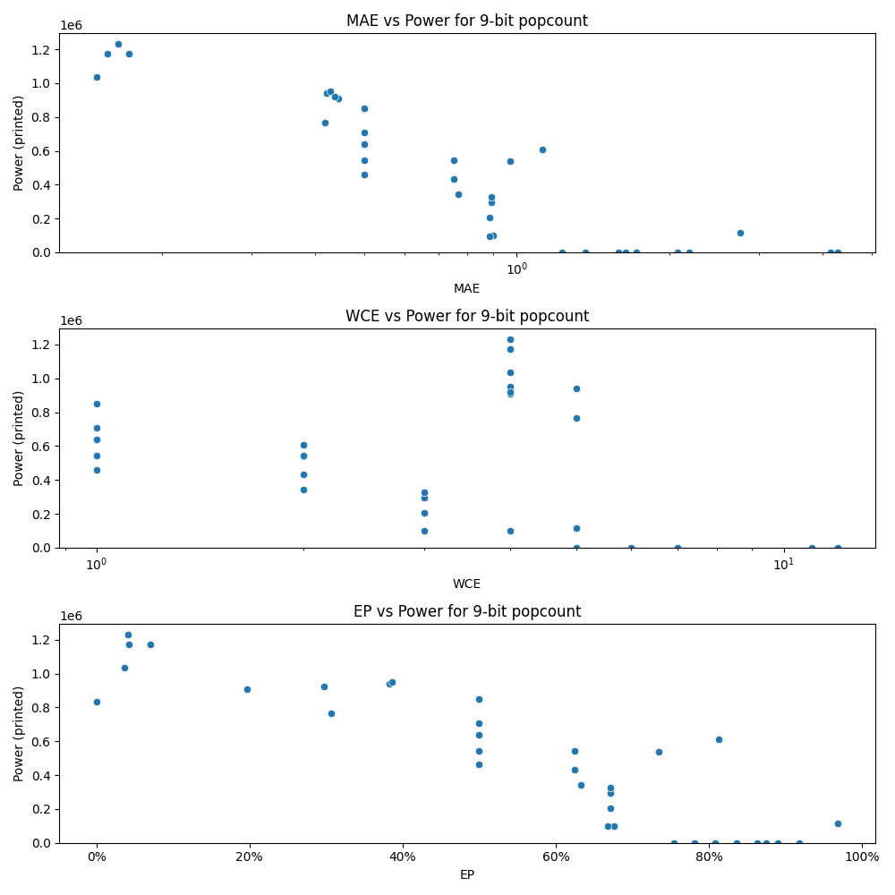

# Generated 9 bit popcount circuit
- __Circuit__: popcount (9 bit to 4.0 bit)

## Parameters of selected circuit
| Circuit         |      MAE |   WCE |        EP |        Area |           Power |       Delay | Download                                                               |
|:----------------|---------:|------:|----------:|------------:|----------------:|------------:|:-----------------------------------------------------------------------|
| popcount09_3tye | 0.15625  |     4 | 0.0703125 | 1.94339e+07 |      1.1731e+06 | 2.94873e+07 | [v](popcount09_3tye.v) [c](popcount09_3tye.c) [py](popcount09_3tye.py) |
| popcount09_wzhw | 0.164062 |     4 | 0.0410156 | 2.02368e+07 |      1.2321e+06 | 4.25243e+07 | [v](popcount09_wzhw.v) [c](popcount09_wzhw.c) [py](popcount09_wzhw.py) |
| popcount09_dvbw | 0.148438 |     4 | 0.0371094 | 2.00512e+07 |      1.0364e+06 | 4.06481e+07 | [v](popcount09_dvbw.v) [c](popcount09_dvbw.c) [py](popcount09_dvbw.py) |
| popcount09_9i0r | 0.171875 |     4 | 0.0429688 | 2.14783e+07 |      1.1747e+06 | 4.19665e+07 | [v](popcount09_9i0r.v) [c](popcount09_9i0r.c) [py](popcount09_9i0r.py) |
| popcount09_djaw | 0.421875 |     5 | 0.382812  | 1.54142e+07 | 942080          | 3.8437e+07  | [v](popcount09_djaw.v) [c](popcount09_djaw.c) [py](popcount09_djaw.py) |
| popcount09_pbj4 | 0.445312 |     4 | 0.197266  | 1.75763e+07 | 910490          | 3.47056e+07 | [v](popcount09_pbj4.v) [c](popcount09_pbj4.c) [py](popcount09_pbj4.py) |
| popcount09_h9q3 | 0.417969 |     5 | 0.306641  | 1.6575e+07  | 764590          | 3.3782e+07  | [v](popcount09_h9q3.v) [c](popcount09_h9q3.c) [py](popcount09_h9q3.py) |
| popcount09_mlbu | 0.429688 |     4 | 0.386719  | 1.7241e+07  | 951730          | 2.61135e+07 | [v](popcount09_mlbu.v) [c](popcount09_mlbu.c) [py](popcount09_mlbu.py) |
| popcount09_lvs3 | 0.4375   |     4 | 0.296875  | 1.79831e+07 | 921480          | 3.4722e+07  | [v](popcount09_lvs3.v) [c](popcount09_lvs3.c) [py](popcount09_lvs3.py) |
| popcount09_xhvt | 0.898438 |     3 | 0.675781  | 2.52914e+06 |  99412          | 8.77561e+06 | [v](popcount09_xhvt.v) [c](popcount09_xhvt.c) [py](popcount09_xhvt.py) |
| popcount09_67h5 | 0.890625 |     3 | 0.671875  | 4.77106e+06 | 295310          | 1.33646e+07 | [v](popcount09_67h5.v) [c](popcount09_67h5.c) [py](popcount09_67h5.py) |
| popcount09_0wpw | 0.882812 |     3 | 0.671875  | 5.33762e+06 | 206030          | 2.03976e+07 | [v](popcount09_0wpw.v) [c](popcount09_0wpw.c) [py](popcount09_0wpw.py) |
| popcount09_rx25 | 0.882812 |     4 | 0.667969  | 3.29216e+06 |  97482          | 6.92741e+06 | [v](popcount09_rx25.v) [c](popcount09_rx25.c) [py](popcount09_rx25.py) |
| popcount09_8hhh | 0.890625 |     3 | 0.671875  | 7.12353e+06 | 327430          | 1.62519e+07 | [v](popcount09_8hhh.v) [c](popcount09_8hhh.c) [py](popcount09_8hhh.py) |
| popcount09_2lw3 | 1.64062  |     5 | 0.835938  | 0           |      0          | 0           | [v](popcount09_2lw3.v) [c](popcount09_2lw3.c) [py](popcount09_2lw3.py) |
| popcount09_ab2p | 1.58594  |     6 | 0.808594  | 0           |      0          | 0           | [v](popcount09_ab2p.v) [c](popcount09_ab2p.c) [py](popcount09_ab2p.py) |
| popcount09_akef | 1.36719  |     5 | 0.78125   | 0           |      0          | 0           | [v](popcount09_akef.v) [c](popcount09_akef.c) [py](popcount09_akef.py) |
| popcount09_eerb | 1.72266  |     6 | 0.835938  | 0           |      0          | 0           | [v](popcount09_eerb.v) [c](popcount09_eerb.c) [py](popcount09_eerb.py) |
| popcount09_9ept | 4.29688  |    11 | 0.863281  | 0           |      0          | 0           | [v](popcount09_9ept.v) [c](popcount09_9ept.c) [py](popcount09_9ept.py) |
| popcount09_6x3e | 2.1875   |     7 | 0.875     | 0           |      0          | 0           | [v](popcount09_6x3e.v) [c](popcount09_6x3e.c) [py](popcount09_6x3e.py) |
| popcount09_yjz6 | 1.23047  |     5 | 0.753906  | 0           |      0          | 0           | [v](popcount09_yjz6.v) [c](popcount09_yjz6.c) [py](popcount09_yjz6.py) |
| popcount09_nxsc | 2.07812  |     6 | 0.890625  | 0           |      0          | 0           | [v](popcount09_nxsc.v) [c](popcount09_nxsc.c) [py](popcount09_nxsc.py) |
| popcount09_rhtn | 4.15234  |    12 | 0.917969  | 0           |      0          | 0           | [v](popcount09_rhtn.v) [c](popcount09_rhtn.c) [py](popcount09_rhtn.py) |
| popcount09_wh15 | 0        |     0 | 0         | 1.93858e+07 | 835350          | 3.29543e+07 | [v](popcount09_wh15.v) [c](popcount09_wh15.c) [py](popcount09_wh15.py) |
| popcount09_55fn | 0.5      |     1 | 0.5       | 1.20595e+07 | 545130          | 2.26382e+07 | [v](popcount09_55fn.v) [c](popcount09_55fn.c) [py](popcount09_55fn.py) |
| popcount09_9knk | 0.5      |     1 | 0.5       | 1.00973e+07 | 461350          | 2.1897e+07  | [v](popcount09_9knk.v) [c](popcount09_9knk.c) [py](popcount09_9knk.py) |
| popcount09_9s88 | 0.5      |     1 | 0.5       | 1.36256e+07 | 640860          | 3.45465e+07 | [v](popcount09_9s88.v) [c](popcount09_9s88.c) [py](popcount09_9s88.py) |
| popcount09_ptuk | 0.5      |     1 | 0.5       | 1.75211e+07 | 848990          | 3.71719e+07 | [v](popcount09_ptuk.v) [c](popcount09_ptuk.c) [py](popcount09_ptuk.py) |
| popcount09_wg1j | 0.5      |     1 | 0.5       | 1.55553e+07 | 708050          | 3.25781e+07 | [v](popcount09_wg1j.v) [c](popcount09_wg1j.c) [py](popcount09_wg1j.py) |
| popcount09_p2ed | 0.765625 |     2 | 0.632812  | 7.37104e+06 | 342810          | 1.90903e+07 | [v](popcount09_p2ed.v) [c](popcount09_p2ed.c) [py](popcount09_p2ed.py) |
| popcount09_o3k4 | 1.125    |     2 | 0.8125    | 1.17599e+07 | 609560          | 2.06497e+07 | [v](popcount09_o3k4.v) [c](popcount09_o3k4.c) [py](popcount09_o3k4.py) |
| popcount09_bbni | 0.96875  |     2 | 0.734375  | 1.23504e+07 | 540110          | 2.5232e+07  | [v](popcount09_bbni.v) [c](popcount09_bbni.c) [py](popcount09_bbni.py) |
| popcount09_cd13 | 0.75     |     2 | 0.625     | 8.77779e+06 | 432340          | 2.3343e+07  | [v](popcount09_cd13.v) [c](popcount09_cd13.c) [py](popcount09_cd13.py) |
| popcount09_vc7p | 0.75     |     2 | 0.625     | 1.16961e+07 | 542390          | 3.09046e+07 | [v](popcount09_vc7p.v) [c](popcount09_vc7p.c) [py](popcount09_vc7p.py) |
| popcount09_mxwa | 2.75781  |     5 | 0.96875   | 2.23633e+06 | 115680          | 6.84424e+06 | [v](popcount09_mxwa.v) [c](popcount09_mxwa.c) [py](popcount09_mxwa.py) |

## Parameters 
