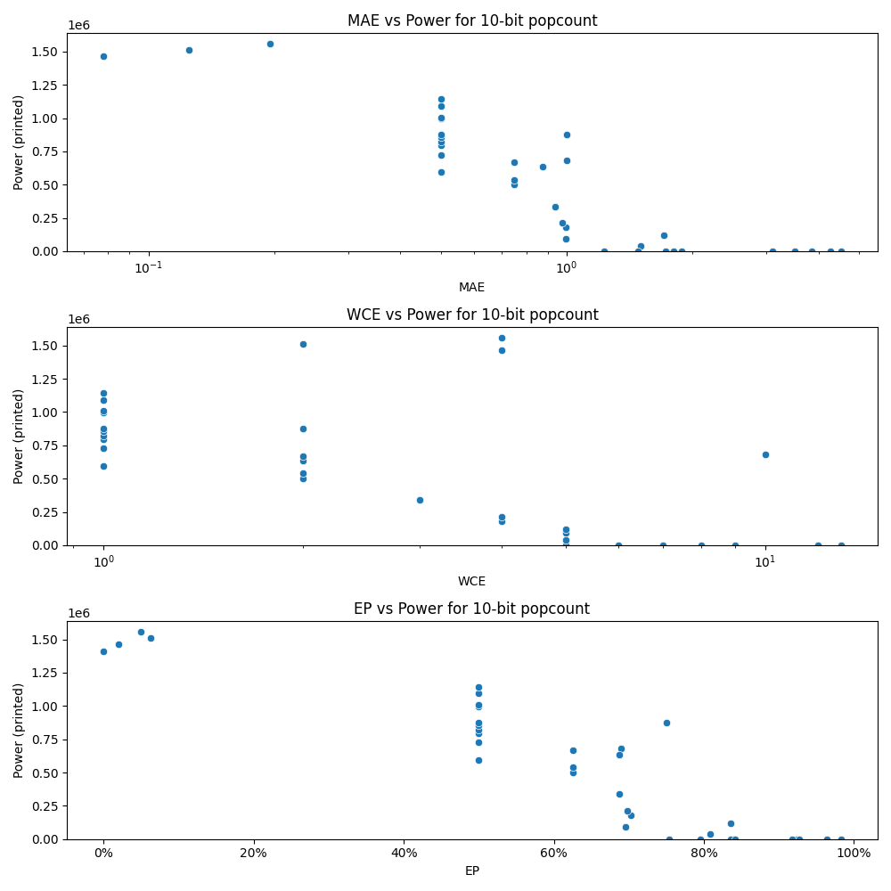

# Generated 10 bit popcount circuit
- __Circuit__: popcount (10 bit to 4.0 bit)

## Parameters of selected circuit
| Circuit         |      MAE |   WCE |        EP |             Area |           Power |       Delay | Download                                                               |
|:----------------|---------:|------:|----------:|-----------------:|----------------:|------------:|:-----------------------------------------------------------------------|
| popcount10_q4jr | 0.5      |     1 | 0.5       |      1.56304e+07 | 595080          | 3.2848e+07  | [v](popcount10_q4jr.v) [c](popcount10_q4jr.c) [py](popcount10_q4jr.py) |
| popcount10_zdql | 0.5      |     1 | 0.5       |      1.94271e+07 | 794300          | 4.35661e+07 | [v](popcount10_zdql.v) [c](popcount10_zdql.c) [py](popcount10_zdql.py) |
| popcount10_twl4 | 0.5      |     1 | 0.5       |      1.82454e+07 | 725970          | 4.3925e+07  | [v](popcount10_twl4.v) [c](popcount10_twl4.c) [py](popcount10_twl4.py) |
| popcount10_8ena | 0.5      |     1 | 0.5       |      2.01701e+07 | 822720          | 4.4278e+07  | [v](popcount10_8ena.v) [c](popcount10_8ena.c) [py](popcount10_8ena.py) |
| popcount10_sbro | 0.5      |     1 | 0.5       |      2.50748e+07 | 996150          | 4.51389e+07 | [v](popcount10_sbro.v) [c](popcount10_sbro.c) [py](popcount10_sbro.py) |
| popcount10_cs3q | 0.996094 |     5 | 0.695312  |      3.91948e+06 |  93795          | 1.52446e+07 | [v](popcount10_cs3q.v) [c](popcount10_cs3q.c) [py](popcount10_cs3q.py) |
| popcount10_5bqa | 0.996094 |     4 | 0.702148  |      3.8433e+06  | 177800          | 1.02199e+07 | [v](popcount10_5bqa.v) [c](popcount10_5bqa.c) [py](popcount10_5bqa.py) |
| popcount10_u5wm | 0.976562 |     4 | 0.697266  |      3.13931e+06 | 212830          | 1.07345e+07 | [v](popcount10_u5wm.v) [c](popcount10_u5wm.c) [py](popcount10_u5wm.py) |
| popcount10_9u3o | 1        |    10 | 0.689453  |      1.62354e+07 | 680340          | 2.81568e+07 | [v](popcount10_9u3o.v) [c](popcount10_9u3o.c) [py](popcount10_9u3o.py) |
| popcount10_c46q | 0.9375   |     3 | 0.6875    |      5.95692e+06 | 337920          | 1.29476e+07 | [v](popcount10_c46q.v) [c](popcount10_c46q.c) [py](popcount10_c46q.py) |
| popcount10_uaej | 3.50391  |     8 | 0.982422  |      0           |      0          | 0           | [v](popcount10_uaej.v) [c](popcount10_uaej.c) [py](popcount10_uaej.py) |
| popcount10_48zv | 4.52148  |    13 | 0.963867  |      0           |      0          | 0           | [v](popcount10_48zv.v) [c](popcount10_48zv.c) [py](popcount10_48zv.py) |
| popcount10_n0yn | 4.27539  |    12 | 0.923828  |      0           |      0          | 0           | [v](popcount10_n0yn.v) [c](popcount10_n0yn.c) [py](popcount10_n0yn.py) |
| popcount10_og78 | 3.85254  |    12 | 0.927246  |      0           |      0          | 0           | [v](popcount10_og78.v) [c](popcount10_og78.c) [py](popcount10_og78.py) |
| popcount10_56yg | 3.11133  |     9 | 0.916992  |      0           |      0          | 0           | [v](popcount10_56yg.v) [c](popcount10_56yg.c) [py](popcount10_56yg.py) |
| popcount10_hlvo | 0.5      |     1 | 0.5       |      2.09055e+07 |      1.0935e+06 | 4.97666e+07 | [v](popcount10_hlvo.v) [c](popcount10_hlvo.c) [py](popcount10_hlvo.py) |
| popcount10_87j7 | 0.5      |     1 | 0.5       |      2.07366e+07 |      1.0068e+06 | 4.76698e+07 | [v](popcount10_87j7.v) [c](popcount10_87j7.c) [py](popcount10_87j7.py) |
| popcount10_5ssc | 0.5      |     1 | 0.5       |      1.6844e+07  | 854710          | 3.19079e+07 | [v](popcount10_5ssc.v) [c](popcount10_5ssc.c) [py](popcount10_5ssc.py) |
| popcount10_4fo6 | 0.5      |     1 | 0.5       |      1.78843e+07 | 876600          | 4.65939e+07 | [v](popcount10_4fo6.v) [c](popcount10_4fo6.c) [py](popcount10_4fo6.py) |
| popcount10_iiri | 0.5      |     1 | 0.5       |      2.43937e+07 |      1.1441e+06 | 4.70785e+07 | [v](popcount10_iiri.v) [c](popcount10_iiri.c) [py](popcount10_iiri.py) |
| popcount10_fq29 | 0.078125 |     4 | 0.0195312 |      2.51339e+07 |      1.4671e+06 | 4.49592e+07 | [v](popcount10_fq29.v) [c](popcount10_fq29.c) [py](popcount10_fq29.py) |
| popcount10_541x | 1.23047  |     5 | 0.753906  |      0           |      0          | 0           | [v](popcount10_541x.v) [c](popcount10_541x.c) [py](popcount10_541x.py) |
| popcount10_ndh1 | 1.50391  |     5 | 0.808594  | 563530           |  37703          | 3.14213e+06 | [v](popcount10_ndh1.v) [c](popcount10_ndh1.c) [py](popcount10_ndh1.py) |
| popcount10_pdrv | 1.70703  |     5 | 0.835938  |      1.93503e+06 | 121960          | 6.53048e+06 | [v](popcount10_pdrv.v) [c](popcount10_pdrv.c) [py](popcount10_pdrv.py) |
| popcount10_vwgh | 0.875    |     2 | 0.6875    |      1.64723e+07 | 637250          | 3.90671e+07 | [v](popcount10_vwgh.v) [c](popcount10_vwgh.c) [py](popcount10_vwgh.py) |
| popcount10_6kdn | 0.75     |     2 | 0.625     |      1.0776e+07  | 500150          | 2.57155e+07 | [v](popcount10_6kdn.v) [c](popcount10_6kdn.c) [py](popcount10_6kdn.py) |
| popcount10_3pxa | 0.75     |     2 | 0.625     |      1.31295e+07 | 666770          | 3.16095e+07 | [v](popcount10_3pxa.v) [c](popcount10_3pxa.c) [py](popcount10_3pxa.py) |
| popcount10_z50v | 0.75     |     2 | 0.625     |      1.08007e+07 | 538080          | 2.7877e+07  | [v](popcount10_z50v.v) [c](popcount10_z50v.c) [py](popcount10_z50v.py) |
| popcount10_izrs | 1        |     2 | 0.75      |      1.77671e+07 | 874880          | 2.90903e+07 | [v](popcount10_izrs.v) [c](popcount10_izrs.c) [py](popcount10_izrs.py) |
| popcount10_3duh | 0.125    |     2 | 0.0625    |      2.61125e+07 |      1.5102e+06 | 4.97228e+07 | [v](popcount10_3duh.v) [c](popcount10_3duh.c) [py](popcount10_3duh.py) |
| popcount10_uc11 | 0.195312 |     4 | 0.0488281 |      2.63617e+07 |      1.5598e+06 | 4.55676e+07 | [v](popcount10_uc11.v) [c](popcount10_uc11.c) [py](popcount10_uc11.py) |
| popcount10_zd9y | 1.47656  |     6 | 0.794922  |      0           |      0          | 0           | [v](popcount10_zd9y.v) [c](popcount10_zd9y.c) [py](popcount10_zd9y.py) |
| popcount10_cge4 | 1.80469  |     7 | 0.838867  |      0           |      0          | 0           | [v](popcount10_cge4.v) [c](popcount10_cge4.c) [py](popcount10_cge4.py) |
| popcount10_2493 | 1.72266  |     6 | 0.835938  |      0           |      0          | 0           | [v](popcount10_2493.v) [c](popcount10_2493.c) [py](popcount10_2493.py) |
| popcount10_x1ug | 1.88672  |     7 | 0.841797  |      0           |      0          | 0           | [v](popcount10_x1ug.v) [c](popcount10_x1ug.c) [py](popcount10_x1ug.py) |
| popcount10_kdwb | 0        |     0 | 0         |      2.32782e+07 |      1.4088e+06 | 5.04448e+07 | [v](popcount10_kdwb.v) [c](popcount10_kdwb.c) [py](popcount10_kdwb.py) |

## Parameters 
