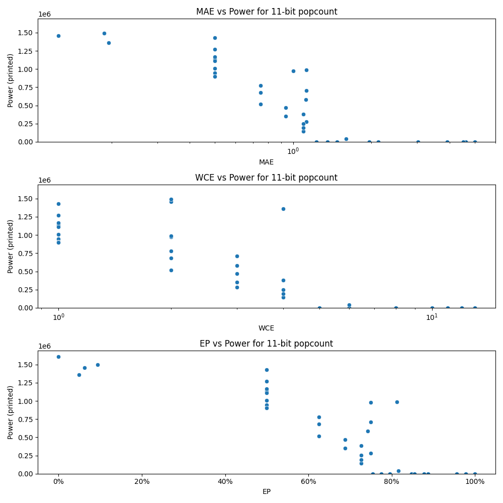

# Generated 11 bit popcount circuit
- __Circuit__: popcount (11 bit to 4.0 bit)

## Parameters of selected circuit
| Circuit         |      MAE |   WCE |        EP |        Area |           Power |       Delay | Download                                                               |
|:----------------|---------:|------:|----------:|------------:|----------------:|------------:|:-----------------------------------------------------------------------|
| popcount11_3gu2 | 5        |    10 | 0.999023  | 0           |      0          | 0           | [v](popcount11_3gu2.v) [c](popcount11_3gu2.c) [py](popcount11_3gu2.py) |
| popcount11_y684 | 3.02344  |     8 | 0.956055  | 0           |      0          | 0           | [v](popcount11_y684.v) [c](popcount11_y684.c) [py](popcount11_y684.py) |
| popcount11_bzh6 | 3.92676  |    12 | 0.887207  | 0           |      0          | 0           | [v](popcount11_bzh6.v) [c](popcount11_bzh6.c) [py](popcount11_bzh6.py) |
| popcount11_98m8 | 4.61523  |    13 | 0.876953  | 0           |      0          | 0           | [v](popcount11_98m8.v) [c](popcount11_98m8.c) [py](popcount11_98m8.py) |
| popcount11_h0bj | 4.51172  |    11 | 0.978027  | 0           |      0          | 0           | [v](popcount11_h0bj.v) [c](popcount11_h0bj.c) [py](popcount11_h0bj.py) |
| popcount11_ygp4 | 0        |     0 | 0         | 2.84789e+07 |      1.6102e+06 | 4.73131e+07 | [v](popcount11_ygp4.v) [c](popcount11_ygp4.c) [py](popcount11_ygp4.py) |
| popcount11_fs8b | 1.47656  |     6 | 0.794922  | 0           |      0          | 0           | [v](popcount11_fs8b.v) [c](popcount11_fs8b.c) [py](popcount11_fs8b.py) |
| popcount11_kr2a | 1.96582  |     8 | 0.846924  | 0           |      0          | 0           | [v](popcount11_kr2a.v) [c](popcount11_kr2a.c) [py](popcount11_kr2a.py) |
| popcount11_ttod | 1.35352  |     6 | 0.774414  | 0           |      0          | 0           | [v](popcount11_ttod.v) [c](popcount11_ttod.c) [py](popcount11_ttod.py) |
| popcount11_2or9 | 2.12695  |     8 | 0.85498   | 0           |      0          | 0           | [v](popcount11_2or9.v) [c](popcount11_2or9.c) [py](popcount11_2or9.py) |
| popcount11_13r5 | 0.5      |     1 | 0.5       | 2.36884e+07 | 944220          | 4.43932e+07 | [v](popcount11_13r5.v) [c](popcount11_13r5.c) [py](popcount11_13r5.py) |
| popcount11_bprq | 0.5      |     1 | 0.5       | 2.38053e+07 |      1.2696e+06 | 4.70737e+07 | [v](popcount11_bprq.v) [c](popcount11_bprq.c) [py](popcount11_bprq.py) |
| popcount11_4t2o | 0.5      |     1 | 0.5       | 2.34228e+07 |      1.0097e+06 | 3.65953e+07 | [v](popcount11_4t2o.v) [c](popcount11_4t2o.c) [py](popcount11_4t2o.py) |
| popcount11_4ru9 | 0.5      |     1 | 0.5       | 2.44446e+07 |      1.1183e+06 | 4.67609e+07 | [v](popcount11_4ru9.v) [c](popcount11_4ru9.c) [py](popcount11_4ru9.py) |
| popcount11_h4rx | 0.5      |     1 | 0.5       | 2.57108e+07 |      1.4317e+06 | 4.98036e+07 | [v](popcount11_h4rx.v) [c](popcount11_h4rx.c) [py](popcount11_h4rx.py) |
| popcount11_tur8 | 1.125    |     3 | 0.75      | 5.71394e+06 | 279250          | 1.27888e+07 | [v](popcount11_tur8.v) [c](popcount11_tur8.c) [py](popcount11_tur8.py) |
| popcount11_bw5b | 1.125    |     3 | 0.75      | 1.41843e+07 | 708170          | 3.63365e+07 | [v](popcount11_bw5b.v) [c](popcount11_bw5b.c) [py](popcount11_bw5b.py) |
| popcount11_1hst | 1.11719  |     3 | 0.742188  | 1.32415e+07 | 582690          | 2.66133e+07 | [v](popcount11_1hst.v) [c](popcount11_1hst.c) [py](popcount11_1hst.py) |
| popcount11_esm6 | 0.9375   |     3 | 0.6875    | 6.34403e+06 | 467670          | 1.64613e+07 | [v](popcount11_esm6.v) [c](popcount11_esm6.c) [py](popcount11_esm6.py) |
| popcount11_mihm | 0.9375   |     3 | 0.6875    | 7.88872e+06 | 352140          | 2.15067e+07 | [v](popcount11_mihm.v) [c](popcount11_mihm.c) [py](popcount11_mihm.py) |
| popcount11_k95p | 0.75     |     2 | 0.625     | 1.88266e+07 | 776780          | 3.84128e+07 | [v](popcount11_k95p.v) [c](popcount11_k95p.c) [py](popcount11_k95p.py) |
| popcount11_h5sy | 1        |     2 | 0.75      | 2.2298e+07  | 976790          | 4.72879e+07 | [v](popcount11_h5sy.v) [c](popcount11_h5sy.c) [py](popcount11_h5sy.py) |
| popcount11_wljh | 0.75     |     2 | 0.625     | 1.51897e+07 | 680350          | 4.36503e+07 | [v](popcount11_wljh.v) [c](popcount11_wljh.c) [py](popcount11_wljh.py) |
| popcount11_dxgc | 1.125    |     2 | 0.8125    | 1.81997e+07 | 988730          | 4.15365e+07 | [v](popcount11_dxgc.v) [c](popcount11_dxgc.c) [py](popcount11_dxgc.py) |
| popcount11_5cw8 | 0.75     |     2 | 0.625     | 1.14162e+07 | 515540          | 3.33371e+07 | [v](popcount11_5cw8.v) [c](popcount11_5cw8.c) [py](popcount11_5cw8.py) |
| popcount11_ri1g | 0.5      |     1 | 0.5       | 2.08861e+07 | 901520          | 4.57743e+07 | [v](popcount11_ri1g.v) [c](popcount11_ri1g.c) [py](popcount11_ri1g.py) |
| popcount11_9kbr | 0.5      |     1 | 0.5       | 2.15221e+07 |      1.1407e+06 | 4.76717e+07 | [v](popcount11_9kbr.v) [c](popcount11_9kbr.c) [py](popcount11_9kbr.py) |
| popcount11_t05r | 0.5      |     1 | 0.5       | 2.16442e+07 |      1.1134e+06 | 4.74776e+07 | [v](popcount11_t05r.v) [c](popcount11_t05r.c) [py](popcount11_t05r.py) |
| popcount11_h2zj | 0.5      |     1 | 0.5       | 2.28619e+07 | 900290          | 3.45181e+07 | [v](popcount11_h2zj.v) [c](popcount11_h2zj.c) [py](popcount11_h2zj.py) |
| popcount11_zcqw | 0.5      |     1 | 0.5       | 2.47793e+07 |      1.1694e+06 | 4.9184e+07  | [v](popcount11_zcqw.v) [c](popcount11_zcqw.c) [py](popcount11_zcqw.py) |
| popcount11_6c5o | 1.09375  |     4 | 0.726562  | 2.2725e+06  | 141820          | 1.00169e+07 | [v](popcount11_6c5o.v) [c](popcount11_6c5o.c) [py](popcount11_6c5o.py) |
| popcount11_2a3r | 1.09375  |     4 | 0.726562  | 4.65409e+06 | 194620          | 1.57811e+07 | [v](popcount11_2a3r.v) [c](popcount11_2a3r.c) [py](popcount11_2a3r.py) |
| popcount11_iz9m | 1.09375  |     4 | 0.726562  | 7.62956e+06 | 382360          | 2.44279e+07 | [v](popcount11_iz9m.v) [c](popcount11_iz9m.c) [py](popcount11_iz9m.py) |
| popcount11_fep9 | 1.09375  |     4 | 0.726562  | 6.1531e+06  | 251010          | 1.60385e+07 | [v](popcount11_fep9.v) [c](popcount11_fep9.c) [py](popcount11_fep9.py) |
| popcount11_zxmq | 0.125    |     2 | 0.0625    | 2.62953e+07 |      1.4585e+06 | 4.7313e+07  | [v](popcount11_zxmq.v) [c](popcount11_zxmq.c) [py](popcount11_zxmq.py) |
| popcount11_mo0w | 0.1875   |     2 | 0.09375   | 2.83482e+07 |      1.4945e+06 | 4.71972e+07 | [v](popcount11_mo0w.v) [c](popcount11_mo0w.c) [py](popcount11_mo0w.py) |
| popcount11_j7ne | 0.195312 |     4 | 0.0488281 | 2.49026e+07 |      1.3629e+06 | 4.07069e+07 | [v](popcount11_j7ne.v) [c](popcount11_j7ne.c) [py](popcount11_j7ne.py) |
| popcount11_yx6e | 1.23047  |     5 | 0.753906  | 0           |      0          | 0           | [v](popcount11_yx6e.v) [c](popcount11_yx6e.c) [py](popcount11_yx6e.py) |
| popcount11_qv4q | 1.59961  |     6 | 0.81543   | 1.03981e+06 |  42086          | 5.17047e+06 | [v](popcount11_qv4q.v) [c](popcount11_qv4q.c) [py](popcount11_qv4q.py) |

## Parameters 
