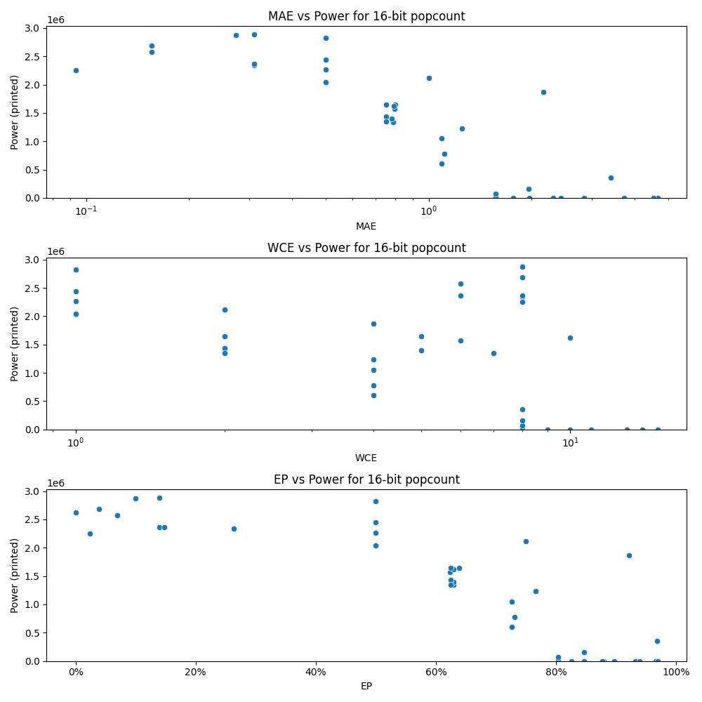

# Generated 16 bit popcount circuit
- __Circuit__: popcount (16 bit to 5.0 bit)

## Parameters of selected circuit
| Circuit         |       MAE |   WCE |        EP |             Area |           Power |            Delay | Download                                                               |
|:----------------|----------:|------:|----------:|-----------------:|----------------:|-----------------:|:-----------------------------------------------------------------------|
| popcount16_8aeh | 0.309448  |     8 | 0.139099  |      4.61441e+07 |      2.886e+06  |      5.12907e+07 | [v](popcount16_8aeh.v) [c](popcount16_8aeh.c) [py](popcount16_8aeh.py) |
| popcount16_armn | 0.273315  |     8 | 0.0992126 |      4.45502e+07 |      2.8701e+06 |      5.40527e+07 | [v](popcount16_armn.v) [c](popcount16_armn.c) [py](popcount16_armn.py) |
| popcount16_j9m9 | 0.310303  |     8 | 0.26358   |      4.25297e+07 |      2.3363e+06 |      4.96119e+07 | [v](popcount16_j9m9.v) [c](popcount16_j9m9.c) [py](popcount16_j9m9.py) |
| popcount16_orho | 0.310303  |     8 | 0.139557  |      4.28058e+07 |      2.3656e+06 |      4.81031e+07 | [v](popcount16_orho.v) [c](popcount16_orho.c) [py](popcount16_orho.py) |
| popcount16_tcow | 0.310242  |     6 | 0.147858  |      4.13788e+07 |      2.3635e+06 |      4.53798e+07 | [v](popcount16_tcow.v) [c](popcount16_tcow.c) [py](popcount16_tcow.py) |
| popcount16_t2q1 | 1.57104   |     8 | 0.803619  |      0           |      0          |      0           | [v](popcount16_t2q1.v) [c](popcount16_t2q1.c) [py](popcount16_t2q1.py) |
| popcount16_lqf5 | 1.57104   |     8 | 0.803619  | 228420           |    878.448      | 565707           | [v](popcount16_lqf5.v) [c](popcount16_lqf5.c) [py](popcount16_lqf5.py) |
| popcount16_udm2 | 1.57104   |     8 | 0.803619  | 627920           |  30372          |      2.6182e+06  | [v](popcount16_udm2.v) [c](popcount16_udm2.c) [py](popcount16_udm2.py) |
| popcount16_fzn7 | 1.57104   |     8 | 0.803619  |      2.19745e+06 |  76087          |      6.74625e+06 | [v](popcount16_fzn7.v) [c](popcount16_fzn7.c) [py](popcount16_fzn7.py) |
| popcount16_3uea | 0.0932617 |     8 | 0.0232391 |      4.75052e+07 |      2.255e+06  |      4.97453e+07 | [v](popcount16_3uea.v) [c](popcount16_3uea.c) [py](popcount16_3uea.py) |
| popcount16_wv19 | 0.155273  |     6 | 0.0698242 |      4.14952e+07 |      2.5712e+06 |      4.83785e+07 | [v](popcount16_wv19.v) [c](popcount16_wv19.c) [py](popcount16_wv19.py) |
| popcount16_5m6z | 0.155273  |     8 | 0.0388031 |      4.35699e+07 |      2.689e+06  |      5.07956e+07 | [v](popcount16_5m6z.v) [c](popcount16_5m6z.c) [py](popcount16_5m6z.py) |
| popcount16_dhry | 3.7242    |    14 | 0.932297  |      0           |      0          |      0           | [v](popcount16_dhry.v) [c](popcount16_dhry.c) [py](popcount16_dhry.py) |
| popcount16_kjj7 | 4.55168   |    14 | 0.965759  |      0           |      0          |      0           | [v](popcount16_kjj7.v) [c](popcount16_kjj7.c) [py](popcount16_kjj7.py) |
| popcount16_ev53 | 4.65648   |    15 | 0.938782  |      0           |      0          |      0           | [v](popcount16_ev53.v) [c](popcount16_ev53.c) [py](popcount16_ev53.py) |
| popcount16_fjie | 4.53619   |    13 | 0.969025  |      0           |      0          |      0           | [v](popcount16_fjie.v) [c](popcount16_fjie.c) [py](popcount16_fjie.py) |
| popcount16_muzi | 2.43512   |    11 | 0.879395  |      0           |      0          |      0           | [v](popcount16_muzi.v) [c](popcount16_muzi.c) [py](popcount16_muzi.py) |
| popcount16_qr3c | 0.798828  |     5 | 0.638672  |      3.05375e+07 |      1.6432e+06 |      5.27027e+07 | [v](popcount16_qr3c.v) [c](popcount16_qr3c.c) [py](popcount16_qr3c.py) |
| popcount16_mo1y | 0.793945  |     6 | 0.623535  |      3.4639e+07  |      1.5712e+06 |      4.93332e+07 | [v](popcount16_mo1y.v) [c](popcount16_mo1y.c) [py](popcount16_mo1y.py) |
| popcount16_l5l0 | 0.79187   |    10 | 0.628906  |      2.96861e+07 |      1.6217e+06 |      5.19604e+07 | [v](popcount16_l5l0.v) [c](popcount16_l5l0.c) [py](popcount16_l5l0.py) |
| popcount16_off0 | 0.787262  |     7 | 0.629883  |      3.12266e+07 |      1.3436e+06 |      4.74107e+07 | [v](popcount16_off0.v) [c](popcount16_off0.c) [py](popcount16_off0.py) |
| popcount16_n4nf | 0.781494  |     5 | 0.629272  |      2.95437e+07 |      1.4004e+06 |      4.36371e+07 | [v](popcount16_n4nf.v) [c](popcount16_n4nf.c) [py](popcount16_n4nf.py) |
| popcount16_naoc | 2.31293   |    10 | 0.877808  |      0           |      0          |      0           | [v](popcount16_naoc.v) [c](popcount16_naoc.c) [py](popcount16_naoc.py) |
| popcount16_m0lx | 2.84534   |    11 | 0.897247  |      0           |      0          |      0           | [v](popcount16_m0lx.v) [c](popcount16_m0lx.c) [py](popcount16_m0lx.py) |
| popcount16_cko8 | 1.96381   |     9 | 0.84726   |      0           |      0          |      0           | [v](popcount16_cko8.v) [c](popcount16_cko8.c) [py](popcount16_cko8.py) |
| popcount16_ib3r | 1.76743   |     9 | 0.825439  |      0           |      0          |      0           | [v](popcount16_ib3r.v) [c](popcount16_ib3r.c) [py](popcount16_ib3r.py) |
| popcount16_vksp | 0.5       |     1 | 0.5       |      5.13179e+07 |      2.8241e+06 |      6.02139e+07 | [v](popcount16_vksp.v) [c](popcount16_vksp.c) [py](popcount16_vksp.py) |
| popcount16_fo81 | 0.5       |     1 | 0.5       |      3.92097e+07 |      2.0348e+06 |      4.7093e+07  | [v](popcount16_fo81.v) [c](popcount16_fo81.c) [py](popcount16_fo81.py) |
| popcount16_oxsv | 0.5       |     1 | 0.5       |      3.83996e+07 |      2.4442e+06 |      4.87634e+07 | [v](popcount16_oxsv.v) [c](popcount16_oxsv.c) [py](popcount16_oxsv.py) |
| popcount16_lucm | 0.5       |     1 | 0.5       |      4.0759e+07  |      2.0407e+06 |      5.06067e+07 | [v](popcount16_lucm.v) [c](popcount16_lucm.c) [py](popcount16_lucm.py) |
| popcount16_ucuu | 0.5       |     1 | 0.5       |      4.27277e+07 |      2.2624e+06 |      5.25357e+07 | [v](popcount16_ucuu.v) [c](popcount16_ucuu.c) [py](popcount16_ucuu.py) |
| popcount16_uhjj | 0         |     0 | 0         |      4.46059e+07 |      2.6229e+06 |      4.6835e+07  | [v](popcount16_uhjj.v) [c](popcount16_uhjj.c) [py](popcount16_uhjj.py) |
| popcount16_955a | 0.75      |     2 | 0.625     |      3.2662e+07  |      1.4233e+06 |      4.32492e+07 | [v](popcount16_955a.v) [c](popcount16_955a.c) [py](popcount16_955a.py) |
| popcount16_nql8 | 0.75      |     2 | 0.625     |      3.75458e+07 |      1.6496e+06 |      5.08545e+07 | [v](popcount16_nql8.v) [c](popcount16_nql8.c) [py](popcount16_nql8.py) |
| popcount16_cyre | 0.75      |     2 | 0.625     |      3.15253e+07 |      1.4357e+06 |      4.91634e+07 | [v](popcount16_cyre.v) [c](popcount16_cyre.c) [py](popcount16_cyre.py) |
| popcount16_fbab | 1         |     2 | 0.75      |      3.98271e+07 |      2.1179e+06 |      4.67083e+07 | [v](popcount16_fbab.v) [c](popcount16_fbab.c) [py](popcount16_fbab.py) |
| popcount16_fx4n | 0.75      |     2 | 0.625     |      3.14823e+07 |      1.3498e+06 |      3.28145e+07 | [v](popcount16_fx4n.v) [c](popcount16_fx4n.c) [py](popcount16_fx4n.py) |
| popcount16_t78k | 1.9599    |     8 | 0.84726   |      2.45236e+06 | 159890          |      7.02179e+06 | [v](popcount16_t78k.v) [c](popcount16_t78k.c) [py](popcount16_t78k.py) |
| popcount16_1x09 | 3.39526   |     8 | 0.968475  |      1.02446e+07 | 354960          |      1.53112e+07 | [v](popcount16_1x09.v) [c](popcount16_1x09.c) [py](popcount16_1x09.py) |
| popcount16_qj7a | 1.09375   |     4 | 0.726562  |      1.56526e+07 | 604540          |      3.38063e+07 | [v](popcount16_qj7a.v) [c](popcount16_qj7a.c) [py](popcount16_qj7a.py) |
| popcount16_zmzn | 1.09375   |     4 | 0.726562  |      2.44474e+07 |      1.0466e+06 |      4.72938e+07 | [v](popcount16_zmzn.v) [c](popcount16_zmzn.c) [py](popcount16_zmzn.py) |
| popcount16_o5yw | 1.25      |     4 | 0.765625  |      2.76867e+07 |      1.2308e+06 |      5.23117e+07 | [v](popcount16_o5yw.v) [c](popcount16_o5yw.c) [py](popcount16_o5yw.py) |
| popcount16_aifa | 1.11328   |     4 | 0.731445  |      1.75517e+07 | 776160          |      4.06691e+07 | [v](popcount16_aifa.v) [c](popcount16_aifa.c) [py](popcount16_aifa.py) |
| popcount16_i8oz | 2.16406   |     4 | 0.921875  |      3.18623e+07 |      1.8724e+06 |      4.60895e+07 | [v](popcount16_i8oz.v) [c](popcount16_i8oz.c) [py](popcount16_i8oz.py) |

## Parameters 
