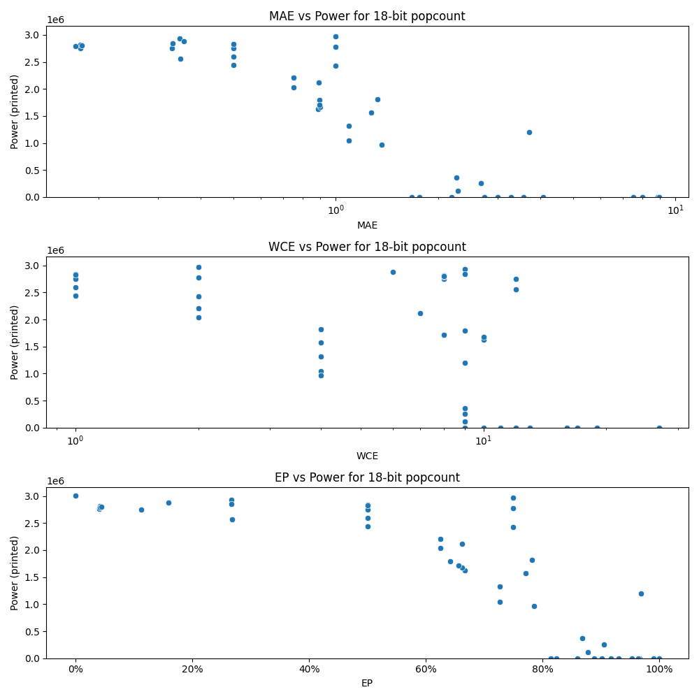

# Generated 18 bit popcount circuit
- __Circuit__: popcount (18 bit to 5.0 bit)

## Parameters of selected circuit
| Circuit         |      MAE |   WCE |        EP |        Area |           Power |       Delay | Download                                                               |
|:----------------|---------:|------:|----------:|------------:|----------------:|------------:|:-----------------------------------------------------------------------|
| popcount18_663o | 2.73316  |    13 | 0.888393  | 0           |      0          | 0           | [v](popcount18_663o.v) [c](popcount18_663o.c) [py](popcount18_663o.py) |
| popcount18_wr92 | 3.27777  |    13 | 0.916733  | 0           |      0          | 0           | [v](popcount18_wr92.v) [c](popcount18_wr92.c) [py](popcount18_wr92.py) |
| popcount18_e87q | 2.18855  |    11 | 0.860054  | 0           |      0          | 0           | [v](popcount18_e87q.v) [c](popcount18_e87q.c) [py](popcount18_e87q.py) |
| popcount18_ecno | 2.99788  |    13 | 0.901558  | 0           |      0          | 0           | [v](popcount18_ecno.v) [c](popcount18_ecno.c) [py](popcount18_ecno.py) |
| popcount18_ycxv | 3.56441  |    12 | 0.952789  | 0           |      0          | 0           | [v](popcount18_ycxv.v) [c](popcount18_ycxv.c) [py](popcount18_ycxv.py) |
| popcount18_rd0s | 1.26953  |     4 | 0.770508  | 3.64147e+07 |      1.5698e+06 | 5.89828e+07 | [v](popcount18_rd0s.v) [c](popcount18_rd0s.c) [py](popcount18_rd0s.py) |
| popcount18_yobk | 1.09375  |     4 | 0.726562  | 2.89462e+07 |      1.3223e+06 | 5.40408e+07 | [v](popcount18_yobk.v) [c](popcount18_yobk.c) [py](popcount18_yobk.py) |
| popcount18_x9si | 1.32422  |     4 | 0.782227  | 3.53347e+07 |      1.8138e+06 | 5.21107e+07 | [v](popcount18_x9si.v) [c](popcount18_x9si.c) [py](popcount18_x9si.py) |
| popcount18_ommv | 1.09375  |     4 | 0.726562  | 2.20944e+07 |      1.0429e+06 | 4.89833e+07 | [v](popcount18_ommv.v) [c](popcount18_ommv.c) [py](popcount18_ommv.py) |
| popcount18_nsf3 | 1.36719  |     4 | 0.785156  | 2.295e+07   | 967080          | 3.27145e+07 | [v](popcount18_nsf3.v) [c](popcount18_nsf3.c) [py](popcount18_nsf3.py) |
| popcount18_ldz5 | 0        |     0 | 0         | 5.80659e+07 |      3.011e+06  | 6.82295e+07 | [v](popcount18_ldz5.v) [c](popcount18_ldz5.c) [py](popcount18_ldz5.py) |
| popcount18_jhp7 | 1.66924  |     9 | 0.814529  | 0           |      0          | 0           | [v](popcount18_jhp7.v) [c](popcount18_jhp7.c) [py](popcount18_jhp7.py) |
| popcount18_afqx | 1.76197  |    10 | 0.823803  | 0           |      0          | 0           | [v](popcount18_afqx.v) [c](popcount18_afqx.c) [py](popcount18_afqx.py) |
| popcount18_ea91 | 0.5      |     1 | 0.5       | 5.03496e+07 |      2.8361e+06 | 6.84384e+07 | [v](popcount18_ea91.v) [c](popcount18_ea91.c) [py](popcount18_ea91.py) |
| popcount18_hifa | 0.5      |     1 | 0.5       | 5.2641e+07  |      2.7483e+06 | 6.44977e+07 | [v](popcount18_hifa.v) [c](popcount18_hifa.c) [py](popcount18_hifa.py) |
| popcount18_bxu6 | 0.5      |     1 | 0.5       | 5.36061e+07 |      2.831e+06  | 6.95676e+07 | [v](popcount18_bxu6.v) [c](popcount18_bxu6.c) [py](popcount18_bxu6.py) |
| popcount18_28gj | 0.5      |     1 | 0.5       | 5.48113e+07 |      2.4412e+06 | 6.83587e+07 | [v](popcount18_28gj.v) [c](popcount18_28gj.c) [py](popcount18_28gj.py) |
| popcount18_tfwz | 0.5      |     1 | 0.5       | 5.13804e+07 |      2.5957e+06 | 6.78151e+07 | [v](popcount18_tfwz.v) [c](popcount18_tfwz.c) [py](popcount18_tfwz.py) |
| popcount18_gjq6 | 1        |     2 | 0.75      | 5.53101e+07 |      2.7806e+06 | 6.51893e+07 | [v](popcount18_gjq6.v) [c](popcount18_gjq6.c) [py](popcount18_gjq6.py) |
| popcount18_80w7 | 0.75     |     2 | 0.625     | 4.79018e+07 |      2.2065e+06 | 5.84333e+07 | [v](popcount18_80w7.v) [c](popcount18_80w7.c) [py](popcount18_80w7.py) |
| popcount18_tvgo | 0.75     |     2 | 0.625     | 4.43697e+07 |      2.035e+06  | 6.09345e+07 | [v](popcount18_tvgo.v) [c](popcount18_tvgo.c) [py](popcount18_tvgo.py) |
| popcount18_1ln4 | 1        |     2 | 0.75      | 5.125e+07   |      2.4292e+06 | 6.88494e+07 | [v](popcount18_1ln4.v) [c](popcount18_1ln4.c) [py](popcount18_1ln4.py) |
| popcount18_ow8b | 1        |     2 | 0.75      | 5.17879e+07 |      2.9667e+06 | 6.88551e+07 | [v](popcount18_ow8b.v) [c](popcount18_ow8b.c) [py](popcount18_ow8b.py) |
| popcount18_rtib | 0.884743 |    10 | 0.667156  | 3.02993e+07 |      1.6303e+06 | 6.00201e+07 | [v](popcount18_rtib.v) [c](popcount18_rtib.c) [py](popcount18_rtib.py) |
| popcount18_tdlx | 0.897308 |    10 | 0.662071  | 3.41727e+07 |      1.6725e+06 | 6.65044e+07 | [v](popcount18_tdlx.v) [c](popcount18_tdlx.c) [py](popcount18_tdlx.py) |
| popcount18_6uxx | 0.896721 |     9 | 0.641613  | 4.01145e+07 |      1.7985e+06 | 6.48068e+07 | [v](popcount18_6uxx.v) [c](popcount18_6uxx.c) [py](popcount18_6uxx.py) |
| popcount18_lk7c | 0.895317 |     8 | 0.656128  | 3.69406e+07 |      1.712e+06  | 6.45948e+07 | [v](popcount18_lk7c.v) [c](popcount18_lk7c.c) [py](popcount18_lk7c.py) |
| popcount18_g3qg | 0.892456 |     7 | 0.661621  | 3.62611e+07 |      2.1152e+06 | 4.28996e+07 | [v](popcount18_g3qg.v) [c](popcount18_g3qg.c) [py](popcount18_g3qg.py) |
| popcount18_y609 | 8.87881  |    27 | 0.965729  | 0           |      0          | 0           | [v](popcount18_y609.v) [c](popcount18_y609.c) [py](popcount18_y609.py) |
| popcount18_u65w | 8.96249  |    27 | 0.963619  | 0           |      0          | 0           | [v](popcount18_u65w.v) [c](popcount18_u65w.c) [py](popcount18_u65w.py) |
| popcount18_aqjc | 4.07452  |    16 | 0.929995  | 0           |      0          | 0           | [v](popcount18_aqjc.v) [c](popcount18_aqjc.c) [py](popcount18_aqjc.py) |
| popcount18_a0u4 | 8.00001  |    17 | 0.999931  | 0           |      0          | 0           | [v](popcount18_a0u4.v) [c](popcount18_a0u4.c) [py](popcount18_a0u4.py) |
| popcount18_7eib | 7.51091  |    19 | 0.989471  | 0           |      0          | 0           | [v](popcount18_7eib.v) [c](popcount18_7eib.c) [py](popcount18_7eib.py) |
| popcount18_yhom | 2.28204  |     9 | 0.877136  | 2.08667e+06 | 116840          | 6.83345e+06 | [v](popcount18_yhom.v) [c](popcount18_yhom.c) [py](popcount18_yhom.py) |
| popcount18_88r5 | 3.71472  |     9 | 0.968254  | 2.29643e+07 |      1.2019e+06 | 4.56318e+07 | [v](popcount18_88r5.v) [c](popcount18_88r5.c) [py](popcount18_88r5.py) |
| popcount18_mcy3 | 2.27     |     9 | 0.867744  | 7.58765e+06 | 366190          | 1.74239e+07 | [v](popcount18_mcy3.v) [c](popcount18_mcy3.c) [py](popcount18_mcy3.py) |
| popcount18_f88b | 2.66785  |     9 | 0.905449  | 4.73147e+06 | 259860          | 1.21888e+07 | [v](popcount18_f88b.v) [c](popcount18_f88b.c) [py](popcount18_f88b.py) |
| popcount18_zuw4 | 0.347382 |     9 | 0.267212  | 5.19775e+07 |      2.9274e+06 | 6.22328e+07 | [v](popcount18_zuw4.v) [c](popcount18_zuw4.c) [py](popcount18_zuw4.py) |
| popcount18_so9i | 0.328918 |     8 | 0.111992  | 5.10964e+07 |      2.7516e+06 | 6.70309e+07 | [v](popcount18_so9i.v) [c](popcount18_so9i.c) [py](popcount18_so9i.py) |
| popcount18_1qd4 | 0.348145 |    12 | 0.268608  | 5.2805e+07  |      2.5631e+06 | 6.81883e+07 | [v](popcount18_1qd4.v) [c](popcount18_1qd4.c) [py](popcount18_1qd4.py) |
| popcount18_8r18 | 0.357025 |     6 | 0.159088  | 5.23245e+07 |      2.8803e+06 | 6.0299e+07  | [v](popcount18_8r18.v) [c](popcount18_8r18.c) [py](popcount18_8r18.py) |
| popcount18_g1k9 | 0.330536 |     9 | 0.266617  | 4.96087e+07 |      2.8473e+06 | 5.89168e+07 | [v](popcount18_g1k9.v) [c](popcount18_g1k9.c) [py](popcount18_g1k9.py) |
| popcount18_5t4j | 0.177185 |    12 | 0.0406647 | 5.27438e+07 |      2.7568e+06 | 6.76195e+07 | [v](popcount18_5t4j.v) [c](popcount18_5t4j.c) [py](popcount18_5t4j.py) |
| popcount18_cini | 0.177429 |     8 | 0.0422668 | 5.17434e+07 |      2.8135e+06 | 6.28517e+07 | [v](popcount18_cini.v) [c](popcount18_cini.c) [py](popcount18_cini.py) |
| popcount18_aqga | 0.171265 |     8 | 0.0424309 | 5.06625e+07 |      2.7892e+06 | 5.8958e+07  | [v](popcount18_aqga.v) [c](popcount18_aqga.c) [py](popcount18_aqga.py) |
| popcount18_up40 | 0.178772 |     8 | 0.0443115 | 4.90627e+07 |      2.8035e+06 | 5.95423e+07 | [v](popcount18_up40.v) [c](popcount18_up40.c) [py](popcount18_up40.py) |

## Parameters 
