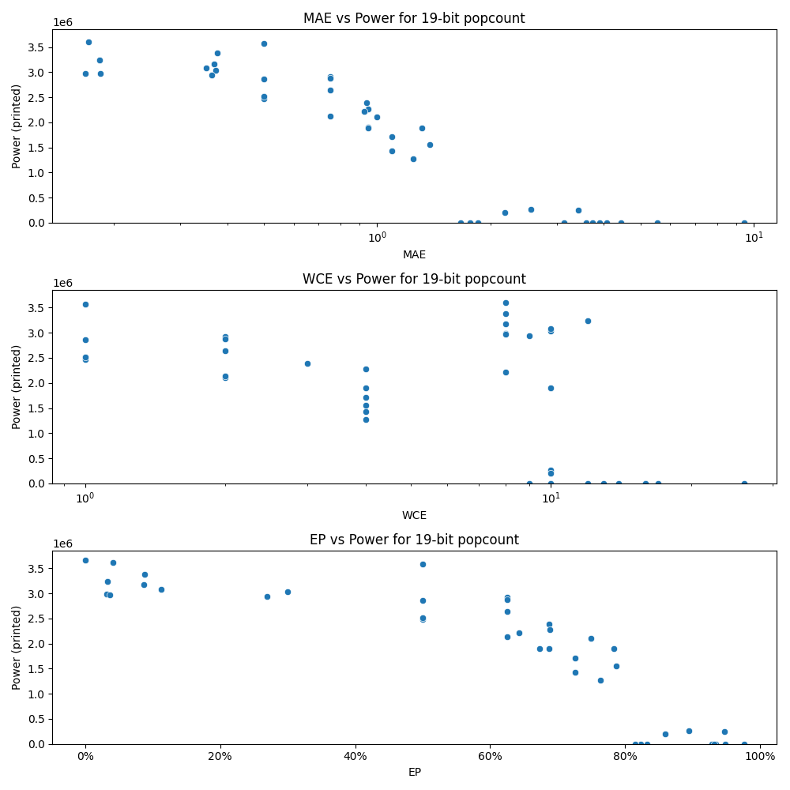

# Generated 19 bit popcount circuit
- __Circuit__: popcount (19 bit to 5.0 bit)

## Parameters of selected circuit
| Circuit         |      MAE |   WCE |        EP |        Area |           Power |       Delay | Download                                                               |
|:----------------|---------:|------:|----------:|------------:|----------------:|------------:|:-----------------------------------------------------------------------|
| popcount19_la78 | 0.75     |     2 | 0.625     | 5.66078e+07 |      2.9179e+06 | 7.15657e+07 | [v](popcount19_la78.v) [c](popcount19_la78.c) [py](popcount19_la78.py) |
| popcount19_gwor | 0.75     |     2 | 0.625     | 5.91536e+07 |      2.8765e+06 | 6.65972e+07 | [v](popcount19_gwor.v) [c](popcount19_gwor.c) [py](popcount19_gwor.py) |
| popcount19_w8df | 1        |     2 | 0.75      | 4.98443e+07 |      2.1037e+06 | 6.53206e+07 | [v](popcount19_w8df.v) [c](popcount19_w8df.c) [py](popcount19_w8df.py) |
| popcount19_9tsi | 0.75     |     2 | 0.625     | 5.70934e+07 |      2.6386e+06 | 6.81309e+07 | [v](popcount19_9tsi.v) [c](popcount19_9tsi.c) [py](popcount19_9tsi.py) |
| popcount19_20zm | 0.75     |     2 | 0.625     | 5.02326e+07 |      2.1297e+06 | 7.00601e+07 | [v](popcount19_20zm.v) [c](popcount19_20zm.c) [py](popcount19_20zm.py) |
| popcount19_yhgx | 0.18335  |    12 | 0.0325508 | 5.92203e+07 |      3.2343e+06 | 6.39841e+07 | [v](popcount19_yhgx.v) [c](popcount19_yhgx.c) [py](popcount19_yhgx.py) |
| popcount19_79md | 0.16806  |     8 | 0.0317497 | 5.86538e+07 |      2.9805e+06 | 6.49355e+07 | [v](popcount19_79md.v) [c](popcount19_79md.c) [py](popcount19_79md.py) |
| popcount19_pf7o | 0.183929 |     8 | 0.0366631 | 5.86732e+07 |      2.9693e+06 | 7.36789e+07 | [v](popcount19_pf7o.v) [c](popcount19_pf7o.c) [py](popcount19_pf7o.py) |
| popcount19_2pig | 0.18335  |    12 | 0.0325508 | 5.92203e+07 |      3.2358e+06 | 6.39841e+07 | [v](popcount19_2pig.v) [c](popcount19_2pig.c) [py](popcount19_2pig.py) |
| popcount19_nnb0 | 0.171082 |     8 | 0.0414734 | 5.73727e+07 |      3.6063e+06 | 6.40222e+07 | [v](popcount19_nnb0.v) [c](popcount19_nnb0.c) [py](popcount19_nnb0.py) |
| popcount19_b5vj | 1.76197  |    10 | 0.823803  | 0           |      0          | 0           | [v](popcount19_b5vj.v) [c](popcount19_b5vj.c) [py](popcount19_b5vj.py) |
| popcount19_nco1 | 3.41774  |    10 | 0.94722   | 4.14358e+06 | 251940          | 1.24832e+07 | [v](popcount19_nco1.v) [c](popcount19_nco1.c) [py](popcount19_nco1.py) |
| popcount19_w96b | 2.55958  |    10 | 0.894341  | 5.99372e+06 | 261280          | 1.43059e+07 | [v](popcount19_w96b.v) [c](popcount19_w96b.c) [py](popcount19_w96b.py) |
| popcount19_iinv | 2.18117  |    10 | 0.859764  | 3.98038e+06 | 202430          | 7.57147e+06 | [v](popcount19_iinv.v) [c](popcount19_iinv.c) [py](popcount19_iinv.py) |
| popcount19_s961 | 0.368942 |     8 | 0.0863476 | 5.54496e+07 |      3.1678e+06 | 6.46e+07    | [v](popcount19_s961.v) [c](popcount19_s961.c) [py](popcount19_s961.py) |
| popcount19_93r5 | 0.376495 |     8 | 0.0882187 | 5.60585e+07 |      3.3802e+06 | 6.12934e+07 | [v](popcount19_93r5.v) [c](popcount19_93r5.c) [py](popcount19_93r5.py) |
| popcount19_4ito | 0.373085 |    10 | 0.299934  | 5.54735e+07 |      3.036e+06  | 6.19881e+07 | [v](popcount19_4ito.v) [c](popcount19_4ito.c) [py](popcount19_4ito.py) |
| popcount19_rksi | 0.364429 |     9 | 0.269188  | 5.55593e+07 |      2.9354e+06 | 6.14776e+07 | [v](popcount19_rksi.v) [c](popcount19_rksi.c) [py](popcount19_rksi.py) |
| popcount19_mzf9 | 0.351471 |    10 | 0.112465  | 5.37257e+07 |      3.0782e+06 | 6.09538e+07 | [v](popcount19_mzf9.v) [c](popcount19_mzf9.c) [py](popcount19_mzf9.py) |
| popcount19_4e3v | 0.5      |     1 | 0.5       | 5.33089e+07 |      2.5151e+06 | 6.76349e+07 | [v](popcount19_4e3v.v) [c](popcount19_4e3v.c) [py](popcount19_4e3v.py) |
| popcount19_e28k | 0.5      |     1 | 0.5       | 6.78483e+07 |      3.5748e+06 | 7.15499e+07 | [v](popcount19_e28k.v) [c](popcount19_e28k.c) [py](popcount19_e28k.py) |
| popcount19_t89y | 0.5      |     1 | 0.5       | 5.82797e+07 |      2.4744e+06 | 6.61452e+07 | [v](popcount19_t89y.v) [c](popcount19_t89y.c) [py](popcount19_t89y.py) |
| popcount19_qqtl | 0.5      |     1 | 0.5       | 5.54442e+07 |      2.8558e+06 | 6.79402e+07 | [v](popcount19_qqtl.v) [c](popcount19_qqtl.c) [py](popcount19_qqtl.py) |
| popcount19_cznu | 0.5      |     1 | 0.5       | 5.68332e+07 |      2.5139e+06 | 6.7609e+07  | [v](popcount19_cznu.v) [c](popcount19_cznu.c) [py](popcount19_cznu.py) |
| popcount19_6mq2 | 0        |     0 | 0         | 6.49403e+07 |      3.6657e+06 | 6.73244e+07 | [v](popcount19_6mq2.v) [c](popcount19_6mq2.c) [py](popcount19_6mq2.py) |
| popcount19_vq19 | 1.09375  |     4 | 0.726562  | 3.42503e+07 |      1.7109e+06 | 6.24728e+07 | [v](popcount19_vq19.v) [c](popcount19_vq19.c) [py](popcount19_vq19.py) |
| popcount19_njix | 1.38281  |     4 | 0.787109  | 3.50624e+07 |      1.5505e+06 | 5.22591e+07 | [v](popcount19_njix.v) [c](popcount19_njix.c) [py](popcount19_njix.py) |
| popcount19_4jg2 | 1.3125   |     4 | 0.783203  | 3.67445e+07 |      1.895e+06  | 5.80436e+07 | [v](popcount19_4jg2.v) [c](popcount19_4jg2.c) [py](popcount19_4jg2.py) |
| popcount19_u7kd | 1.09375  |     4 | 0.726562  | 2.8692e+07  |      1.4263e+06 | 5.76706e+07 | [v](popcount19_u7kd.v) [c](popcount19_u7kd.c) [py](popcount19_u7kd.py) |
| popcount19_0f7a | 1.24756  |     4 | 0.764099  | 2.42737e+07 |      1.2706e+06 | 6.45876e+07 | [v](popcount19_0f7a.v) [c](popcount19_0f7a.c) [py](popcount19_0f7a.py) |
| popcount19_ss8s | 0.9375   |     3 | 0.6875    | 4.93202e+07 |      2.3875e+06 | 6.02854e+07 | [v](popcount19_ss8s.v) [c](popcount19_ss8s.c) [py](popcount19_ss8s.py) |
| popcount19_uyvv | 0.948837 |    10 | 0.673435  | 4.22931e+07 |      1.9065e+06 | 6.43333e+07 | [v](popcount19_uyvv.v) [c](popcount19_uyvv.c) [py](popcount19_uyvv.py) |
| popcount19_lz7c | 0.947601 |     4 | 0.689102  | 5.14388e+07 |      2.2717e+06 | 6.66437e+07 | [v](popcount19_lz7c.v) [c](popcount19_lz7c.c) [py](popcount19_lz7c.py) |
| popcount19_a8mq | 0.946312 |    10 | 0.68792   | 3.764e+07   |      1.8946e+06 | 6.4973e+07  | [v](popcount19_a8mq.v) [c](popcount19_a8mq.c) [py](popcount19_a8mq.py) |
| popcount19_nxx3 | 0.926071 |     8 | 0.642746  | 4.49422e+07 |      2.2187e+06 | 6.31068e+07 | [v](popcount19_nxx3.v) [c](popcount19_nxx3.c) [py](popcount19_nxx3.py) |
| popcount19_3csc | 4.44085  |    17 | 0.934759  | 0           |      0          | 0           | [v](popcount19_3csc.v) [c](popcount19_3csc.c) [py](popcount19_3csc.py) |
| popcount19_b1in | 4.07452  |    16 | 0.929995  | 0           |      0          | 0           | [v](popcount19_b1in.v) [c](popcount19_b1in.c) [py](popcount19_b1in.py) |
| popcount19_nznu | 5.53221  |    16 | 0.97633   | 0           |      0          | 0           | [v](popcount19_nznu.v) [c](popcount19_nznu.c) [py](popcount19_nznu.py) |
| popcount19_0h8t | 9.41846  |    26 | 0.934242  | 0           |      0          | 0           | [v](popcount19_0h8t.v) [c](popcount19_0h8t.c) [py](popcount19_0h8t.py) |
| popcount19_zvgu | 3.89482  |    16 | 0.92946   | 0           |      0          | 0           | [v](popcount19_zvgu.v) [c](popcount19_zvgu.c) [py](popcount19_zvgu.py) |
| popcount19_fq88 | 1.85471  |    10 | 0.833076  | 0           |      0          | 0           | [v](popcount19_fq88.v) [c](popcount19_fq88.c) [py](popcount19_fq88.py) |
| popcount19_6vv5 | 1.66924  |     9 | 0.814529  | 0           |      0          | 0           | [v](popcount19_6vv5.v) [c](popcount19_6vv5.c) [py](popcount19_6vv5.py) |
| popcount19_oxm2 | 3.13614  |    12 | 0.929184  | 0           |      0          | 0           | [v](popcount19_oxm2.v) [c](popcount19_oxm2.c) [py](popcount19_oxm2.py) |
| popcount19_9o0n | 3.58801  |    13 | 0.94825   | 0           |      0          | 0           | [v](popcount19_9o0n.v) [c](popcount19_9o0n.c) [py](popcount19_9o0n.py) |
| popcount19_g788 | 3.7242   |    14 | 0.932297  | 0           |      0          | 0           | [v](popcount19_g788.v) [c](popcount19_g788.c) [py](popcount19_g788.py) |

## Parameters 
