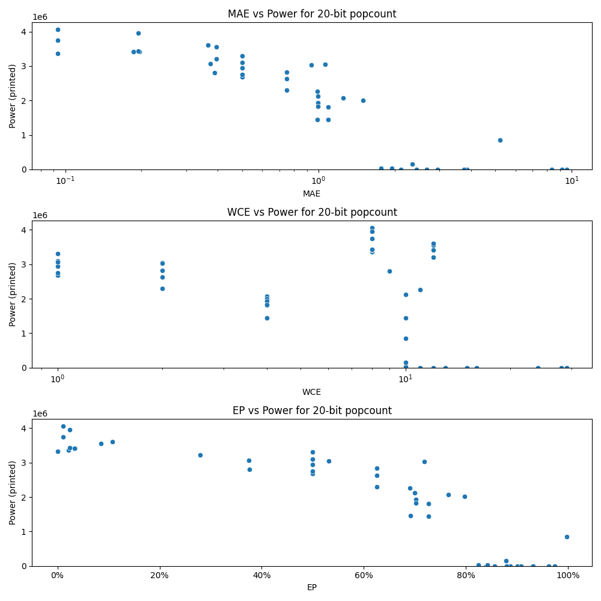

# Generated 20 bit popcount circuit
- __Circuit__: popcount (20 bit to 5.0 bit)

## Parameters of selected circuit
| Circuit         |       MAE |   WCE |        EP |             Area |           Power |       Delay | Download                                                               |
|:----------------|----------:|------:|----------:|-----------------:|----------------:|------------:|:-----------------------------------------------------------------------|
| popcount20_3nqq | 1.76197   |    10 | 0.823803  |      0           |      0          | 0           | [v](popcount20_3nqq.v) [c](popcount20_3nqq.c) [py](popcount20_3nqq.py) |
| popcount20_028g | 2.11436   |    11 | 0.855839  |      0           |      0          | 0           | [v](popcount20_028g.v) [c](popcount20_028g.c) [py](popcount20_028g.py) |
| popcount20_nadx | 3.8597    |    16 | 0.929614  |      0           |      0          | 0           | [v](popcount20_nadx.v) [c](popcount20_nadx.c) [py](popcount20_nadx.py) |
| popcount20_dajg | 3.75805   |    15 | 0.931616  |      0           |      0          | 0           | [v](popcount20_dajg.v) [c](popcount20_dajg.c) [py](popcount20_dajg.py) |
| popcount20_d7fv | 2.67499   |    13 | 0.886026  |      0           |      0          | 0           | [v](popcount20_d7fv.v) [c](popcount20_d7fv.c) [py](popcount20_d7fv.py) |
| popcount20_e73p | 0         |     0 | 0         |      6.81459e+07 |      3.3256e+06 | 6.90598e+07 | [v](popcount20_e73p.v) [c](popcount20_e73p.c) [py](popcount20_e73p.py) |
| popcount20_zl4x | 1.25      |     4 | 0.765625  |      4.12068e+07 |      2.0666e+06 | 6.51989e+07 | [v](popcount20_zl4x.v) [c](popcount20_zl4x.c) [py](popcount20_zl4x.py) |
| popcount20_8y0h | 1.09375   |     4 | 0.726562  |      4.24228e+07 |      1.8079e+06 | 7.3572e+07  | [v](popcount20_8y0h.v) [c](popcount20_8y0h.c) [py](popcount20_8y0h.py) |
| popcount20_slif | 1.49756   |     4 | 0.796875  |      4.57355e+07 |      2.009e+06  | 6.60038e+07 | [v](popcount20_slif.v) [c](popcount20_slif.c) [py](popcount20_slif.py) |
| popcount20_pxwl | 1.09375   |     4 | 0.726562  |      2.80236e+07 |      1.4403e+06 | 6.00598e+07 | [v](popcount20_pxwl.v) [c](popcount20_pxwl.c) [py](popcount20_pxwl.py) |
| popcount20_7itw | 1.09375   |     4 | 0.726562  |      2.77567e+07 |      1.4405e+06 | 6.22939e+07 | [v](popcount20_7itw.v) [c](popcount20_7itw.c) [py](popcount20_7itw.py) |
| popcount20_3j0v | 1.93817   |    11 | 0.839821  |      0           |      0          | 0           | [v](popcount20_3j0v.v) [c](popcount20_3j0v.c) [py](popcount20_3j0v.py) |
| popcount20_tp7o | 0.5       |     1 | 0.5       |      5.96591e+07 |      2.6819e+06 | 6.97191e+07 | [v](popcount20_tp7o.v) [c](popcount20_tp7o.c) [py](popcount20_tp7o.py) |
| popcount20_tp6j | 0.5       |     1 | 0.5       |      6.14738e+07 |      2.9475e+06 | 6.9478e+07  | [v](popcount20_tp6j.v) [c](popcount20_tp6j.c) [py](popcount20_tp6j.py) |
| popcount20_hsu2 | 0.5       |     1 | 0.5       |      6.47737e+07 |      3.3034e+06 | 7.19745e+07 | [v](popcount20_hsu2.v) [c](popcount20_hsu2.c) [py](popcount20_hsu2.py) |
| popcount20_osl8 | 0.5       |     1 | 0.5       |      6.3018e+07  |      3.0978e+06 | 6.88553e+07 | [v](popcount20_osl8.v) [c](popcount20_osl8.c) [py](popcount20_osl8.py) |
| popcount20_c82p | 0.5       |     1 | 0.5       |      6.17558e+07 |      2.7482e+06 | 6.85044e+07 | [v](popcount20_c82p.v) [c](popcount20_c82p.c) [py](popcount20_c82p.py) |
| popcount20_zaql | 2.9473    |    13 | 0.900196  |      0           |      0          | 0           | [v](popcount20_zaql.v) [c](popcount20_zaql.c) [py](popcount20_zaql.py) |
| popcount20_ba20 | 8.33462   |    24 | 0.907265  |      0           |      0          | 0           | [v](popcount20_ba20.v) [c](popcount20_ba20.c) [py](popcount20_ba20.py) |
| popcount20_o7pg | 9.54401   |    28 | 0.974125  |      0           |      0          | 0           | [v](popcount20_o7pg.v) [c](popcount20_o7pg.c) [py](popcount20_o7pg.py) |
| popcount20_m97i | 9.1549    |    29 | 0.962111  |      0           |      0          | 0           | [v](popcount20_m97i.v) [c](popcount20_m97i.c) [py](popcount20_m97i.py) |
| popcount20_py96 | 2.43472   |    12 | 0.879866  |      0           |      0          | 0           | [v](popcount20_py96.v) [c](popcount20_py96.c) [py](popcount20_py96.py) |
| popcount20_44hq | 0.996094  |     4 | 0.702148  |      4.26229e+07 |      1.9374e+06 | 6.61636e+07 | [v](popcount20_44hq.v) [c](popcount20_44hq.c) [py](popcount20_44hq.py) |
| popcount20_voo3 | 0.988556  |    11 | 0.689789  |      4.12846e+07 |      2.261e+06  | 6.33549e+07 | [v](popcount20_voo3.v) [c](popcount20_voo3.c) [py](popcount20_voo3.py) |
| popcount20_amum | 0.994854  |    10 | 0.699306  |      4.66358e+07 |      2.1278e+06 | 6.5633e+07  | [v](popcount20_amum.v) [c](popcount20_amum.c) [py](popcount20_amum.py) |
| popcount20_honn | 0.996094  |     4 | 0.702148  |      4.33399e+07 |      1.8287e+06 | 6.92543e+07 | [v](popcount20_honn.v) [c](popcount20_honn.c) [py](popcount20_honn.py) |
| popcount20_8zhz | 0.990562  |    10 | 0.690744  |      3.50214e+07 |      1.4511e+06 | 4.98863e+07 | [v](popcount20_8zhz.v) [c](popcount20_8zhz.c) [py](popcount20_8zhz.py) |
| popcount20_ng2h | 1.94744   |    10 | 0.84235   | 433500           |  36240          | 3.17226e+06 | [v](popcount20_ng2h.v) [c](popcount20_ng2h.c) [py](popcount20_ng2h.py) |
| popcount20_429r | 1.76197   |    10 | 0.823803  |      1.1042e+06  |  35820          | 3.38086e+06 | [v](popcount20_429r.v) [c](popcount20_429r.c) [py](popcount20_429r.py) |
| popcount20_bv09 | 5.19996   |    10 | 0.996658  |      1.90676e+07 | 848140          | 4.05747e+07 | [v](popcount20_bv09.v) [c](popcount20_bv09.c) [py](popcount20_bv09.py) |
| popcount20_fy9w | 2.34348   |    10 | 0.877808  |      2.77508e+06 | 157510          | 8.66178e+06 | [v](popcount20_fy9w.v) [c](popcount20_fy9w.c) [py](popcount20_fy9w.py) |
| popcount20_0qvg | 0.0935059 |     8 | 0.0214539 |      6.50383e+07 |      3.3567e+06 | 6.69879e+07 | [v](popcount20_0qvg.v) [c](popcount20_0qvg.c) [py](popcount20_0qvg.py) |
| popcount20_8gek | 0.0930634 |     8 | 0.0116329 |      6.55913e+07 |      3.7427e+06 | 7.1454e+07  | [v](popcount20_8gek.v) [c](popcount20_8gek.c) [py](popcount20_8gek.py) |
| popcount20_v59y | 0.0930634 |     8 | 0.0116329 |      6.68335e+07 |      4.0622e+06 | 7.14538e+07 | [v](popcount20_v59y.v) [c](popcount20_v59y.c) [py](popcount20_v59y.py) |
| popcount20_n7zv | 1.0625    |     2 | 0.53125   |      6.25472e+07 |      3.0519e+06 | 6.74009e+07 | [v](popcount20_n7zv.v) [c](popcount20_n7zv.c) [py](popcount20_n7zv.py) |
| popcount20_1c1q | 0.9375    |     2 | 0.71875   |      5.74529e+07 |      3.0333e+06 | 7.01998e+07 | [v](popcount20_1c1q.v) [c](popcount20_1c1q.c) [py](popcount20_1c1q.py) |
| popcount20_4el7 | 0.75      |     2 | 0.625     |      5.75049e+07 |      2.8302e+06 | 7.15583e+07 | [v](popcount20_4el7.v) [c](popcount20_4el7.c) [py](popcount20_4el7.py) |
| popcount20_g1sw | 0.75      |     2 | 0.625     |      5.42936e+07 |      2.6271e+06 | 6.65538e+07 | [v](popcount20_g1sw.v) [c](popcount20_g1sw.c) [py](popcount20_g1sw.py) |
| popcount20_exny | 0.75      |     2 | 0.625     |      5.15999e+07 |      2.2961e+06 | 6.30462e+07 | [v](popcount20_exny.v) [c](popcount20_exny.c) [py](popcount20_exny.py) |
| popcount20_z0pm | 0.395096  |    12 | 0.0852041 |      6.12803e+07 |      3.5533e+06 | 6.36723e+07 | [v](popcount20_z0pm.v) [c](popcount20_z0pm.c) [py](popcount20_z0pm.py) |
| popcount20_la4f | 0.365044  |    12 | 0.107878  |      6.07627e+07 |      3.6075e+06 | 6.68135e+07 | [v](popcount20_la4f.v) [c](popcount20_la4f.c) [py](popcount20_la4f.py) |
| popcount20_tl2m | 0.394836  |    12 | 0.278875  |      6.09492e+07 |      3.2122e+06 | 6.40584e+07 | [v](popcount20_tl2m.v) [c](popcount20_tl2m.c) [py](popcount20_tl2m.py) |
| popcount20_kd0d | 0.375     |     1 | 0.375     |      6.22123e+07 |      3.0679e+06 | 6.94371e+07 | [v](popcount20_kd0d.v) [c](popcount20_kd0d.c) [py](popcount20_kd0d.py) |
| popcount20_z3tu | 0.388187  |     9 | 0.375772  |      6.27297e+07 |      2.8021e+06 | 6.46242e+07 | [v](popcount20_z3tu.v) [c](popcount20_z3tu.c) [py](popcount20_z3tu.py) |
| popcount20_xrap | 0.195877  |    12 | 0.034193  |      6.21195e+07 |      3.4156e+06 | 6.47934e+07 | [v](popcount20_xrap.v) [c](popcount20_xrap.c) [py](popcount20_xrap.py) |
| popcount20_rfky | 0.185539  |     8 | 0.032958  |      6.12486e+07 |      3.4208e+06 | 7.0983e+07  | [v](popcount20_rfky.v) [c](popcount20_rfky.c) [py](popcount20_rfky.py) |
| popcount20_0hv4 | 0.194084  |     8 | 0.0242605 |      6.60373e+07 |      3.9511e+06 | 7.40082e+07 | [v](popcount20_0hv4.v) [c](popcount20_0hv4.c) [py](popcount20_0hv4.py) |
| popcount20_3fqp | 0.194084  |     8 | 0.0242605 |      6.57852e+07 |      3.4365e+06 | 7.37639e+07 | [v](popcount20_3fqp.v) [c](popcount20_3fqp.c) [py](popcount20_3fqp.py) |

## Parameters 
