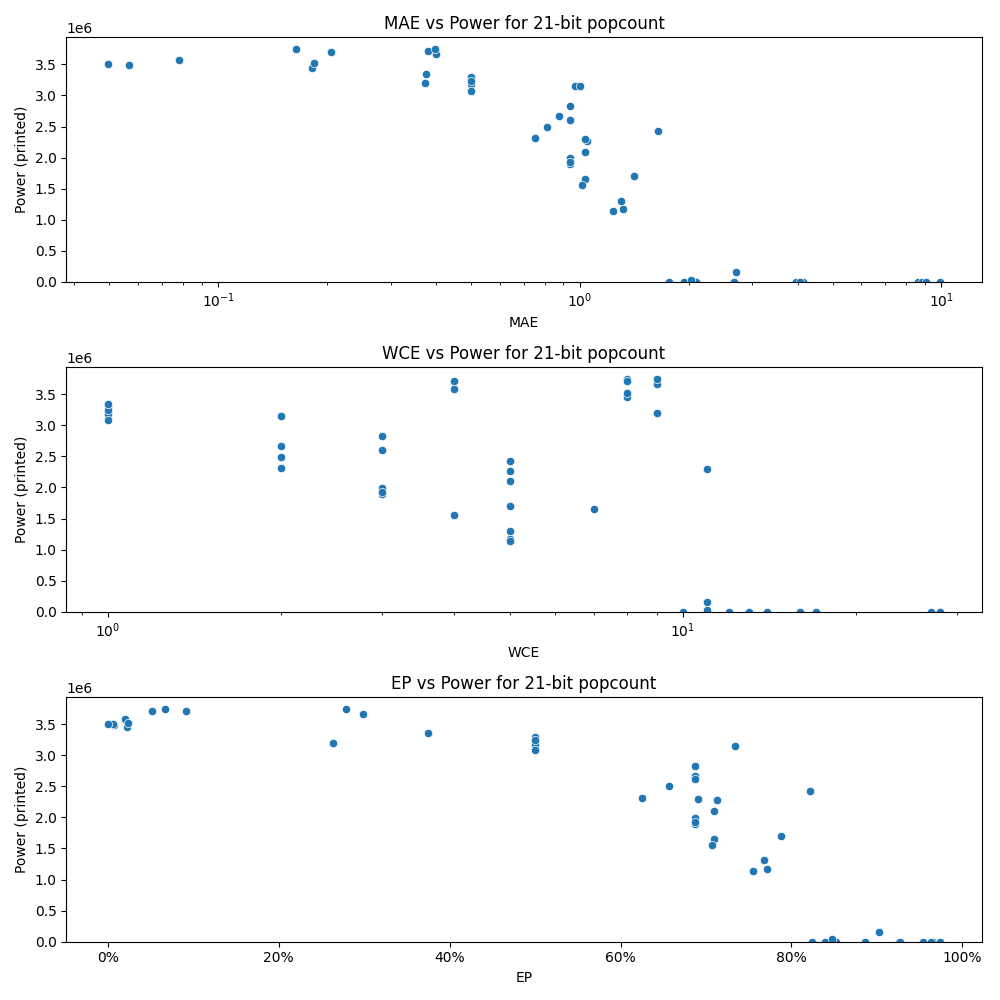

# Generated 21 bit popcount circuit
- __Circuit__: popcount (21 bit to 5.0 bit)

## Parameters of selected circuit
| Circuit         |       MAE |   WCE |         EP |             Area |           Power |       Delay | Download                                                               |
|:----------------|----------:|------:|-----------:|-----------------:|----------------:|------------:|:-----------------------------------------------------------------------|
| popcount21_p65z | 0.078125  |     4 | 0.0195312  |      6.65878e+07 |      3.5768e+06 | 6.79458e+07 | [v](popcount21_p65z.v) [c](popcount21_p65z.c) [py](popcount21_p65z.py) |
| popcount21_5jdp | 0.0568542 |     8 | 0.00710678 |      6.70207e+07 |      3.4882e+06 | 6.40469e+07 | [v](popcount21_5jdp.v) [c](popcount21_5jdp.c) [py](popcount21_5jdp.py) |
| popcount21_yosn | 0.0495605 |     8 | 0.00619507 |      6.72812e+07 |      3.4997e+06 | 6.62233e+07 | [v](popcount21_yosn.v) [c](popcount21_yosn.c) [py](popcount21_yosn.py) |
| popcount21_4hgm | 0         |     0 | 0          |      6.85267e+07 |      3.5072e+06 | 6.73212e+07 | [v](popcount21_4hgm.v) [c](popcount21_4hgm.c) [py](popcount21_4hgm.py) |
| popcount21_38br | 0.875     |     2 | 0.6875     |      5.13977e+07 |      2.6663e+06 | 7.20924e+07 | [v](popcount21_38br.v) [c](popcount21_38br.c) [py](popcount21_38br.py) |
| popcount21_ftas | 0.96875   |     2 | 0.734375   |      5.70718e+07 |      3.1463e+06 | 7.16486e+07 | [v](popcount21_ftas.v) [c](popcount21_ftas.c) [py](popcount21_ftas.py) |
| popcount21_7nkr | 0.75      |     2 | 0.625      |      5.61193e+07 |      2.3156e+06 | 6.34731e+07 | [v](popcount21_7nkr.v) [c](popcount21_7nkr.c) [py](popcount21_7nkr.py) |
| popcount21_j7jb | 1.00098   |     2 | 0.500488   |      6.37276e+07 |      3.1439e+06 | 6.72276e+07 | [v](popcount21_j7jb.v) [c](popcount21_j7jb.c) [py](popcount21_j7jb.py) |
| popcount21_t0vc | 0.8125    |     2 | 0.65625    |      5.40586e+07 |      2.4963e+06 | 6.60246e+07 | [v](popcount21_t0vc.v) [c](popcount21_t0vc.c) [py](popcount21_t0vc.py) |
| popcount21_v7tr | 0.181992  |     8 | 0.0227489  |      6.6212e+07  |      3.4482e+06 | 6.40694e+07 | [v](popcount21_v7tr.v) [c](popcount21_v7tr.c) [py](popcount21_v7tr.py) |
| popcount21_p29d | 0.183655  |     8 | 0.0229568  |      6.73543e+07 |      3.5248e+06 | 7.30635e+07 | [v](popcount21_p29d.v) [c](popcount21_p29d.c) [py](popcount21_p29d.py) |
| popcount21_qsok | 0.205322  |     4 | 0.0513306  |      6.85681e+07 |      3.7041e+06 | 6.69298e+07 | [v](popcount21_qsok.v) [c](popcount21_qsok.c) [py](popcount21_qsok.py) |
| popcount21_wker | 0.16394   |     8 | 0.0673676  |      6.55132e+07 |      3.7432e+06 | 6.52697e+07 | [v](popcount21_wker.v) [c](popcount21_wker.c) [py](popcount21_wker.py) |
| popcount21_h738 | 8.62886   |    28 | 0.966115   |      0           |      0          | 0           | [v](popcount21_h738.v) [c](popcount21_h738.c) [py](popcount21_h738.py) |
| popcount21_jlfi | 8.87902   |    28 | 0.965807   |      0           |      0          | 0           | [v](popcount21_jlfi.v) [c](popcount21_jlfi.c) [py](popcount21_jlfi.py) |
| popcount21_6qa3 | 8.86297   |    28 | 0.973508   |      0           |      0          | 0           | [v](popcount21_6qa3.v) [c](popcount21_6qa3.c) [py](popcount21_6qa3.py) |
| popcount21_ltw2 | 9.04401   |    27 | 0.974125   |      0           |      0          | 0           | [v](popcount21_ltw2.v) [c](popcount21_ltw2.c) [py](popcount21_ltw2.py) |
| popcount21_39ti | 9.91731   |    28 | 0.953631   |      0           |      0          | 0           | [v](popcount21_39ti.v) [c](popcount21_39ti.c) [py](popcount21_39ti.py) |
| popcount21_mjel | 1.93817   |    11 | 0.839821   |      0           |      0          | 0           | [v](popcount21_mjel.v) [c](popcount21_mjel.c) [py](popcount21_mjel.py) |
| popcount21_4jcu | 2.69478   |    11 | 0.902157   |      2.69125e+06 | 164020          | 9.49447e+06 | [v](popcount21_4jcu.v) [c](popcount21_4jcu.c) [py](popcount21_4jcu.py) |
| popcount21_6h3d | 0.5       |     1 | 0.5        |      6.92663e+07 |      3.2097e+06 | 6.93775e+07 | [v](popcount21_6h3d.v) [c](popcount21_6h3d.c) [py](popcount21_6h3d.py) |
| popcount21_94as | 0.5       |     1 | 0.5        |      6.15959e+07 |      3.1865e+06 | 6.91142e+07 | [v](popcount21_94as.v) [c](popcount21_94as.c) [py](popcount21_94as.py) |
| popcount21_n2vv | 0.5       |     1 | 0.5        |      6.53058e+07 |      3.2969e+06 | 6.83972e+07 | [v](popcount21_n2vv.v) [c](popcount21_n2vv.c) [py](popcount21_n2vv.py) |
| popcount21_vc4b | 0.5       |     1 | 0.5        |      6.22442e+07 |      3.2377e+06 | 6.86136e+07 | [v](popcount21_vc4b.v) [c](popcount21_vc4b.c) [py](popcount21_vc4b.py) |
| popcount21_ufkz | 0.5       |     1 | 0.5        |      6.49015e+07 |      3.0784e+06 | 6.75451e+07 | [v](popcount21_ufkz.v) [c](popcount21_ufkz.c) [py](popcount21_ufkz.py) |
| popcount21_ufho | 1.64786   |     5 | 0.82193    |      4.89294e+07 |      2.4288e+06 | 6.34974e+07 | [v](popcount21_ufho.v) [c](popcount21_ufho.c) [py](popcount21_ufho.py) |
| popcount21_6w8j | 1.40814   |     5 | 0.787842   |      4.19554e+07 |      1.7036e+06 | 5.76552e+07 | [v](popcount21_6w8j.v) [c](popcount21_6w8j.c) [py](popcount21_6w8j.py) |
| popcount21_cxcd | 1.29883   |     5 | 0.767578   |      3.29866e+07 |      1.3064e+06 | 6.45088e+07 | [v](popcount21_cxcd.v) [c](popcount21_cxcd.c) [py](popcount21_cxcd.py) |
| popcount21_m1cq | 1.31592   |     5 | 0.770996   |      2.38994e+07 |      1.1755e+06 | 5.52567e+07 | [v](popcount21_m1cq.v) [c](popcount21_m1cq.c) [py](popcount21_m1cq.py) |
| popcount21_uo7w | 1.23901   |     5 | 0.755615   |      2.23044e+07 |      1.1354e+06 | 5.61989e+07 | [v](popcount21_uo7w.v) [c](popcount21_uo7w.c) [py](popcount21_uo7w.py) |
| popcount21_8rc0 | 0.9375    |     3 | 0.6875     |      5.09058e+07 |      2.6099e+06 | 6.98595e+07 | [v](popcount21_8rc0.v) [c](popcount21_8rc0.c) [py](popcount21_8rc0.py) |
| popcount21_fkp9 | 0.9375    |     3 | 0.6875     |      5.17035e+07 |      2.8325e+06 | 7.01151e+07 | [v](popcount21_fkp9.v) [c](popcount21_fkp9.c) [py](popcount21_fkp9.py) |
| popcount21_tl5f | 0.9375    |     3 | 0.6875     |      3.81167e+07 |      1.8995e+06 | 5.58067e+07 | [v](popcount21_tl5f.v) [c](popcount21_tl5f.c) [py](popcount21_tl5f.py) |
| popcount21_2m6e | 0.9375    |     3 | 0.6875     |      4.74798e+07 |      1.9902e+06 | 6.86965e+07 | [v](popcount21_2m6e.v) [c](popcount21_2m6e.c) [py](popcount21_2m6e.py) |
| popcount21_vgn7 | 0.9375    |     3 | 0.6875     |      4.06915e+07 |      1.9268e+06 | 6.84905e+07 | [v](popcount21_vgn7.v) [c](popcount21_vgn7.c) [py](popcount21_vgn7.py) |
| popcount21_y7t2 | 0.375     |     1 | 0.375      |      6.62266e+07 |      3.3482e+06 | 7.07934e+07 | [v](popcount21_y7t2.v) [c](popcount21_y7t2.c) [py](popcount21_y7t2.py) |
| popcount21_htr4 | 0.372206  |     9 | 0.262968   |      6.12207e+07 |      3.1973e+06 | 6.68153e+07 | [v](popcount21_htr4.v) [c](popcount21_htr4.c) [py](popcount21_htr4.py) |
| popcount21_deg8 | 0.399841  |     9 | 0.299015   |      6.35087e+07 |      3.6588e+06 | 6.59099e+07 | [v](popcount21_deg8.v) [c](popcount21_deg8.c) [py](popcount21_deg8.py) |
| popcount21_ii4f | 0.380051  |     8 | 0.0919933  |      6.34802e+07 |      3.7133e+06 | 6.6255e+07  | [v](popcount21_ii4f.v) [c](popcount21_ii4f.c) [py](popcount21_ii4f.py) |
| popcount21_w2se | 0.397839  |     9 | 0.278217   |      6.59888e+07 |      3.7466e+06 | 6.7152e+07  | [v](popcount21_w2se.v) [c](popcount21_w2se.c) [py](popcount21_w2se.py) |
| popcount21_sqs3 | 1.76197   |    10 | 0.823803   |      0           |      0          | 0           | [v](popcount21_sqs3.v) [c](popcount21_sqs3.c) [py](popcount21_sqs3.py) |
| popcount21_rprm | 4.13539   |    17 | 0.926298   |      0           |      0          | 0           | [v](popcount21_rprm.v) [c](popcount21_rprm.c) [py](popcount21_rprm.py) |
| popcount21_htwf | 2.67499   |    13 | 0.886026   |      0           |      0          | 0           | [v](popcount21_htwf.v) [c](popcount21_htwf.c) [py](popcount21_htwf.py) |
| popcount21_x30l | 3.96135   |    16 | 0.927611   |      0           |      0          | 0           | [v](popcount21_x30l.v) [c](popcount21_x30l.c) [py](popcount21_x30l.py) |
| popcount21_rr23 | 4.05623   |    14 | 0.963036   |      0           |      0          | 0           | [v](popcount21_rr23.v) [c](popcount21_rr23.c) [py](popcount21_rr23.py) |
| popcount21_c3w8 | 1.03229   |     5 | 0.70929    |      4.56613e+07 |      2.0974e+06 | 6.63049e+07 | [v](popcount21_c3w8.v) [c](popcount21_c3w8.c) [py](popcount21_c3w8.py) |
| popcount21_e838 | 1.03174   |     7 | 0.70903    |      3.66642e+07 |      1.6587e+06 | 5.62844e+07 | [v](popcount21_e838.v) [c](popcount21_e838.c) [py](popcount21_e838.py) |
| popcount21_pna9 | 1.04877   |     5 | 0.712952   |      4.81672e+07 |      2.2723e+06 | 6.16847e+07 | [v](popcount21_pna9.v) [c](popcount21_pna9.c) [py](popcount21_pna9.py) |
| popcount21_dmh2 | 1.03104   |    11 | 0.691087   |      4.58485e+07 |      2.3004e+06 | 6.61965e+07 | [v](popcount21_dmh2.v) [c](popcount21_dmh2.c) [py](popcount21_dmh2.py) |
| popcount21_zxhf | 1.01562   |     4 | 0.707031   |      3.84994e+07 |      1.563e+06  | 5.83514e+07 | [v](popcount21_zxhf.v) [c](popcount21_zxhf.c) [py](popcount21_zxhf.py) |
| popcount21_rb4r | 2.09835   |    12 | 0.851834   |      0           |      0          | 0           | [v](popcount21_rb4r.v) [c](popcount21_rb4r.c) [py](popcount21_rb4r.py) |
| popcount21_r2pi | 2.02627   |    11 | 0.84783    | 563530           |  37703          | 3.14213e+06 | [v](popcount21_r2pi.v) [c](popcount21_r2pi.c) [py](popcount21_r2pi.py) |

## Parameters 
