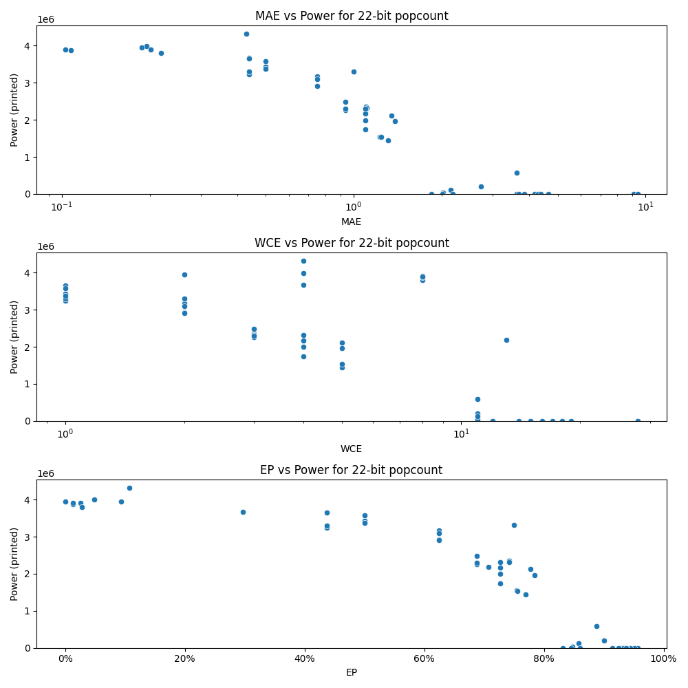

# Generated 22 bit popcount circuit
- __Circuit__: popcount (22 bit to 5.0 bit)

## Parameters of selected circuit
| Circuit         |      MAE |   WCE |        EP |             Area |           Power |            Delay | Download                                                               |
|:----------------|---------:|------:|----------:|-----------------:|----------------:|-----------------:|:-----------------------------------------------------------------------|
| popcount22_5p8l | 0.195312 |     4 | 0.0488281 |      6.9388e+07  |      3.9942e+06 |      6.93985e+07 | [v](popcount22_5p8l.v) [c](popcount22_5p8l.c) [py](popcount22_5p8l.py) |
| popcount22_vvqr | 0.201553 |     8 | 0.0251942 |      6.91784e+07 |      3.9041e+06 |      6.57704e+07 | [v](popcount22_vvqr.v) [c](popcount22_vvqr.c) [py](popcount22_vvqr.py) |
| popcount22_cxfm | 0.1875   |     2 | 0.09375   |      7.20645e+07 |      3.9495e+06 |      6.98179e+07 | [v](popcount22_cxfm.v) [c](popcount22_cxfm.c) [py](popcount22_cxfm.py) |
| popcount22_c9v0 | 0.218163 |     8 | 0.0272703 |      6.96528e+07 |      3.8021e+06 |      6.68697e+07 | [v](popcount22_c9v0.v) [c](popcount22_c9v0.c) [py](popcount22_c9v0.py) |
| popcount22_q5vv | 0.75     |     2 | 0.625     |      6.18428e+07 |      3.177e+06  |      7.12797e+07 | [v](popcount22_q5vv.v) [c](popcount22_q5vv.c) [py](popcount22_q5vv.py) |
| popcount22_mjrp | 0.75     |     2 | 0.625     |      5.80151e+07 |      2.9207e+06 |      6.64512e+07 | [v](popcount22_mjrp.v) [c](popcount22_mjrp.c) [py](popcount22_mjrp.py) |
| popcount22_saj8 | 0.75     |     2 | 0.625     |      5.55911e+07 |      3.0916e+06 |      7.0851e+07  | [v](popcount22_saj8.v) [c](popcount22_saj8.c) [py](popcount22_saj8.py) |
| popcount22_8sfe | 0.75     |     2 | 0.625     |      5.60612e+07 |      2.9077e+06 |      7.02804e+07 | [v](popcount22_8sfe.v) [c](popcount22_8sfe.c) [py](popcount22_8sfe.py) |
| popcount22_u8cb | 1        |     2 | 0.75      |      6.42547e+07 |      3.3092e+06 |      7.11822e+07 | [v](popcount22_u8cb.v) [c](popcount22_u8cb.c) [py](popcount22_u8cb.py) |
| popcount22_9xdo | 1.3501   |     5 | 0.777832  |      4.44974e+07 |      2.1208e+06 |      6.51582e+07 | [v](popcount22_9xdo.v) [c](popcount22_9xdo.c) [py](popcount22_9xdo.py) |
| popcount22_41i7 | 1.23047  |     5 | 0.753906  |      3.73892e+07 |      1.5451e+06 |      4.91215e+07 | [v](popcount22_41i7.v) [c](popcount22_41i7.c) [py](popcount22_41i7.py) |
| popcount22_mam2 | 1.31409  |     5 | 0.769897  |      3.1615e+07  |      1.4508e+06 |      4.94378e+07 | [v](popcount22_mam2.v) [c](popcount22_mam2.c) [py](popcount22_mam2.py) |
| popcount22_gsqv | 1.23901  |     5 | 0.755615  |      3.45068e+07 |      1.5369e+06 |      6.58051e+07 | [v](popcount22_gsqv.v) [c](popcount22_gsqv.c) [py](popcount22_gsqv.py) |
| popcount22_kt8u | 1.38428  |     5 | 0.784668  |      3.68866e+07 |      1.9646e+06 |      6.78362e+07 | [v](popcount22_kt8u.v) [c](popcount22_kt8u.c) [py](popcount22_kt8u.py) |
| popcount22_fcc4 | 0.4375   |     4 | 0.296875  |      7.18385e+07 |      3.6761e+06 |      6.963e+07   | [v](popcount22_fcc4.v) [c](popcount22_fcc4.c) [py](popcount22_fcc4.py) |
| popcount22_gy6s | 0.4375   |     1 | 0.4375    |      6.4194e+07  |      3.2375e+06 |      6.80028e+07 | [v](popcount22_gy6s.v) [c](popcount22_gy6s.c) [py](popcount22_gy6s.py) |
| popcount22_oreq | 0.4375   |     1 | 0.4375    |      6.63096e+07 |      3.305e+06  |      6.85516e+07 | [v](popcount22_oreq.v) [c](popcount22_oreq.c) [py](popcount22_oreq.py) |
| popcount22_z2kh | 0.4375   |     1 | 0.4375    |      6.81857e+07 |      3.6494e+06 |      6.92087e+07 | [v](popcount22_z2kh.v) [c](popcount22_z2kh.c) [py](popcount22_z2kh.py) |
| popcount22_uab4 | 0.427948 |     4 | 0.106987  |      6.94419e+07 |      4.3241e+06 |      6.98229e+07 | [v](popcount22_uab4.v) [c](popcount22_uab4.c) [py](popcount22_uab4.py) |
| popcount22_gic7 | 0.9375   |     3 | 0.6875    |      5.0442e+07  |      2.2622e+06 |      6.8468e+07  | [v](popcount22_gic7.v) [c](popcount22_gic7.c) [py](popcount22_gic7.py) |
| popcount22_v7ve | 1.10156  |     3 | 0.742188  |      5.20643e+07 |      2.3591e+06 |      6.78268e+07 | [v](popcount22_v7ve.v) [c](popcount22_v7ve.c) [py](popcount22_v7ve.py) |
| popcount22_ng0t | 1.10938  |     3 | 0.742188  |      5.57298e+07 |      2.3151e+06 |      6.57501e+07 | [v](popcount22_ng0t.v) [c](popcount22_ng0t.c) [py](popcount22_ng0t.py) |
| popcount22_s52r | 0.9375   |     3 | 0.6875    |      4.85106e+07 |      2.3027e+06 |      7.00211e+07 | [v](popcount22_s52r.v) [c](popcount22_s52r.c) [py](popcount22_s52r.py) |
| popcount22_4dhs | 0.9375   |     3 | 0.6875    |      5.29318e+07 |      2.4896e+06 |      6.77103e+07 | [v](popcount22_4dhs.v) [c](popcount22_4dhs.c) [py](popcount22_4dhs.py) |
| popcount22_pkdo | 0        |     0 | 0         |      7.23932e+07 |      3.9472e+06 |      6.96232e+07 | [v](popcount22_pkdo.v) [c](popcount22_pkdo.c) [py](popcount22_pkdo.py) |
| popcount22_p5c5 | 0.107254 |     8 | 0.0134068 |      7.04732e+07 |      3.8819e+06 |      6.45948e+07 | [v](popcount22_p5c5.v) [c](popcount22_p5c5.c) [py](popcount22_p5c5.py) |
| popcount22_qm25 | 0.102661 |     8 | 0.0128326 |      7.07336e+07 |      3.9027e+06 |      6.78641e+07 | [v](popcount22_qm25.v) [c](popcount22_qm25.c) [py](popcount22_qm25.py) |
| popcount22_409n | 1.85007  |    11 | 0.831812  |      0           |      0          |      0           | [v](popcount22_409n.v) [c](popcount22_409n.c) [py](popcount22_409n.py) |
| popcount22_toep | 2.02627  |    11 | 0.84783   | 433500           |  36240          |      3.17226e+06 | [v](popcount22_toep.v) [c](popcount22_toep.c) [py](popcount22_toep.py) |
| popcount22_ujfe | 3.61443  |    11 | 0.887348  |      1.7486e+07  | 582210          |      3.86831e+07 | [v](popcount22_ujfe.v) [c](popcount22_ujfe.c) [py](popcount22_ujfe.py) |
| popcount22_zi82 | 2.72729  |    11 | 0.900593  |      4.24063e+06 | 207480          |      9.62296e+06 | [v](popcount22_zi82.v) [c](popcount22_zi82.c) [py](popcount22_zi82.py) |
| popcount22_n1n6 | 2.15146  |    11 | 0.857946  |      2.30072e+06 | 119680          |      1.00254e+07 | [v](popcount22_n1n6.v) [c](popcount22_n1n6.c) [py](popcount22_n1n6.py) |
| popcount22_2t7h | 1.09834  |    13 | 0.707088  |      4.59851e+07 |      2.1835e+06 |      6.3296e+07  | [v](popcount22_2t7h.v) [c](popcount22_2t7h.c) [py](popcount22_2t7h.py) |
| popcount22_oara | 1.09375  |     4 | 0.726562  |      4.33032e+07 |      2.1745e+06 |      6.86811e+07 | [v](popcount22_oara.v) [c](popcount22_oara.c) [py](popcount22_oara.py) |
| popcount22_8unz | 1.09375  |     4 | 0.726562  |      5.11151e+07 |      2.3078e+06 |      6.75062e+07 | [v](popcount22_8unz.v) [c](popcount22_8unz.c) [py](popcount22_8unz.py) |
| popcount22_q77y | 1.09375  |     4 | 0.726562  |      3.56811e+07 |      1.7457e+06 |      6.76602e+07 | [v](popcount22_q77y.v) [c](popcount22_q77y.c) [py](popcount22_q77y.py) |
| popcount22_dwjp | 1.09375  |     4 | 0.726562  |      4.32558e+07 |      1.9944e+06 |      6.78452e+07 | [v](popcount22_dwjp.v) [c](popcount22_dwjp.c) [py](popcount22_dwjp.py) |
| popcount22_szlo | 0.5      |     1 | 0.5       |      6.49086e+07 |      3.4357e+06 |      7.15742e+07 | [v](popcount22_szlo.v) [c](popcount22_szlo.c) [py](popcount22_szlo.py) |
| popcount22_6yqh | 0.5      |     1 | 0.5       |      6.59748e+07 |      3.4316e+06 |      6.85762e+07 | [v](popcount22_6yqh.v) [c](popcount22_6yqh.c) [py](popcount22_6yqh.py) |
| popcount22_j5gf | 0.5      |     1 | 0.5       |      6.57098e+07 |      3.4256e+06 |      7.20777e+07 | [v](popcount22_j5gf.v) [c](popcount22_j5gf.c) [py](popcount22_j5gf.py) |
| popcount22_tvkn | 0.5      |     1 | 0.5       |      6.62658e+07 |      3.5759e+06 |      7.11384e+07 | [v](popcount22_tvkn.v) [c](popcount22_tvkn.c) [py](popcount22_tvkn.py) |
| popcount22_tcmp | 0.5      |     1 | 0.5       |      6.6366e+07  |      3.3698e+06 |      6.75769e+07 | [v](popcount22_tcmp.v) [c](popcount22_tcmp.c) [py](popcount22_tcmp.py) |
| popcount22_y1dy | 2.18645  |    12 | 0.859843  |      0           |      0          |      0           | [v](popcount22_y1dy.v) [c](popcount22_y1dy.c) [py](popcount22_y1dy.py) |
| popcount22_vqp7 | 2.01826  |    12 | 0.845828  |      0           |      0          |      0           | [v](popcount22_vqp7.v) [c](popcount22_vqp7.c) [py](popcount22_vqp7.py) |
| popcount22_e7gy | 9.08795  |    28 | 0.957239  |      0           |      0          |      0           | [v](popcount22_e7gy.v) [c](popcount22_e7gy.c) [py](popcount22_e7gy.py) |
| popcount22_95lk | 4.1759   |    17 | 0.914479  |      0           |      0          |      0           | [v](popcount22_95lk.v) [c](popcount22_95lk.c) [py](popcount22_95lk.py) |
| popcount22_ue9l | 4.63243  |    19 | 0.928879  |      0           |      0          |      0           | [v](popcount22_ue9l.v) [c](popcount22_ue9l.c) [py](popcount22_ue9l.py) |
| popcount22_43n0 | 9.42559  |    28 | 0.951022  |      0           |      0          |      0           | [v](popcount22_43n0.v) [c](popcount22_43n0.c) [py](popcount22_43n0.py) |
| popcount22_n0hk | 3.61389  |    14 | 0.944553  |      0           |      0          |      0           | [v](popcount22_n0hk.v) [c](popcount22_n0hk.c) [py](popcount22_n0hk.py) |
| popcount22_cmon | 4.2915   |    18 | 0.932187  |      0           |      0          |      0           | [v](popcount22_cmon.v) [c](popcount22_cmon.c) [py](popcount22_cmon.py) |
| popcount22_bwjn | 3.66933  |    15 | 0.938547  |      0           |      0          |      0           | [v](popcount22_bwjn.v) [c](popcount22_bwjn.c) [py](popcount22_bwjn.py) |
| popcount22_2p23 | 4.37493  |    18 | 0.937464  |      0           |      0          |      0           | [v](popcount22_2p23.v) [c](popcount22_2p23.c) [py](popcount22_2p23.py) |
| popcount22_wzfg | 3.84769  |    16 | 0.92507   | 228420           |    878.448      | 565707           | [v](popcount22_wzfg.v) [c](popcount22_wzfg.c) [py](popcount22_wzfg.py) |

## Parameters 
