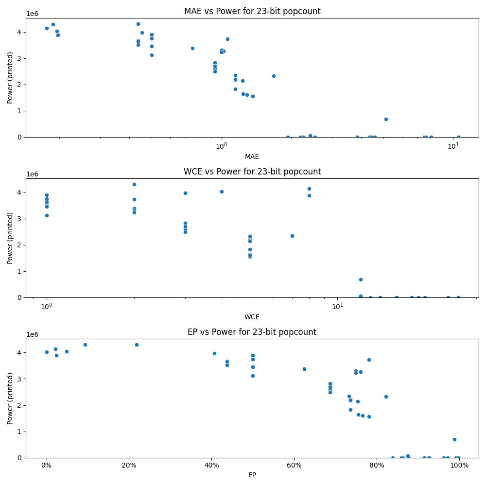

# Generated 23 bit popcount circuit
- __Circuit__: popcount (23 bit to 5.0 bit)

## Parameters of selected circuit
| Circuit         |       MAE |   WCE |        EP |        Area |           Power |       Delay | Download                                                               |
|:----------------|----------:|------:|----------:|------------:|----------------:|------------:|:-----------------------------------------------------------------------|
| popcount23_fyu3 |  1.14502  |     5 | 0.736816  | 3.84011e+07 |      1.8324e+06 | 5.71943e+07 | [v](popcount23_fyu3.v) [c](popcount23_fyu3.c) [py](popcount23_fyu3.py) |
| popcount23_9rzr |  1.14502  |     5 | 0.736816  | 4.58478e+07 |      2.2064e+06 | 6.70438e+07 | [v](popcount23_9rzr.v) [c](popcount23_9rzr.c) [py](popcount23_9rzr.py) |
| popcount23_6gty |  1.14502  |     5 | 0.736816  | 5.13728e+07 |      2.1702e+06 | 6.33074e+07 | [v](popcount23_6gty.v) [c](popcount23_6gty.c) [py](popcount23_6gty.py) |
| popcount23_ejxo |  1.14468  |     7 | 0.732666  | 4.13233e+07 |      2.3434e+06 | 5.49691e+07 | [v](popcount23_ejxo.v) [c](popcount23_ejxo.c) [py](popcount23_ejxo.py) |
| popcount23_es12 |  1.14502  |     5 | 0.736816  | 5.28623e+07 |      2.1966e+06 | 6.57987e+07 | [v](popcount23_es12.v) [c](popcount23_es12.c) [py](popcount23_es12.py) |
| popcount23_x5vx |  1.23901  |     5 | 0.755615  | 4.00165e+07 |      1.647e+06  | 5.98682e+07 | [v](popcount23_x5vx.v) [c](popcount23_x5vx.c) [py](popcount23_x5vx.py) |
| popcount23_cgw3 |  1.36719  |     5 | 0.78125   | 3.5633e+07  |      1.5586e+06 | 5.30814e+07 | [v](popcount23_cgw3.v) [c](popcount23_cgw3.c) [py](popcount23_cgw3.py) |
| popcount23_4mmz |  1.23047  |     5 | 0.753906  | 4.0473e+07  |      2.141e+06  | 6.44624e+07 | [v](popcount23_4mmz.v) [c](popcount23_4mmz.c) [py](popcount23_4mmz.py) |
| popcount23_i9zc |  1.28998  |     5 | 0.765686  | 3.29199e+07 |      1.6029e+06 | 6.52252e+07 | [v](popcount23_i9zc.v) [c](popcount23_i9zc.c) [py](popcount23_i9zc.py) |
| popcount23_sb6i |  1.67773  |     5 | 0.823059  | 3.95832e+07 |      2.3274e+06 | 5.32487e+07 | [v](popcount23_sb6i.v) [c](popcount23_sb6i.c) [py](popcount23_sb6i.py) |
| popcount23_ghhf |  0.1875   |     2 | 0.09375   | 7.42021e+07 |      4.2963e+06 | 6.91744e+07 | [v](popcount23_ghhf.v) [c](popcount23_ghhf.c) [py](popcount23_ghhf.py) |
| popcount23_ldwx |  0.196884 |     8 | 0.0246105 | 6.94565e+07 |      3.8878e+06 | 6.55685e+07 | [v](popcount23_ldwx.v) [c](popcount23_ldwx.c) [py](popcount23_ldwx.py) |
| popcount23_9vbe |  0.195312 |     4 | 0.0488281 | 6.94377e+07 |      4.0347e+06 | 6.97987e+07 | [v](popcount23_9vbe.v) [c](popcount23_9vbe.c) [py](popcount23_9vbe.py) |
| popcount23_bdfb |  0.175674 |     8 | 0.0219593 | 7.05451e+07 |      4.1421e+06 | 6.7344e+07  | [v](popcount23_bdfb.v) [c](popcount23_bdfb.c) [py](popcount23_bdfb.py) |
| popcount23_1876 |  0.453125 |     3 | 0.40625   | 6.77108e+07 |      3.9774e+06 | 7.2343e+07  | [v](popcount23_1876.v) [c](popcount23_1876.c) [py](popcount23_1876.py) |
| popcount23_x2q6 |  0.4375   |     1 | 0.4375    | 7.00432e+07 |      3.6733e+06 | 6.98395e+07 | [v](popcount23_x2q6.v) [c](popcount23_x2q6.c) [py](popcount23_x2q6.py) |
| popcount23_ffqb |  0.4375   |     1 | 0.4375    | 6.54925e+07 |      3.6468e+06 | 6.76434e+07 | [v](popcount23_ffqb.v) [c](popcount23_ffqb.c) [py](popcount23_ffqb.py) |
| popcount23_l8qy |  0.4375   |     1 | 0.4375    | 7.17273e+07 |      3.5188e+06 | 7.05932e+07 | [v](popcount23_l8qy.v) [c](popcount23_l8qy.c) [py](popcount23_l8qy.py) |
| popcount23_gkr9 |  0.4375   |     2 | 0.21875   | 6.92291e+07 |      4.3071e+06 | 7.13623e+07 | [v](popcount23_gkr9.v) [c](popcount23_gkr9.c) [py](popcount23_gkr9.py) |
| popcount23_ocxg |  0        |     0 | 0         | 7.22047e+07 |      4.0209e+06 | 6.97986e+07 | [v](popcount23_ocxg.v) [c](popcount23_ocxg.c) [py](popcount23_ocxg.py) |
| popcount23_bpx5 |  2.25652  |    13 | 0.863617  | 0           |      0          | 0           | [v](popcount23_bpx5.v) [c](popcount23_bpx5.c) [py](popcount23_bpx5.py) |
| popcount23_gn3s |  0.75     |     2 | 0.625     | 6.11319e+07 |      3.3835e+06 | 6.38006e+07 | [v](popcount23_gn3s.v) [c](popcount23_gn3s.c) [py](popcount23_gn3s.py) |
| popcount23_kd9n |  1.02344  |     2 | 0.761719  | 5.81284e+07 |      3.2723e+06 | 6.7597e+07  | [v](popcount23_kd9n.v) [c](popcount23_kd9n.c) [py](popcount23_kd9n.py) |
| popcount23_2pi9 |  1.0625   |     2 | 0.78125   | 6.30957e+07 |      3.7269e+06 | 6.97033e+07 | [v](popcount23_2pi9.v) [c](popcount23_2pi9.c) [py](popcount23_2pi9.py) |
| popcount23_hqx6 |  1        |     2 | 0.75      | 6.08296e+07 |      3.3093e+06 | 6.9773e+07  | [v](popcount23_hqx6.v) [c](popcount23_hqx6.c) [py](popcount23_hqx6.py) |
| popcount23_skdp |  1        |     2 | 0.75      | 6.01304e+07 |      3.2343e+06 | 6.58984e+07 | [v](popcount23_skdp.v) [c](popcount23_skdp.c) [py](popcount23_skdp.py) |
| popcount23_2it3 |  4.34694  |    18 | 0.92618   | 0           |      0          | 0           | [v](popcount23_2it3.v) [c](popcount23_2it3.c) [py](popcount23_2it3.py) |
| popcount23_fggb |  3.84769  |    16 | 0.92507   | 0           |      0          | 0           | [v](popcount23_fggb.v) [c](popcount23_fggb.c) [py](popcount23_fggb.py) |
| popcount23_5gm3 |  4.42553  |    18 | 0.915034  | 0           |      0          | 0           | [v](popcount23_5gm3.v) [c](popcount23_5gm3.c) [py](popcount23_5gm3.py) |
| popcount23_9ybe |  4.59546  |    19 | 0.927471  | 0           |      0          | 0           | [v](popcount23_9ybe.v) [c](popcount23_9ybe.c) [py](popcount23_9ybe.py) |
| popcount23_t3oo |  2.52929  |    14 | 0.877786  | 0           |      0          | 0           | [v](popcount23_t3oo.v) [c](popcount23_t3oo.c) [py](popcount23_t3oo.py) |
| popcount23_d9bv |  0.5      |     1 | 0.5       | 6.83603e+07 |      3.473e+06  | 6.94698e+07 | [v](popcount23_d9bv.v) [c](popcount23_d9bv.c) [py](popcount23_d9bv.py) |
| popcount23_gbhg |  0.5      |     1 | 0.5       | 6.871e+07   |      3.745e+06  | 7.19484e+07 | [v](popcount23_gbhg.v) [c](popcount23_gbhg.c) [py](popcount23_gbhg.py) |
| popcount23_ic9i |  0.5      |     1 | 0.5       | 6.47282e+07 |      3.1268e+06 | 6.70639e+07 | [v](popcount23_ic9i.v) [c](popcount23_ic9i.c) [py](popcount23_ic9i.py) |
| popcount23_59wy |  0.5      |     1 | 0.5       | 7.01402e+07 |      3.8911e+06 | 7.16059e+07 | [v](popcount23_59wy.v) [c](popcount23_59wy.c) [py](popcount23_59wy.py) |
| popcount23_hnd5 |  0.5      |     1 | 0.5       | 6.70305e+07 |      3.4597e+06 | 7.03632e+07 | [v](popcount23_hnd5.v) [c](popcount23_hnd5.c) [py](popcount23_hnd5.py) |
| popcount23_wbjs |  8.02935  |    26 | 0.9628    | 0           |      0          | 0           | [v](popcount23_wbjs.v) [c](popcount23_wbjs.c) [py](popcount23_wbjs.py) |
| popcount23_59hv |  7.50742  |    20 | 0.992607  | 0           |      0          | 0           | [v](popcount23_59hv.v) [c](popcount23_59hv.c) [py](popcount23_59hv.py) |
| popcount23_n50r |  7.6047   |    24 | 0.971946  | 0           |      0          | 0           | [v](popcount23_n50r.v) [c](popcount23_n50r.c) [py](popcount23_n50r.py) |
| popcount23_nv3y | 10.5022   |    26 | 0.997549  | 0           |      0          | 0           | [v](popcount23_nv3y.v) [c](popcount23_nv3y.c) [py](popcount23_nv3y.py) |
| popcount23_9z4j |  1.93416  |    12 | 0.83882   | 0           |      0          | 0           | [v](popcount23_9z4j.v) [c](popcount23_9z4j.c) [py](popcount23_9z4j.py) |
| popcount23_c58h |  2.18645  |    12 | 0.859843  | 0           |      0          | 0           | [v](popcount23_c58h.v) [c](popcount23_c58h.c) [py](popcount23_c58h.py) |
| popcount23_6d1u |  5.13137  |    12 | 0.988012  | 1.53883e+07 | 688170          | 2.66055e+07 | [v](popcount23_6d1u.v) [c](popcount23_6d1u.c) [py](popcount23_6d1u.py) |
| popcount23_053y |  2.41533  |    12 | 0.875124  | 1.57658e+06 |  61525          | 5.88913e+06 | [v](popcount23_053y.v) [c](popcount23_053y.c) [py](popcount23_053y.py) |
| popcount23_vkxa |  0.9375   |     3 | 0.6875    | 5.41756e+07 |      2.6631e+06 | 6.84056e+07 | [v](popcount23_vkxa.v) [c](popcount23_vkxa.c) [py](popcount23_vkxa.py) |
| popcount23_wgyt |  0.9375   |     3 | 0.6875    | 5.57939e+07 |      2.6058e+06 | 6.76679e+07 | [v](popcount23_wgyt.v) [c](popcount23_wgyt.c) [py](popcount23_wgyt.py) |
| popcount23_jltj |  0.9375   |     3 | 0.6875    | 5.79484e+07 |      2.8274e+06 | 6.71987e+07 | [v](popcount23_jltj.v) [c](popcount23_jltj.c) [py](popcount23_jltj.py) |
| popcount23_nlo7 |  0.9375   |     3 | 0.6875    | 5.55416e+07 |      2.4871e+06 | 6.81645e+07 | [v](popcount23_nlo7.v) [c](popcount23_nlo7.c) [py](popcount23_nlo7.py) |
| popcount23_mkhj |  0.9375   |     3 | 0.6875    | 4.52443e+07 |      2.7026e+06 | 7.15898e+07 | [v](popcount23_mkhj.v) [c](popcount23_mkhj.c) [py](popcount23_mkhj.py) |

## Parameters 
