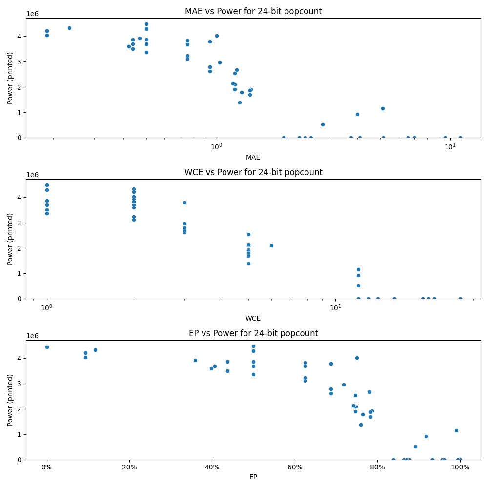

# Generated 24 bit popcount circuit
- __Circuit__: popcount (24 bit to 5.0 bit)

## Parameters of selected circuit
| Circuit         |       MAE |   WCE |       EP |             Area |           Power |            Delay | Download                                                               |
|:----------------|----------:|------:|---------:|-----------------:|----------------:|-----------------:|:-----------------------------------------------------------------------|
| popcount24_dyrt |  3.75851  |    16 | 0.931808 | 228420           |    878.448      | 565707           | [v](popcount24_dyrt.v) [c](popcount24_dyrt.c) [py](popcount24_dyrt.py) |
| popcount24_fkj6 |  2.25652  |    13 | 0.863617 |      0           |      0          |      0           | [v](popcount24_fkj6.v) [c](popcount24_fkj6.c) [py](popcount24_fkj6.py) |
| popcount24_qgj4 |  2.52929  |    14 | 0.877786 |      0           |      0          |      0           | [v](popcount24_qgj4.v) [c](popcount24_qgj4.c) [py](popcount24_qgj4.py) |
| popcount24_avee |  4.09504  |    16 | 0.956163 |      0           |      0          |      0           | [v](popcount24_avee.v) [c](popcount24_avee.c) [py](popcount24_avee.py) |
| popcount24_9965 |  1.93416  |    12 | 0.83882  |      0           |      0          |      0           | [v](popcount24_9965.v) [c](popcount24_9965.c) [py](popcount24_9965.py) |
| popcount24_t12x |  1.93416  |    12 | 0.83882  | 228420           |    878.448      | 565707           | [v](popcount24_t12x.v) [c](popcount24_t12x.c) [py](popcount24_t12x.py) |
| popcount24_mubj |  5.13779  |    12 | 0.991153 |      2.52024e+07 |      1.1538e+06 |      4.5485e+07  | [v](popcount24_mubj.v) [c](popcount24_mubj.c) [py](popcount24_mubj.py) |
| popcount24_w594 |  2.84583  |    12 | 0.89143  |      1.14211e+07 | 518780          |      2.3723e+07  | [v](popcount24_w594.v) [c](popcount24_w594.c) [py](popcount24_w594.py) |
| popcount24_cnyw |  4.00019  |    12 | 0.917529 |      2.11247e+07 | 920570          |      4.01969e+07 | [v](popcount24_cnyw.v) [c](popcount24_cnyw.c) [py](popcount24_cnyw.py) |
| popcount24_gf11 |  0.1875   |     2 | 0.09375  |      7.37424e+07 |      4.2174e+06 |      6.84678e+07 | [v](popcount24_gf11.v) [c](popcount24_gf11.c) [py](popcount24_gf11.py) |
| popcount24_lnym |  0.234375 |     2 | 0.117188 |      7.16588e+07 |      4.3284e+06 |      7.00895e+07 | [v](popcount24_lnym.v) [c](popcount24_lnym.c) [py](popcount24_lnym.py) |
| popcount24_dsjy |  0.1875   |     2 | 0.09375  |      7.37424e+07 |      4.2174e+06 |      6.84677e+07 | [v](popcount24_dsjy.v) [c](popcount24_dsjy.c) [py](popcount24_dsjy.py) |
| popcount24_cypj |  0.1875   |     2 | 0.09375  |      7.43848e+07 |      4.0445e+06 |      7.08512e+07 | [v](popcount24_cypj.v) [c](popcount24_cypj.c) [py](popcount24_cypj.py) |
| popcount24_glw0 |  0        |     0 | 0        |      7.4261e+07  |      4.4429e+06 |      7.20916e+07 | [v](popcount24_glw0.v) [c](popcount24_glw0.c) [py](popcount24_glw0.py) |
| popcount24_65o1 |  1.19629  |     5 | 0.74707  |      4.69437e+07 |      2.5351e+06 |      6.195e+07   | [v](popcount24_65o1.v) [c](popcount24_65o1.c) [py](popcount24_65o1.py) |
| popcount24_4j04 |  1.19629  |     5 | 0.74707  |      4.03057e+07 |      1.9038e+06 |      5.91416e+07 | [v](popcount24_4j04.v) [c](popcount24_4j04.c) [py](popcount24_4j04.py) |
| popcount24_vz8p |  1.19904  |     5 | 0.74765  |      4.71671e+07 |      2.0938e+06 |      6.8117e+07  | [v](popcount24_vz8p.v) [c](popcount24_vz8p.c) [py](popcount24_vz8p.py) |
| popcount24_nqdk |  1.19348  |     6 | 0.745728 |      4.89531e+07 |      2.0962e+06 |      6.37365e+07 | [v](popcount24_nqdk.v) [c](popcount24_nqdk.c) [py](popcount24_nqdk.py) |
| popcount24_0mvk |  1.17065  |     5 | 0.741943 |      4.45736e+07 |      2.1359e+06 |      6.77146e+07 | [v](popcount24_0mvk.v) [c](popcount24_0mvk.c) [py](popcount24_0mvk.py) |
| popcount24_3wel |  2.39291  |    14 | 0.870702 |      0           |      0          |      0           | [v](popcount24_3wel.v) [c](popcount24_3wel.c) [py](popcount24_3wel.py) |
| popcount24_h3qw |  0.421875 |     2 | 0.398438 |      6.72119e+07 |      3.5964e+06 |      6.43339e+07 | [v](popcount24_h3qw.v) [c](popcount24_h3qw.c) [py](popcount24_h3qw.py) |
| popcount24_2tmx |  0.46875  |     2 | 0.359375 |      6.9992e+07  |      3.9265e+06 |      6.97576e+07 | [v](popcount24_2tmx.v) [c](popcount24_2tmx.c) [py](popcount24_2tmx.py) |
| popcount24_31ch |  0.4375   |     1 | 0.4375   |      7.2968e+07  |      3.4996e+06 |      6.65631e+07 | [v](popcount24_31ch.v) [c](popcount24_31ch.c) [py](popcount24_31ch.py) |
| popcount24_oq48 |  0.4375   |     1 | 0.4375   |      7.14429e+07 |      3.863e+06  |      7.02902e+07 | [v](popcount24_oq48.v) [c](popcount24_oq48.c) [py](popcount24_oq48.py) |
| popcount24_x5q3 |  0.4375   |     2 | 0.40625  |      6.87948e+07 |      3.7028e+06 |      6.82416e+07 | [v](popcount24_x5q3.v) [c](popcount24_x5q3.c) [py](popcount24_x5q3.py) |
| popcount24_ajog | 11.0013   |    27 | 0.998417 |      0           |      0          |      0           | [v](popcount24_ajog.v) [c](popcount24_ajog.c) [py](popcount24_ajog.py) |
| popcount24_o13k |  9.50007  |    22 | 0.999816 |      0           |      0          |      0           | [v](popcount24_o13k.v) [c](popcount24_o13k.c) [py](popcount24_o13k.py) |
| popcount24_6to5 |  5.16373  |    20 | 0.932979 |      0           |      0          |      0           | [v](popcount24_6to5.v) [c](popcount24_6to5.c) [py](popcount24_6to5.py) |
| popcount24_pa1p |  6.60426  |    21 | 0.961878 |      0           |      0          |      0           | [v](popcount24_pa1p.v) [c](popcount24_pa1p.c) [py](popcount24_pa1p.py) |
| popcount24_0c31 |  7.00693  |    20 | 0.993878 |      0           |      0          |      0           | [v](popcount24_0c31.v) [c](popcount24_0c31.c) [py](popcount24_0c31.py) |
| popcount24_h2bi |  0.9375   |     3 | 0.6875   |      5.86291e+07 |      2.7961e+06 |      6.73115e+07 | [v](popcount24_h2bi.v) [c](popcount24_h2bi.c) [py](popcount24_h2bi.py) |
| popcount24_hzvg |  0.9375   |     3 | 0.6875   |      5.9016e+07  |      2.6211e+06 |      7.14997e+07 | [v](popcount24_hzvg.v) [c](popcount24_hzvg.c) [py](popcount24_hzvg.py) |
| popcount24_kghr |  0.9375   |     3 | 0.6875   |      7.1935e+07  |      3.7872e+06 |      8.01129e+07 | [v](popcount24_kghr.v) [c](popcount24_kghr.c) [py](popcount24_kghr.py) |
| popcount24_03vt |  1.03125  |     3 | 0.71875  |      5.32763e+07 |      2.9599e+06 |      6.92888e+07 | [v](popcount24_03vt.v) [c](popcount24_03vt.c) [py](popcount24_03vt.py) |
| popcount24_et0y |  1.21875  |     3 | 0.78125  |      4.93751e+07 |      2.6753e+06 |      6.88908e+07 | [v](popcount24_et0y.v) [c](popcount24_et0y.c) [py](popcount24_et0y.py) |
| popcount24_6ohc |  1.39893  |     5 | 0.786621 |      4.71279e+07 |      1.916e+06  |      5.75689e+07 | [v](popcount24_6ohc.v) [c](popcount24_6ohc.c) [py](popcount24_6ohc.py) |
| popcount24_yzho |  1.38922  |     5 | 0.78363  |      4.14548e+07 |      1.8762e+06 |      5.34446e+07 | [v](popcount24_yzho.v) [c](popcount24_yzho.c) [py](popcount24_yzho.py) |
| popcount24_xaat |  1.28174  |     5 | 0.76416  |      4.17691e+07 |      1.787e+06  |      6.34484e+07 | [v](popcount24_xaat.v) [c](popcount24_xaat.c) [py](popcount24_xaat.py) |
| popcount24_zonk |  1.38889  |     5 | 0.78363  |      3.52951e+07 |      1.6931e+06 |      5.62954e+07 | [v](popcount24_zonk.v) [c](popcount24_zonk.c) [py](popcount24_zonk.py) |
| popcount24_8px4 |  1.2561   |     5 | 0.759033 |      3.20401e+07 |      1.3909e+06 |      5.29191e+07 | [v](popcount24_8px4.v) [c](popcount24_8px4.c) [py](popcount24_8px4.py) |
| popcount24_mxl7 |  0.5      |     1 | 0.5      |      6.73318e+07 |      3.8702e+06 |      7.2266e+07  | [v](popcount24_mxl7.v) [c](popcount24_mxl7.c) [py](popcount24_mxl7.py) |
| popcount24_cvvc |  0.5      |     1 | 0.5      |      6.73354e+07 |      3.6908e+06 |      6.95149e+07 | [v](popcount24_cvvc.v) [c](popcount24_cvvc.c) [py](popcount24_cvvc.py) |
| popcount24_cbpv |  0.5      |     1 | 0.5      |      6.5969e+07  |      3.3666e+06 |      6.8043e+07  | [v](popcount24_cbpv.v) [c](popcount24_cbpv.c) [py](popcount24_cbpv.py) |
| popcount24_2cg5 |  0.5      |     1 | 0.5      |      7.33823e+07 |      4.4885e+06 |      7.18529e+07 | [v](popcount24_2cg5.v) [c](popcount24_2cg5.c) [py](popcount24_2cg5.py) |
| popcount24_1vqd |  0.5      |     1 | 0.5      |      7.17681e+07 |      4.2861e+06 |      7.21048e+07 | [v](popcount24_1vqd.v) [c](popcount24_1vqd.c) [py](popcount24_1vqd.py) |
| popcount24_z0tr |  0.75     |     2 | 0.625    |      6.80153e+07 |      3.6886e+06 |      7.05852e+07 | [v](popcount24_z0tr.v) [c](popcount24_z0tr.c) [py](popcount24_z0tr.py) |
| popcount24_pgnp |  0.999756 |     2 | 0.749878 |      6.48668e+07 |      4.0163e+06 |      6.96377e+07 | [v](popcount24_pgnp.v) [c](popcount24_pgnp.c) [py](popcount24_pgnp.py) |
| popcount24_qgy2 |  0.75     |     2 | 0.625    |      7.00644e+07 |      3.832e+06  |      7.13363e+07 | [v](popcount24_qgy2.v) [c](popcount24_qgy2.c) [py](popcount24_qgy2.py) |
| popcount24_7qfm |  0.75     |     2 | 0.625    |      5.63948e+07 |      3.1099e+06 |      6.92499e+07 | [v](popcount24_7qfm.v) [c](popcount24_7qfm.c) [py](popcount24_7qfm.py) |
| popcount24_17ls |  0.75     |     2 | 0.625    |      6.25402e+07 |      3.2391e+06 |      6.69756e+07 | [v](popcount24_17ls.v) [c](popcount24_17ls.c) [py](popcount24_17ls.py) |

## Parameters 
