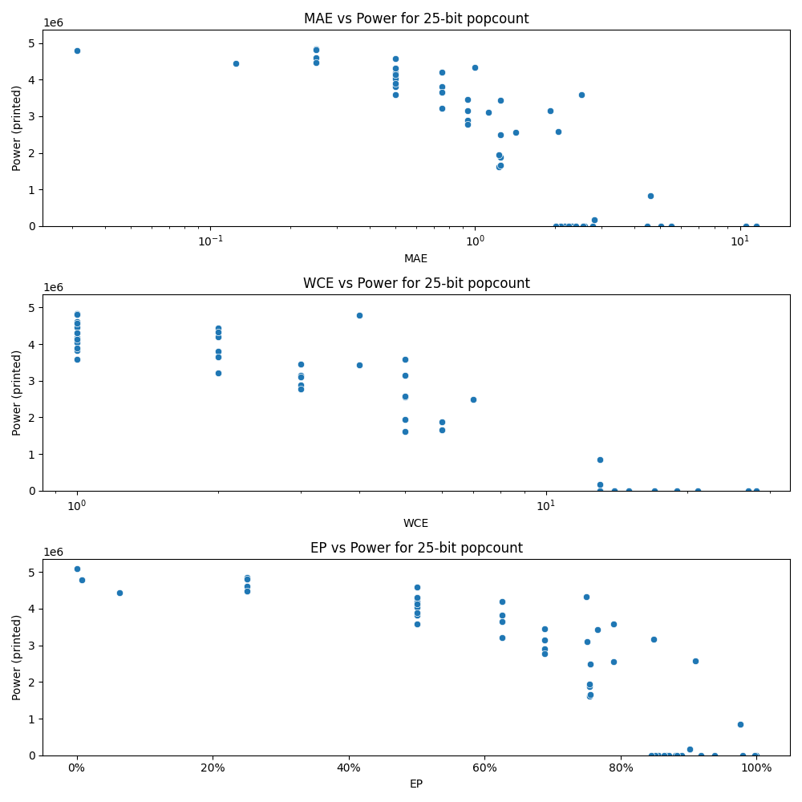

# Generated 25 bit popcount circuit
- __Circuit__: popcount (25 bit to 5.0 bit)

## Parameters of selected circuit
| Circuit         |       MAE |   WCE |        EP |        Area |           Power |       Delay | Download                                                               |
|:----------------|----------:|------:|----------:|------------:|----------------:|------------:|:-----------------------------------------------------------------------|
| popcount25_3f06 |  1.23047  |     5 | 0.753906  | 3.72791e+07 |      1.6158e+06 | 5.89227e+07 | [v](popcount25_3f06.v) [c](popcount25_3f06.c) [py](popcount25_3f06.py) |
| popcount25_hizu |  1.242    |     7 | 0.75528   | 4.3335e+07  |      2.4966e+06 | 6.02295e+07 | [v](popcount25_hizu.v) [c](popcount25_hizu.c) [py](popcount25_hizu.py) |
| popcount25_um1l |  1.24286  |     6 | 0.755615  | 3.33606e+07 |      1.6631e+06 | 6.63166e+07 | [v](popcount25_um1l.v) [c](popcount25_um1l.c) [py](popcount25_um1l.py) |
| popcount25_qjqh |  1.244    |     6 | 0.753931  | 3.56971e+07 |      1.8819e+06 | 4.83754e+07 | [v](popcount25_qjqh.v) [c](popcount25_qjqh.c) [py](popcount25_qjqh.py) |
| popcount25_qlgq |  1.24994  |     4 | 0.765579  | 6.3324e+07  |      3.4309e+06 | 6.78173e+07 | [v](popcount25_qlgq.v) [c](popcount25_qlgq.c) [py](popcount25_qlgq.py) |
| popcount25_aewx |  4.46801  |    19 | 0.918143  | 0           |      0          | 0           | [v](popcount25_aewx.v) [c](popcount25_aewx.c) [py](popcount25_aewx.py) |
| popcount25_h47o | 11.5008   |    28 | 0.99899   | 0           |      0          | 0           | [v](popcount25_h47o.v) [c](popcount25_h47o.c) [py](popcount25_h47o.py) |
| popcount25_gz2m |  5.03113  |    17 | 0.979371  | 0           |      0          | 0           | [v](popcount25_gz2m.v) [c](popcount25_gz2m.c) [py](popcount25_gz2m.py) |
| popcount25_8cyj | 10.5035   |    27 | 0.996939  | 0           |      0          | 0           | [v](popcount25_8cyj.v) [c](popcount25_8cyj.c) [py](popcount25_8cyj.py) |
| popcount25_6x39 |  5.51489  |    21 | 0.938456  | 0           |      0          | 0           | [v](popcount25_6x39.v) [c](popcount25_6x39.c) [py](popcount25_6x39.py) |
| popcount25_s2y6 |  0.25     |     1 | 0.25      | 7.68442e+07 |      4.8426e+06 | 7.20041e+07 | [v](popcount25_s2y6.v) [c](popcount25_s2y6.c) [py](popcount25_s2y6.py) |
| popcount25_1ful |  0.25     |     1 | 0.25      | 7.68442e+07 |      4.6068e+06 | 6.96471e+07 | [v](popcount25_1ful.v) [c](popcount25_1ful.c) [py](popcount25_1ful.py) |
| popcount25_vxzm |  0.25     |     1 | 0.25      | 7.48894e+07 |      4.4706e+06 | 6.96447e+07 | [v](popcount25_vxzm.v) [c](popcount25_vxzm.c) [py](popcount25_vxzm.py) |
| popcount25_h7hr |  0.25     |     1 | 0.25      | 7.77106e+07 |      4.8166e+06 | 6.98218e+07 | [v](popcount25_h7hr.v) [c](popcount25_h7hr.c) [py](popcount25_h7hr.py) |
| popcount25_e4ky |  0.03125  |     4 | 0.0078125 | 7.90422e+07 |      4.7939e+06 | 7.20916e+07 | [v](popcount25_e4ky.v) [c](popcount25_e4ky.c) [py](popcount25_e4ky.py) |
| popcount25_dy29 |  0.125    |     2 | 0.0625    | 7.80216e+07 |      4.4346e+06 | 7.04879e+07 | [v](popcount25_dy29.v) [c](popcount25_dy29.c) [py](popcount25_dy29.py) |
| popcount25_n43g |  2.16973  |    14 | 0.856089  | 0           |      0          | 0           | [v](popcount25_n43g.v) [c](popcount25_n43g.c) [py](popcount25_n43g.py) |
| popcount25_gm8j |  2.32472  |    14 | 0.867159  | 0           |      0          | 0           | [v](popcount25_gm8j.v) [c](popcount25_gm8j.c) [py](popcount25_gm8j.py) |
| popcount25_1aj0 |  2.39291  |    14 | 0.870702  | 0           |      0          | 0           | [v](popcount25_1aj0.v) [c](popcount25_1aj0.c) [py](popcount25_1aj0.py) |
| popcount25_yqcn |  2.25652  |    13 | 0.863617  | 0           |      0          | 0           | [v](popcount25_yqcn.v) [c](popcount25_yqcn.c) [py](popcount25_yqcn.py) |
| popcount25_734b |  2.78789  |    15 | 0.890185  | 0           |      0          | 0           | [v](popcount25_734b.v) [c](popcount25_734b.c) [py](popcount25_734b.py) |
| popcount25_2mwl |  2.5904   |    15 | 0.880443  | 0           |      0          | 0           | [v](popcount25_2mwl.v) [c](popcount25_2mwl.c) [py](popcount25_2mwl.py) |
| popcount25_jxwu |  2.55409  |    14 | 0.8831    | 0           |      0          | 0           | [v](popcount25_jxwu.v) [c](popcount25_jxwu.c) [py](popcount25_jxwu.py) |
| popcount25_w6r9 |  0        |     0 | 0         | 7.77046e+07 |      5.0998e+06 | 7.21857e+07 | [v](popcount25_w6r9.v) [c](popcount25_w6r9.c) [py](popcount25_w6r9.py) |
| popcount25_nrm6 |  2.09534  |    13 | 0.851218  | 0           |      0          | 0           | [v](popcount25_nrm6.v) [c](popcount25_nrm6.c) [py](popcount25_nrm6.py) |
| popcount25_ikmp |  2.01475  |    13 | 0.845019  | 0           |      0          | 0           | [v](popcount25_ikmp.v) [c](popcount25_ikmp.c) [py](popcount25_ikmp.py) |
| popcount25_4jgj |  4.59866  |    13 | 0.976329  | 1.67309e+07 | 840180          | 4.79478e+07 | [v](popcount25_4jgj.v) [c](popcount25_4jgj.c) [py](popcount25_4jgj.py) |
| popcount25_j01l |  2.82096  |    13 | 0.901589  | 3.82386e+06 | 168780          | 1.03639e+07 | [v](popcount25_j01l.v) [c](popcount25_j01l.c) [py](popcount25_j01l.py) |
| popcount25_4qpr |  0.5      |     1 | 0.5       | 7.40997e+07 |      4.0443e+06 | 7.05888e+07 | [v](popcount25_4qpr.v) [c](popcount25_4qpr.c) [py](popcount25_4qpr.py) |
| popcount25_yde7 |  0.5      |     1 | 0.5       | 7.10759e+07 |      4.0353e+06 | 7.18531e+07 | [v](popcount25_yde7.v) [c](popcount25_yde7.c) [py](popcount25_yde7.py) |
| popcount25_1h4j |  0.5      |     1 | 0.5       | 7.13713e+07 |      4.1869e+06 | 7.21099e+07 | [v](popcount25_1h4j.v) [c](popcount25_1h4j.c) [py](popcount25_1h4j.py) |
| popcount25_d8u8 |  0.5      |     1 | 0.5       | 7.46189e+07 |      3.5818e+06 | 6.55449e+07 | [v](popcount25_d8u8.v) [c](popcount25_d8u8.c) [py](popcount25_d8u8.py) |
| popcount25_q35t |  0.5      |     1 | 0.5       | 7.16297e+07 |      4.3091e+06 | 6.84791e+07 | [v](popcount25_q35t.v) [c](popcount25_q35t.c) [py](popcount25_q35t.py) |
| popcount25_1us2 |  0.75     |     2 | 0.625     | 6.66188e+07 |      3.8146e+06 | 7.10854e+07 | [v](popcount25_1us2.v) [c](popcount25_1us2.c) [py](popcount25_1us2.py) |
| popcount25_ypwi |  0.75     |     2 | 0.625     | 6.53779e+07 |      3.6465e+06 | 6.98559e+07 | [v](popcount25_ypwi.v) [c](popcount25_ypwi.c) [py](popcount25_ypwi.py) |
| popcount25_1zo5 |  0.75     |     2 | 0.625     | 7.31271e+07 |      4.1986e+06 | 7.19822e+07 | [v](popcount25_1zo5.v) [c](popcount25_1zo5.c) [py](popcount25_1zo5.py) |
| popcount25_vzkp |  0.75     |     2 | 0.625     | 6.57064e+07 |      3.2104e+06 | 6.99078e+07 | [v](popcount25_vzkp.v) [c](popcount25_vzkp.c) [py](popcount25_vzkp.py) |
| popcount25_ubud |  0.999756 |     2 | 0.749878  | 6.96432e+07 |      4.324e+06  | 6.785e+07   | [v](popcount25_ubud.v) [c](popcount25_ubud.c) [py](popcount25_ubud.py) |
| popcount25_xfgw |  0.5      |     1 | 0.5       | 7.08819e+07 |      4.3055e+06 | 7.03313e+07 | [v](popcount25_xfgw.v) [c](popcount25_xfgw.c) [py](popcount25_xfgw.py) |
| popcount25_gmuo |  0.5      |     1 | 0.5       | 7.24004e+07 |      4.5801e+06 | 7.13276e+07 | [v](popcount25_gmuo.v) [c](popcount25_gmuo.c) [py](popcount25_gmuo.py) |
| popcount25_pgj3 |  0.5      |     1 | 0.5       | 6.97576e+07 |      3.8175e+06 | 6.80217e+07 | [v](popcount25_pgj3.v) [c](popcount25_pgj3.c) [py](popcount25_pgj3.py) |
| popcount25_98qq |  0.5      |     1 | 0.5       | 7.35348e+07 |      4.1392e+06 | 7.08046e+07 | [v](popcount25_98qq.v) [c](popcount25_98qq.c) [py](popcount25_98qq.py) |
| popcount25_vtdu |  0.5      |     1 | 0.5       | 7.04286e+07 |      3.8916e+06 | 7.15998e+07 | [v](popcount25_vtdu.v) [c](popcount25_vtdu.c) [py](popcount25_vtdu.py) |
| popcount25_n4rw |  1.23047  |     5 | 0.753906  | 3.86666e+07 |      1.9441e+06 | 5.78418e+07 | [v](popcount25_n4rw.v) [c](popcount25_n4rw.c) [py](popcount25_n4rw.py) |
| popcount25_27gm |  1.42578  |     5 | 0.789062  | 5.09889e+07 |      2.5577e+06 | 6.63146e+07 | [v](popcount25_27gm.v) [c](popcount25_27gm.c) [py](popcount25_27gm.py) |
| popcount25_pbml |  2.06421  |     5 | 0.909912  | 5.20936e+07 |      2.5866e+06 | 6.42726e+07 | [v](popcount25_pbml.v) [c](popcount25_pbml.c) [py](popcount25_pbml.py) |
| popcount25_9gts |  2.51998  |     5 | 0.788976  | 6.5838e+07  |      3.5848e+06 | 6.25877e+07 | [v](popcount25_9gts.v) [c](popcount25_9gts.c) [py](popcount25_9gts.py) |
| popcount25_u12w |  1.91808  |     5 | 0.848568  | 5.88631e+07 |      3.1579e+06 | 5.37383e+07 | [v](popcount25_u12w.v) [c](popcount25_u12w.c) [py](popcount25_u12w.py) |
| popcount25_89ak |  0.9375   |     3 | 0.6875    | 6.6198e+07  |      3.4516e+06 | 7.59384e+07 | [v](popcount25_89ak.v) [c](popcount25_89ak.c) [py](popcount25_89ak.py) |
| popcount25_jue2 |  0.9375   |     3 | 0.6875    | 6.07192e+07 |      3.151e+06  | 7.00967e+07 | [v](popcount25_jue2.v) [c](popcount25_jue2.c) [py](popcount25_jue2.py) |
| popcount25_pm72 |  0.9375   |     3 | 0.6875    | 5.96486e+07 |      2.8963e+06 | 6.93961e+07 | [v](popcount25_pm72.v) [c](popcount25_pm72.c) [py](popcount25_pm72.py) |
| popcount25_zi5y |  1.125    |     3 | 0.75      | 5.71661e+07 |      3.0999e+06 | 6.95924e+07 | [v](popcount25_zi5y.v) [c](popcount25_zi5y.c) [py](popcount25_zi5y.py) |
| popcount25_2c7g |  0.9375   |     3 | 0.6875    | 5.92743e+07 |      2.7816e+06 | 6.58939e+07 | [v](popcount25_2c7g.v) [c](popcount25_2c7g.c) [py](popcount25_2c7g.py) |

## Parameters 
