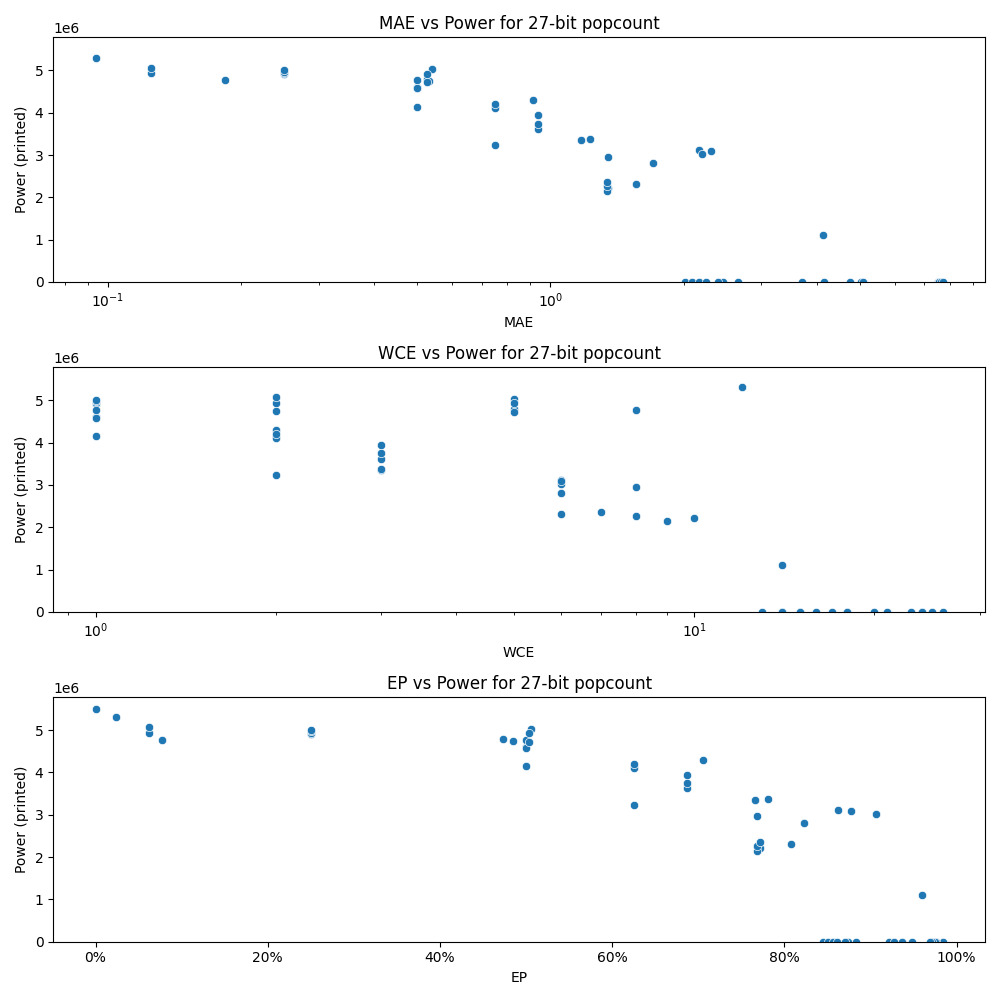

# Generated 27 bit popcount circuit
- __Circuit__: popcount (27 bit to 5.0 bit)

## Parameters of selected circuit
| Circuit         |      MAE |   WCE |        EP |             Area |         Power |       Delay | Download                                                               |
|:----------------|---------:|------:|----------:|-----------------:|--------------:|------------:|:-----------------------------------------------------------------------|
| popcount27_aow5 | 2.45756  |    15 | 0.873801  |      0           |    0          | 0           | [v](popcount27_aow5.v) [c](popcount27_aow5.c) [py](popcount27_aow5.py) |
| popcount27_qkp5 | 2.65018  |    16 | 0.882934  |      0           |    0          | 0           | [v](popcount27_qkp5.v) [c](popcount27_qkp5.c) [py](popcount27_qkp5.py) |
| popcount27_xcpf | 2.01475  |    13 | 0.845019  |      0           |    0          | 0           | [v](popcount27_xcpf.v) [c](popcount27_xcpf.c) [py](popcount27_xcpf.py) |
| popcount27_90nk | 2.39114  |    15 | 0.87048   |      0           |    0          | 0           | [v](popcount27_90nk.v) [c](popcount27_90nk.c) [py](popcount27_90nk.py) |
| popcount27_j1oh | 3.70128  |    17 | 0.937145  |      0           |    0          | 0           | [v](popcount27_j1oh.v) [c](popcount27_j1oh.c) [py](popcount27_j1oh.py) |
| popcount27_s0xx | 4.75792  |    20 | 0.921718  |      0           |    0          | 0           | [v](popcount27_s0xx.v) [c](popcount27_s0xx.c) [py](popcount27_s0xx.py) |
| popcount27_b6ql | 5.04144  |    18 | 0.97672   |      0           |    0          | 0           | [v](popcount27_b6ql.v) [c](popcount27_b6ql.c) [py](popcount27_b6ql.py) |
| popcount27_dl7k | 5.08518  |    21 | 0.927554  |      0           |    0          | 0           | [v](popcount27_dl7k.v) [c](popcount27_dl7k.c) [py](popcount27_dl7k.py) |
| popcount27_zzpw | 4.16352  |    18 | 0.948785  |      0           |    0          | 0           | [v](popcount27_zzpw.v) [c](popcount27_zzpw.c) [py](popcount27_zzpw.py) |
| popcount27_3787 | 0.183609 |     8 | 0.0770912 |      8.69875e+07 |    4.7715e+06 | 7.17652e+07 | [v](popcount27_3787.v) [c](popcount27_3787.c) [py](popcount27_3787.py) |
| popcount27_x8t9 | 0.25     |     1 | 0.25      |      8.25058e+07 |    4.9115e+06 | 6.98178e+07 | [v](popcount27_x8t9.v) [c](popcount27_x8t9.c) [py](popcount27_x8t9.py) |
| popcount27_qulh | 0.25     |     1 | 0.25      |      8.45938e+07 |    4.928e+06  | 7.16112e+07 | [v](popcount27_qulh.v) [c](popcount27_qulh.c) [py](popcount27_qulh.py) |
| popcount27_jmnn | 0.25     |     1 | 0.25      |      8.29042e+07 |    4.9742e+06 | 6.97649e+07 | [v](popcount27_jmnn.v) [c](popcount27_jmnn.c) [py](popcount27_jmnn.py) |
| popcount27_4sdm | 0.25     |     1 | 0.25      |      7.81873e+07 |    5.0039e+06 | 6.82651e+07 | [v](popcount27_4sdm.v) [c](popcount27_4sdm.c) [py](popcount27_4sdm.py) |
| popcount27_3ii0 | 0.5      |     1 | 0.5       |      8.15051e+07 |    4.6043e+06 | 6.96469e+07 | [v](popcount27_3ii0.v) [c](popcount27_3ii0.c) [py](popcount27_3ii0.py) |
| popcount27_3cx7 | 0.5      |     1 | 0.5       |      7.83475e+07 |    4.1471e+06 | 6.88763e+07 | [v](popcount27_3cx7.v) [c](popcount27_3cx7.c) [py](popcount27_3cx7.py) |
| popcount27_gsc3 | 0.5      |     1 | 0.5       |      7.98792e+07 |    4.5965e+06 | 6.8977e+07  | [v](popcount27_gsc3.v) [c](popcount27_gsc3.c) [py](popcount27_gsc3.py) |
| popcount27_6ls0 | 0.5      |     1 | 0.5       |      7.7117e+07  |    4.5851e+06 | 6.885e+07   | [v](popcount27_6ls0.v) [c](popcount27_6ls0.c) [py](popcount27_6ls0.py) |
| popcount27_2ueo | 0.5      |     1 | 0.5       |      7.84323e+07 |    4.7682e+06 | 7.18608e+07 | [v](popcount27_2ueo.v) [c](popcount27_2ueo.c) [py](popcount27_2ueo.py) |
| popcount27_wmyu | 1.34976  |    10 | 0.771244  |      4.97052e+07 |    2.2158e+06 | 6.96423e+07 | [v](popcount27_wmyu.v) [c](popcount27_wmyu.c) [py](popcount27_wmyu.py) |
| popcount27_3epo | 1.34483  |     9 | 0.76877   |      4.36934e+07 |    2.1438e+06 | 6.45809e+07 | [v](popcount27_3epo.v) [c](popcount27_3epo.c) [py](popcount27_3epo.py) |
| popcount27_ljyr | 1.34145  |     8 | 0.768821  |      4.73772e+07 |    2.265e+06  | 6.9051e+07  | [v](popcount27_ljyr.v) [c](popcount27_ljyr.c) [py](popcount27_ljyr.py) |
| popcount27_bzit | 1.34912  |     8 | 0.768768  |      5.45194e+07 |    2.962e+06  | 7.18417e+07 | [v](popcount27_bzit.v) [c](popcount27_bzit.c) [py](popcount27_bzit.py) |
| popcount27_1im0 | 1.34402  |     7 | 0.771984  |      5.11514e+07 |    2.365e+06  | 6.78319e+07 | [v](popcount27_1im0.v) [c](popcount27_1im0.c) [py](popcount27_1im0.py) |
| popcount27_6er0 | 7.53154  |    23 | 0.983879  |      0           |    0          | 0           | [v](popcount27_6er0.v) [c](popcount27_6er0.c) [py](popcount27_6er0.py) |
| popcount27_6cry | 7.55848  |    24 | 0.976718  |      0           |    0          | 0           | [v](popcount27_6cry.v) [c](popcount27_6cry.c) [py](popcount27_6cry.py) |
| popcount27_zdtu | 7.56944  |    24 | 0.975355  |      0           |    0          | 0           | [v](popcount27_zdtu.v) [c](popcount27_zdtu.c) [py](popcount27_zdtu.py) |
| popcount27_exvj | 7.61873  |    25 | 0.971465  |      0           |    0          | 0           | [v](popcount27_exvj.v) [c](popcount27_exvj.c) [py](popcount27_exvj.py) |
| popcount27_uhu8 | 7.70317  |    26 | 0.968629  |      0           |    0          | 0           | [v](popcount27_uhu8.v) [c](popcount27_uhu8.c) [py](popcount27_uhu8.py) |
| popcount27_8vtf | 0.526367 |     5 | 0.4729    |      7.81637e+07 |    4.7875e+06 | 7.4146e+07  | [v](popcount27_8vtf.v) [c](popcount27_8vtf.c) [py](popcount27_8vtf.py) |
| popcount27_ywwk | 0.53125  |     2 | 0.484375  |      8.07813e+07 |    4.7401e+06 | 7.13285e+07 | [v](popcount27_ywwk.v) [c](popcount27_ywwk.c) [py](popcount27_ywwk.py) |
| popcount27_tno0 | 0.538849 |     5 | 0.505829  |      8.17751e+07 |    5.028e+06  | 7.80212e+07 | [v](popcount27_tno0.v) [c](popcount27_tno0.c) [py](popcount27_tno0.py) |
| popcount27_p39m | 0.526367 |     5 | 0.503906  |      8.00422e+07 |    4.9272e+06 | 7.20547e+07 | [v](popcount27_p39m.v) [c](popcount27_p39m.c) [py](popcount27_p39m.py) |
| popcount27_y9tl | 0.527344 |     5 | 0.503906  |      8.04619e+07 |    4.7243e+06 | 7.26898e+07 | [v](popcount27_y9tl.v) [c](popcount27_y9tl.c) [py](popcount27_y9tl.py) |
| popcount27_4rsu | 0        |     0 | 0         |      8.38097e+07 |    5.5073e+06 | 6.93808e+07 | [v](popcount27_4rsu.v) [c](popcount27_4rsu.c) [py](popcount27_4rsu.py) |
| popcount27_eg0w | 1.17188  |     3 | 0.765625  |      6.50712e+07 |    3.3459e+06 | 6.98297e+07 | [v](popcount27_eg0w.v) [c](popcount27_eg0w.c) [py](popcount27_eg0w.py) |
| popcount27_9sb7 | 0.9375   |     3 | 0.6875    |      6.74916e+07 |    3.9485e+06 | 7.01746e+07 | [v](popcount27_9sb7.v) [c](popcount27_9sb7.c) [py](popcount27_9sb7.py) |
| popcount27_ifbv | 0.9375   |     3 | 0.6875    |      6.98827e+07 |    3.6228e+06 | 7.10495e+07 | [v](popcount27_ifbv.v) [c](popcount27_ifbv.c) [py](popcount27_ifbv.py) |
| popcount27_zu6b | 0.9375   |     3 | 0.6875    |      6.84496e+07 |    3.7432e+06 | 7.43851e+07 | [v](popcount27_zu6b.v) [c](popcount27_zu6b.c) [py](popcount27_zu6b.py) |
| popcount27_0fee | 1.22656  |     3 | 0.78125   |      6.2867e+07  |    3.378e+06  | 6.93727e+07 | [v](popcount27_0fee.v) [c](popcount27_0fee.c) [py](popcount27_0fee.py) |
| popcount27_0me9 | 0.09375  |    12 | 0.0232549 |      8.84222e+07 |    5.3052e+06 | 7.42039e+07 | [v](popcount27_0me9.v) [c](popcount27_0me9.c) [py](popcount27_0me9.py) |
| popcount27_cdyr | 0.125    |     2 | 0.0625    |      8.49548e+07 |    4.9381e+06 | 7.22192e+07 | [v](popcount27_cdyr.v) [c](popcount27_cdyr.c) [py](popcount27_cdyr.py) |
| popcount27_p083 | 0.125    |     2 | 0.0625    |      8.26565e+07 |    5.0681e+06 | 7.11986e+07 | [v](popcount27_p083.v) [c](popcount27_p083.c) [py](popcount27_p083.py) |
| popcount27_im9c | 0.912109 |     2 | 0.706055  |      7.1933e+07  |    4.2944e+06 | 6.86976e+07 | [v](popcount27_im9c.v) [c](popcount27_im9c.c) [py](popcount27_im9c.py) |
| popcount27_rq7i | 0.75     |     2 | 0.625     |      7.18632e+07 |    4.129e+06  | 7.11231e+07 | [v](popcount27_rq7i.v) [c](popcount27_rq7i.c) [py](popcount27_rq7i.py) |
| popcount27_0tfs | 0.75     |     2 | 0.625     |      7.18076e+07 |    4.1097e+06 | 7.10934e+07 | [v](popcount27_0tfs.v) [c](popcount27_0tfs.c) [py](popcount27_0tfs.py) |
| popcount27_s17z | 0.75     |     2 | 0.625     |      7.33094e+07 |    4.1965e+06 | 7.09134e+07 | [v](popcount27_s17z.v) [c](popcount27_s17z.c) [py](popcount27_s17z.py) |
| popcount27_zznn | 0.75     |     2 | 0.625     |      6.55393e+07 |    3.2341e+06 | 6.95327e+07 | [v](popcount27_zznn.v) [c](popcount27_zznn.c) [py](popcount27_zznn.py) |
| popcount27_ffqx | 1.5593   |     6 | 0.807861  |      4.19631e+07 |    2.3121e+06 | 5.22788e+07 | [v](popcount27_ffqx.v) [c](popcount27_ffqx.c) [py](popcount27_ffqx.py) |
| popcount27_3xcf | 2.1666   |     6 | 0.862637  |      5.37198e+07 |    3.1128e+06 | 7.06249e+07 | [v](popcount27_3xcf.v) [c](popcount27_3xcf.c) [py](popcount27_3xcf.py) |
| popcount27_lva2 | 2.2041   |     6 | 0.907058  |      5.50882e+07 |    3.0158e+06 | 6.11877e+07 | [v](popcount27_lva2.v) [c](popcount27_lva2.c) [py](popcount27_lva2.py) |
| popcount27_1y4c | 1.70953  |     6 | 0.822754  |      5.10512e+07 |    2.8142e+06 | 5.28244e+07 | [v](popcount27_1y4c.v) [c](popcount27_1y4c.c) [py](popcount27_1y4c.py) |
| popcount27_ijzh | 2.31255  |     6 | 0.877298  |      6.31111e+07 |    3.0907e+06 | 6.41346e+07 | [v](popcount27_ijzh.v) [c](popcount27_ijzh.c) [py](popcount27_ijzh.py) |
| popcount27_yw9x | 2.09224  |    14 | 0.850554  |      0           |    0          | 0           | [v](popcount27_yw9x.v) [c](popcount27_yw9x.c) [py](popcount27_yw9x.py) |
| popcount27_5jsl | 2.16973  |    14 | 0.856089  |      0           |    0          | 0           | [v](popcount27_5jsl.v) [c](popcount27_5jsl.c) [py](popcount27_5jsl.py) |
| popcount27_sojs | 4.13493  |    14 | 0.959781  |      2.33629e+07 |    1.0998e+06 | 5.27909e+07 | [v](popcount27_sojs.v) [c](popcount27_sojs.c) [py](popcount27_sojs.py) |
| popcount27_6onj | 2.24722  |    14 | 0.861624  | 476280           | 3460.8        | 2.5511e+06  | [v](popcount27_6onj.v) [c](popcount27_6onj.c) [py](popcount27_6onj.py) |

## Parameters 
