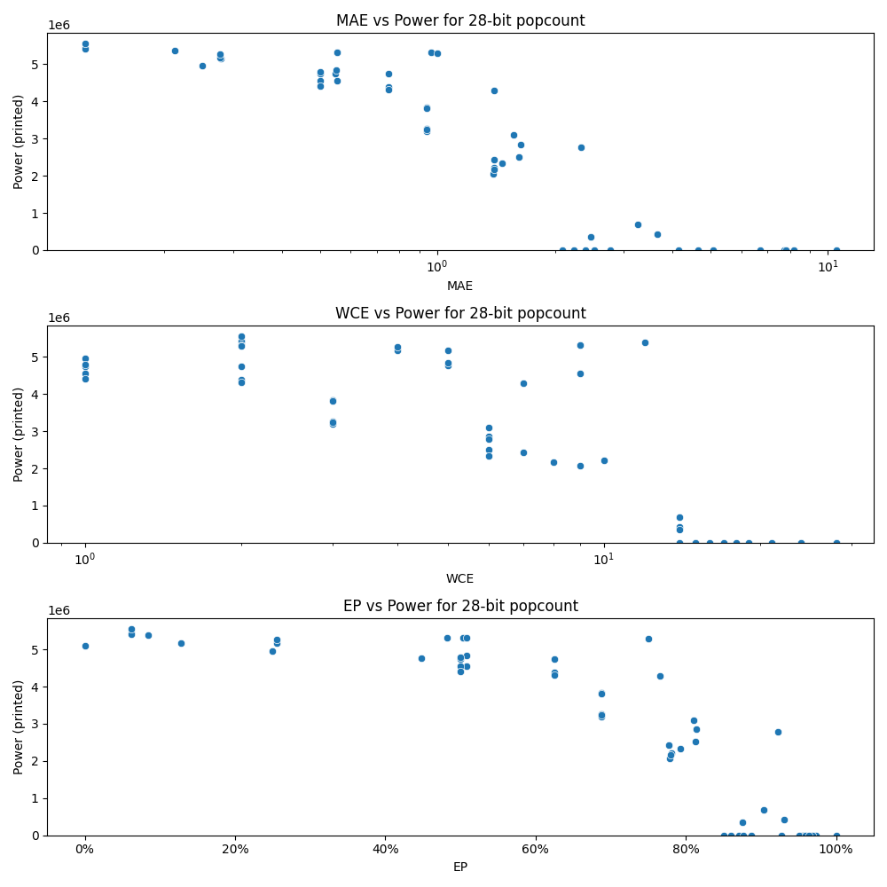

# Generated 28 bit popcount circuit
- __Circuit__: popcount (28 bit to 5.0 bit)

## Parameters of selected circuit
| Circuit         |       MAE |   WCE |        EP |             Area |           Power |            Delay | Download                                                               |
|:----------------|----------:|------:|----------:|-----------------:|----------------:|-----------------:|:-----------------------------------------------------------------------|
| popcount28_5yv8 |  0.125    |     2 | 0.0625    |      8.58625e+07 |      5.4309e+06 |      6.95443e+07 | [v](popcount28_5yv8.v) [c](popcount28_5yv8.c) [py](popcount28_5yv8.py) |
| popcount28_hh3x |  0.125    |     2 | 0.0625    |      8.58625e+07 |      5.4159e+06 |      7.12685e+07 | [v](popcount28_hh3x.v) [c](popcount28_hh3x.c) [py](popcount28_hh3x.py) |
| popcount28_sqd3 |  0.125    |     2 | 0.0625    |      8.62766e+07 |      5.5595e+06 |      7.05438e+07 | [v](popcount28_sqd3.v) [c](popcount28_sqd3.c) [py](popcount28_sqd3.py) |
| popcount28_oa6j |  0.212936 |    12 | 0.0843014 |      9.08891e+07 |      5.3782e+06 |      7.28063e+07 | [v](popcount28_oa6j.v) [c](popcount28_oa6j.c) [py](popcount28_oa6j.py) |
| popcount28_ovuj |  0.279297 |     5 | 0.255859  |      8.83311e+07 |      5.1646e+06 |      6.99531e+07 | [v](popcount28_ovuj.v) [c](popcount28_ovuj.c) [py](popcount28_ovuj.py) |
| popcount28_vyp7 |  0.277344 |     4 | 0.12793   |      8.68751e+07 |      5.1674e+06 |      6.9672e+07  | [v](popcount28_vyp7.v) [c](popcount28_vyp7.c) [py](popcount28_vyp7.py) |
| popcount28_wvn0 |  0.277344 |     4 | 0.255859  |      8.83166e+07 |      5.2753e+06 |      7.24994e+07 | [v](popcount28_wvn0.v) [c](popcount28_wvn0.c) [py](popcount28_wvn0.py) |
| popcount28_7zjo |  0.25     |     1 | 0.25      |      8.55224e+07 |      4.957e+06  |      6.86997e+07 | [v](popcount28_7zjo.v) [c](popcount28_7zjo.c) [py](popcount28_7zjo.py) |
| popcount28_7dhe |  0.554718 |     9 | 0.507782  |      8.2206e+07  |      4.5468e+06 |      6.89848e+07 | [v](popcount28_7dhe.v) [c](popcount28_7dhe.c) [py](popcount28_7dhe.py) |
| popcount28_be3c |  0.547699 |     5 | 0.447693  |      8.34458e+07 |      4.7579e+06 |      7.15892e+07 | [v](popcount28_be3c.v) [c](popcount28_be3c.c) [py](popcount28_be3c.py) |
| popcount28_1sn7 |  0.552551 |     9 | 0.503906  |      8.85118e+07 |      5.3207e+06 |      7.11211e+07 | [v](popcount28_1sn7.v) [c](popcount28_1sn7.c) [py](popcount28_1sn7.py) |
| popcount28_pwfh |  0.550354 |     5 | 0.507751  |      8.12234e+07 |      4.8375e+06 |      6.95505e+07 | [v](popcount28_pwfh.v) [c](popcount28_pwfh.c) [py](popcount28_pwfh.py) |
| popcount28_af1u |  0.554718 |     9 | 0.507782  |      8.46466e+07 |      5.3172e+06 |      7.51959e+07 | [v](popcount28_af1u.v) [c](popcount28_af1u.c) [py](popcount28_af1u.py) |
| popcount28_jvgw |  1.39972  |    10 | 0.78055   |      4.72292e+07 |      2.207e+06  |      5.90155e+07 | [v](popcount28_jvgw.v) [c](popcount28_jvgw.c) [py](popcount28_jvgw.py) |
| popcount28_n6yf |  1.39029  |     9 | 0.77816   |      4.31749e+07 |      2.0615e+06 |      6.73636e+07 | [v](popcount28_n6yf.v) [c](popcount28_n6yf.c) [py](popcount28_n6yf.py) |
| popcount28_qvuq |  1.39738  |     7 | 0.777103  |      4.85107e+07 |      2.4341e+06 |      5.94559e+07 | [v](popcount28_qvuq.v) [c](popcount28_qvuq.c) [py](popcount28_qvuq.py) |
| popcount28_wrg6 |  1.39438  |     8 | 0.779181  |      4.08829e+07 |      2.1659e+06 |      6.40189e+07 | [v](popcount28_wrg6.v) [c](popcount28_wrg6.c) [py](popcount28_wrg6.py) |
| popcount28_inai |  1.39926  |     7 | 0.765723  |      7.61767e+07 |      4.2873e+06 |      6.58147e+07 | [v](popcount28_inai.v) [c](popcount28_inai.c) [py](popcount28_inai.py) |
| popcount28_7cxv |  2.39114  |    15 | 0.87048   |      0           |      0          |      0           | [v](popcount28_7cxv.v) [c](popcount28_7cxv.c) [py](popcount28_7cxv.py) |
| popcount28_iswk |  2.76724  |    17 | 0.887622  | 228420           |    878.448      | 565707           | [v](popcount28_iswk.v) [c](popcount28_iswk.c) [py](popcount28_iswk.py) |
| popcount28_pk69 |  2.24169  |    15 | 0.860517  |      0           |      0          |      0           | [v](popcount28_pk69.v) [c](popcount28_pk69.c) [py](popcount28_pk69.py) |
| popcount28_aqmn |  2.52066  |    16 | 0.876707  |      0           |      0          |      0           | [v](popcount28_aqmn.v) [c](popcount28_aqmn.c) [py](popcount28_aqmn.py) |
| popcount28_vbgj |  4.64904  |    19 | 0.955523  |      0           |      0          |      0           | [v](popcount28_vbgj.v) [c](popcount28_vbgj.c) [py](popcount28_vbgj.py) |
| popcount28_2a7j |  4.14024  |    18 | 0.951113  |      0           |      0          |      0           | [v](popcount28_2a7j.v) [c](popcount28_2a7j.c) [py](popcount28_2a7j.py) |
| popcount28_rfog |  5.08518  |    21 | 0.927554  |      0           |      0          |      0           | [v](popcount28_rfog.v) [c](popcount28_rfog.c) [py](popcount28_rfog.py) |
| popcount28_6bx8 | 10.5      |    24 | 0.999978  |      0           |      0          |      0           | [v](popcount28_6bx8.v) [c](popcount28_6bx8.c) [py](popcount28_6bx8.py) |
| popcount28_ez8k |  8.16618  |    28 | 0.973036  |      0           |      0          |      0           | [v](popcount28_ez8k.v) [c](popcount28_ez8k.c) [py](popcount28_ez8k.py) |
| popcount28_62mx |  7.73629  |    28 | 0.968996  |      0           |      0          |      0           | [v](popcount28_62mx.v) [c](popcount28_62mx.c) [py](popcount28_62mx.py) |
| popcount28_elja |  6.72199  |    24 | 0.958637  |      0           |      0          |      0           | [v](popcount28_elja.v) [c](popcount28_elja.c) [py](popcount28_elja.py) |
| popcount28_lwvc |  7.80263  |    28 | 0.964362  |      0           |      0          |      0           | [v](popcount28_lwvc.v) [c](popcount28_lwvc.c) [py](popcount28_lwvc.py) |
| popcount28_evz2 |  0        |     0 | 0         |      8.5392e+07  |      5.0902e+06 |      6.72699e+07 | [v](popcount28_evz2.v) [c](popcount28_evz2.c) [py](popcount28_evz2.py) |
| popcount28_xu2r |  0.5      |     1 | 0.5       |      7.96928e+07 |      4.7731e+06 |      6.96561e+07 | [v](popcount28_xu2r.v) [c](popcount28_xu2r.c) [py](popcount28_xu2r.py) |
| popcount28_ihqe |  0.5      |     1 | 0.5       |      7.84808e+07 |      4.5473e+06 |      6.99254e+07 | [v](popcount28_ihqe.v) [c](popcount28_ihqe.c) [py](popcount28_ihqe.py) |
| popcount28_1kvj |  0.5      |     1 | 0.5       |      8.29322e+07 |      4.7449e+06 |      7.10904e+07 | [v](popcount28_1kvj.v) [c](popcount28_1kvj.c) [py](popcount28_1kvj.py) |
| popcount28_25xp |  0.5      |     1 | 0.5       |      7.96457e+07 |      4.4101e+06 |      6.73383e+07 | [v](popcount28_25xp.v) [c](popcount28_25xp.c) [py](popcount28_25xp.py) |
| popcount28_so8f |  0.5      |     1 | 0.5       |      8.196e+07   |      4.7845e+06 |      7.14919e+07 | [v](popcount28_so8f.v) [c](popcount28_so8f.c) [py](popcount28_so8f.py) |
| popcount28_482y |  0.964844 |     2 | 0.482422  |      8.08477e+07 |      5.3119e+06 |      7.03166e+07 | [v](popcount28_482y.v) [c](popcount28_482y.c) [py](popcount28_482y.py) |
| popcount28_65h4 |  0.75     |     2 | 0.625     |      7.65797e+07 |      4.744e+06  |      7.2019e+07  | [v](popcount28_65h4.v) [c](popcount28_65h4.c) [py](popcount28_65h4.py) |
| popcount28_6b92 |  0.75     |     2 | 0.625     |      7.62435e+07 |      4.3888e+06 |      7.16824e+07 | [v](popcount28_6b92.v) [c](popcount28_6b92.c) [py](popcount28_6b92.py) |
| popcount28_lsp0 |  0.75     |     2 | 0.625     |      7.96171e+07 |      4.3162e+06 |      7.17302e+07 | [v](popcount28_lsp0.v) [c](popcount28_lsp0.c) [py](popcount28_lsp0.py) |
| popcount28_4621 |  1.00006  |     2 | 0.750031  |      8.30558e+07 |      5.2881e+06 |      7.08119e+07 | [v](popcount28_4621.v) [c](popcount28_4621.c) [py](popcount28_4621.py) |
| popcount28_ss2z |  0.9375   |     3 | 0.6875    |      6.97886e+07 |      3.8362e+06 |      6.82659e+07 | [v](popcount28_ss2z.v) [c](popcount28_ss2z.c) [py](popcount28_ss2z.py) |
| popcount28_i7yl |  0.9375   |     3 | 0.6875    |      7.01992e+07 |      3.8103e+06 |      7.15743e+07 | [v](popcount28_i7yl.v) [c](popcount28_i7yl.c) [py](popcount28_i7yl.py) |
| popcount28_of3n |  0.9375   |     3 | 0.6875    |      6.40114e+07 |      3.2568e+06 |      7.14223e+07 | [v](popcount28_of3n.v) [c](popcount28_of3n.c) [py](popcount28_of3n.py) |
| popcount28_qrl0 |  0.9375   |     3 | 0.6875    |      6.28139e+07 |      3.1871e+06 |      6.83146e+07 | [v](popcount28_qrl0.v) [c](popcount28_qrl0.c) [py](popcount28_qrl0.py) |
| popcount28_26ka |  0.9375   |     3 | 0.6875    |      6.76199e+07 |      3.2341e+06 |      6.97499e+07 | [v](popcount28_26ka.v) [c](popcount28_26ka.c) [py](popcount28_26ka.py) |
| popcount28_jzqm |  1.61776  |     6 | 0.812671  |      4.68149e+07 |      2.511e+06  |      7.06358e+07 | [v](popcount28_jzqm.v) [c](popcount28_jzqm.c) [py](popcount28_jzqm.py) |
| popcount28_b7nj |  1.46738  |     6 | 0.792892  |      4.78985e+07 |      2.3305e+06 |      6.41439e+07 | [v](popcount28_b7nj.v) [c](popcount28_b7nj.c) [py](popcount28_b7nj.py) |
| popcount28_fqia |  1.56885  |     6 | 0.810303  |      5.52561e+07 |      3.1026e+06 |      6.84282e+07 | [v](popcount28_fqia.v) [c](popcount28_fqia.c) [py](popcount28_fqia.py) |
| popcount28_q74m |  1.63783  |     6 | 0.814014  |      5.30795e+07 |      2.8508e+06 |      6.40168e+07 | [v](popcount28_q74m.v) [c](popcount28_q74m.c) [py](popcount28_q74m.py) |
| popcount28_0k3a |  2.33691  |     6 | 0.922852  |      5.36039e+07 |      2.7779e+06 |      7.22143e+07 | [v](popcount28_0k3a.v) [c](popcount28_0k3a.c) [py](popcount28_0k3a.py) |
| popcount28_gp0i |  2.09224  |    14 | 0.850554  |      0           |      0          |      0           | [v](popcount28_gp0i.v) [c](popcount28_gp0i.c) [py](popcount28_gp0i.py) |
| popcount28_1ic1 |  3.65962  |    14 | 0.931123  |      1.21454e+07 | 420790          |      2.80619e+07 | [v](popcount28_1ic1.v) [c](popcount28_1ic1.c) [py](popcount28_1ic1.py) |
| popcount28_ykzy |  3.25293  |    14 | 0.903075  |      1.55149e+07 | 685370          |      3.92896e+07 | [v](popcount28_ykzy.v) [c](popcount28_ykzy.c) [py](popcount28_ykzy.py) |
| popcount28_e9p1 |  2.47543  |    14 | 0.875326  |      7.41784e+06 | 357240          |      1.55076e+07 | [v](popcount28_e9p1.v) [c](popcount28_e9p1.c) [py](popcount28_e9p1.py) |

## Parameters 
