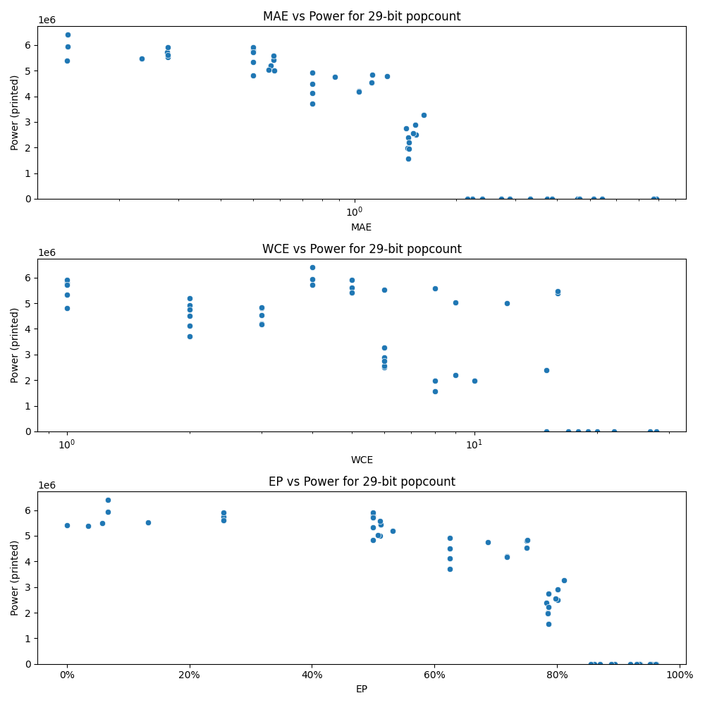

# Generated 29 bit popcount circuit
- __Circuit__: popcount (29 bit to 5.0 bit)

## Parameters of selected circuit
| Circuit         |      MAE |   WCE |        EP |             Area |        Power |            Delay | Download                                                               |
|:----------------|---------:|------:|----------:|-----------------:|-------------:|-----------------:|:-----------------------------------------------------------------------|
| popcount29_bst1 | 0.140625 |     4 | 0.0664062 |      9.11566e+07 |   6.4099e+06 |      7.56662e+07 | [v](popcount29_bst1.v) [c](popcount29_bst1.c) [py](popcount29_bst1.py) |
| popcount29_r11v | 0.140625 |     4 | 0.0664062 |      9.11566e+07 |   5.9472e+06 |      7.32828e+07 | [v](popcount29_r11v.v) [c](popcount29_r11v.c) [py](popcount29_r11v.py) |
| popcount29_ynoh | 0.139898 |    16 | 0.034611  |      9.73771e+07 |   5.3878e+06 |      7.22448e+07 | [v](popcount29_ynoh.v) [c](popcount29_ynoh.c) [py](popcount29_ynoh.py) |
| popcount29_imjn | 0.279297 |     6 | 0.131836  |      9.06124e+07 |   5.52e+06   |      7.15826e+07 | [v](popcount29_imjn.v) [c](popcount29_imjn.c) [py](popcount29_imjn.py) |
| popcount29_i87h | 0.277344 |     4 | 0.255859  |      8.67976e+07 |   5.7315e+06 |      6.93645e+07 | [v](popcount29_i87h.v) [c](popcount29_i87h.c) [py](popcount29_i87h.py) |
| popcount29_82pv | 0.279297 |     5 | 0.255859  |      9.07972e+07 |   5.9084e+06 |      7.71772e+07 | [v](popcount29_82pv.v) [c](popcount29_82pv.c) [py](popcount29_82pv.py) |
| popcount29_f1nb | 0.233648 |    16 | 0.0575034 |      9.49554e+07 |   5.4827e+06 |      7.19806e+07 | [v](popcount29_f1nb.v) [c](popcount29_f1nb.c) [py](popcount29_f1nb.py) |
| popcount29_asdi | 0.279297 |     5 | 0.255859  |      9.07936e+07 |   5.6167e+06 |      7.36838e+07 | [v](popcount29_asdi.v) [c](popcount29_asdi.c) [py](popcount29_asdi.py) |
| popcount29_t6np | 0.574219 |     5 | 0.511719  |      8.40354e+07 |   5.4257e+06 |      7.43871e+07 | [v](popcount29_t6np.v) [c](popcount29_t6np.c) [py](popcount29_t6np.py) |
| popcount29_z2xm | 0.5625   |     2 | 0.53125   |      8.81122e+07 |   5.1931e+06 |      7.40321e+07 | [v](popcount29_z2xm.v) [c](popcount29_z2xm.c) [py](popcount29_z2xm.py) |
| popcount29_b3uc | 0.577791 |    12 | 0.511597  |      8.71418e+07 |   5.0041e+06 |      7.52576e+07 | [v](popcount29_b3uc.v) [c](popcount29_b3uc.c) [py](popcount29_b3uc.py) |
| popcount29_t7ez | 0.554718 |     9 | 0.507782  |      8.4244e+07  |   5.0394e+06 |      6.93693e+07 | [v](popcount29_t7ez.v) [c](popcount29_t7ez.c) [py](popcount29_t7ez.py) |
| popcount29_o5od | 0.573853 |     8 | 0.511627  |      8.82264e+07 |   5.5861e+06 |      7.37626e+07 | [v](popcount29_o5od.v) [c](popcount29_o5od.c) [py](popcount29_o5od.py) |
| popcount29_yyft | 1.44384  |    15 | 0.782476  |      5.19884e+07 |   2.393e+06  |      6.5069e+07  | [v](popcount29_yyft.v) [c](popcount29_yyft.c) [py](popcount29_yyft.py) |
| popcount29_b8e8 | 1.43927  |     8 | 0.785115  |      3.68273e+07 |   1.9894e+06 |      6.47664e+07 | [v](popcount29_b8e8.v) [c](popcount29_b8e8.c) [py](popcount29_b8e8.py) |
| popcount29_yyj2 | 1.44957  |    10 | 0.785067  |      4.40638e+07 |   1.9654e+06 |      5.53625e+07 | [v](popcount29_yyj2.v) [c](popcount29_yyj2.c) [py](popcount29_yyj2.py) |
| popcount29_khno | 1.44305  |     8 | 0.786725  |      3.55299e+07 |   1.5701e+06 |      5.65172e+07 | [v](popcount29_khno.v) [c](popcount29_khno.c) [py](popcount29_khno.py) |
| popcount29_1nbj | 1.44973  |     9 | 0.785622  |      3.81669e+07 |   2.2076e+06 |      6.54195e+07 | [v](popcount29_1nbj.v) [c](popcount29_1nbj.c) [py](popcount29_1nbj.py) |
| popcount29_idu3 | 2.24169  |    15 | 0.860517  |      0           |   0          |      0           | [v](popcount29_idu3.v) [c](popcount29_idu3.c) [py](popcount29_idu3.py) |
| popcount29_22bo | 2.89676  |    17 | 0.893849  |      0           |   0          |      0           | [v](popcount29_22bo.v) [c](popcount29_22bo.c) [py](popcount29_22bo.py) |
| popcount29_s2ta | 2.72677  |    17 | 0.888465  |      0           |   0          |      0           | [v](popcount29_s2ta.v) [c](popcount29_s2ta.c) [py](popcount29_s2ta.py) |
| popcount29_oqwo | 2.16697  |    15 | 0.855536  |      0           |   0          |      0           | [v](popcount29_oqwo.v) [c](popcount29_oqwo.c) [py](popcount29_oqwo.py) |
| popcount29_vk7b | 5.12141  |    22 | 0.929557  |      0           |   0          |      0           | [v](popcount29_vk7b.v) [c](popcount29_vk7b.c) [py](popcount29_vk7b.py) |
| popcount29_yfl4 | 4.59666  |    19 | 0.962691  |      0           |   0          |      0           | [v](popcount29_yfl4.v) [c](popcount29_yfl4.c) [py](popcount29_yfl4.py) |
| popcount29_g3eh | 3.32517  |    17 | 0.920002  |      0           |   0          |      0           | [v](popcount29_g3eh.v) [c](popcount29_g3eh.c) [py](popcount29_g3eh.py) |
| popcount29_hn6m | 4.67128  |    20 | 0.954212  |      0           |   0          |      0           | [v](popcount29_hn6m.v) [c](popcount29_hn6m.c) [py](popcount29_hn6m.py) |
| popcount29_uob2 | 3.73271  |    18 | 0.935558  |      0           |   0          |      0           | [v](popcount29_uob2.v) [c](popcount29_uob2.c) [py](popcount29_uob2.py) |
| popcount29_di19 | 7.899    |    28 | 0.961536  |      0           |   0          |      0           | [v](popcount29_di19.v) [c](popcount29_di19.c) [py](popcount29_di19.py) |
| popcount29_4bty | 7.74882  |    27 | 0.951668  |      0           |   0          |      0           | [v](popcount29_4bty.v) [c](popcount29_4bty.c) [py](popcount29_4bty.py) |
| popcount29_hc56 | 5.44575  |    22 | 0.934939  |      0           |   0          |      0           | [v](popcount29_hc56.v) [c](popcount29_hc56.c) [py](popcount29_hc56.py) |
| popcount29_tarb | 3.86159  |    19 | 0.93047   |      0           |   0          |      0           | [v](popcount29_tarb.v) [c](popcount29_tarb.c) [py](popcount29_tarb.py) |
| popcount29_2sso | 0        |     0 | 0         |      9.05786e+07 |   5.4153e+06 |      6.97615e+07 | [v](popcount29_2sso.v) [c](popcount29_2sso.c) [py](popcount29_2sso.py) |
| popcount29_i2j2 | 0.5      |     1 | 0.5       |      8.66989e+07 |   5.8087e+06 |      7.01033e+07 | [v](popcount29_i2j2.v) [c](popcount29_i2j2.c) [py](popcount29_i2j2.py) |
| popcount29_n9rs | 0.5      |     1 | 0.5       |      8.40956e+07 |   4.8233e+06 |      7.05422e+07 | [v](popcount29_n9rs.v) [c](popcount29_n9rs.c) [py](popcount29_n9rs.py) |
| popcount29_qpgw | 0.5      |     1 | 0.5       |      8.86885e+07 |   5.9151e+06 |      7.21893e+07 | [v](popcount29_qpgw.v) [c](popcount29_qpgw.c) [py](popcount29_qpgw.py) |
| popcount29_vuyv | 0.5      |     1 | 0.5       |      8.43085e+07 |   5.3337e+06 |      7.38124e+07 | [v](popcount29_vuyv.v) [c](popcount29_vuyv.c) [py](popcount29_vuyv.py) |
| popcount29_tp10 | 0.5      |     1 | 0.5       |      8.70774e+07 |   5.7268e+06 |      7.04124e+07 | [v](popcount29_tp10.v) [c](popcount29_tp10.c) [py](popcount29_tp10.py) |
| popcount29_myzf | 0.75     |     2 | 0.625     |      7.51663e+07 |   3.7166e+06 |      6.65182e+07 | [v](popcount29_myzf.v) [c](popcount29_myzf.c) [py](popcount29_myzf.py) |
| popcount29_sq3l | 0.75     |     2 | 0.625     |      8.12459e+07 |   4.9148e+06 |      7.06926e+07 | [v](popcount29_sq3l.v) [c](popcount29_sq3l.c) [py](popcount29_sq3l.py) |
| popcount29_omol | 0.75     |     2 | 0.625     |      7.90195e+07 |   4.1301e+06 |      7.15039e+07 | [v](popcount29_omol.v) [c](popcount29_omol.c) [py](popcount29_omol.py) |
| popcount29_ycro | 0.875    |     2 | 0.6875    |      7.75137e+07 |   4.7476e+06 |      6.87316e+07 | [v](popcount29_ycro.v) [c](popcount29_ycro.c) [py](popcount29_ycro.py) |
| popcount29_rhfi | 0.75     |     2 | 0.625     |      8.10154e+07 |   4.4941e+06 |      6.77137e+07 | [v](popcount29_rhfi.v) [c](popcount29_rhfi.c) [py](popcount29_rhfi.py) |
| popcount29_iy0t | 1.25     |     3 | 0.75      |      7.79114e+07 |   4.7984e+06 |      6.98169e+07 | [v](popcount29_iy0t.v) [c](popcount29_iy0t.c) [py](popcount29_iy0t.py) |
| popcount29_7493 | 1.03125  |     3 | 0.71875   |      7.60904e+07 |   4.2023e+06 |      6.96107e+07 | [v](popcount29_7493.v) [c](popcount29_7493.c) [py](popcount29_7493.py) |
| popcount29_3m40 | 1.03125  |     3 | 0.71875   |      7.67086e+07 |   4.1771e+06 |      6.75927e+07 | [v](popcount29_3m40.v) [c](popcount29_3m40.c) [py](popcount29_3m40.py) |
| popcount29_qtex | 1.12502  |     3 | 0.75      |      7.74566e+07 |   4.5298e+06 |      6.72029e+07 | [v](popcount29_qtex.v) [c](popcount29_qtex.c) [py](popcount29_qtex.py) |
| popcount29_uq83 | 1.13086  |     3 | 0.751953  |      8.3549e+07  |   4.8281e+06 |      6.86594e+07 | [v](popcount29_uq83.v) [c](popcount29_uq83.c) [py](popcount29_uq83.py) |
| popcount29_rq03 | 1.60659  |     6 | 0.810928  |      5.94993e+07 |   3.2731e+06 |      6.19143e+07 | [v](popcount29_rq03.v) [c](popcount29_rq03.c) [py](popcount29_rq03.py) |
| popcount29_2bwi | 1.52052  |     6 | 0.801678  |      4.62277e+07 |   2.5025e+06 |      6.82339e+07 | [v](popcount29_2bwi.v) [c](popcount29_2bwi.c) [py](popcount29_2bwi.py) |
| popcount29_7rcu | 1.51395  |     6 | 0.800797  |      5.40663e+07 |   2.8964e+06 |      7.07944e+07 | [v](popcount29_7rcu.v) [c](popcount29_7rcu.c) [py](popcount29_7rcu.py) |
| popcount29_5oab | 1.49708  |     6 | 0.797477  |      5.16251e+07 |   2.5576e+06 |      6.96912e+07 | [v](popcount29_5oab.v) [c](popcount29_5oab.c) [py](popcount29_5oab.py) |
| popcount29_lcay | 1.4223   |     6 | 0.785736  |      5.53634e+07 |   2.7391e+06 |      5.92809e+07 | [v](popcount29_lcay.v) [c](popcount29_lcay.c) [py](popcount29_lcay.py) |
| popcount29_4kz0 | 2.39114  |    15 | 0.87048   | 228420           | 878.448      | 565707           | [v](popcount29_4kz0.v) [c](popcount29_4kz0.c) [py](popcount29_4kz0.py) |

## Parameters 
