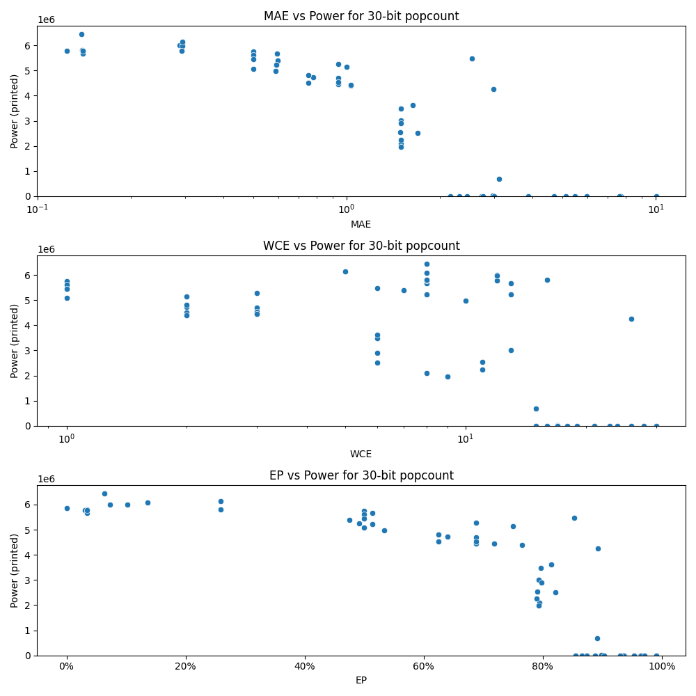

# Generated 30 bit popcount circuit
- __Circuit__: popcount (30 bit to 5.0 bit)

## Parameters of selected circuit
| Circuit         |       MAE |   WCE |        EP |             Area |           Power |            Delay | Download                                                               |
|:----------------|----------:|------:|----------:|-----------------:|----------------:|-----------------:|:-----------------------------------------------------------------------|
| popcount30_ceqt |  0.139294 |    16 | 0.0345361 |      9.93474e+07 |      5.8135e+06 |      7.27551e+07 | [v](popcount30_ceqt.v) [c](popcount30_ceqt.c) [py](popcount30_ceqt.py) |
| popcount30_uyuu |  0.124028 |    12 | 0.0308098 |      9.88682e+07 |      5.7712e+06 |      7.14613e+07 | [v](popcount30_uyuu.v) [c](popcount30_uyuu.c) [py](popcount30_uyuu.py) |
| popcount30_4nvk |  0.139771 |     8 | 0.0349274 |      9.40583e+07 |      5.6685e+06 |      7.36735e+07 | [v](popcount30_4nvk.v) [c](popcount30_4nvk.c) [py](popcount30_4nvk.py) |
| popcount30_jq3v |  0.139771 |     8 | 0.0349274 |      9.52361e+07 |      5.7734e+06 |      7.33624e+07 | [v](popcount30_jq3v.v) [c](popcount30_jq3v.c) [py](popcount30_jq3v.py) |
| popcount30_v7le |  0.138794 |     8 | 0.064209  |      9.36264e+07 |      6.4472e+06 |      7.0994e+07  | [v](popcount30_v7le.v) [c](popcount30_v7le.c) [py](popcount30_v7le.py) |
| popcount30_z9zp |  0.287782 |    12 | 0.102603  |      9.42395e+07 |      6.0077e+06 |      7.20767e+07 | [v](popcount30_z9zp.v) [c](popcount30_z9zp.c) [py](popcount30_z9zp.py) |
| popcount30_wvib |  0.2948   |     8 | 0.135696  |      9.52683e+07 |      6.0829e+06 |      7.31407e+07 | [v](popcount30_wvib.v) [c](popcount30_wvib.c) [py](popcount30_wvib.py) |
| popcount30_7cin |  0.294571 |    12 | 0.0729597 |      9.83383e+07 |      5.9863e+06 |      7.39271e+07 | [v](popcount30_7cin.v) [c](popcount30_7cin.c) [py](popcount30_7cin.py) |
| popcount30_ymph |  0.294693 |     5 | 0.258743  |      9.64203e+07 |      6.1483e+06 |      7.52083e+07 | [v](popcount30_ymph.v) [c](popcount30_ymph.c) [py](popcount30_ymph.py) |
| popcount30_ivoi |  0.292862 |     8 | 0.258755  |      9.32502e+07 |      5.7946e+06 |      7.36838e+07 | [v](popcount30_ivoi.v) [c](popcount30_ivoi.c) [py](popcount30_ivoi.py) |
| popcount30_wwcv |  0.597092 |     7 | 0.474838  |      8.78085e+07 |      5.3937e+06 |      7.55509e+07 | [v](popcount30_wwcv.v) [c](popcount30_wwcv.c) [py](popcount30_wwcv.py) |
| popcount30_5m8h |  0.589472 |    10 | 0.53394   |      8.84032e+07 |      4.9694e+06 |      6.83273e+07 | [v](popcount30_5m8h.v) [c](popcount30_5m8h.c) [py](popcount30_5m8h.py) |
| popcount30_02e8 |  0.595027 |    13 | 0.513497  |      9.41875e+07 |      5.6612e+06 |      7.49079e+07 | [v](popcount30_02e8.v) [c](popcount30_02e8.c) [py](popcount30_02e8.py) |
| popcount30_1qop |  0.59295  |    13 | 0.51352   |      9.38991e+07 |      5.2288e+06 |      7.26282e+07 | [v](popcount30_1qop.v) [c](popcount30_1qop.c) [py](popcount30_1qop.py) |
| popcount30_kqt8 |  0.591293 |     8 | 0.491306  |      8.78945e+07 |      5.2367e+06 |      7.15225e+07 | [v](popcount30_kqt8.v) [c](popcount30_kqt8.c) [py](popcount30_kqt8.py) |
| popcount30_n4lj |  1.49519  |     8 | 0.793997  |      4.72082e+07 |      2.0966e+06 |      6.13145e+07 | [v](popcount30_n4lj.v) [c](popcount30_n4lj.c) [py](popcount30_n4lj.py) |
| popcount30_lnxq |  1.48658  |    11 | 0.790412  |      4.51768e+07 |      2.5407e+06 |      6.93663e+07 | [v](popcount30_lnxq.v) [c](popcount30_lnxq.c) [py](popcount30_lnxq.py) |
| popcount30_dedb |  1.49608  |     9 | 0.792889  |      3.71741e+07 |      1.971e+06  |      6.44884e+07 | [v](popcount30_dedb.v) [c](popcount30_dedb.c) [py](popcount30_dedb.py) |
| popcount30_u8tp |  1.49501  |    11 | 0.790214  |      4.79846e+07 |      2.2494e+06 |      6.72664e+07 | [v](popcount30_u8tp.v) [c](popcount30_u8tp.c) [py](popcount30_u8tp.py) |
| popcount30_wgv4 |  1.49838  |    13 | 0.792877  |      5.5411e+07  |      3.0025e+06 |      6.84615e+07 | [v](popcount30_wgv4.v) [c](popcount30_wgv4.c) [py](popcount30_wgv4.py) |
| popcount30_lvyx |  2.98384  |    26 | 0.893235  |      8.61867e+07 |      4.259e+06  |      8.38767e+07 | [v](popcount30_lvyx.v) [c](popcount30_lvyx.c) [py](popcount30_lvyx.py) |
| popcount30_iw31 |  2.97148  |    17 | 0.898831  | 856340           |  31251          |      2.6182e+06  | [v](popcount30_iw31.v) [c](popcount30_iw31.c) [py](popcount30_iw31.py) |
| popcount30_3jmp |  2.72677  |    17 | 0.888465  |      0           |      0          |      0           | [v](popcount30_3jmp.v) [c](popcount30_3jmp.c) [py](popcount30_3jmp.py) |
| popcount30_96cy |  2.4559   |    16 | 0.873594  |      0           |      0          |      0           | [v](popcount30_96cy.v) [c](popcount30_96cy.c) [py](popcount30_96cy.py) |
| popcount30_q08w |  2.99764  |    17 | 0.903336  |      0           |      0          |      0           | [v](popcount30_q08w.v) [c](popcount30_q08w.c) [py](popcount30_q08w.py) |
| popcount30_8xzl |  5.97801  |    24 | 0.936686  |      0           |      0          |      0           | [v](popcount30_8xzl.v) [c](popcount30_8xzl.c) [py](popcount30_8xzl.py) |
| popcount30_k2px |  2.76607  |    18 | 0.887491  |      0           |      0          |      0           | [v](popcount30_k2px.v) [c](popcount30_k2px.c) [py](popcount30_k2px.py) |
| popcount30_hs5j |  5.47828  |    23 | 0.936354  |      0           |      0          |      0           | [v](popcount30_hs5j.v) [c](popcount30_hs5j.c) [py](popcount30_hs5j.py) |
| popcount30_37rn |  4.69417  |    21 | 0.953061  |      0           |      0          |      0           | [v](popcount30_37rn.v) [c](popcount30_37rn.c) [py](popcount30_37rn.py) |
| popcount30_wicn |  5.12191  |    21 | 0.963781  |      0           |      0          |      0           | [v](popcount30_wicn.v) [c](popcount30_wicn.c) [py](popcount30_wicn.py) |
| popcount30_pley |  7.71559  |    28 | 0.964959  |      0           |      0          |      0           | [v](popcount30_pley.v) [c](popcount30_pley.c) [py](popcount30_pley.py) |
| popcount30_3baw |  3.86159  |    19 | 0.93047   |      0           |      0          |      0           | [v](popcount30_3baw.v) [c](popcount30_3baw.c) [py](popcount30_3baw.py) |
| popcount30_yp3n |  7.61902  |    26 | 0.971547  |      0           |      0          |      0           | [v](popcount30_yp3n.v) [c](popcount30_yp3n.c) [py](popcount30_yp3n.py) |
| popcount30_eqge | 10.0243   |    30 | 0.99045   |      0           |      0          |      0           | [v](popcount30_eqge.v) [c](popcount30_eqge.c) [py](popcount30_eqge.py) |
| popcount30_04o5 |  0        |     0 | 0         |      9.48845e+07 |      5.8491e+06 |      6.93023e+07 | [v](popcount30_04o5.v) [c](popcount30_04o5.c) [py](popcount30_04o5.py) |
| popcount30_ksqb |  0.5      |     1 | 0.5       |      8.66258e+07 |      5.0745e+06 |      6.99749e+07 | [v](popcount30_ksqb.v) [c](popcount30_ksqb.c) [py](popcount30_ksqb.py) |
| popcount30_l9cg |  0.5      |     1 | 0.5       |      9.00414e+07 |      5.742e+06  |      6.84131e+07 | [v](popcount30_l9cg.v) [c](popcount30_l9cg.c) [py](popcount30_l9cg.py) |
| popcount30_f97w |  0.5      |     1 | 0.5       |      8.68313e+07 |      5.6219e+06 |      7.0959e+07  | [v](popcount30_f97w.v) [c](popcount30_f97w.c) [py](popcount30_f97w.py) |
| popcount30_2z0y |  0.5      |     1 | 0.5       |      9.18612e+07 |      5.4511e+06 |      6.94907e+07 | [v](popcount30_2z0y.v) [c](popcount30_2z0y.c) [py](popcount30_2z0y.py) |
| popcount30_rzf6 |  0.78125  |     2 | 0.640625  |      8.33004e+07 |      4.7209e+06 |      6.8781e+07  | [v](popcount30_rzf6.v) [c](popcount30_rzf6.c) [py](popcount30_rzf6.py) |
| popcount30_m396 |  0.75     |     2 | 0.625     |      8.32299e+07 |      4.8114e+06 |      7.1168e+07  | [v](popcount30_m396.v) [c](popcount30_m396.c) [py](popcount30_m396.py) |
| popcount30_f1bt |  0.75     |     2 | 0.625     |      8.38002e+07 |      4.5174e+06 |      6.92383e+07 | [v](popcount30_f1bt.v) [c](popcount30_f1bt.c) [py](popcount30_f1bt.py) |
| popcount30_t4fl |  1        |     2 | 0.75      |      8.32914e+07 |      5.1335e+06 |      6.23132e+07 | [v](popcount30_t4fl.v) [c](popcount30_t4fl.c) [py](popcount30_t4fl.py) |
| popcount30_z6q2 |  1.03125  |     2 | 0.765625  |      7.9251e+07  |      4.3934e+06 |      6.60544e+07 | [v](popcount30_z6q2.v) [c](popcount30_z6q2.c) [py](popcount30_z6q2.py) |
| popcount30_ousu |  0.9375   |     3 | 0.6875    |      7.98447e+07 |      4.4568e+06 |      7.12649e+07 | [v](popcount30_ousu.v) [c](popcount30_ousu.c) [py](popcount30_ousu.py) |
| popcount30_9moc |  0.9375   |     3 | 0.6875    |      8.46778e+07 |      4.6952e+06 |      7.21656e+07 | [v](popcount30_9moc.v) [c](popcount30_9moc.c) [py](popcount30_9moc.py) |
| popcount30_1m2r |  0.9375   |     3 | 0.6875    |      8.97909e+07 |      5.2698e+06 |      7.07926e+07 | [v](popcount30_1m2r.v) [c](popcount30_1m2r.c) [py](popcount30_1m2r.py) |
| popcount30_nku9 |  0.9375   |     3 | 0.6875    |      8.55581e+07 |      4.5291e+06 |      6.87132e+07 | [v](popcount30_nku9.v) [c](popcount30_nku9.c) [py](popcount30_nku9.py) |
| popcount30_guom |  1.03125  |     3 | 0.71875   |      7.76072e+07 |      4.4394e+06 |      7.11339e+07 | [v](popcount30_guom.v) [c](popcount30_guom.c) [py](popcount30_guom.py) |
| popcount30_ci90 |  1.49506  |     6 | 0.797089  |      5.88379e+07 |      3.4842e+06 |      6.35645e+07 | [v](popcount30_ci90.v) [c](popcount30_ci90.c) [py](popcount30_ci90.py) |
| popcount30_ergs |  1.63365  |     6 | 0.814159  |      7.30806e+07 |      3.6134e+06 |      6.81136e+07 | [v](popcount30_ergs.v) [c](popcount30_ergs.c) [py](popcount30_ergs.py) |
| popcount30_rlhk |  1.6963   |     6 | 0.821376  |      5.85188e+07 |      2.516e+06  |      5.55988e+07 | [v](popcount30_rlhk.v) [c](popcount30_rlhk.c) [py](popcount30_rlhk.py) |
| popcount30_ivb4 |  2.53614  |     6 | 0.853206  |      8.1875e+07  |      5.4767e+06 |      6.26613e+07 | [v](popcount30_ivb4.v) [c](popcount30_ivb4.c) [py](popcount30_ivb4.py) |
| popcount30_o64m |  1.49649  |     6 | 0.797714  |      6.35073e+07 |      2.9051e+06 |      6.81715e+07 | [v](popcount30_o64m.v) [c](popcount30_o64m.c) [py](popcount30_o64m.py) |
| popcount30_ihkh |  2.16697  |    15 | 0.855536  |      0           |      0          |      0           | [v](popcount30_ihkh.v) [c](popcount30_ihkh.c) [py](popcount30_ihkh.py) |
| popcount30_qxin |  3.11924  |    15 | 0.891101  |      1.40341e+07 | 679850          |      2.95403e+07 | [v](popcount30_qxin.v) [c](popcount30_qxin.c) [py](popcount30_qxin.py) |
| popcount30_uea4 |  2.31641  |    15 | 0.865499  | 476280           |   3460.8        |      2.5511e+06  | [v](popcount30_uea4.v) [c](popcount30_uea4.c) [py](popcount30_uea4.py) |
| popcount30_rptt |  2.16697  |    15 | 0.855536  | 228420           |    878.448      | 565707           | [v](popcount30_rptt.v) [c](popcount30_rptt.c) [py](popcount30_rptt.py) |

## Parameters 
