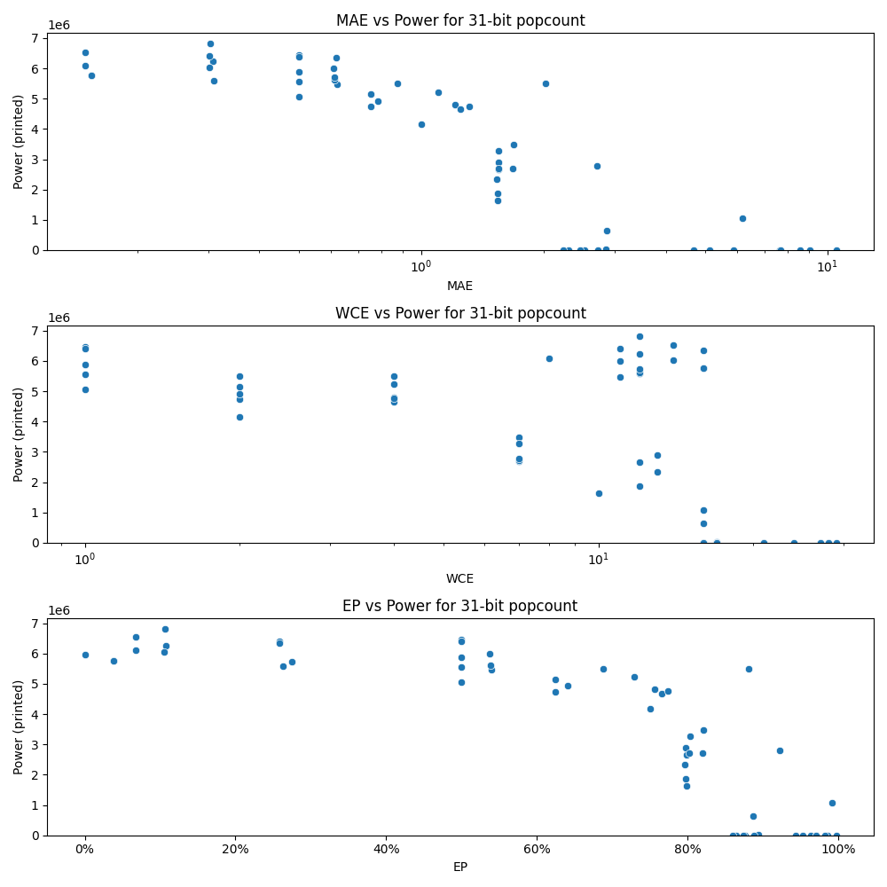

# Generated 31 bit popcount circuit
- __Circuit__: popcount (31 bit to 5.0 bit)

## Parameters of selected circuit
| Circuit         |       MAE |   WCE |        EP |             Area |           Power |            Delay | Download                                                               |
|:----------------|----------:|------:|----------:|-----------------:|----------------:|-----------------:|:-----------------------------------------------------------------------|
| popcount31_iv0n |  0.154315 |    16 | 0.038262  |      1.02897e+08 |      5.757e+06  |      7.19017e+07 | [v](popcount31_iv0n.v) [c](popcount31_iv0n.c) [py](popcount31_iv0n.py) |
| popcount31_r659 |  0.154315 |    16 | 0.038262  |      1.02897e+08 |      5.7575e+06 |      7.19017e+07 | [v](popcount31_r659.v) [c](popcount31_r659.c) [py](popcount31_r659.py) |
| popcount31_8nd8 |  0.148832 |     8 | 0.0671805 |      9.57395e+07 |      6.099e+06  |      7.1266e+07  | [v](popcount31_8nd8.v) [c](popcount31_8nd8.c) [py](popcount31_8nd8.py) |
| popcount31_o90f |  0.148638 |    14 | 0.0671311 |      9.61651e+07 |      6.5378e+06 |      7.3043e+07  | [v](popcount31_o90f.v) [c](popcount31_o90f.c) [py](popcount31_o90f.py) |
| popcount31_79lt |  0.307299 |    12 | 0.10723   |      9.92661e+07 |      6.2446e+06 |      7.31253e+07 | [v](popcount31_79lt.v) [c](popcount31_79lt.c) [py](popcount31_79lt.py) |
| popcount31_osm2 |  0.302438 |    12 | 0.106107  |      1.00766e+08 |      6.8234e+06 |      7.41972e+07 | [v](popcount31_osm2.v) [c](popcount31_osm2.c) [py](popcount31_osm2.py) |
| popcount31_v1lp |  0.301646 |    14 | 0.105691  |      9.79303e+07 |      6.0413e+06 |      7.22057e+07 | [v](popcount31_v1lp.v) [c](popcount31_v1lp.c) [py](popcount31_v1lp.py) |
| popcount31_7z46 |  0.300644 |    11 | 0.258755  |      9.70665e+07 |      6.4012e+06 |      7.29039e+07 | [v](popcount31_7z46.v) [c](popcount31_7z46.c) [py](popcount31_7z46.py) |
| popcount31_zueb |  0.308365 |    12 | 0.2626    |      9.72345e+07 |      5.5971e+06 |      7.15042e+07 | [v](popcount31_zueb.v) [c](popcount31_zueb.c) [py](popcount31_zueb.py) |
| popcount31_hl49 |  0.619744 |    11 | 0.539469  |      8.81354e+07 |      5.4629e+06 |      7.09309e+07 | [v](popcount31_hl49.v) [c](popcount31_hl49.c) [py](popcount31_hl49.py) |
| popcount31_m4mm |  0.612866 |    12 | 0.538401  |      9.21219e+07 |      5.6276e+06 |      7.2875e+07  | [v](popcount31_m4mm.v) [c](popcount31_m4mm.c) [py](popcount31_m4mm.py) |
| popcount31_zqhc |  0.609745 |    11 | 0.536842  |      9.15203e+07 |      5.9966e+06 |      7.41532e+07 | [v](popcount31_zqhc.v) [c](popcount31_zqhc.c) [py](popcount31_zqhc.py) |
| popcount31_xx8c |  0.619087 |    16 | 0.258235  |      9.94227e+07 |      6.3531e+06 |      7.27017e+07 | [v](popcount31_xx8c.v) [c](popcount31_xx8c.c) [py](popcount31_xx8c.py) |
| popcount31_748o |  0.612669 |    12 | 0.274732  |      9.98883e+07 |      5.7247e+06 |      7.09179e+07 | [v](popcount31_748o.v) [c](popcount31_748o.c) [py](popcount31_748o.py) |
| popcount31_xkds |  1.54882  |    12 | 0.798545  |      4.43375e+07 |      2.6649e+06 |      6.20831e+07 | [v](popcount31_xkds.v) [c](popcount31_xkds.c) [py](popcount31_xkds.py) |
| popcount31_193u |  1.54028  |    10 | 0.798672  |      3.77709e+07 |      1.6361e+06 |      6.19587e+07 | [v](popcount31_193u.v) [c](popcount31_193u.c) [py](popcount31_193u.py) |
| popcount31_x8ez |  1.5385   |    13 | 0.796093  |      4.40238e+07 |      2.346e+06  |      6.61986e+07 | [v](popcount31_x8ez.v) [c](popcount31_x8ez.c) [py](popcount31_x8ez.py) |
| popcount31_efxp |  1.54316  |    12 | 0.797723  |      4.22635e+07 |      1.8634e+06 |      5.39749e+07 | [v](popcount31_efxp.v) [c](popcount31_efxp.c) [py](popcount31_efxp.py) |
| popcount31_i1hn |  1.5479   |    13 | 0.797436  |      5.65087e+07 |      2.8873e+06 |      7.10791e+07 | [v](popcount31_i1hn.v) [c](popcount31_i1hn.c) [py](popcount31_i1hn.py) |
| popcount31_qr3w |  2.85317  |    17 | 0.894307  | 627920           |  30372          |      2.6182e+06  | [v](popcount31_qr3w.v) [c](popcount31_qr3w.c) [py](popcount31_qr3w.py) |
| popcount31_6lx6 |  2.72677  |    17 | 0.888465  |      0           |      0          |      0           | [v](popcount31_6lx6.v) [c](popcount31_6lx6.c) [py](popcount31_6lx6.py) |
| popcount31_xsys |  2.31143  |    16 | 0.864565  |      0           |      0          |      0           | [v](popcount31_xsys.v) [c](popcount31_xsys.c) [py](popcount31_xsys.py) |
| popcount31_2jmp |  2.5191   |    17 | 0.876515  |      0           |      0          |      0           | [v](popcount31_2jmp.v) [c](popcount31_2jmp.c) [py](popcount31_2jmp.py) |
| popcount31_4tbf |  5.86358  |    24 | 0.943956  |      0           |      0          |      0           | [v](popcount31_4tbf.v) [c](popcount31_4tbf.c) [py](popcount31_4tbf.py) |
| popcount31_to1t |  4.69417  |    21 | 0.953061  |      0           |      0          |      0           | [v](popcount31_to1t.v) [c](popcount31_to1t.c) [py](popcount31_to1t.py) |
| popcount31_cxtw |  5.12191  |    21 | 0.963781  |      0           |      0          |      0           | [v](popcount31_cxtw.v) [c](popcount31_cxtw.c) [py](popcount31_cxtw.py) |
| popcount31_1j0h |  7.63325  |    27 | 0.971115  |      0           |      0          |      0           | [v](popcount31_1j0h.v) [c](popcount31_1j0h.c) [py](popcount31_1j0h.py) |
| popcount31_1hjn |  7.64747  |    27 | 0.970683  |      0           |      0          |      0           | [v](popcount31_1hjn.v) [c](popcount31_1hjn.c) [py](popcount31_1hjn.py) |
| popcount31_9qm7 | 10.5035   |    29 | 0.997275  |      0           |      0          |      0           | [v](popcount31_9qm7.v) [c](popcount31_9qm7.c) [py](popcount31_9qm7.py) |
| popcount31_a7wc |  9.03297  |    28 | 0.986009  |      0           |      0          |      0           | [v](popcount31_a7wc.v) [c](popcount31_a7wc.c) [py](popcount31_a7wc.py) |
| popcount31_8ly7 |  8.56096  |    28 | 0.98188   |      0           |      0          |      0           | [v](popcount31_8ly7.v) [c](popcount31_8ly7.c) [py](popcount31_8ly7.py) |
| popcount31_so31 |  0        |     0 | 0         |      1.00166e+08 |      5.9765e+06 |      6.94865e+07 | [v](popcount31_so31.v) [c](popcount31_so31.c) [py](popcount31_so31.py) |
| popcount31_d0nk |  0.75     |     2 | 0.625     |      8.40063e+07 |      4.742e+06  |      6.92582e+07 | [v](popcount31_d0nk.v) [c](popcount31_d0nk.c) [py](popcount31_d0nk.py) |
| popcount31_bnzh |  0.78125  |     2 | 0.640625  |      8.76279e+07 |      4.9296e+06 |      7.38574e+07 | [v](popcount31_bnzh.v) [c](popcount31_bnzh.c) [py](popcount31_bnzh.py) |
| popcount31_fkgi |  0.75     |     2 | 0.625     |      8.28822e+07 |      5.1488e+06 |      7.00379e+07 | [v](popcount31_fkgi.v) [c](popcount31_fkgi.c) [py](popcount31_fkgi.py) |
| popcount31_bfiw |  0.875    |     2 | 0.6875    |      8.95445e+07 |      5.5069e+06 |      7.34256e+07 | [v](popcount31_bfiw.v) [c](popcount31_bfiw.c) [py](popcount31_bfiw.py) |
| popcount31_yzvy |  1.00002  |     2 | 0.750008  |      8.56384e+07 |      4.1651e+06 |      6.93232e+07 | [v](popcount31_yzvy.v) [c](popcount31_yzvy.c) [py](popcount31_yzvy.py) |
| popcount31_ics0 |  0.5      |     1 | 0.5       |      1.02351e+08 |      6.4538e+06 |      7.20578e+07 | [v](popcount31_ics0.v) [c](popcount31_ics0.c) [py](popcount31_ics0.py) |
| popcount31_ez17 |  0.5      |     1 | 0.5       |      9.38959e+07 |      5.5642e+06 |      7.45499e+07 | [v](popcount31_ez17.v) [c](popcount31_ez17.c) [py](popcount31_ez17.py) |
| popcount31_sjo8 |  0.5      |     1 | 0.5       |      9.64615e+07 |      5.8812e+06 |      7.11615e+07 | [v](popcount31_sjo8.v) [c](popcount31_sjo8.c) [py](popcount31_sjo8.py) |
| popcount31_8xby |  0.5      |     1 | 0.5       |      9.04931e+07 |      5.0545e+06 |      6.67338e+07 | [v](popcount31_8xby.v) [c](popcount31_8xby.c) [py](popcount31_8xby.py) |
| popcount31_luxd |  0.5      |     1 | 0.5       |      9.68755e+07 |      6.3959e+06 |      6.9666e+07  | [v](popcount31_luxd.v) [c](popcount31_luxd.c) [py](popcount31_luxd.py) |
| popcount31_bis8 |  1.10352  |     4 | 0.729004  |      8.49915e+07 |      5.2262e+06 |      7.08988e+07 | [v](popcount31_bis8.v) [c](popcount31_bis8.c) [py](popcount31_bis8.py) |
| popcount31_mkg7 |  1.21094  |     4 | 0.755859  |      8.71068e+07 |      4.8117e+06 |      6.64946e+07 | [v](popcount31_mkg7.v) [c](popcount31_mkg7.c) [py](popcount31_mkg7.py) |
| popcount31_6qe9 |  1.25     |     4 | 0.765625  |      7.91968e+07 |      4.6633e+06 |      6.92238e+07 | [v](popcount31_6qe9.v) [c](popcount31_6qe9.c) [py](popcount31_6qe9.py) |
| popcount31_e1p5 |  1.3125   |     4 | 0.773438  |      8.20754e+07 |      4.7555e+06 |      6.67482e+07 | [v](popcount31_e1p5.v) [c](popcount31_e1p5.c) [py](popcount31_e1p5.py) |
| popcount31_3g2z |  2.01986  |     4 | 0.880824  |      8.79967e+07 |      5.4919e+06 |      6.15102e+07 | [v](popcount31_3g2z.v) [c](popcount31_3g2z.c) [py](popcount31_3g2z.py) |
| popcount31_ir5s |  1.5509   |     7 | 0.802612  |      6.1002e+07  |      2.7008e+06 |      7.01201e+07 | [v](popcount31_ir5s.v) [c](popcount31_ir5s.c) [py](popcount31_ir5s.py) |
| popcount31_jckm |  1.69216  |     7 | 0.820885  |      7.75271e+07 |      3.4841e+06 |      6.88676e+07 | [v](popcount31_jckm.v) [c](popcount31_jckm.c) [py](popcount31_jckm.py) |
| popcount31_h38t |  1.55405  |     7 | 0.802963  |      6.07167e+07 |      3.2854e+06 |      6.89644e+07 | [v](popcount31_h38t.v) [c](popcount31_h38t.c) [py](popcount31_h38t.py) |
| popcount31_9osp |  1.67844  |     7 | 0.820007  |      5.36233e+07 |      2.7067e+06 |      6.1675e+07  | [v](popcount31_9osp.v) [c](popcount31_9osp.c) [py](popcount31_9osp.py) |
| popcount31_fw0j |  2.71331  |     7 | 0.922228  |      6.6127e+07  |      2.7919e+06 |      5.95198e+07 | [v](popcount31_fw0j.v) [c](popcount31_fw0j.c) [py](popcount31_fw0j.py) |
| popcount31_chaa |  2.4559   |    16 | 0.873594  | 228420           |    878.448      | 565707           | [v](popcount31_chaa.v) [c](popcount31_chaa.c) [py](popcount31_chaa.py) |
| popcount31_j5tm |  2.2392   |    16 | 0.86005   |      0           |      0          |      0           | [v](popcount31_j5tm.v) [c](popcount31_j5tm.c) [py](popcount31_j5tm.py) |
| popcount31_asyy |  2.86888  |    16 | 0.88674   |      1.72224e+07 | 644080          |      4.93767e+07 | [v](popcount31_asyy.v) [c](popcount31_asyy.c) [py](popcount31_asyy.py) |
| popcount31_4js4 |  6.17559  |    16 | 0.991379  |      2.5471e+07  |      1.068e+06  |      3.22817e+07 | [v](popcount31_4js4.v) [c](popcount31_4js4.c) [py](popcount31_4js4.py) |

## Parameters 
