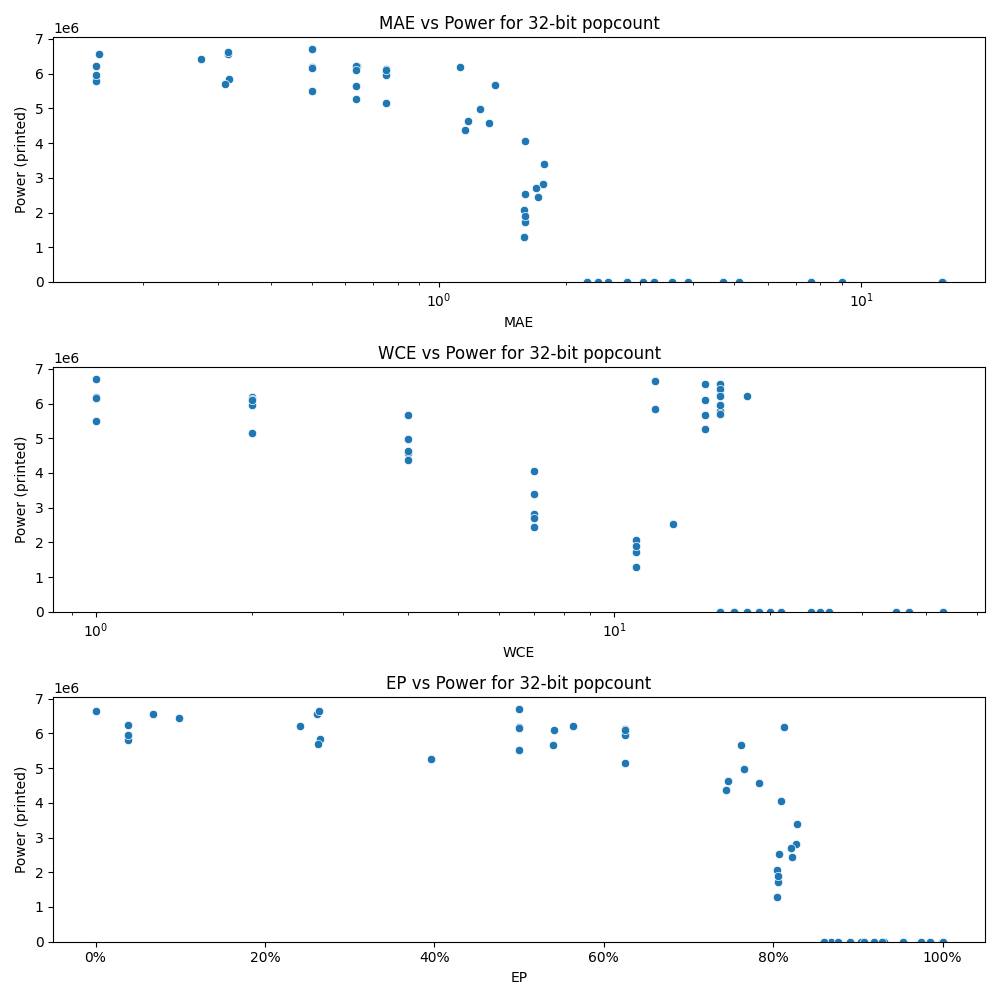

# Generated 32 bit popcount circuit
- __Circuit__: popcount (32 bit to 6.0 bit)

## Parameters of selected circuit
| Circuit         |       MAE |   WCE |        EP |             Area |        Power |            Delay | Download                                                               |
|:----------------|----------:|------:|----------:|-----------------:|-------------:|-----------------:|:-----------------------------------------------------------------------|
| popcount32_2i0q |  0.154074 |    16 | 0.0382321 |      1.04846e+08 |   5.7966e+06 |      7.17024e+07 | [v](popcount32_2i0q.v) [c](popcount32_2i0q.c) [py](popcount32_2i0q.py) |
| popcount32_dk15 |  0.154073 |    16 | 0.0382467 |      1.0696e+08  |   5.961e+06  |      7.20647e+07 | [v](popcount32_dk15.v) [c](popcount32_dk15.c) [py](popcount32_dk15.py) |
| popcount32_t1ft |  0.156756 |    16 | 0.0681379 |      1.00325e+08 |   6.5701e+06 |      7.05444e+07 | [v](popcount32_t1ft.v) [c](popcount32_t1ft.c) [py](popcount32_t1ft.py) |
| popcount32_t20b |  0.154074 |    16 | 0.0382321 |      1.04846e+08 |   6.2315e+06 |      7.12282e+07 | [v](popcount32_t20b.v) [c](popcount32_t20b.c) [py](popcount32_t20b.py) |
| popcount32_furp |  0.316427 |    15 | 0.26165   |      1.01209e+08 |   6.5705e+06 |      7.28762e+07 | [v](popcount32_furp.v) [c](popcount32_furp.c) [py](popcount32_furp.py) |
| popcount32_bnjj |  0.319387 |    12 | 0.264523  |      1.00056e+08 |   5.85e+06   |      6.92009e+07 | [v](popcount32_bnjj.v) [c](popcount32_bnjj.c) [py](popcount32_bnjj.py) |
| popcount32_vuu4 |  0.317914 |    12 | 0.26336   |      9.98419e+07 |   6.6343e+06 |      7.29471e+07 | [v](popcount32_vuu4.v) [c](popcount32_vuu4.c) [py](popcount32_vuu4.py) |
| popcount32_9krs |  0.273666 |    16 | 0.0986311 |      1.08204e+08 |   6.4321e+06 |      7.44611e+07 | [v](popcount32_9krs.v) [c](popcount32_9krs.c) [py](popcount32_9krs.py) |
| popcount32_c7zc |  0.3125   |    16 | 0.262615  |      9.27764e+07 |   5.6884e+06 |      6.96739e+07 | [v](popcount32_c7zc.v) [c](popcount32_c7zc.c) [py](popcount32_c7zc.py) |
| popcount32_z0hx |  0.639118 |    18 | 0.563278  |      9.68527e+07 |   6.211e+06  |      7.06981e+07 | [v](popcount32_z0hx.v) [c](popcount32_z0hx.c) [py](popcount32_z0hx.py) |
| popcount32_7kgn |  0.638275 |    16 | 0.241027  |      1.00152e+08 |   6.2226e+06 |      7.29177e+07 | [v](popcount32_7kgn.v) [c](popcount32_7kgn.c) [py](popcount32_7kgn.py) |
| popcount32_9jxh |  0.637355 |    15 | 0.396253  |      9.85208e+07 |   5.2657e+06 |      7.0691e+07  | [v](popcount32_9jxh.v) [c](popcount32_9jxh.c) [py](popcount32_9jxh.py) |
| popcount32_aycx |  0.637109 |    15 | 0.54162   |      9.63382e+07 |   6.0939e+06 |      7.29002e+07 | [v](popcount32_aycx.v) [c](popcount32_aycx.c) [py](popcount32_aycx.py) |
| popcount32_ku6y |  0.635307 |    15 | 0.54032   |      9.41103e+07 |   5.6582e+06 |      7.02725e+07 | [v](popcount32_ku6y.v) [c](popcount32_ku6y.c) [py](popcount32_ku6y.py) |
| popcount32_s4xg |  1.5879   |    11 | 0.803928  |      4.23798e+07 |   2.0664e+06 |      6.25135e+07 | [v](popcount32_s4xg.v) [c](popcount32_s4xg.c) [py](popcount32_s4xg.py) |
| popcount32_iick |  1.59907  |    13 | 0.806548  |      5.34267e+07 |   2.5346e+06 |      7.21477e+07 | [v](popcount32_iick.v) [c](popcount32_iick.c) [py](popcount32_iick.py) |
| popcount32_0itb |  1.58726  |    11 | 0.80441   |      3.13675e+07 |   1.2992e+06 |      6.44105e+07 | [v](popcount32_0itb.v) [c](popcount32_0itb.c) [py](popcount32_0itb.py) |
| popcount32_cdyi |  1.59882  |    11 | 0.805995  |      3.8356e+07  |   1.7271e+06 |      6.02549e+07 | [v](popcount32_cdyi.v) [c](popcount32_cdyi.c) [py](popcount32_cdyi.py) |
| popcount32_lqzk |  1.59654  |    11 | 0.805715  |      3.27142e+07 |   1.9068e+06 |      6.11727e+07 | [v](popcount32_lqzk.v) [c](popcount32_lqzk.c) [py](popcount32_lqzk.py) |
| popcount32_mod1 |  2.78253  |    18 | 0.890235  |      0           |   0          |      0           | [v](popcount32_mod1.v) [c](popcount32_mod1.c) [py](popcount32_mod1.py) |
| popcount32_ultj |  2.37915  |    17 | 0.868282  |      0           |   0          |      0           | [v](popcount32_ultj.v) [c](popcount32_ultj.c) [py](popcount32_ultj.py) |
| popcount32_b7wf |  2.5191   |    17 | 0.876515  |      0           |   0          |      0           | [v](popcount32_b7wf.v) [c](popcount32_b7wf.c) [py](popcount32_b7wf.py) |
| popcount32_0bg6 |  2.2392   |    16 | 0.86005   |      0           |   0          |      0           | [v](popcount32_0bg6.v) [c](popcount32_0bg6.c) [py](popcount32_0bg6.py) |
| popcount32_j87r |  3.04597  |    18 | 0.903956  |      0           |   0          |      0           | [v](popcount32_j87r.v) [c](popcount32_j87r.c) [py](popcount32_j87r.py) |
| popcount32_b0rq |  3.89636  |    20 | 0.930242  |      0           |   0          |      0           | [v](popcount32_b0rq.v) [c](popcount32_b0rq.c) [py](popcount32_b0rq.py) |
| popcount32_k4qz |  5.12099  |    24 | 0.928801  |      0           |   0          |      0           | [v](popcount32_k4qz.v) [c](popcount32_k4qz.c) [py](popcount32_k4qz.py) |
| popcount32_sgw3 |  3.56721  |    20 | 0.918543  |      0           |   0          |      0           | [v](popcount32_sgw3.v) [c](popcount32_sgw3.c) [py](popcount32_sgw3.py) |
| popcount32_lji0 |  3.23806  |    19 | 0.906844  |      0           |   0          |      0           | [v](popcount32_lji0.v) [c](popcount32_lji0.c) [py](popcount32_lji0.py) |
| popcount32_35id |  4.69417  |    21 | 0.953061  |      0           |   0          |      0           | [v](popcount32_35id.v) [c](popcount32_35id.c) [py](popcount32_35id.py) |
| popcount32_d3ei |  9.00067  |    25 | 0.999216  |      0           |   0          |      0           | [v](popcount32_d3ei.v) [c](popcount32_d3ei.c) [py](popcount32_d3ei.py) |
| popcount32_gyrw |  7.58235  |    26 | 0.974549  |      0           |   0          |      0           | [v](popcount32_gyrw.v) [c](popcount32_gyrw.c) [py](popcount32_gyrw.py) |
| popcount32_k31q | 15.5666   |    43 | 0.985557  |      0           |   0          |      0           | [v](popcount32_k31q.v) [c](popcount32_k31q.c) [py](popcount32_k31q.py) |
| popcount32_y9gs | 15.5001   |    37 | 0.999861  |      0           |   0          |      0           | [v](popcount32_y9gs.v) [c](popcount32_y9gs.c) [py](popcount32_y9gs.py) |
| popcount32_cvsc | 15.5      |    35 | 0.999994  |      0           |   0          |      0           | [v](popcount32_cvsc.v) [c](popcount32_cvsc.c) [py](popcount32_cvsc.py) |
| popcount32_r8pv |  0        |     0 | 0         |      1.06899e+08 |   6.658e+06  |      6.6826e+07  | [v](popcount32_r8pv.v) [c](popcount32_r8pv.c) [py](popcount32_r8pv.py) |
| popcount32_53pu |  0.5      |     1 | 0.5       |      1.07858e+08 |   6.7101e+06 |      7.48304e+07 | [v](popcount32_53pu.v) [c](popcount32_53pu.c) [py](popcount32_53pu.py) |
| popcount32_05zt |  0.5      |     1 | 0.5       |      1.01146e+08 |   6.1906e+06 |      6.92269e+07 | [v](popcount32_05zt.v) [c](popcount32_05zt.c) [py](popcount32_05zt.py) |
| popcount32_eq50 |  0.5      |     1 | 0.5       |      1.04012e+08 |   6.1496e+06 |      7.02538e+07 | [v](popcount32_eq50.v) [c](popcount32_eq50.c) [py](popcount32_eq50.py) |
| popcount32_ifxl |  0.5      |     1 | 0.5       |      1.01834e+08 |   5.5073e+06 |      7.36338e+07 | [v](popcount32_ifxl.v) [c](popcount32_ifxl.c) [py](popcount32_ifxl.py) |
| popcount32_gco7 |  0.75     |     2 | 0.625     |      8.4275e+07  |   5.1483e+06 |      6.9743e+07  | [v](popcount32_gco7.v) [c](popcount32_gco7.c) [py](popcount32_gco7.py) |
| popcount32_ffh8 |  0.75     |     2 | 0.625     |      9.83904e+07 |   5.9603e+06 |      7.65232e+07 | [v](popcount32_ffh8.v) [c](popcount32_ffh8.c) [py](popcount32_ffh8.py) |
| popcount32_lb70 |  1.125    |     2 | 0.8125    |      1.05302e+08 |   6.1969e+06 |      7.24493e+07 | [v](popcount32_lb70.v) [c](popcount32_lb70.c) [py](popcount32_lb70.py) |
| popcount32_xkvt |  0.75     |     2 | 0.625     |      1.00009e+08 |   6.1232e+06 |      7.79509e+07 | [v](popcount32_xkvt.v) [c](popcount32_xkvt.c) [py](popcount32_xkvt.py) |
| popcount32_frh6 |  0.75     |     2 | 0.625     |      1.08573e+08 |   6.1052e+06 |      7.3875e+07  | [v](popcount32_frh6.v) [c](popcount32_frh6.c) [py](popcount32_frh6.py) |
| popcount32_fylz |  1.25171  |     4 | 0.765991  |      8.65567e+07 |   4.9735e+06 |      7.27947e+07 | [v](popcount32_fylz.v) [c](popcount32_fylz.c) [py](popcount32_fylz.py) |
| popcount32_avq4 |  1.3125   |     4 | 0.783203  |      8.17269e+07 |   4.5711e+06 |      7.15539e+07 | [v](popcount32_avq4.v) [c](popcount32_avq4.c) [py](popcount32_avq4.py) |
| popcount32_4tz7 |  1.15625  |     4 | 0.744141  |      8.78305e+07 |   4.3834e+06 |      6.69899e+07 | [v](popcount32_4tz7.v) [c](popcount32_4tz7.c) [py](popcount32_4tz7.py) |
| popcount32_81gj |  1.17188  |     4 | 0.746094  |      8.48999e+07 |   4.6265e+06 |      7.39659e+07 | [v](popcount32_81gj.v) [c](popcount32_81gj.c) [py](popcount32_81gj.py) |
| popcount32_pm40 |  1.3584   |     4 | 0.761475  |      9.04233e+07 |   5.6666e+06 |      6.41347e+07 | [v](popcount32_pm40.v) [c](popcount32_pm40.c) [py](popcount32_pm40.py) |
| popcount32_hrxy |  1.77061  |     7 | 0.827591  |      7.02178e+07 |   3.4007e+06 |      6.80633e+07 | [v](popcount32_hrxy.v) [c](popcount32_hrxy.c) [py](popcount32_hrxy.py) |
| popcount32_bcpf |  1.76064  |     7 | 0.826714  |      6.76224e+07 |   2.8096e+06 |      7.27283e+07 | [v](popcount32_bcpf.v) [c](popcount32_bcpf.c) [py](popcount32_bcpf.py) |
| popcount32_hqnk |  1.70258  |     7 | 0.821411  |      6.98191e+07 |   2.6955e+06 |      6.20734e+07 | [v](popcount32_hqnk.v) [c](popcount32_hqnk.c) [py](popcount32_hqnk.py) |
| popcount32_9uz6 |  1.72059  |     7 | 0.822737  |      5.5513e+07  |   2.4367e+06 |      5.03414e+07 | [v](popcount32_9uz6.v) [c](popcount32_9uz6.c) [py](popcount32_9uz6.py) |
| popcount32_i2cs |  1.59833  |     7 | 0.808841  |      8.09611e+07 |   4.049e+06  |      7.38302e+07 | [v](popcount32_i2cs.v) [c](popcount32_i2cs.c) [py](popcount32_i2cs.py) |
| popcount32_ckmq |  2.2392   |    16 | 0.86005   | 228420           | 878.448      | 565707           | [v](popcount32_ckmq.v) [c](popcount32_ckmq.c) [py](popcount32_ckmq.py) |

## Parameters 
