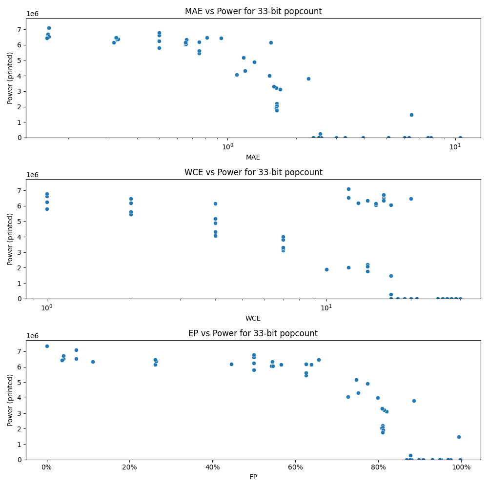

# Generated 33 bit popcount circuit
- __Circuit__: popcount (33 bit to 6.0 bit)

## Parameters of selected circuit
| Circuit         |       MAE |   WCE |        EP |             Area |           Power |            Delay | Download                                                               |
|:----------------|----------:|------:|----------:|-----------------:|----------------:|-----------------:|:-----------------------------------------------------------------------|
| popcount33_19nw |  0.316515 |    15 | 0.261707  |      1.05825e+08 |      6.1443e+06 |      8.37961e+07 | [v](popcount33_19nw.v) [c](popcount33_19nw.c) [py](popcount33_19nw.py) |
| popcount33_ju2i |  0.321873 |    20 | 0.262192  |      1.01618e+08 |      6.4704e+06 |      8.20233e+07 | [v](popcount33_ju2i.v) [c](popcount33_ju2i.c) [py](popcount33_ju2i.py) |
| popcount33_qeb0 |  0.327152 |    14 | 0.111056  |      1.04694e+08 |      6.3462e+06 |      8.23762e+07 | [v](popcount33_qeb0.v) [c](popcount33_qeb0.c) [py](popcount33_qeb0.py) |
| popcount33_2h3s |  0.329754 |    16 | 0.264553  |      1.05268e+08 |      6.3742e+06 |      8.31601e+07 | [v](popcount33_2h3s.v) [c](popcount33_2h3s.c) [py](popcount33_2h3s.py) |
| popcount33_s6it |  0.323996 |    16 | 0.26151   |      1.03561e+08 |      6.4717e+06 |      7.88743e+07 | [v](popcount33_s6it.v) [c](popcount33_s6it.c) [py](popcount33_s6it.py) |
| popcount33_dxb1 |  0.162185 |    16 | 0.040244  |      1.05801e+08 |      6.539e+06  |      8.5453e+07  | [v](popcount33_dxb1.v) [c](popcount33_dxb1.c) [py](popcount33_dxb1.py) |
| popcount33_5xmn |  0.162185 |    16 | 0.040244  |      1.05801e+08 |      6.7038e+06 |      8.3769e+07  | [v](popcount33_5xmn.v) [c](popcount33_5xmn.c) [py](popcount33_5xmn.py) |
| popcount33_hi2p |  0.16397  |    12 | 0.0708957 |      1.06689e+08 |      6.5216e+06 |      8.48224e+07 | [v](popcount33_hi2p.v) [c](popcount33_hi2p.c) [py](popcount33_hi2p.py) |
| popcount33_2l24 |  0.164167 |    12 | 0.0709035 |      1.06755e+08 |      7.0857e+06 |      7.86585e+07 | [v](popcount33_2l24.v) [c](popcount33_2l24.c) [py](popcount33_2l24.py) |
| popcount33_2c2h |  0.160186 |    16 | 0.0371421 |      1.07637e+08 |      6.4282e+06 |      7.88958e+07 | [v](popcount33_2c2h.v) [c](popcount33_2c2h.c) [py](popcount33_2c2h.py) |
| popcount33_qm8x |  0.657059 |    13 | 0.445385  |      1.04179e+08 |      6.1843e+06 |      8.12626e+07 | [v](popcount33_qm8x.v) [c](popcount33_qm8x.c) [py](popcount33_qm8x.py) |
| popcount33_h2ag |  0.651896 |    17 | 0.541544  |      1.06622e+08 |      6.0417e+06 |      8.18185e+07 | [v](popcount33_h2ag.v) [c](popcount33_h2ag.c) [py](popcount33_h2ag.py) |
| popcount33_djju |  0.655145 |    15 | 0.545215  |      1.01859e+08 |      6.0621e+06 |      8.17165e+07 | [v](popcount33_djju.v) [c](popcount33_djju.c) [py](popcount33_djju.py) |
| popcount33_klur |  0.658749 |    16 | 0.544015  |      1.00451e+08 |      6.3286e+06 |      8.49227e+07 | [v](popcount33_klur.v) [c](popcount33_klur.c) [py](popcount33_klur.py) |
| popcount33_ec12 |  0.652632 |    15 | 0.565547  |      9.82755e+07 |      6.1559e+06 |      6.94158e+07 | [v](popcount33_ec12.v) [c](popcount33_ec12.c) [py](popcount33_ec12.py) |
| popcount33_550p |  1.64727  |    14 | 0.810222  |      4.49749e+07 |      2.2014e+06 |      5.78222e+07 | [v](popcount33_550p.v) [c](popcount33_550p.c) [py](popcount33_550p.py) |
| popcount33_5ac0 |  1.63899  |    12 | 0.808142  |      4.4776e+07  |      2.0301e+06 |      6.78574e+07 | [v](popcount33_5ac0.v) [c](popcount33_5ac0.c) [py](popcount33_5ac0.py) |
| popcount33_w90i |  1.6455   |    14 | 0.810121  |      4.09079e+07 |      2.0663e+06 |      5.99131e+07 | [v](popcount33_w90i.v) [c](popcount33_w90i.c) [py](popcount33_w90i.py) |
| popcount33_iyj4 |  1.63766  |    10 | 0.810825  |      4.17972e+07 |      1.901e+06  |      6.71516e+07 | [v](popcount33_iyj4.v) [c](popcount33_iyj4.c) [py](popcount33_iyj4.py) |
| popcount33_t3tt |  1.6455   |    14 | 0.810564  |      3.86928e+07 |      1.7623e+06 |      6.33791e+07 | [v](popcount33_t3tt.v) [c](popcount33_t3tt.c) [py](popcount33_t3tt.py) |
| popcount33_ysq8 |  2.58084  |    18 | 0.879259  |      0           |      0          |      0           | [v](popcount33_ysq8.v) [c](popcount33_ysq8.c) [py](popcount33_ysq8.py) |
| popcount33_5zjr |  2.37915  |    17 | 0.868282  |      0           |      0          |      0           | [v](popcount33_5zjr.v) [c](popcount33_5zjr.c) [py](popcount33_5zjr.py) |
| popcount33_mpnk |  3.00206  |    19 | 0.897168  |      0           |      0          |      0           | [v](popcount33_mpnk.v) [c](popcount33_mpnk.c) [py](popcount33_mpnk.py) |
| popcount33_fozj |  3.28464  |    20 | 0.907855  |      0           |      0          |      0           | [v](popcount33_fozj.v) [c](popcount33_fozj.c) [py](popcount33_fozj.py) |
| popcount33_en6z |  3.93124  |    21 | 0.930097  |      0           |      0          |      0           | [v](popcount33_en6z.v) [c](popcount33_en6z.c) [py](popcount33_en6z.py) |
| popcount33_0w6b |  6.2731   |    25 | 0.951807  |      0           |      0          |      0           | [v](popcount33_0w6b.v) [c](popcount33_0w6b.c) [py](popcount33_0w6b.py) |
| popcount33_o1nm |  6.00215  |    26 | 0.947646  |      0           |      0          |      0           | [v](popcount33_o1nm.v) [c](popcount33_o1nm.c) [py](popcount33_o1nm.py) |
| popcount33_6wfk |  5.07994  |    21 | 0.969959  |      0           |      0          |      0           | [v](popcount33_6wfk.v) [c](popcount33_6wfk.c) [py](popcount33_6wfk.py) |
| popcount33_pft4 |  7.70621  |    29 | 0.969427  |      0           |      0          |      0           | [v](popcount33_pft4.v) [c](popcount33_pft4.c) [py](popcount33_pft4.py) |
| popcount33_bqn3 |  7.64769  |    28 | 0.970739  |      0           |      0          |      0           | [v](popcount33_bqn3.v) [c](popcount33_bqn3.c) [py](popcount33_bqn3.py) |
| popcount33_95r9 |  7.59507  |    27 | 0.973691  |      0           |      0          |      0           | [v](popcount33_95r9.v) [c](popcount33_95r9.c) [py](popcount33_95r9.py) |
| popcount33_7qyk |  7.82588  |    30 | 0.96744   |      0           |      0          |      0           | [v](popcount33_7qyk.v) [c](popcount33_7qyk.c) [py](popcount33_7qyk.py) |
| popcount33_h9p2 | 10.5049   |    30 | 0.996735  |      0           |      0          |      0           | [v](popcount33_h9p2.v) [c](popcount33_h9p2.c) [py](popcount33_h9p2.py) |
| popcount33_ah81 |  0        |     0 | 0         |      1.17932e+08 |      7.3527e+06 |      8.92221e+07 | [v](popcount33_ah81.v) [c](popcount33_ah81.c) [py](popcount33_ah81.py) |
| popcount33_rsk3 |  0.5      |     1 | 0.5       |      1.0797e+08  |      5.7965e+06 |      7.95414e+07 | [v](popcount33_rsk3.v) [c](popcount33_rsk3.c) [py](popcount33_rsk3.py) |
| popcount33_itfv |  0.5      |     1 | 0.5       |      1.10115e+08 |      6.2504e+06 |      7.85225e+07 | [v](popcount33_itfv.v) [c](popcount33_itfv.c) [py](popcount33_itfv.py) |
| popcount33_hc7z |  0.5      |     1 | 0.5       |      1.13968e+08 |      6.6378e+06 |      9.18657e+07 | [v](popcount33_hc7z.v) [c](popcount33_hc7z.c) [py](popcount33_hc7z.py) |
| popcount33_c6uq |  0.5      |     1 | 0.5       |      1.16737e+08 |      6.626e+06  |      8.9294e+07  | [v](popcount33_c6uq.v) [c](popcount33_c6uq.c) [py](popcount33_c6uq.py) |
| popcount33_ibz1 |  0.5      |     1 | 0.5       |      1.10294e+08 |      6.7755e+06 |      9.31041e+07 | [v](popcount33_ibz1.v) [c](popcount33_ibz1.c) [py](popcount33_ibz1.py) |
| popcount33_ltpt |  0.8125   |     2 | 0.65625   |      1.02364e+08 |      6.4538e+06 |      6.83434e+07 | [v](popcount33_ltpt.v) [c](popcount33_ltpt.c) [py](popcount33_ltpt.py) |
| popcount33_lcjp |  0.75     |     2 | 0.625     |      1.02114e+08 |      5.4565e+06 |      7.91741e+07 | [v](popcount33_lcjp.v) [c](popcount33_lcjp.c) [py](popcount33_lcjp.py) |
| popcount33_e9vi |  0.75     |     2 | 0.625     |      1.05654e+08 |      5.623e+06  |      8.9068e+07  | [v](popcount33_e9vi.v) [c](popcount33_e9vi.c) [py](popcount33_e9vi.py) |
| popcount33_6jli |  0.9375   |     2 | 0.65625   |      1.119e+08   |      6.4526e+06 |      8.25143e+07 | [v](popcount33_6jli.v) [c](popcount33_6jli.c) [py](popcount33_6jli.py) |
| popcount33_owhs |  0.75     |     2 | 0.625     |      1.06972e+08 |      6.184e+06  |      8.07003e+07 | [v](popcount33_owhs.v) [c](popcount33_owhs.c) [py](popcount33_owhs.py) |
| popcount33_33n3 |  1.3125   |     4 | 0.773438  |      8.933e+07   |      4.9014e+06 |      7.29328e+07 | [v](popcount33_33n3.v) [c](popcount33_33n3.c) [py](popcount33_33n3.py) |
| popcount33_qbwq |  1.55137  |     4 | 0.637846  |      1.03907e+08 |      6.1506e+06 |      7.38731e+07 | [v](popcount33_qbwq.v) [c](popcount33_qbwq.c) [py](popcount33_qbwq.py) |
| popcount33_x3m1 |  1.19141  |     4 | 0.750977  |      8.77199e+07 |      4.3291e+06 |      7.51475e+07 | [v](popcount33_x3m1.v) [c](popcount33_x3m1.c) [py](popcount33_x3m1.py) |
| popcount33_s5mk |  1.17188  |     4 | 0.746094  |      8.53408e+07 |      5.1807e+06 |      8.08637e+07 | [v](popcount33_s5mk.v) [c](popcount33_s5mk.c) [py](popcount33_s5mk.py) |
| popcount33_jdae |  1.09375  |     4 | 0.726562  |      8.61686e+07 |      4.0618e+06 |      7.0969e+07  | [v](popcount33_jdae.v) [c](popcount33_jdae.c) [py](popcount33_jdae.py) |
| popcount33_7viv |  1.69888  |     7 | 0.820068  |      7.2329e+07  |      3.1304e+06 |      8.33835e+07 | [v](popcount33_7viv.v) [c](popcount33_7viv.c) [py](popcount33_7viv.py) |
| popcount33_92ki |  1.63283  |     7 | 0.813168  |      6.64563e+07 |      3.2225e+06 |      7.23916e+07 | [v](popcount33_92ki.v) [c](popcount33_92ki.c) [py](popcount33_92ki.py) |
| popcount33_dhyq |  1.59288  |     7 | 0.808517  |      6.56589e+07 |      3.3004e+06 |      6.78756e+07 | [v](popcount33_dhyq.v) [c](popcount33_dhyq.c) [py](popcount33_dhyq.py) |
| popcount33_vgtk |  2.26071  |     7 | 0.885193  |      7.94004e+07 |      3.8083e+06 |      7.58337e+07 | [v](popcount33_vgtk.v) [c](popcount33_vgtk.c) [py](popcount33_vgtk.py) |
| popcount33_9if5 |  1.52271  |     7 | 0.798584  |      8.67657e+07 |      4.0094e+06 |      8.64728e+07 | [v](popcount33_9if5.v) [c](popcount33_9if5.c) [py](popcount33_9if5.py) |
| popcount33_oce2 |  2.5191   |    17 | 0.876515  | 228420           |    878.448      | 565707           | [v](popcount33_oce2.v) [c](popcount33_oce2.c) [py](popcount33_oce2.py) |
| popcount33_w6o5 |  6.41218  |    17 | 0.994043  |      2.89447e+07 |      1.4724e+06 |      4.46342e+07 | [v](popcount33_w6o5.v) [c](popcount33_w6o5.c) [py](popcount33_w6o5.py) |
| popcount33_8i9o |  2.54806  |    17 | 0.877585  |      6.86158e+06 | 265010          |      1.8645e+07  | [v](popcount33_8i9o.v) [c](popcount33_8i9o.c) [py](popcount33_8i9o.py) |

## Parameters 
