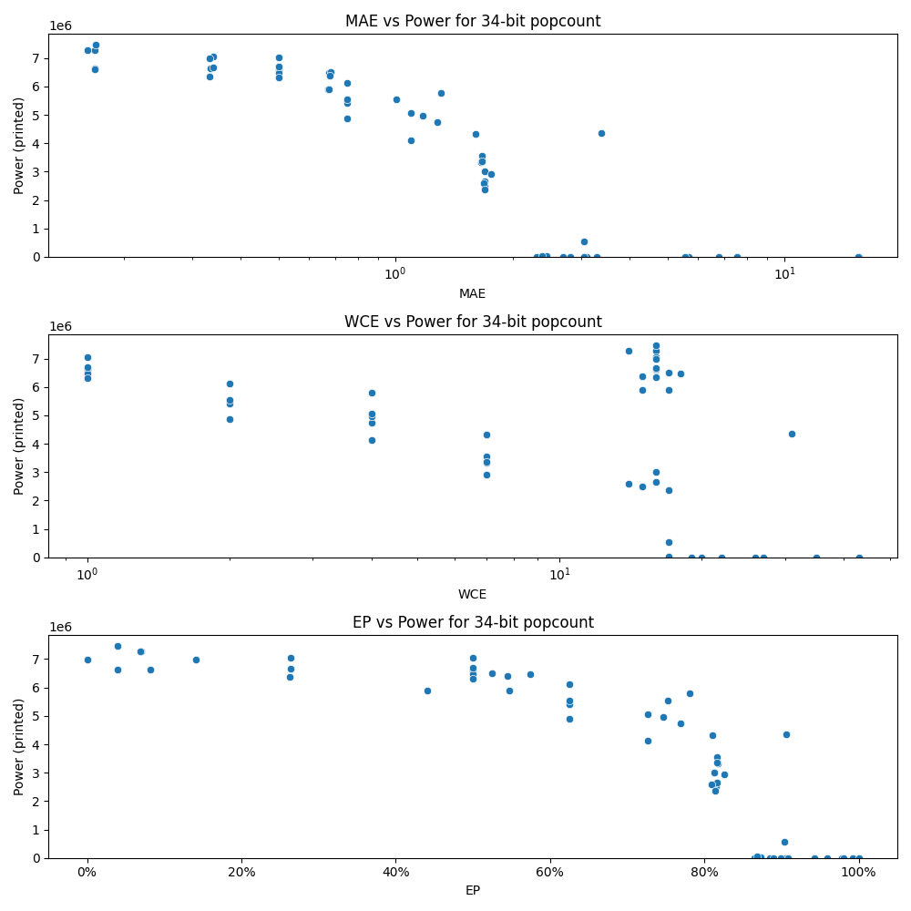

# Generated 34 bit popcount circuit
- __Circuit__: popcount (34 bit to 6.0 bit)

## Parameters of selected circuit
| Circuit         |       MAE |   WCE |        EP |             Area |           Power |       Delay | Download                                                               |
|:----------------|----------:|------:|----------:|-----------------:|----------------:|------------:|:-----------------------------------------------------------------------|
| popcount34_bem8 |  0.161021 |    14 | 0.0705126 |      1.12619e+08 |      7.266e+06  | 8.87688e+07 | [v](popcount34_bem8.v) [c](popcount34_bem8.c) [py](popcount34_bem8.py) |
| popcount34_shrh |  0.169    |    16 | 0.0392632 |      1.098e+08   |      6.637e+06  | 8.54264e+07 | [v](popcount34_shrh.v) [c](popcount34_shrh.c) [py](popcount34_shrh.py) |
| popcount34_ud1t |  0.168539 |    16 | 0.0695518 |      1.11988e+08 |      7.2873e+06 | 8.47531e+07 | [v](popcount34_ud1t.v) [c](popcount34_ud1t.c) [py](popcount34_ud1t.py) |
| popcount34_yyqi |  0.169    |    16 | 0.0392632 |      1.08853e+08 |      6.6152e+06 | 8.56908e+07 | [v](popcount34_yyqi.v) [c](popcount34_yyqi.c) [py](popcount34_yyqi.py) |
| popcount34_revc |  0.169818 |    16 | 0.0393695 |      1.14373e+08 |      7.4733e+06 | 8.60994e+07 | [v](popcount34_revc.v) [c](popcount34_revc.c) [py](popcount34_revc.py) |
| popcount34_xh7h |  0.334364 |    16 | 0.0824233 |      1.09275e+08 |      6.6416e+06 | 8.29417e+07 | [v](popcount34_xh7h.v) [c](popcount34_xh7h.c) [py](popcount34_xh7h.py) |
| popcount34_nmz4 |  0.339213 |    16 | 0.263711  |      1.12369e+08 |      7.049e+06  | 8.53692e+07 | [v](popcount34_nmz4.v) [c](popcount34_nmz4.c) [py](popcount34_nmz4.py) |
| popcount34_zcb3 |  0.333044 |    16 | 0.262797  |      1.14749e+08 |      6.3607e+06 | 8.70145e+07 | [v](popcount34_zcb3.v) [c](popcount34_zcb3.c) [py](popcount34_zcb3.py) |
| popcount34_th2z |  0.332543 |    16 | 0.141564  |      1.092e+08   |      6.978e+06  | 8.23739e+07 | [v](popcount34_th2z.v) [c](popcount34_th2z.c) [py](popcount34_th2z.py) |
| popcount34_y020 |  0.339083 |    16 | 0.263483  |      1.11499e+08 |      6.6631e+06 | 8.64354e+07 | [v](popcount34_y020.v) [c](popcount34_y020.c) [py](popcount34_y020.py) |
| popcount34_gu4n |  0.673254 |    18 | 0.574817  |      1.06318e+08 |      6.4752e+06 | 8.71947e+07 | [v](popcount34_gu4n.v) [c](popcount34_gu4n.c) [py](popcount34_gu4n.py) |
| popcount34_7unk |  0.671365 |    17 | 0.440454  |      1.03544e+08 |      5.8986e+06 | 8.29179e+07 | [v](popcount34_7unk.v) [c](popcount34_7unk.c) [py](popcount34_7unk.py) |
| popcount34_4724 |  0.679665 |    17 | 0.524914  |      1.07825e+08 |      6.5002e+06 | 9.3498e+07  | [v](popcount34_4724.v) [c](popcount34_4724.c) [py](popcount34_4724.py) |
| popcount34_5r09 |  0.678124 |    15 | 0.544951  |      1.02033e+08 |      6.3907e+06 | 8.08622e+07 | [v](popcount34_5r09.v) [c](popcount34_5r09.c) [py](popcount34_5r09.py) |
| popcount34_czks |  0.675069 |    15 | 0.547158  |      1.01124e+08 |      5.8909e+06 | 8.17612e+07 | [v](popcount34_czks.v) [c](popcount34_czks.c) [py](popcount34_czks.py) |
| popcount34_geg4 |  1.69655  |    15 | 0.815498  |      5.04485e+07 |      2.5109e+06 | 6.63626e+07 | [v](popcount34_geg4.v) [c](popcount34_geg4.c) [py](popcount34_geg4.py) |
| popcount34_cq0z |  1.69832  |    16 | 0.816441  |      5.05397e+07 |      2.658e+06  | 6.66896e+07 | [v](popcount34_cq0z.v) [c](popcount34_cq0z.c) [py](popcount34_cq0z.py) |
| popcount34_u458 |  1.69046  |    14 | 0.809692  |      5.86994e+07 |      2.5922e+06 | 7.03345e+07 | [v](popcount34_u458.v) [c](popcount34_u458.c) [py](popcount34_u458.py) |
| popcount34_breu |  1.69723  |    17 | 0.814465  |      5.04484e+07 |      2.3699e+06 | 6.80099e+07 | [v](popcount34_breu.v) [c](popcount34_breu.c) [py](popcount34_breu.py) |
| popcount34_9k5s |  1.69762  |    16 | 0.813225  |      6.69456e+07 |      3.0021e+06 | 6.25198e+07 | [v](popcount34_9k5s.v) [c](popcount34_9k5s.c) [py](popcount34_9k5s.py) |
| popcount34_sqxy |  2.70158  |    19 | 0.884422  |      0           |      0          | 0           | [v](popcount34_sqxy.v) [c](popcount34_sqxy.c) [py](popcount34_sqxy.py) |
| popcount34_zx80 |  3.09399  |    19 | 0.904678  |      0           |      0          | 0           | [v](popcount34_zx80.v) [c](popcount34_zx80.c) [py](popcount34_zx80.py) |
| popcount34_9fz1 |  3.28464  |    20 | 0.907855  |      0           |      0          | 0           | [v](popcount34_9fz1.v) [c](popcount34_9fz1.c) [py](popcount34_9fz1.py) |
| popcount34_vhmp |  2.30917  |    17 | 0.864166  |      0           |      0          | 0           | [v](popcount34_vhmp.v) [c](popcount34_vhmp.c) [py](popcount34_vhmp.py) |
| popcount34_czl0 |  3.38548  |    31 | 0.906191  |      9.00036e+07 |      4.3641e+06 | 8.45723e+07 | [v](popcount34_czl0.v) [c](popcount34_czl0.c) [py](popcount34_czl0.py) |
| popcount34_bams |  2.82232  |    19 | 0.889585  |      0           |      0          | 0           | [v](popcount34_bams.v) [c](popcount34_bams.c) [py](popcount34_bams.py) |
| popcount34_jam1 |  3.05348  |    20 | 0.89872   |      0           |      0          | 0           | [v](popcount34_jam1.v) [c](popcount34_jam1.c) [py](popcount34_jam1.py) |
| popcount34_hnxw |  5.66364  |    26 | 0.943107  |      0           |      0          | 0           | [v](popcount34_hnxw.v) [c](popcount34_hnxw.c) [py](popcount34_hnxw.py) |
| popcount34_h8wc |  5.55489  |    22 | 0.977469  |      0           |      0          | 0           | [v](popcount34_h8wc.v) [c](popcount34_h8wc.c) [py](popcount34_h8wc.py) |
| popcount34_x9bf |  6.78388  |    27 | 0.958962  |      0           |      0          | 0           | [v](popcount34_x9bf.v) [c](popcount34_x9bf.c) [py](popcount34_x9bf.py) |
| popcount34_q8j1 | 15.5285   |    43 | 0.992257  |      0           |      0          | 0           | [v](popcount34_q8j1.v) [c](popcount34_q8j1.c) [py](popcount34_q8j1.py) |
| popcount34_gs0l |  7.57029  |    27 | 0.980915  |      0           |      0          | 0           | [v](popcount34_gs0l.v) [c](popcount34_gs0l.c) [py](popcount34_gs0l.py) |
| popcount34_nffr | 15.5      |    35 | 0.999996  |      0           |      0          | 0           | [v](popcount34_nffr.v) [c](popcount34_nffr.c) [py](popcount34_nffr.py) |
| popcount34_qqp6 |  0        |     0 | 0         |      1.26897e+08 |      6.968e+06  | 9.06785e+07 | [v](popcount34_qqp6.v) [c](popcount34_qqp6.c) [py](popcount34_qqp6.py) |
| popcount34_uzn8 |  0.5      |     1 | 0.5       |      1.13888e+08 |      6.5913e+06 | 9.1983e+07  | [v](popcount34_uzn8.v) [c](popcount34_uzn8.c) [py](popcount34_uzn8.py) |
| popcount34_aqyj |  0.5      |     1 | 0.5       |      1.17352e+08 |      6.4629e+06 | 9.09391e+07 | [v](popcount34_aqyj.v) [c](popcount34_aqyj.c) [py](popcount34_aqyj.py) |
| popcount34_rq7r |  0.5      |     1 | 0.5       |      1.1472e+08  |      7.0374e+06 | 8.85377e+07 | [v](popcount34_rq7r.v) [c](popcount34_rq7r.c) [py](popcount34_rq7r.py) |
| popcount34_v06s |  0.5      |     1 | 0.5       |      1.21348e+08 |      6.6923e+06 | 9.14523e+07 | [v](popcount34_v06s.v) [c](popcount34_v06s.c) [py](popcount34_v06s.py) |
| popcount34_n1vz |  0.5      |     1 | 0.5       |      1.23121e+08 |      6.3193e+06 | 8.85436e+07 | [v](popcount34_n1vz.v) [c](popcount34_n1vz.c) [py](popcount34_n1vz.py) |
| popcount34_idk9 |  1.00391  |     2 | 0.751953  |      1.05141e+08 |      5.5529e+06 | 8.62395e+07 | [v](popcount34_idk9.v) [c](popcount34_idk9.c) [py](popcount34_idk9.py) |
| popcount34_5pn9 |  0.75     |     2 | 0.625     |      1.11353e+08 |      5.4055e+06 | 8.57193e+07 | [v](popcount34_5pn9.v) [c](popcount34_5pn9.c) [py](popcount34_5pn9.py) |
| popcount34_6dgz |  0.75     |     2 | 0.625     |      1.12463e+08 |      5.5454e+06 | 9.20492e+07 | [v](popcount34_6dgz.v) [c](popcount34_6dgz.c) [py](popcount34_6dgz.py) |
| popcount34_47ro |  0.75     |     2 | 0.625     |      9.78604e+07 |      6.1182e+06 | 8.87464e+07 | [v](popcount34_47ro.v) [c](popcount34_47ro.c) [py](popcount34_47ro.py) |
| popcount34_huod |  0.75     |     2 | 0.625     |      1.02667e+08 |      4.8852e+06 | 8.46764e+07 | [v](popcount34_huod.v) [c](popcount34_huod.c) [py](popcount34_huod.py) |
| popcount34_mao9 |  1.28125  |     4 | 0.769531  |      9.31011e+07 |      4.7389e+06 | 8.81257e+07 | [v](popcount34_mao9.v) [c](popcount34_mao9.c) [py](popcount34_mao9.py) |
| popcount34_llrw |  1.09375  |     4 | 0.726562  |      9.52129e+07 |      4.1204e+06 | 8.4222e+07  | [v](popcount34_llrw.v) [c](popcount34_llrw.c) [py](popcount34_llrw.py) |
| popcount34_p13g |  1.17188  |     4 | 0.746094  |      9.82657e+07 |      4.9568e+06 | 7.11494e+07 | [v](popcount34_p13g.v) [c](popcount34_p13g.c) [py](popcount34_p13g.py) |
| popcount34_3jgm |  1.30859  |     4 | 0.780273  |      1.04524e+08 |      5.7865e+06 | 8.86919e+07 | [v](popcount34_3jgm.v) [c](popcount34_3jgm.c) [py](popcount34_3jgm.py) |
| popcount34_sntv |  1.09375  |     4 | 0.726562  |      1.10626e+08 |      5.0697e+06 | 9.36516e+07 | [v](popcount34_sntv.v) [c](popcount34_sntv.c) [py](popcount34_sntv.py) |
| popcount34_96e7 |  1.75782  |     7 | 0.826077  |      7.83294e+07 |      2.9274e+06 | 8.40289e+07 | [v](popcount34_96e7.v) [c](popcount34_96e7.c) [py](popcount34_96e7.py) |
| popcount34_kjbw |  1.66415  |     7 | 0.81596   |      6.93524e+07 |      3.5476e+06 | 9.02547e+07 | [v](popcount34_kjbw.v) [c](popcount34_kjbw.c) [py](popcount34_kjbw.py) |
| popcount34_wgkz |  1.60345  |     7 | 0.810028  |      9.08847e+07 |      4.3281e+06 | 8.97698e+07 | [v](popcount34_wgkz.v) [c](popcount34_wgkz.c) [py](popcount34_wgkz.py) |
| popcount34_8dwn |  1.66327  |     7 | 0.817047  |      7.12326e+07 |      3.3397e+06 | 7.81472e+07 | [v](popcount34_8dwn.v) [c](popcount34_8dwn.c) [py](popcount34_8dwn.py) |
| popcount34_3vkq |  1.66647  |     7 | 0.816452  |      7.01112e+07 |      3.37e+06   | 8.38178e+07 | [v](popcount34_3vkq.v) [c](popcount34_3vkq.c) [py](popcount34_3vkq.py) |
| popcount34_q4e0 |  2.44912  |    17 | 0.872399  | 627920           |  30372          | 2.6182e+06  | [v](popcount34_q4e0.v) [c](popcount34_q4e0.c) [py](popcount34_q4e0.py) |
| popcount34_28tv |  2.37915  |    17 | 0.868282  |      1.12364e+06 |  39342          | 4.18138e+06 | [v](popcount34_28tv.v) [c](popcount34_28tv.c) [py](popcount34_28tv.py) |
| popcount34_yo6e |  3.04852  |    17 | 0.903529  |      1.33198e+07 | 553930          | 2.35627e+07 | [v](popcount34_yo6e.v) [c](popcount34_yo6e.c) [py](popcount34_yo6e.py) |

## Parameters 
