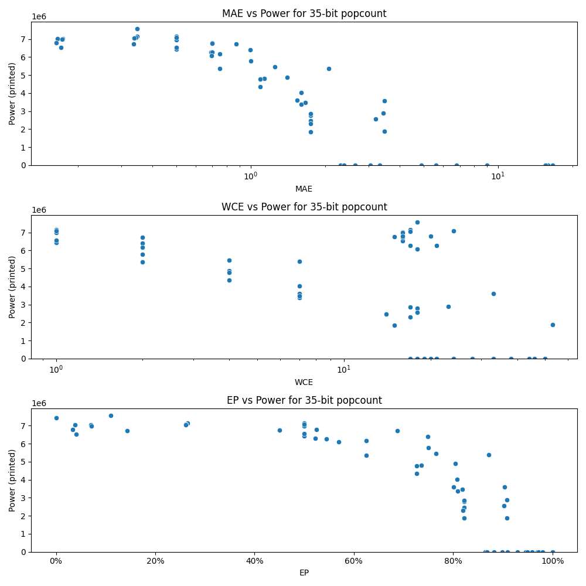

# Generated 35 bit popcount circuit
- __Circuit__: popcount (35 bit to 6.0 bit)

## Parameters of selected circuit
| Circuit         |       MAE |   WCE |        EP |             Area |        Power |            Delay | Download                                                               |
|:----------------|----------:|------:|----------:|-----------------:|-------------:|-----------------:|:-----------------------------------------------------------------------|
| popcount35_54f3 |  0.165419 |    16 | 0.0388153 |      1.18306e+08 |   7.0341e+06 |      8.53533e+07 | [v](popcount35_54f3.v) [c](popcount35_54f3.c) [py](popcount35_54f3.py) |
| popcount35_by5n |  0.163203 |    20 | 0.0337811 |      1.16551e+08 |   6.7837e+06 |      8.44685e+07 | [v](popcount35_by5n.v) [c](popcount35_by5n.c) [py](popcount35_by5n.py) |
| popcount35_z69w |  0.173886 |    16 | 0.0703968 |      1.22499e+08 |   7.0314e+06 |      8.5957e+07  | [v](popcount35_z69w.v) [c](popcount35_z69w.c) [py](popcount35_z69w.py) |
| popcount35_7kii |  0.173023 |    16 | 0.0718921 |      1.17316e+08 |   6.9847e+06 |      8.59764e+07 | [v](popcount35_7kii.v) [c](popcount35_7kii.c) [py](popcount35_7kii.py) |
| popcount35_970x |  0.171227 |    16 | 0.0403644 |      1.14073e+08 |   6.5281e+06 |      8.19084e+07 | [v](popcount35_970x.v) [c](popcount35_970x.c) [py](popcount35_970x.py) |
| popcount35_dkh5 |  0.347801 |    17 | 0.265208  |      1.13175e+08 |   7.1596e+06 |      8.69269e+07 | [v](popcount35_dkh5.v) [c](popcount35_dkh5.c) [py](popcount35_dkh5.py) |
| popcount35_4f6h |  0.347932 |    18 | 0.110895  |      1.16014e+08 |   7.5761e+06 |      9.05539e+07 | [v](popcount35_4f6h.v) [c](popcount35_4f6h.c) [py](popcount35_4f6h.py) |
| popcount35_6xqo |  0.343299 |    24 | 0.261295  |      1.19586e+08 |   7.0842e+06 |      9.39651e+07 | [v](popcount35_6xqo.v) [c](popcount35_6xqo.c) [py](popcount35_6xqo.py) |
| popcount35_uzpb |  0.337884 |    17 | 0.261356  |      1.17399e+08 |   7.0472e+06 |      8.97599e+07 | [v](popcount35_uzpb.v) [c](popcount35_uzpb.c) [py](popcount35_uzpb.py) |
| popcount35_76z3 |  0.336295 |    16 | 0.142882  |      1.18236e+08 |   6.7313e+06 |      8.46994e+07 | [v](popcount35_76z3.v) [c](popcount35_76z3.c) [py](popcount35_76z3.py) |
| popcount35_svr2 |  0.68984  |    21 | 0.521747  |      1.07706e+08 |   6.2859e+06 |      8.63734e+07 | [v](popcount35_svr2.v) [c](popcount35_svr2.c) [py](popcount35_svr2.py) |
| popcount35_sgid |  0.696832 |    17 | 0.544803  |      1.11718e+08 |   6.2759e+06 |      8.47541e+07 | [v](popcount35_sgid.v) [c](popcount35_sgid.c) [py](popcount35_sgid.py) |
| popcount35_tc59 |  0.698936 |    16 | 0.524374  |      1.11073e+08 |   6.8009e+06 |      8.35812e+07 | [v](popcount35_tc59.v) [c](popcount35_tc59.c) [py](popcount35_tc59.py) |
| popcount35_v8zz |  0.69491  |    18 | 0.569999  |      1.09336e+08 |   6.0913e+06 |      8.25256e+07 | [v](popcount35_v8zz.v) [c](popcount35_v8zz.c) [py](popcount35_v8zz.py) |
| popcount35_j4sf |  0.698937 |    15 | 0.450246  |      1.08662e+08 |   6.7526e+06 |      8.47251e+07 | [v](popcount35_j4sf.v) [c](popcount35_j4sf.c) [py](popcount35_j4sf.py) |
| popcount35_gtof |  1.74343  |    14 | 0.821608  |      4.9435e+07  |   2.4703e+06 |      7.3641e+07  | [v](popcount35_gtof.v) [c](popcount35_gtof.c) [py](popcount35_gtof.py) |
| popcount35_ctzs |  1.74815  |    17 | 0.819303  |      4.28992e+07 |   2.2958e+06 |      5.34717e+07 | [v](popcount35_ctzs.v) [c](popcount35_ctzs.c) [py](popcount35_ctzs.py) |
| popcount35_3d5j |  1.74951  |    15 | 0.821869  |      4.00125e+07 |   1.8618e+06 |      6.8833e+07  | [v](popcount35_3d5j.v) [c](popcount35_3d5j.c) [py](popcount35_3d5j.py) |
| popcount35_vmrh |  1.7478   |    18 | 0.821625  |      5.54935e+07 |   2.7775e+06 |      7.62849e+07 | [v](popcount35_vmrh.v) [c](popcount35_vmrh.c) [py](popcount35_vmrh.py) |
| popcount35_yol8 |  1.74938  |    17 | 0.82168   |      5.08056e+07 |   2.8608e+06 |      6.8632e+07  | [v](popcount35_yol8.v) [c](popcount35_yol8.c) [py](popcount35_yol8.py) |
| popcount35_xlwl |  2.64121  |    19 | 0.881841  |      0           |   0          |      0           | [v](popcount35_xlwl.v) [c](popcount35_xlwl.c) [py](popcount35_xlwl.py) |
| popcount35_gddu |  3.33071  |    21 | 0.908848  | 228420           | 878.448      | 565707           | [v](popcount35_gddu.v) [c](popcount35_gddu.c) [py](popcount35_gddu.py) |
| popcount35_hxy9 |  3.47028  |    53 | 0.908513  |      4.93651e+07 |   1.8742e+06 |      6.94932e+07 | [v](popcount35_hxy9.v) [c](popcount35_hxy9.c) [py](popcount35_hxy9.py) |
| popcount35_c6d4 |  3.44133  |    23 | 0.908798  |      6.53405e+07 |   2.8782e+06 |      6.70188e+07 | [v](popcount35_c6d4.v) [c](popcount35_c6d4.c) [py](popcount35_c6d4.py) |
| popcount35_kfnc |  3.47244  |    33 | 0.904025  |      7.34759e+07 |   3.5895e+06 |      8.09904e+07 | [v](popcount35_kfnc.v) [c](popcount35_kfnc.c) [py](popcount35_kfnc.py) |
| popcount35_19t3 |  3.05348  |    20 | 0.89872   |      0           |   0          |      0           | [v](popcount35_19t3.v) [c](popcount35_19t3.c) [py](popcount35_19t3.py) |
| popcount35_1ht9 |  6.8044   |    28 | 0.959077  |      0           |   0          |      0           | [v](popcount35_1ht9.v) [c](popcount35_1ht9.c) [py](popcount35_1ht9.py) |
| popcount35_j1nz |  4.90772  |    24 | 0.929838  |      0           |   0          |      0           | [v](popcount35_j1nz.v) [c](popcount35_j1nz.c) [py](popcount35_j1nz.py) |
| popcount35_epb3 |  5.61472  |    24 | 0.969176  |      0           |   0          |      0           | [v](popcount35_epb3.v) [c](popcount35_epb3.c) [py](popcount35_epb3.py) |
| popcount35_2pl6 | 15.9187   |    46 | 0.945984  |      0           |   0          |      0           | [v](popcount35_2pl6.v) [c](popcount35_2pl6.c) [py](popcount35_2pl6.py) |
| popcount35_im4v | 16.5806   |    50 | 0.972395  |      0           |   0          |      0           | [v](popcount35_im4v.v) [c](popcount35_im4v.c) [py](popcount35_im4v.py) |
| popcount35_vg2l | 15.5001   |    38 | 0.999876  |      0           |   0          |      0           | [v](popcount35_vg2l.v) [c](popcount35_vg2l.c) [py](popcount35_vg2l.py) |
| popcount35_vq48 |  9.02674  |    33 | 0.94936   |      0           |   0          |      0           | [v](popcount35_vq48.v) [c](popcount35_vq48.c) [py](popcount35_vq48.py) |
| popcount35_xcpb | 15.5794   |    44 | 0.980625  |      0           |   0          |      0           | [v](popcount35_xcpb.v) [c](popcount35_xcpb.c) [py](popcount35_xcpb.py) |
| popcount35_9x85 |  0        |     0 | 0         |      1.36875e+08 |   7.4521e+06 |      9.00932e+07 | [v](popcount35_9x85.v) [c](popcount35_9x85.c) [py](popcount35_9x85.py) |
| popcount35_pyuw |  0.5      |     1 | 0.5       |      1.26565e+08 |   6.9716e+06 |      9.06016e+07 | [v](popcount35_pyuw.v) [c](popcount35_pyuw.c) [py](popcount35_pyuw.py) |
| popcount35_mfmj |  0.5      |     1 | 0.5       |      1.33507e+08 |   7.1603e+06 |      9.21336e+07 | [v](popcount35_mfmj.v) [c](popcount35_mfmj.c) [py](popcount35_mfmj.py) |
| popcount35_kpgk |  0.5      |     1 | 0.5       |      1.29686e+08 |   7.0916e+06 |      9.19673e+07 | [v](popcount35_kpgk.v) [c](popcount35_kpgk.c) [py](popcount35_kpgk.py) |
| popcount35_e4o7 |  0.5      |     1 | 0.5       |      1.2815e+08  |   6.4328e+06 |      9.01446e+07 | [v](popcount35_e4o7.v) [c](popcount35_e4o7.c) [py](popcount35_e4o7.py) |
| popcount35_sd3p |  0.5      |     1 | 0.5       |      1.23399e+08 |   6.5499e+06 |      9.09428e+07 | [v](popcount35_sd3p.v) [c](popcount35_sd3p.c) [py](popcount35_sd3p.py) |
| popcount35_2wpv |  0.999996 |     2 | 0.749998  |      1.16918e+08 |   5.7737e+06 |      9.22568e+07 | [v](popcount35_2wpv.v) [c](popcount35_2wpv.c) [py](popcount35_2wpv.py) |
| popcount35_9dnr |  0.998047 |     2 | 0.749023  |      1.18201e+08 |   6.3944e+06 |      9.08851e+07 | [v](popcount35_9dnr.v) [c](popcount35_9dnr.c) [py](popcount35_9dnr.py) |
| popcount35_30y6 |  0.875    |     2 | 0.6875    |      1.18897e+08 |   6.7141e+06 |      9.03943e+07 | [v](popcount35_30y6.v) [c](popcount35_30y6.c) [py](popcount35_30y6.py) |
| popcount35_lkr3 |  0.75     |     2 | 0.625     |      1.20225e+08 |   6.1663e+06 |      9.26372e+07 | [v](popcount35_lkr3.v) [c](popcount35_lkr3.c) [py](popcount35_lkr3.py) |
| popcount35_1zrn |  0.75     |     2 | 0.625     |      1.05081e+08 |   5.349e+06  |      8.70652e+07 | [v](popcount35_1zrn.v) [c](popcount35_1zrn.c) [py](popcount35_1zrn.py) |
| popcount35_khoe |  1.13281  |     4 | 0.736328  |      9.92449e+07 |   4.8183e+06 |      8.62625e+07 | [v](popcount35_khoe.v) [c](popcount35_khoe.c) [py](popcount35_khoe.py) |
| popcount35_b5vz |  1.40625  |     4 | 0.804688  |      9.9632e+07  |   4.8846e+06 |      9.25924e+07 | [v](popcount35_b5vz.v) [c](popcount35_b5vz.c) [py](popcount35_b5vz.py) |
| popcount35_ri0d |  1.09375  |     4 | 0.726562  |      1.04149e+08 |   4.7764e+06 |      8.86458e+07 | [v](popcount35_ri0d.v) [c](popcount35_ri0d.c) [py](popcount35_ri0d.py) |
| popcount35_6rpl |  1.09375  |     4 | 0.726562  |      9.34629e+07 |   4.3445e+06 |      8.81233e+07 | [v](popcount35_6rpl.v) [c](popcount35_6rpl.c) [py](popcount35_6rpl.py) |
| popcount35_eken |  1.25     |     4 | 0.765627  |      1.04655e+08 |   5.4684e+06 |      9.21527e+07 | [v](popcount35_eken.v) [c](popcount35_eken.c) [py](popcount35_eken.py) |
| popcount35_pao7 |  1.60025  |     7 | 0.809662  |      7.68541e+07 |   3.3817e+06 |      7.92902e+07 | [v](popcount35_pao7.v) [c](popcount35_pao7.c) [py](popcount35_pao7.py) |
| popcount35_2cml |  1.5368   |     7 | 0.800598  |      7.59673e+07 |   3.61e+06   |      8.77484e+07 | [v](popcount35_2cml.v) [c](popcount35_2cml.c) [py](popcount35_2cml.py) |
| popcount35_vo0j |  1.59769  |     7 | 0.808105  |      9.24061e+07 |   4.023e+06  |      9.21823e+07 | [v](popcount35_vo0j.v) [c](popcount35_vo0j.c) [py](popcount35_vo0j.py) |
| popcount35_7uvf |  2.06799  |     7 | 0.871412  |      1.05828e+08 |   5.377e+06  |      9.02682e+07 | [v](popcount35_7uvf.v) [c](popcount35_7uvf.c) [py](popcount35_7uvf.py) |
| popcount35_ele2 |  1.6637   |     7 | 0.818726  |      8.24305e+07 |   3.4733e+06 |      8.80919e+07 | [v](popcount35_ele2.v) [c](popcount35_ele2.c) [py](popcount35_ele2.py) |
| popcount35_3lws |  2.30917  |    17 | 0.864166  |      0           |   0          |      0           | [v](popcount35_3lws.v) [c](popcount35_3lws.c) [py](popcount35_3lws.py) |
| popcount35_h2g5 |  2.37709  |    18 | 0.867939  |      0           |   0          |      0           | [v](popcount35_h2g5.v) [c](popcount35_h2g5.c) [py](popcount35_h2g5.py) |
| popcount35_g3qe |  3.20746  |    18 | 0.902659  |      5.39037e+07 |   2.5732e+06 |      7.16122e+07 | [v](popcount35_g3qe.v) [c](popcount35_g3qe.c) [py](popcount35_g3qe.py) |

## Parameters 
