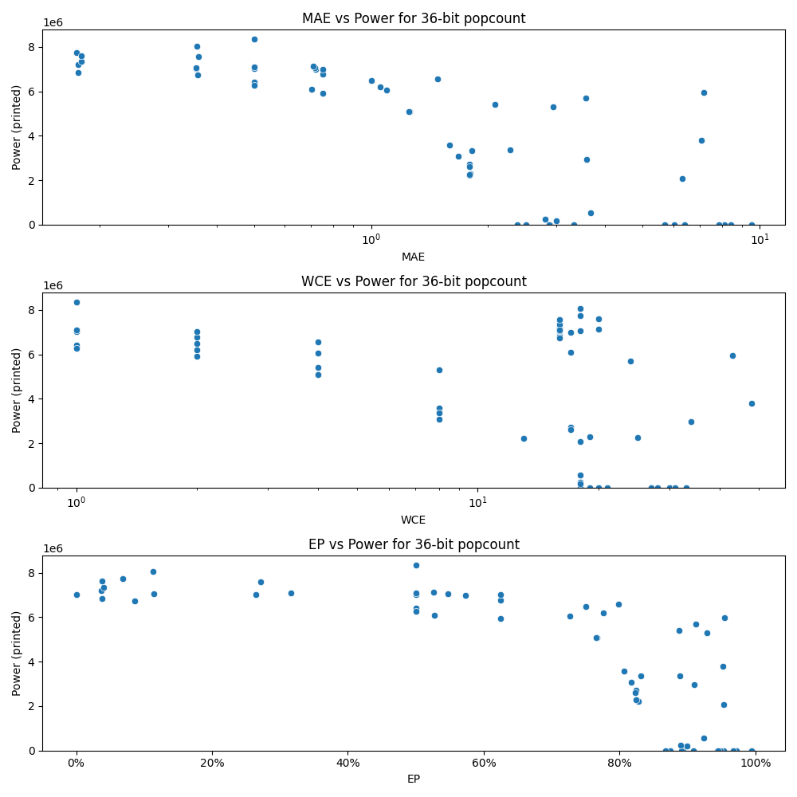

# Generated 36 bit popcount circuit
- __Circuit__: popcount (36 bit to 6.0 bit)

## Parameters of selected circuit
| Circuit         |      MAE |   WCE |        EP |        Area |           Power |       Delay | Download                                                               |
|:----------------|---------:|------:|----------:|------------:|----------------:|------------:|:-----------------------------------------------------------------------|
| popcount36_64zn | 0.174106 |    18 | 0.0684008 | 1.24536e+08 |      7.7549e+06 | 8.90681e+07 | [v](popcount36_64zn.v) [c](popcount36_64zn.c) [py](popcount36_64zn.py) |
| popcount36_d9qj | 0.176356 |    16 | 0.0364446 | 1.2384e+08  |      7.209e+06  | 8.80218e+07 | [v](popcount36_d9qj.v) [c](popcount36_d9qj.c) [py](popcount36_d9qj.py) |
| popcount36_pc6o | 0.179608 |    16 | 0.0405897 | 1.21215e+08 |      7.3489e+06 | 8.46142e+07 | [v](popcount36_pc6o.v) [c](popcount36_pc6o.c) [py](popcount36_pc6o.py) |
| popcount36_tr1f | 0.176428 |    16 | 0.0383542 | 1.25579e+08 |      6.8461e+06 | 8.33698e+07 | [v](popcount36_tr1f.v) [c](popcount36_tr1f.c) [py](popcount36_tr1f.py) |
| popcount36_gchd | 0.179355 |    20 | 0.0386926 | 1.24818e+08 |      7.6173e+06 | 8.90982e+07 | [v](popcount36_gchd.v) [c](popcount36_gchd.c) [py](popcount36_gchd.py) |
| popcount36_oag1 | 0.358476 |    16 | 0.0860833 | 1.15914e+08 |      6.7375e+06 | 8.50481e+07 | [v](popcount36_oag1.v) [c](popcount36_oag1.c) [py](popcount36_oag1.py) |
| popcount36_nvvx | 0.355227 |    18 | 0.113432  | 1.17752e+08 |      8.0528e+06 | 8.79269e+07 | [v](popcount36_nvvx.v) [c](popcount36_nvvx.c) [py](popcount36_nvvx.py) |
| popcount36_pm89 | 0.358948 |    16 | 0.272157  | 1.21646e+08 |      7.582e+06  | 8.85443e+07 | [v](popcount36_pm89.v) [c](popcount36_pm89.c) [py](popcount36_pm89.py) |
| popcount36_ddvy | 0.354331 |    16 | 0.264625  | 1.20702e+08 |      7.0235e+06 | 9.08247e+07 | [v](popcount36_ddvy.v) [c](popcount36_ddvy.c) [py](popcount36_ddvy.py) |
| popcount36_xk8e | 0.353595 |    16 | 0.11394   | 1.17943e+08 |      7.0558e+06 | 8.18995e+07 | [v](popcount36_xk8e.v) [c](popcount36_xk8e.c) [py](popcount36_xk8e.py) |
| popcount36_85ew | 0.717217 |    18 | 0.547733  | 1.11122e+08 |      7.0641e+06 | 8.5843e+07  | [v](popcount36_85ew.v) [c](popcount36_85ew.c) [py](popcount36_85ew.py) |
| popcount36_i5yx | 0.719139 |    17 | 0.573179  | 1.16416e+08 |      7.0022e+06 | 8.83076e+07 | [v](popcount36_i5yx.v) [c](popcount36_i5yx.c) [py](popcount36_i5yx.py) |
| popcount36_8bvr | 0.70441  |    17 | 0.526817  | 1.11884e+08 |      6.0986e+06 | 8.17609e+07 | [v](popcount36_8bvr.v) [c](popcount36_8bvr.c) [py](popcount36_8bvr.py) |
| popcount36_dhoe | 0.716633 |    16 | 0.315738  | 1.16532e+08 |      7.082e+06  | 8.54437e+07 | [v](popcount36_dhoe.v) [c](popcount36_dhoe.c) [py](popcount36_dhoe.py) |
| popcount36_sch8 | 0.710698 |    20 | 0.526328  | 1.17866e+08 |      7.1288e+06 | 9.05604e+07 | [v](popcount36_sch8.v) [c](popcount36_sch8.c) [py](popcount36_sch8.py) |
| popcount36_bd2s | 1.79938  |    19 | 0.825257  | 4.58861e+07 |      2.3028e+06 | 5.84745e+07 | [v](popcount36_bd2s.v) [c](popcount36_bd2s.c) [py](popcount36_bd2s.py) |
| popcount36_vanw | 1.79266  |    13 | 0.827212  | 4.5851e+07  |      2.23e+06   | 6.39421e+07 | [v](popcount36_vanw.v) [c](popcount36_vanw.c) [py](popcount36_vanw.py) |
| popcount36_fjpe | 1.79398  |    17 | 0.824783  | 6.07433e+07 |      2.7295e+06 | 7.73919e+07 | [v](popcount36_fjpe.v) [c](popcount36_fjpe.c) [py](popcount36_fjpe.py) |
| popcount36_pocl | 1.78923  |    25 | 0.824561  | 5.3341e+07  |      2.2722e+06 | 6.94201e+07 | [v](popcount36_pocl.v) [c](popcount36_pocl.c) [py](popcount36_pocl.py) |
| popcount36_qqdr | 1.79152  |    17 | 0.822902  | 5.56069e+07 |      2.6056e+06 | 8.2155e+07  | [v](popcount36_qqdr.v) [c](popcount36_qqdr.c) [py](popcount36_qqdr.py) |
| popcount36_ab6g | 2.89143  |    20 | 0.893656  | 0           |      0          | 0           | [v](popcount36_ab6g.v) [c](popcount36_ab6g.c) [py](popcount36_ab6g.py) |
| popcount36_ay4z | 2.50915  |    19 | 0.87489   | 0           |      0          | 0           | [v](popcount36_ay4z.v) [c](popcount36_ay4z.c) [py](popcount36_ay4z.py) |
| popcount36_yo1u | 2.87753  |    20 | 0.891571  | 0           |      0          | 0           | [v](popcount36_yo1u.v) [c](popcount36_yo1u.c) [py](popcount36_yo1u.py) |
| popcount36_j4h6 | 3.56294  |    24 | 0.91217   | 1.10066e+08 |      5.6983e+06 | 9.82369e+07 | [v](popcount36_j4h6.v) [c](popcount36_j4h6.c) [py](popcount36_j4h6.py) |
| popcount36_2ba4 | 3.58979  |    34 | 0.910004  | 5.34918e+07 |      2.9575e+06 | 6.53439e+07 | [v](popcount36_2ba4.v) [c](popcount36_2ba4.c) [py](popcount36_2ba4.py) |
| popcount36_un7b | 5.69209  |    27 | 0.943799  | 0           |      0          | 0           | [v](popcount36_un7b.v) [c](popcount36_un7b.c) [py](popcount36_un7b.py) |
| popcount36_rrns | 6.41636  |    28 | 0.953641  | 0           |      0          | 0           | [v](popcount36_rrns.v) [c](popcount36_rrns.c) [py](popcount36_rrns.py) |
| popcount36_w051 | 3.33071  |    21 | 0.908848  | 0           |      0          | 0           | [v](popcount36_w051.v) [c](popcount36_w051.c) [py](popcount36_w051.py) |
| popcount36_hwoc | 7.07759  |    48 | 0.951983  | 7.31104e+07 |      3.7923e+06 | 8.52002e+07 | [v](popcount36_hwoc.v) [c](popcount36_hwoc.c) [py](popcount36_hwoc.py) |
| popcount36_0skb | 7.18358  |    43 | 0.955035  | 1.02953e+08 |      5.9653e+06 | 6.67347e+07 | [v](popcount36_0skb.v) [c](popcount36_0skb.c) [py](popcount36_0skb.py) |
| popcount36_ssce | 9.5126   |    30 | 0.993924  | 0           |      0          | 0           | [v](popcount36_ssce.v) [c](popcount36_ssce.c) [py](popcount36_ssce.py) |
| popcount36_w9zx | 6.02833  |    27 | 0.948206  | 0           |      0          | 0           | [v](popcount36_w9zx.v) [c](popcount36_w9zx.c) [py](popcount36_w9zx.py) |
| popcount36_vmye | 8.12171  |    30 | 0.972364  | 0           |      0          | 0           | [v](popcount36_vmye.v) [c](popcount36_vmye.c) [py](popcount36_vmye.py) |
| popcount36_ugbo | 8.40858  |    33 | 0.944491  | 0           |      0          | 0           | [v](popcount36_ugbo.v) [c](popcount36_ugbo.c) [py](popcount36_ugbo.py) |
| popcount36_9tg7 | 7.84216  |    31 | 0.967491  | 0           |      0          | 0           | [v](popcount36_9tg7.v) [c](popcount36_9tg7.c) [py](popcount36_9tg7.py) |
| popcount36_21l3 | 0        |     0 | 0         | 1.37318e+08 |      7.0218e+06 | 9.10719e+07 | [v](popcount36_21l3.v) [c](popcount36_21l3.c) [py](popcount36_21l3.py) |
| popcount36_d6su | 0.5      |     1 | 0.5       | 1.27594e+08 |      7.0164e+06 | 9.09358e+07 | [v](popcount36_d6su.v) [c](popcount36_d6su.c) [py](popcount36_d6su.py) |
| popcount36_d9cs | 0.5      |     1 | 0.5       | 1.32574e+08 |      7.0896e+06 | 9.10073e+07 | [v](popcount36_d9cs.v) [c](popcount36_d9cs.c) [py](popcount36_d9cs.py) |
| popcount36_wo8m | 0.5      |     1 | 0.5       | 1.47733e+08 |      8.359e+06  | 9.18202e+07 | [v](popcount36_wo8m.v) [c](popcount36_wo8m.c) [py](popcount36_wo8m.py) |
| popcount36_hsbg | 0.5      |     1 | 0.5       | 1.31339e+08 |      6.4241e+06 | 9.03025e+07 | [v](popcount36_hsbg.v) [c](popcount36_hsbg.c) [py](popcount36_hsbg.py) |
| popcount36_v6ns | 0.5      |     1 | 0.5       | 1.30052e+08 |      6.2666e+06 | 9.02965e+07 | [v](popcount36_v6ns.v) [c](popcount36_v6ns.c) [py](popcount36_v6ns.py) |
| popcount36_dr67 | 0.75     |     2 | 0.625     | 1.23019e+08 |      5.928e+06  | 9.00545e+07 | [v](popcount36_dr67.v) [c](popcount36_dr67.c) [py](popcount36_dr67.py) |
| popcount36_o8g5 | 1        |     2 | 0.75      | 1.25524e+08 |      6.4991e+06 | 9.23359e+07 | [v](popcount36_o8g5.v) [c](popcount36_o8g5.c) [py](popcount36_o8g5.py) |
| popcount36_gscd | 1.05322  |     2 | 0.776611  | 1.20463e+08 |      6.207e+06  | 9.08014e+07 | [v](popcount36_gscd.v) [c](popcount36_gscd.c) [py](popcount36_gscd.py) |
| popcount36_1yu0 | 0.75     |     2 | 0.625     | 1.29357e+08 |      6.7777e+06 | 9.25788e+07 | [v](popcount36_1yu0.v) [c](popcount36_1yu0.c) [py](popcount36_1yu0.py) |
| popcount36_w4aa | 0.75     |     2 | 0.625     | 1.25052e+08 |      7.0113e+06 | 9.17988e+07 | [v](popcount36_w4aa.v) [c](popcount36_w4aa.c) [py](popcount36_w4aa.py) |
| popcount36_xb1a | 1.09375  |     4 | 0.726562  | 1.12739e+08 |      6.0663e+06 | 9.21574e+07 | [v](popcount36_xb1a.v) [c](popcount36_xb1a.c) [py](popcount36_xb1a.py) |
| popcount36_n5a1 | 1.25671  |     4 | 0.766312  | 1.11668e+08 |      5.0802e+06 | 9.12828e+07 | [v](popcount36_n5a1.v) [c](popcount36_n5a1.c) [py](popcount36_n5a1.py) |
| popcount36_753t | 2.08426  |     4 | 0.88734   | 1.18843e+08 |      5.408e+06  | 8.34047e+07 | [v](popcount36_753t.v) [c](popcount36_753t.c) [py](popcount36_753t.py) |
| popcount36_5l2u | 1.48535  |     4 | 0.798096  | 1.08897e+08 |      6.5767e+06 | 8.07048e+07 | [v](popcount36_5l2u.v) [c](popcount36_5l2u.c) [py](popcount36_5l2u.py) |
| popcount36_bsch | 1.25     |     4 | 0.765625  | 9.99186e+07 |      5.0872e+06 | 8.60723e+07 | [v](popcount36_bsch.v) [c](popcount36_bsch.c) [py](popcount36_bsch.py) |
| popcount36_2fox | 1.59396  |     8 | 0.806483  | 7.07067e+07 |      3.592e+06  | 7.47448e+07 | [v](popcount36_2fox.v) [c](popcount36_2fox.c) [py](popcount36_2fox.py) |
| popcount36_pxdz | 2.93558  |     8 | 0.929111  | 9.04852e+07 |      5.316e+06  | 8.98784e+07 | [v](popcount36_pxdz.v) [c](popcount36_pxdz.c) [py](popcount36_pxdz.py) |
| popcount36_wvfd | 1.81578  |     8 | 0.830807  | 8.48156e+07 |      3.3504e+06 | 8.7922e+07  | [v](popcount36_wvfd.v) [c](popcount36_wvfd.c) [py](popcount36_wvfd.py) |
| popcount36_off8 | 1.67557  |     8 | 0.81665   | 7.47346e+07 |      3.0744e+06 | 7.57856e+07 | [v](popcount36_off8.v) [c](popcount36_off8.c) [py](popcount36_off8.py) |
| popcount36_sip1 | 2.27455  |     8 | 0.888912  | 6.89532e+07 |      3.375e+06  | 7.90983e+07 | [v](popcount36_sip1.v) [c](popcount36_sip1.c) [py](popcount36_sip1.py) |
| popcount36_up9p | 2.37709  |    18 | 0.867939  | 0           |      0          | 0           | [v](popcount36_up9p.v) [c](popcount36_up9p.c) [py](popcount36_up9p.py) |
| popcount36_kbjb | 3.66295  |    18 | 0.924139  | 1.64708e+07 | 551060          | 4.08074e+07 | [v](popcount36_kbjb.v) [c](popcount36_kbjb.c) [py](popcount36_kbjb.py) |
| popcount36_pgij | 2.80172  |    18 | 0.890175  | 7.32094e+06 | 240110          | 1.95213e+07 | [v](popcount36_pgij.v) [c](popcount36_pgij.c) [py](popcount36_pgij.py) |
| popcount36_it2u | 6.30531  |    18 | 0.952966  | 5.57307e+07 |      2.0687e+06 | 8.32578e+07 | [v](popcount36_it2u.v) [c](popcount36_it2u.c) [py](popcount36_it2u.py) |
| popcount36_0bei | 2.99916  |    18 | 0.899124  | 4.96206e+06 | 190790          | 1.01057e+07 | [v](popcount36_0bei.v) [c](popcount36_0bei.c) [py](popcount36_0bei.py) |

## Parameters 
