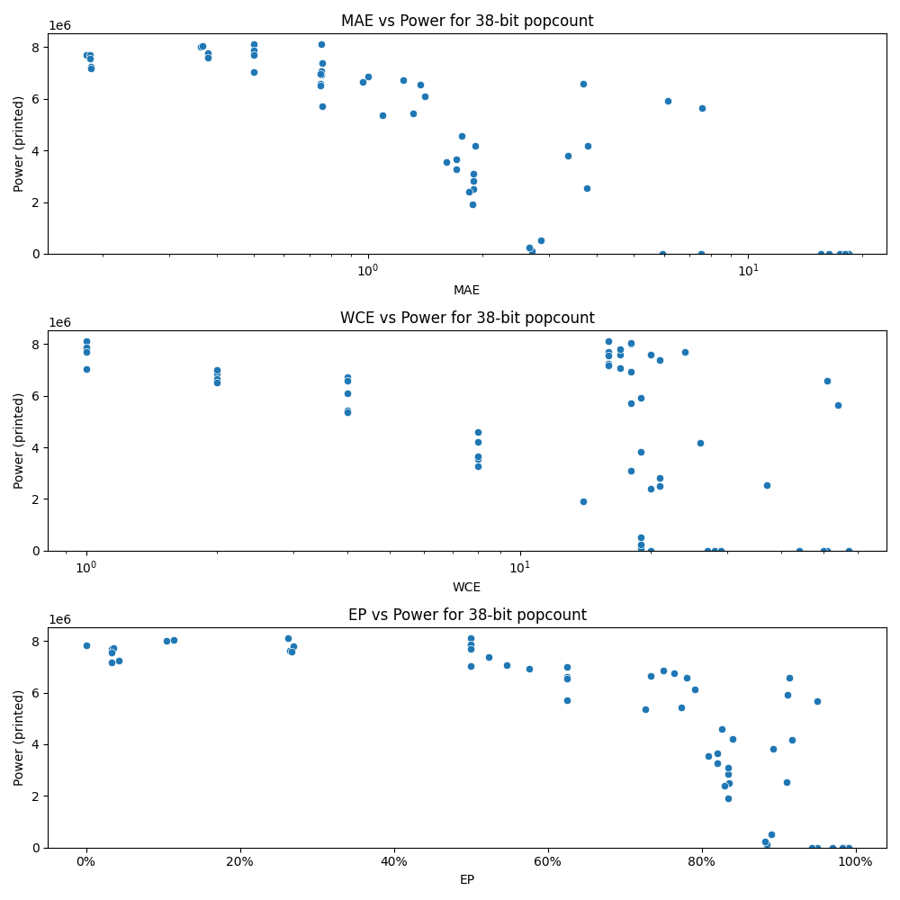

# Generated 38 bit popcount circuit
- __Circuit__: popcount (38 bit to 6.0 bit)

## Parameters of selected circuit
| Circuit         |       MAE |   WCE |        EP |        Area |           Power |       Delay | Download                                                               |
|:----------------|----------:|------:|----------:|------------:|----------------:|------------:|:-----------------------------------------------------------------------|
| popcount38_tt68 |  0.181036 |    24 | 0.0331683 | 1.36324e+08 |      7.6979e+06 | 9.19696e+07 | [v](popcount38_tt68.v) [c](popcount38_tt68.c) [py](popcount38_tt68.py) |
| popcount38_ub94 |  0.185191 |    16 | 0.0357515 | 1.34919e+08 |      7.7123e+06 | 9.10451e+07 | [v](popcount38_ub94.v) [c](popcount38_ub94.c) [py](popcount38_ub94.py) |
| popcount38_gkiu |  0.186467 |    16 | 0.0423129 | 1.28912e+08 |      7.2381e+06 | 8.19125e+07 | [v](popcount38_gkiu.v) [c](popcount38_gkiu.c) [py](popcount38_gkiu.py) |
| popcount38_wv1a |  0.185395 |    16 | 0.0338713 | 1.34509e+08 |      7.565e+06  | 8.54661e+07 | [v](popcount38_wv1a.v) [c](popcount38_wv1a.c) [py](popcount38_wv1a.py) |
| popcount38_wib2 |  0.18637  |    16 | 0.0330064 | 1.31921e+08 |      7.1773e+06 | 8.54221e+07 | [v](popcount38_wib2.v) [c](popcount38_wib2.c) [py](popcount38_wib2.py) |
| popcount38_ihnh |  0.363493 |    18 | 0.105005  | 1.30044e+08 |      8.0116e+06 | 8.81475e+07 | [v](popcount38_ihnh.v) [c](popcount38_ihnh.c) [py](popcount38_ihnh.py) |
| popcount38_93nb |  0.379536 |    17 | 0.265389  | 1.29699e+08 |      7.6089e+06 | 9.10015e+07 | [v](popcount38_93nb.v) [c](popcount38_93nb.c) [py](popcount38_93nb.py) |
| popcount38_pay4 |  0.379351 |    17 | 0.269079  | 1.31044e+08 |      7.7881e+06 | 8.42976e+07 | [v](popcount38_pay4.v) [c](popcount38_pay4.c) [py](popcount38_pay4.py) |
| popcount38_vdvv |  0.367569 |    18 | 0.113834  | 1.28751e+08 |      8.0387e+06 | 8.66972e+07 | [v](popcount38_vdvv.v) [c](popcount38_vdvv.c) [py](popcount38_vdvv.py) |
| popcount38_utrz |  0.378278 |    20 | 0.266696  | 1.33072e+08 |      7.5878e+06 | 8.55282e+07 | [v](popcount38_utrz.v) [c](popcount38_utrz.c) [py](popcount38_utrz.py) |
| popcount38_gzk6 |  0.759368 |    21 | 0.523792  | 1.29452e+08 |      7.3956e+06 | 8.71484e+07 | [v](popcount38_gzk6.v) [c](popcount38_gzk6.c) [py](popcount38_gzk6.py) |
| popcount38_izoy |  0.752991 |    18 | 0.575416  | 1.27458e+08 |      6.935e+06  | 8.69644e+07 | [v](popcount38_izoy.v) [c](popcount38_izoy.c) [py](popcount38_izoy.py) |
| popcount38_tp3i |  0.755403 |    17 | 0.546449  | 1.24592e+08 |      7.0738e+06 | 8.66031e+07 | [v](popcount38_tp3i.v) [c](popcount38_tp3i.c) [py](popcount38_tp3i.py) |
| popcount38_xf2e |  0.756909 |    18 | 0.625195  | 1.26891e+08 |      5.7014e+06 | 8.45385e+07 | [v](popcount38_xf2e.v) [c](popcount38_xf2e.c) [py](popcount38_xf2e.py) |
| popcount38_h3zg |  0.755051 |    16 | 0.262039  | 1.27902e+08 |      8.1205e+06 | 8.65245e+07 | [v](popcount38_h3zg.v) [c](popcount38_h3zg.c) [py](popcount38_h3zg.py) |
| popcount38_k8p1 |  1.89248  |    21 | 0.833912  | 5.94881e+07 |      2.8315e+06 | 7.43312e+07 | [v](popcount38_k8p1.v) [c](popcount38_k8p1.c) [py](popcount38_k8p1.py) |
| popcount38_wm2a |  1.8865   |    14 | 0.834608  | 3.67766e+07 |      1.919e+06  | 6.48811e+07 | [v](popcount38_wm2a.v) [c](popcount38_wm2a.c) [py](popcount38_wm2a.py) |
| popcount38_debw |  1.89695  |    21 | 0.835582  | 5.22163e+07 |      2.4949e+06 | 7.046e+07   | [v](popcount38_debw.v) [c](popcount38_debw.c) [py](popcount38_debw.py) |
| popcount38_u38d |  1.88865  |    18 | 0.834026  | 6.24112e+07 |      3.0929e+06 | 6.96845e+07 | [v](popcount38_u38d.v) [c](popcount38_u38d.c) [py](popcount38_u38d.py) |
| popcount38_akwm |  1.84587  |    20 | 0.830224  | 4.58196e+07 |      2.4104e+06 | 7.73413e+07 | [v](popcount38_akwm.v) [c](popcount38_akwm.c) [py](popcount38_akwm.py) |
| popcount38_d0i1 |  2.70029  |    20 | 0.884273  | 0           |      0          | 0           | [v](popcount38_d0i1.v) [c](popcount38_d0i1.c) [py](popcount38_d0i1.py) |
| popcount38_wib1 |  3.79412  |    26 | 0.916851  | 9.53033e+07 |      4.1893e+06 | 8.14175e+07 | [v](popcount38_wib1.v) [c](popcount38_wib1.c) [py](popcount38_wib1.py) |
| popcount38_b7kd |  3.77172  |    37 | 0.91049   | 6.20384e+07 |      2.536e+06  | 7.10308e+07 | [v](popcount38_b7kd.v) [c](popcount38_b7kd.c) [py](popcount38_b7kd.py) |
| popcount38_ks77 |  3.67226  |    51 | 0.913704  | 1.2052e+08  |      6.5732e+06 | 1.0379e+08  | [v](popcount38_ks77.v) [c](popcount38_ks77.c) [py](popcount38_ks77.py) |
| popcount38_030e |  7.53964  |    28 | 0.986587  | 0           |      0          | 0           | [v](popcount38_030e.v) [c](popcount38_030e.c) [py](popcount38_030e.py) |
| popcount38_bt0q |  7.52363  |    27 | 0.990208  | 0           |      0          | 0           | [v](popcount38_bt0q.v) [c](popcount38_bt0q.c) [py](popcount38_bt0q.py) |
| popcount38_pz4x |  5.94958  |    29 | 0.950328  | 0           |      0          | 0           | [v](popcount38_pz4x.v) [c](popcount38_pz4x.c) [py](popcount38_pz4x.py) |
| popcount38_694u |  7.54393  |    54 | 0.950232  | 1.00547e+08 |      5.6564e+06 | 8.72746e+07 | [v](popcount38_694u.v) [c](popcount38_694u.c) [py](popcount38_694u.py) |
| popcount38_82o8 | 18.3595   |    57 | 0.984282  | 0           |      0          | 0           | [v](popcount38_82o8.v) [c](popcount38_82o8.c) [py](popcount38_82o8.py) |
| popcount38_1bs7 | 17.3797   |    51 | 0.943353  | 0           |      0          | 0           | [v](popcount38_1bs7.v) [c](popcount38_1bs7.c) [py](popcount38_1bs7.py) |
| popcount38_mlfx | 15.5291   |    44 | 0.990669  | 0           |      0          | 0           | [v](popcount38_mlfx.v) [c](popcount38_mlfx.c) [py](popcount38_mlfx.py) |
| popcount38_hhr0 | 17.9675   |    57 | 0.983339  | 0           |      0          | 0           | [v](popcount38_hhr0.v) [c](popcount38_hhr0.c) [py](popcount38_hhr0.py) |
| popcount38_75jl | 16.2853   |    50 | 0.97046   | 0           |      0          | 0           | [v](popcount38_75jl.v) [c](popcount38_75jl.c) [py](popcount38_75jl.py) |
| popcount38_k4fi |  0        |     0 | 0         | 1.49088e+08 |      7.8316e+06 | 8.79496e+07 | [v](popcount38_k4fi.v) [c](popcount38_k4fi.c) [py](popcount38_k4fi.py) |
| popcount38_9tk3 |  0.5      |     1 | 0.5       | 1.47505e+08 |      7.8267e+06 | 9.3033e+07  | [v](popcount38_9tk3.v) [c](popcount38_9tk3.c) [py](popcount38_9tk3.py) |
| popcount38_phtl |  0.5      |     1 | 0.5       | 1.43687e+08 |      8.1049e+06 | 9.46375e+07 | [v](popcount38_phtl.v) [c](popcount38_phtl.c) [py](popcount38_phtl.py) |
| popcount38_m2w9 |  0.5      |     1 | 0.5       | 1.41024e+08 |      7.0356e+06 | 9.01445e+07 | [v](popcount38_m2w9.v) [c](popcount38_m2w9.c) [py](popcount38_m2w9.py) |
| popcount38_37j1 |  0.5      |     1 | 0.5       | 1.44318e+08 |      7.8806e+06 | 9.36922e+07 | [v](popcount38_37j1.v) [c](popcount38_37j1.c) [py](popcount38_37j1.py) |
| popcount38_ugp6 |  0.5      |     1 | 0.5       | 1.40795e+08 |      7.7004e+06 | 9.29961e+07 | [v](popcount38_ugp6.v) [c](popcount38_ugp6.c) [py](popcount38_ugp6.py) |
| popcount38_etz9 |  0.75     |     2 | 0.625     | 1.27292e+08 |      6.6032e+06 | 9.2377e+07  | [v](popcount38_etz9.v) [c](popcount38_etz9.c) [py](popcount38_etz9.py) |
| popcount38_7c31 |  1        |     2 | 0.750001  | 1.39564e+08 |      6.8493e+06 | 9.01084e+07 | [v](popcount38_7c31.v) [c](popcount38_7c31.c) [py](popcount38_7c31.py) |
| popcount38_w58p |  0.75     |     2 | 0.625     | 1.33053e+08 |      6.9839e+06 | 9.5334e+07  | [v](popcount38_w58p.v) [c](popcount38_w58p.c) [py](popcount38_w58p.py) |
| popcount38_bsi7 |  0.96875  |     2 | 0.734375  | 1.30235e+08 |      6.6443e+06 | 8.90116e+07 | [v](popcount38_bsi7.v) [c](popcount38_bsi7.c) [py](popcount38_bsi7.py) |
| popcount38_ugnu |  0.75     |     2 | 0.625     | 1.30303e+08 |      6.5271e+06 | 9.21444e+07 | [v](popcount38_ugnu.v) [c](popcount38_ugnu.c) [py](popcount38_ugnu.py) |
| popcount38_b26p |  1.23438  |     4 | 0.763672  | 1.1799e+08  |      6.7344e+06 | 9.89586e+07 | [v](popcount38_b26p.v) [c](popcount38_b26p.c) [py](popcount38_b26p.py) |
| popcount38_f5et |  1.37421  |     4 | 0.781113  | 1.25304e+08 |      6.5688e+06 | 9.47542e+07 | [v](popcount38_f5et.v) [c](popcount38_f5et.c) [py](popcount38_f5et.py) |
| popcount38_okvr |  1.3125   |     4 | 0.773438  | 1.15562e+08 |      5.4284e+06 | 8.98057e+07 | [v](popcount38_okvr.v) [c](popcount38_okvr.c) [py](popcount38_okvr.py) |
| popcount38_itev |  1.09375  |     4 | 0.726562  | 1.06572e+08 |      5.3626e+06 | 9.04105e+07 | [v](popcount38_itev.v) [c](popcount38_itev.c) [py](popcount38_itev.py) |
| popcount38_z1hm |  1.41406  |     4 | 0.791016  | 1.26674e+08 |      6.1082e+06 | 9.39963e+07 | [v](popcount38_z1hm.v) [c](popcount38_z1hm.c) [py](popcount38_z1hm.py) |
| popcount38_20ky |  1.7626   |     8 | 0.825882  | 8.35308e+07 |      4.5801e+06 | 8.82232e+07 | [v](popcount38_20ky.v) [c](popcount38_20ky.c) [py](popcount38_20ky.py) |
| popcount38_j2g7 |  1.61026  |     8 | 0.808505  | 6.36394e+07 |      3.5539e+06 | 7.98959e+07 | [v](popcount38_j2g7.v) [c](popcount38_j2g7.c) [py](popcount38_j2g7.py) |
| popcount38_b8xx |  1.70607  |     8 | 0.819893  | 7.74654e+07 |      3.6457e+06 | 7.89945e+07 | [v](popcount38_b8xx.v) [c](popcount38_b8xx.c) [py](popcount38_b8xx.py) |
| popcount38_5cwm |  1.70669  |     8 | 0.820683  | 6.49073e+07 |      3.2649e+06 | 9.64041e+07 | [v](popcount38_5cwm.v) [c](popcount38_5cwm.c) [py](popcount38_5cwm.py) |
| popcount38_qoio |  1.91853  |     8 | 0.840784  | 8.99246e+07 |      4.1982e+06 | 9.21071e+07 | [v](popcount38_qoio.v) [c](popcount38_qoio.c) [py](popcount38_qoio.py) |
| popcount38_2oru |  2.69524  |    19 | 0.884291  | 2.15106e+06 | 116290          | 6.78396e+06 | [v](popcount38_2oru.v) [c](popcount38_2oru.c) [py](popcount38_2oru.py) |
| popcount38_z7t9 |  2.84434  |    19 | 0.890559  | 1.49224e+07 | 526180          | 4.44159e+07 | [v](popcount38_z7t9.v) [c](popcount38_z7t9.c) [py](popcount38_z7t9.py) |
| popcount38_h9vn |  2.65305  |    19 | 0.881976  | 4.83057e+06 | 251410          | 1.56886e+07 | [v](popcount38_h9vn.v) [c](popcount38_h9vn.c) [py](popcount38_h9vn.py) |
| popcount38_kbnc |  6.135    |    19 | 0.911787  | 1.07669e+08 |      5.9176e+06 | 7.89486e+07 | [v](popcount38_kbnc.v) [c](popcount38_kbnc.c) [py](popcount38_kbnc.py) |
| popcount38_sjm1 |  3.35385  |    19 | 0.892489  | 7.80586e+07 |      3.8121e+06 | 8.84916e+07 | [v](popcount38_sjm1.v) [c](popcount38_sjm1.c) [py](popcount38_sjm1.py) |

## Parameters 
