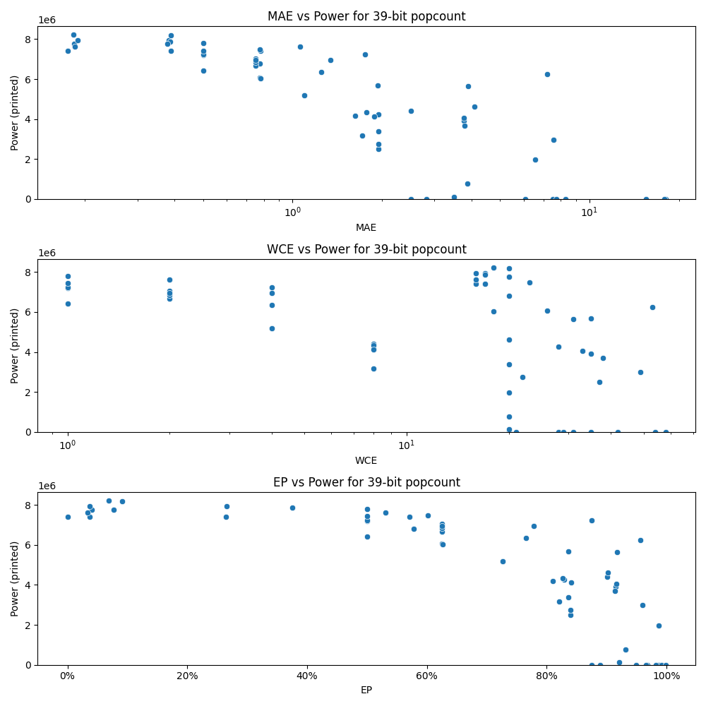

# Generated 39 bit popcount circuit
- __Circuit__: popcount (39 bit to 6.0 bit)

## Parameters of selected circuit
| Circuit         |       MAE |   WCE |        EP |        Area |           Power |       Delay | Download                                                               |
|:----------------|----------:|------:|----------:|------------:|----------------:|------------:|:-----------------------------------------------------------------------|
| popcount39_xi02 |  0.184179 |    20 | 0.0401233 | 1.42837e+08 |      7.7748e+06 | 8.80028e+07 | [v](popcount39_xi02.v) [c](popcount39_xi02.c) [py](popcount39_xi02.py) |
| popcount39_yo7q |  0.189038 |    16 | 0.0367942 | 1.39542e+08 |      7.9487e+06 | 8.68124e+07 | [v](popcount39_yo7q.v) [c](popcount39_yo7q.c) [py](popcount39_yo7q.py) |
| popcount39_k5py |  0.174469 |    16 | 0.0371153 | 1.40162e+08 |      7.4078e+06 | 8.71984e+07 | [v](popcount39_k5py.v) [c](popcount39_k5py.c) [py](popcount39_k5py.py) |
| popcount39_iuli |  0.185255 |    16 | 0.033767  | 1.40199e+08 |      7.6172e+06 | 8.58267e+07 | [v](popcount39_iuli.v) [c](popcount39_iuli.c) [py](popcount39_iuli.py) |
| popcount39_w46l |  0.182575 |    18 | 0.0692303 | 1.43439e+08 |      8.2264e+06 | 8.55938e+07 | [v](popcount39_w46l.v) [c](popcount39_w46l.c) [py](popcount39_w46l.py) |
| popcount39_w0s3 |  0.382444 |    17 | 0.266021  | 1.36577e+08 |      7.934e+06  | 8.62013e+07 | [v](popcount39_w0s3.v) [c](popcount39_w0s3.c) [py](popcount39_w0s3.py) |
| popcount39_94te |  0.386724 |    17 | 0.375505  | 1.46181e+08 |      7.8584e+06 | 9.48069e+07 | [v](popcount39_94te.v) [c](popcount39_94te.c) [py](popcount39_94te.py) |
| popcount39_jb10 |  0.378858 |    20 | 0.0773607 | 1.34757e+08 |      7.7524e+06 | 9.32006e+07 | [v](popcount39_jb10.v) [c](popcount39_jb10.c) [py](popcount39_jb10.py) |
| popcount39_gw4o |  0.389562 |    20 | 0.0911275 | 1.35715e+08 |      8.1799e+06 | 8.81104e+07 | [v](popcount39_gw4o.v) [c](popcount39_gw4o.c) [py](popcount39_gw4o.py) |
| popcount39_eiym |  0.389383 |    17 | 0.26512   | 1.33956e+08 |      7.4083e+06 | 8.80646e+07 | [v](popcount39_eiym.v) [c](popcount39_eiym.c) [py](popcount39_eiym.py) |
| popcount39_4jts |  0.777978 |    17 | 0.570823  | 1.28178e+08 |      7.4134e+06 | 8.43387e+07 | [v](popcount39_4jts.v) [c](popcount39_4jts.c) [py](popcount39_4jts.py) |
| popcount39_uiu8 |  0.776554 |    26 | 0.62572   | 1.29586e+08 |      6.0793e+06 | 8.3263e+07  | [v](popcount39_uiu8.v) [c](popcount39_uiu8.c) [py](popcount39_uiu8.py) |
| popcount39_9v8p |  0.77367  |    23 | 0.601554  | 1.38041e+08 |      7.4738e+06 | 8.8119e+07  | [v](popcount39_9v8p.v) [c](popcount39_9v8p.c) [py](popcount39_9v8p.py) |
| popcount39_ds6c |  0.778042 |    18 | 0.626281  | 1.30201e+08 |      6.0231e+06 | 8.48238e+07 | [v](popcount39_ds6c.v) [c](popcount39_ds6c.c) [py](popcount39_ds6c.py) |
| popcount39_xape |  0.774802 |    20 | 0.578328  | 1.28141e+08 |      6.7919e+06 | 8.52061e+07 | [v](popcount39_xape.v) [c](popcount39_xape.c) [py](popcount39_xape.py) |
| popcount39_kk0n |  1.94828  |    28 | 0.829205  | 8.34897e+07 |      4.2493e+06 | 7.98757e+07 | [v](popcount39_kk0n.v) [c](popcount39_kk0n.c) [py](popcount39_kk0n.py) |
| popcount39_zu7a |  1.93661  |    35 | 0.836007  | 1.05127e+08 |      5.6848e+06 | 1.07509e+08 | [v](popcount39_zu7a.v) [c](popcount39_zu7a.c) [py](popcount39_zu7a.py) |
| popcount39_upex |  1.94109  |    37 | 0.839598  | 5.08183e+07 |      2.5123e+06 | 7.61432e+07 | [v](popcount39_upex.v) [c](popcount39_upex.c) [py](popcount39_upex.py) |
| popcount39_wtue |  1.94951  |    20 | 0.836311  | 6.00001e+07 |      3.3783e+06 | 7.4411e+07  | [v](popcount39_wtue.v) [c](popcount39_wtue.c) [py](popcount39_wtue.py) |
| popcount39_rr27 |  1.94451  |    22 | 0.839381  | 5.14533e+07 |      2.7516e+06 | 7.0746e+07  | [v](popcount39_rr27.v) [c](popcount39_rr27.c) [py](popcount39_rr27.py) |
| popcount39_ia07 |  2.81602  |    21 | 0.888866  | 0           |      0          | 0           | [v](popcount39_ia07.v) [c](popcount39_ia07.c) [py](popcount39_ia07.py) |
| popcount39_8ylc |  3.78293  |    35 | 0.915502  | 7.49364e+07 |      3.9064e+06 | 7.37354e+07 | [v](popcount39_8ylc.v) [c](popcount39_8ylc.c) [py](popcount39_8ylc.py) |
| popcount39_0cj9 |  3.78101  |    33 | 0.916309  | 8.3401e+07  |      4.0588e+06 | 8.81798e+07 | [v](popcount39_0cj9.v) [c](popcount39_0cj9.c) [py](popcount39_0cj9.py) |
| popcount39_gdnl |  3.78423  |    38 | 0.913752  | 7.84229e+07 |      3.6884e+06 | 8.03856e+07 | [v](popcount39_gdnl.v) [c](popcount39_gdnl.c) [py](popcount39_gdnl.py) |
| popcount39_pb95 |  3.89871  |    31 | 0.917448  | 1.13442e+08 |      5.6378e+06 | 8.07489e+07 | [v](popcount39_pb95.v) [c](popcount39_pb95.c) [py](popcount39_pb95.py) |
| popcount39_7upc |  7.53964  |    28 | 0.986587  | 0           |      0          | 0           | [v](popcount39_7upc.v) [c](popcount39_7upc.c) [py](popcount39_7upc.py) |
| popcount39_lhas |  6.07986  |    29 | 0.949195  | 0           |      0          | 0           | [v](popcount39_lhas.v) [c](popcount39_lhas.c) [py](popcount39_lhas.py) |
| popcount39_35p6 |  7.5492   |    49 | 0.960076  | 7.05877e+07 |      2.98e+06   | 7.02815e+07 | [v](popcount39_35p6.v) [c](popcount39_35p6.c) [py](popcount39_35p6.py) |
| popcount39_m5xf |  7.73467  |    31 | 0.968517  | 0           |      0          | 0           | [v](popcount39_m5xf.v) [c](popcount39_m5xf.c) [py](popcount39_m5xf.py) |
| popcount39_wu9u |  7.2088   |    53 | 0.956933  | 1.17068e+08 |      6.2448e+06 | 9.23809e+07 | [v](popcount39_wu9u.v) [c](popcount39_wu9u.c) [py](popcount39_wu9u.py) |
| popcount39_go6i |  8.31678  |    35 | 0.965255  | 0           |      0          | 0           | [v](popcount39_go6i.v) [c](popcount39_go6i.c) [py](popcount39_go6i.py) |
| popcount39_flsk | 18.0278   |    54 | 0.991483  | 0           |      0          | 0           | [v](popcount39_flsk.v) [c](popcount39_flsk.c) [py](popcount39_flsk.py) |
| popcount39_fd46 | 17.9084   |    58 | 0.982627  | 0           |      0          | 0           | [v](popcount39_fd46.v) [c](popcount39_fd46.c) [py](popcount39_fd46.py) |
| popcount39_v8o5 | 15.5032   |    42 | 0.998396  | 0           |      0          | 0           | [v](popcount39_v8o5.v) [c](popcount39_v8o5.c) [py](popcount39_v8o5.py) |
| popcount39_ip7f |  0        |     0 | 0         | 1.5269e+08  |      7.3892e+06 | 9.02622e+07 | [v](popcount39_ip7f.v) [c](popcount39_ip7f.c) [py](popcount39_ip7f.py) |
| popcount39_rjck |  0.5      |     1 | 0.5       | 1.44957e+08 |      7.1964e+06 | 8.87059e+07 | [v](popcount39_rjck.v) [c](popcount39_rjck.c) [py](popcount39_rjck.py) |
| popcount39_ooqy |  0.5      |     1 | 0.5       | 1.42786e+08 |      7.2245e+06 | 8.98559e+07 | [v](popcount39_ooqy.v) [c](popcount39_ooqy.c) [py](popcount39_ooqy.py) |
| popcount39_03ax |  0.5      |     1 | 0.5       | 1.45114e+08 |      7.7896e+06 | 9.27577e+07 | [v](popcount39_03ax.v) [c](popcount39_03ax.c) [py](popcount39_03ax.py) |
| popcount39_g7le |  0.5      |     1 | 0.5       | 1.47109e+08 |      7.4314e+06 | 8.87428e+07 | [v](popcount39_g7le.v) [c](popcount39_g7le.c) [py](popcount39_g7le.py) |
| popcount39_vodx |  0.5      |     1 | 0.5       | 1.44259e+08 |      6.4285e+06 | 8.99226e+07 | [v](popcount39_vodx.v) [c](popcount39_vodx.c) [py](popcount39_vodx.py) |
| popcount39_mqtc |  0.75     |     2 | 0.625     | 1.3507e+08  |      7.0392e+06 | 8.94435e+07 | [v](popcount39_mqtc.v) [c](popcount39_mqtc.c) [py](popcount39_mqtc.py) |
| popcount39_59c2 |  1.0625   |     2 | 0.53125   | 1.4232e+08  |      7.6083e+06 | 8.82947e+07 | [v](popcount39_59c2.v) [c](popcount39_59c2.c) [py](popcount39_59c2.py) |
| popcount39_uukw |  0.75     |     2 | 0.625     | 1.353e+08   |      6.6563e+06 | 8.94331e+07 | [v](popcount39_uukw.v) [c](popcount39_uukw.c) [py](popcount39_uukw.py) |
| popcount39_n9ae |  0.75     |     2 | 0.625     | 1.34355e+08 |      6.8432e+06 | 8.98065e+07 | [v](popcount39_n9ae.v) [c](popcount39_n9ae.c) [py](popcount39_n9ae.py) |
| popcount39_o6dm |  0.75     |     2 | 0.625     | 1.41299e+08 |      6.9537e+06 | 8.80522e+07 | [v](popcount39_o6dm.v) [c](popcount39_o6dm.c) [py](popcount39_o6dm.py) |
| popcount39_e435 |  1.09375  |     4 | 0.726562  | 1.15864e+08 |      5.1905e+06 | 8.79992e+07 | [v](popcount39_e435.v) [c](popcount39_e435.c) [py](popcount39_e435.py) |
| popcount39_8aoa |  1.09375  |     4 | 0.726562  | 1.16035e+08 |      5.1795e+06 | 8.99498e+07 | [v](popcount39_8aoa.v) [c](popcount39_8aoa.c) [py](popcount39_8aoa.py) |
| popcount39_o447 |  1.3418   |     4 | 0.778809  | 1.21029e+08 |      6.9572e+06 | 8.98359e+07 | [v](popcount39_o447.v) [c](popcount39_o447.c) [py](popcount39_o447.py) |
| popcount39_527v |  1.75098  |     4 | 0.874512  | 1.35273e+08 |      7.2391e+06 | 9.09641e+07 | [v](popcount39_527v.v) [c](popcount39_527v.c) [py](popcount39_527v.py) |
| popcount39_81t2 |  1.24976  |     4 | 0.765594  | 1.30422e+08 |      6.3541e+06 | 9.2187e+07  | [v](popcount39_81t2.v) [c](popcount39_81t2.c) [py](popcount39_81t2.py) |
| popcount39_erfq |  2.49805  |     8 | 0.901262  | 8.99219e+07 |      4.4112e+06 | 8.79677e+07 | [v](popcount39_erfq.v) [c](popcount39_erfq.c) [py](popcount39_erfq.py) |
| popcount39_86qe |  1.62341  |     8 | 0.810165  | 8.11007e+07 |      4.1753e+06 | 8.88792e+07 | [v](popcount39_86qe.v) [c](popcount39_86qe.c) [py](popcount39_86qe.py) |
| popcount39_4u5j |  1.77246  |     8 | 0.826782  | 9.17399e+07 |      4.3433e+06 | 8.74623e+07 | [v](popcount39_4u5j.v) [c](popcount39_4u5j.c) [py](popcount39_4u5j.py) |
| popcount39_z85g |  1.87868  |     8 | 0.840396  | 7.85066e+07 |      4.1304e+06 | 7.53071e+07 | [v](popcount39_z85g.v) [c](popcount39_z85g.c) [py](popcount39_z85g.py) |
| popcount39_gtkj |  1.71863  |     8 | 0.820573  | 6.81542e+07 |      3.1663e+06 | 8.70383e+07 | [v](popcount39_gtkj.v) [c](popcount39_gtkj.c) [py](popcount39_gtkj.py) |
| popcount39_ee7v |  2.50741  |    20 | 0.874629  | 0           |      0          | 0           | [v](popcount39_ee7v.v) [c](popcount39_ee7v.c) [py](popcount39_ee7v.py) |
| popcount39_8ad7 |  3.50348  |    20 | 0.921015  | 3.68461e+06 | 121440          | 1.07598e+07 | [v](popcount39_8ad7.v) [c](popcount39_8ad7.c) [py](popcount39_8ad7.py) |
| popcount39_je9w |  3.88739  |    20 | 0.93127   | 1.90689e+07 | 783400          | 4.02255e+07 | [v](popcount39_je9w.v) [c](popcount39_je9w.c) [py](popcount39_je9w.py) |
| popcount39_ub2f |  6.55435  |    20 | 0.98678   | 4.62539e+07 |      1.9816e+06 | 8.42904e+07 | [v](popcount39_ub2f.v) [c](popcount39_ub2f.c) [py](popcount39_ub2f.py) |
| popcount39_fsy6 |  4.09155  |    20 | 0.902716  | 9.55093e+07 |      4.6076e+06 | 8.25443e+07 | [v](popcount39_fsy6.v) [c](popcount39_fsy6.c) [py](popcount39_fsy6.py) |

## Parameters 
