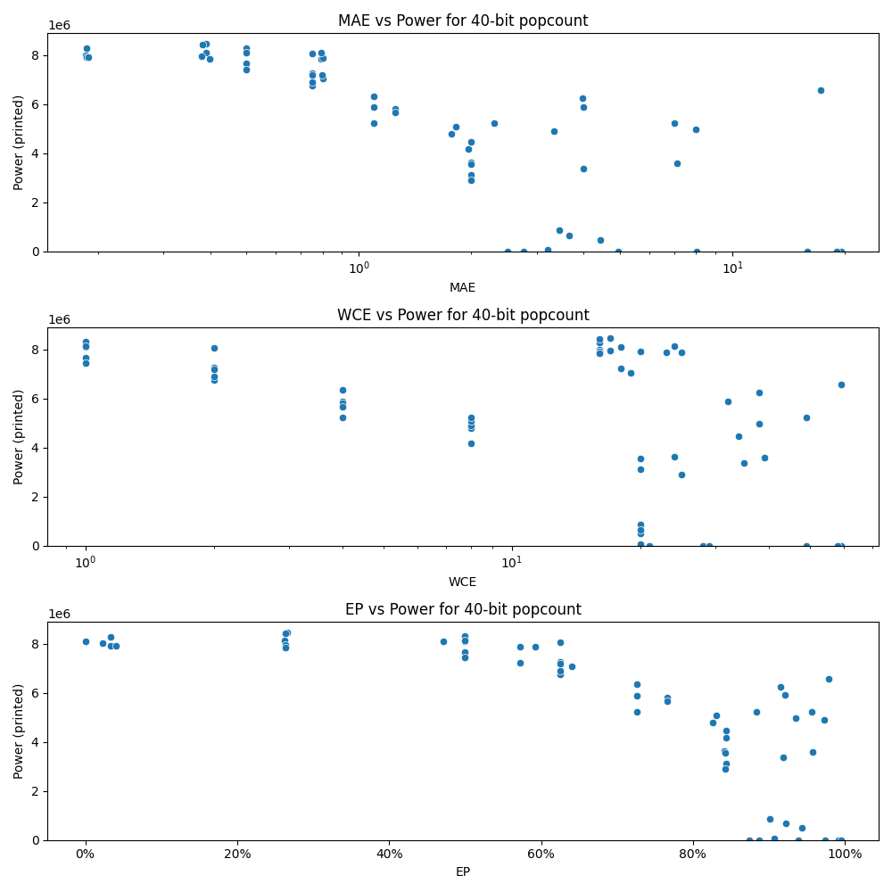

# Generated 40 bit popcount circuit
- __Circuit__: popcount (40 bit to 6.0 bit)

## Parameters of selected circuit
| Circuit         |       MAE |   WCE |        EP |             Area |           Power |            Delay | Download                                                               |
|:----------------|----------:|------:|----------:|-----------------:|----------------:|-----------------:|:-----------------------------------------------------------------------|
| popcount40_cli0 |  0.186669 |    16 | 0.0329652 |      1.44331e+08 |      7.9169e+06 |      8.65631e+07 | [v](popcount40_cli0.v) [c](popcount40_cli0.c) [py](popcount40_cli0.py) |
| popcount40_oqqg |  0.185044 |    16 | 0.0230956 |      1.46374e+08 |      8.0068e+06 |      9.40062e+07 | [v](popcount40_oqqg.v) [c](popcount40_oqqg.c) [py](popcount40_oqqg.py) |
| popcount40_9vez |  0.186669 |    16 | 0.0329652 |      1.44331e+08 |      7.917e+06  |      8.82002e+07 | [v](popcount40_9vez.v) [c](popcount40_9vez.c) [py](popcount40_9vez.py) |
| popcount40_gkxe |  0.18635  |    16 | 0.0329154 |      1.46529e+08 |      8.2819e+06 |      8.70567e+07 | [v](popcount40_gkxe.v) [c](popcount40_gkxe.c) [py](popcount40_gkxe.py) |
| popcount40_93p5 |  0.188654 |    20 | 0.0408075 |      1.45624e+08 |      7.9263e+06 |      8.65559e+07 | [v](popcount40_93p5.v) [c](popcount40_93p5.c) [py](popcount40_93p5.py) |
| popcount40_o9qy |  0.39075  |    24 | 0.262801  |      1.50193e+08 |      8.1205e+06 |      9.01855e+07 | [v](popcount40_o9qy.v) [c](popcount40_o9qy.c) [py](popcount40_o9qy.py) |
| popcount40_gx8x |  0.38906  |    17 | 0.266092  |      1.40122e+08 |      8.471e+06  |      8.99356e+07 | [v](popcount40_gx8x.v) [c](popcount40_gx8x.c) [py](popcount40_gx8x.py) |
| popcount40_ts1k |  0.379863 |    17 | 0.263432  |      1.42146e+08 |      7.9501e+06 |      8.70091e+07 | [v](popcount40_ts1k.v) [c](popcount40_ts1k.c) [py](popcount40_ts1k.py) |
| popcount40_uaye |  0.382037 |    16 | 0.263021  |      1.44146e+08 |      8.4335e+06 |      9.15254e+07 | [v](popcount40_uaye.v) [c](popcount40_uaye.c) [py](popcount40_uaye.py) |
| popcount40_jzqs |  0.398843 |    16 | 0.26416   |      1.43137e+08 |      7.8484e+06 |      8.61443e+07 | [v](popcount40_jzqs.v) [c](popcount40_jzqs.c) [py](popcount40_jzqs.py) |
| popcount40_riym |  0.799729 |    19 | 0.640678  |      1.38337e+08 |      7.0642e+06 |      9.2049e+07  | [v](popcount40_riym.v) [c](popcount40_riym.c) [py](popcount40_riym.py) |
| popcount40_6wsf |  0.790949 |    23 | 0.572656  |      1.3535e+08  |      7.8696e+06 |      8.47352e+07 | [v](popcount40_6wsf.v) [c](popcount40_6wsf.c) [py](popcount40_6wsf.py) |
| popcount40_tvun |  0.799458 |    25 | 0.592546  |      1.3968e+08  |      7.8768e+06 |      9.05926e+07 | [v](popcount40_tvun.v) [c](popcount40_tvun.c) [py](popcount40_tvun.py) |
| popcount40_rmg6 |  0.79808  |    18 | 0.572877  |      1.40645e+08 |      7.2148e+06 |      8.87128e+07 | [v](popcount40_rmg6.v) [c](popcount40_rmg6.c) [py](popcount40_rmg6.py) |
| popcount40_sepb |  0.792817 |    18 | 0.471529  |      1.37813e+08 |      8.1108e+06 |      8.97218e+07 | [v](popcount40_sepb.v) [c](popcount40_sepb.c) [py](popcount40_sepb.py) |
| popcount40_axue |  1.99922  |    34 | 0.843196  |      9.4285e+07  |      4.4745e+06 |      9.12612e+07 | [v](popcount40_axue.v) [c](popcount40_axue.c) [py](popcount40_axue.py) |
| popcount40_rgw7 |  1.99745  |    24 | 0.841412  |      7.76645e+07 |      3.6248e+06 |      7.43602e+07 | [v](popcount40_rgw7.v) [c](popcount40_rgw7.c) [py](popcount40_rgw7.py) |
| popcount40_jl9s |  1.99787  |    20 | 0.843477  |      5.92741e+07 |      3.1139e+06 |      7.04442e+07 | [v](popcount40_jl9s.v) [c](popcount40_jl9s.c) [py](popcount40_jl9s.py) |
| popcount40_uh9e |  1.99751  |    25 | 0.8421    |      5.95297e+07 |      2.9043e+06 |      6.84977e+07 | [v](popcount40_uh9e.v) [c](popcount40_uh9e.c) [py](popcount40_uh9e.py) |
| popcount40_xehm |  1.99895  |    20 | 0.842421  |      7.887e+07   |      3.5691e+06 |      7.9434e+07  | [v](popcount40_xehm.v) [c](popcount40_xehm.c) [py](popcount40_xehm.py) |
| popcount40_w51f |  2.75816  |    21 | 0.886569  |      0           |      0          |      0           | [v](popcount40_w51f.v) [c](popcount40_w51f.c) [py](popcount40_w51f.py) |
| popcount40_xnsl |  3.99957  |    35 | 0.918159  |      7.63781e+07 |      3.3642e+06 |      6.86429e+07 | [v](popcount40_xnsl.v) [c](popcount40_xnsl.c) [py](popcount40_xnsl.py) |
| popcount40_4xnu |  3.98454  |    32 | 0.921461  |      1.07208e+08 |      5.9024e+06 |      8.69637e+07 | [v](popcount40_4xnu.v) [c](popcount40_4xnu.c) [py](popcount40_4xnu.py) |
| popcount40_q69v |  3.96091  |    38 | 0.914798  |      1.2604e+08  |      6.2596e+06 |      8.99871e+07 | [v](popcount40_q69v.v) [c](popcount40_q69v.c) [py](popcount40_q69v.py) |
| popcount40_os9u |  7.10056  |    39 | 0.957207  |      6.90829e+07 |      3.602e+06  |      7.58687e+07 | [v](popcount40_os9u.v) [c](popcount40_os9u.c) [py](popcount40_os9u.py) |
| popcount40_5o2k |  4.93621  |    28 | 0.939096  |      0           |      0          |      0           | [v](popcount40_5o2k.v) [c](popcount40_5o2k.c) [py](popcount40_5o2k.py) |
| popcount40_cpn6 |  7.96577  |    38 | 0.934735  |      9.83291e+07 |      4.9649e+06 |      8.78577e+07 | [v](popcount40_cpn6.v) [c](popcount40_cpn6.c) [py](popcount40_cpn6.py) |
| popcount40_9g9z |  6.99011  |    49 | 0.955767  |      9.85537e+07 |      5.2288e+06 |      9.68032e+07 | [v](popcount40_9g9z.v) [c](popcount40_9g9z.c) [py](popcount40_9g9z.py) |
| popcount40_ghhv | 19.5143   |    59 | 0.994645  |      0           |      0          |      0           | [v](popcount40_ghhv.v) [c](popcount40_ghhv.c) [py](popcount40_ghhv.py) |
| popcount40_2lt7 |  8.01972  |    29 | 0.992034  |      0           |      0          |      0           | [v](popcount40_2lt7.v) [c](popcount40_2lt7.c) [py](popcount40_2lt7.py) |
| popcount40_7oig | 19.0143   |    58 | 0.994645  |      0           |      0          |      0           | [v](popcount40_7oig.v) [c](popcount40_7oig.c) [py](popcount40_7oig.py) |
| popcount40_8d6x | 15.8579   |    49 | 0.973364  |      0           |      0          |      0           | [v](popcount40_8d6x.v) [c](popcount40_8d6x.c) [py](popcount40_8d6x.py) |
| popcount40_xn1f | 17.2629   |    59 | 0.978572  |      1.22971e+08 |      6.5881e+06 |      8.39649e+07 | [v](popcount40_xn1f.v) [c](popcount40_xn1f.c) [py](popcount40_xn1f.py) |
| popcount40_51ml |  0        |     0 | 0         |      1.55882e+08 |      8.0871e+06 |      9.1197e+07  | [v](popcount40_51ml.v) [c](popcount40_51ml.c) [py](popcount40_51ml.py) |
| popcount40_ijde |  0.5      |     1 | 0.5       |      1.58596e+08 |      8.1001e+06 |      8.94752e+07 | [v](popcount40_ijde.v) [c](popcount40_ijde.c) [py](popcount40_ijde.py) |
| popcount40_zsk8 |  0.5      |     1 | 0.5       |      1.50985e+08 |      8.3065e+06 |      9.2157e+07  | [v](popcount40_zsk8.v) [c](popcount40_zsk8.c) [py](popcount40_zsk8.py) |
| popcount40_ww80 |  0.5      |     1 | 0.5       |      1.56898e+08 |      7.67e+06   |      9.18647e+07 | [v](popcount40_ww80.v) [c](popcount40_ww80.c) [py](popcount40_ww80.py) |
| popcount40_sw77 |  0.5      |     1 | 0.5       |      1.52559e+08 |      8.1222e+06 |      9.48418e+07 | [v](popcount40_sw77.v) [c](popcount40_sw77.c) [py](popcount40_sw77.py) |
| popcount40_sbwh |  0.5      |     1 | 0.5       |      1.50389e+08 |      7.4302e+06 |      9.24886e+07 | [v](popcount40_sbwh.v) [c](popcount40_sbwh.c) [py](popcount40_sbwh.py) |
| popcount40_erka |  0.75     |     2 | 0.625     |      1.4287e+08  |      7.2601e+06 |      9.18495e+07 | [v](popcount40_erka.v) [c](popcount40_erka.c) [py](popcount40_erka.py) |
| popcount40_v4gb |  0.75     |     2 | 0.625     |      1.49257e+08 |      8.0689e+06 |      9.22174e+07 | [v](popcount40_v4gb.v) [c](popcount40_v4gb.c) [py](popcount40_v4gb.py) |
| popcount40_w5vr |  0.75     |     2 | 0.625     |      1.40721e+08 |      6.7544e+06 |      9.08764e+07 | [v](popcount40_w5vr.v) [c](popcount40_w5vr.c) [py](popcount40_w5vr.py) |
| popcount40_d3pk |  0.75     |     2 | 0.625     |      1.39231e+08 |      6.8901e+06 |      9.32492e+07 | [v](popcount40_d3pk.v) [c](popcount40_d3pk.c) [py](popcount40_d3pk.py) |
| popcount40_kvkv |  0.75     |     2 | 0.625     |      1.43193e+08 |      7.2007e+06 |      9.21256e+07 | [v](popcount40_kvkv.v) [c](popcount40_kvkv.c) [py](popcount40_kvkv.py) |
| popcount40_ruo9 |  1.09375  |     4 | 0.726562  |      1.18694e+08 |      5.897e+06  |      9.45919e+07 | [v](popcount40_ruo9.v) [c](popcount40_ruo9.c) [py](popcount40_ruo9.py) |
| popcount40_hxn6 |  1.25     |     4 | 0.765625  |      1.27487e+08 |      5.8214e+06 |      8.78143e+07 | [v](popcount40_hxn6.v) [c](popcount40_hxn6.c) [py](popcount40_hxn6.py) |
| popcount40_r5wt |  1.09375  |     4 | 0.726562  |      1.15456e+08 |      5.2217e+06 |      8.88004e+07 | [v](popcount40_r5wt.v) [c](popcount40_r5wt.c) [py](popcount40_r5wt.py) |
| popcount40_qa8c |  1.25     |     4 | 0.765625  |      1.19193e+08 |      5.6637e+06 |      9.03414e+07 | [v](popcount40_qa8c.v) [c](popcount40_qa8c.c) [py](popcount40_qa8c.py) |
| popcount40_raze |  1.09375  |     4 | 0.726562  |      1.21623e+08 |      6.339e+06  |      9.07967e+07 | [v](popcount40_raze.v) [c](popcount40_raze.c) [py](popcount40_raze.py) |
| popcount40_85e4 |  1.76875  |     8 | 0.826412  |      9.95028e+07 |      4.7937e+06 |      8.24162e+07 | [v](popcount40_85e4.v) [c](popcount40_85e4.c) [py](popcount40_85e4.py) |
| popcount40_ut3n |  1.96225  |     8 | 0.843794  |      9.53055e+07 |      4.1879e+06 |      8.99789e+07 | [v](popcount40_ut3n.v) [c](popcount40_ut3n.c) [py](popcount40_ut3n.py) |
| popcount40_3s2n |  3.32373  |     8 | 0.972534  |      1.05483e+08 |      4.915e+06  |      8.98667e+07 | [v](popcount40_3s2n.v) [c](popcount40_3s2n.c) [py](popcount40_3s2n.py) |
| popcount40_jq7e |  1.81677  |     8 | 0.830307  |      1.05995e+08 |      5.0874e+06 |      9.23003e+07 | [v](popcount40_jq7e.v) [c](popcount40_jq7e.c) [py](popcount40_jq7e.py) |
| popcount40_ksie |  2.29738  |     8 | 0.883144  |      9.55444e+07 |      5.2357e+06 |      8.55708e+07 | [v](popcount40_ksie.v) [c](popcount40_ksie.c) [py](popcount40_ksie.py) |
| popcount40_txyt |  2.50741  |    20 | 0.874629  | 228420           |    878.448      | 565707           | [v](popcount40_txyt.v) [c](popcount40_txyt.c) [py](popcount40_txyt.py) |
| popcount40_z9ld |  3.43729  |    20 | 0.901059  |      2.19663e+07 | 856670          |      2.84864e+07 | [v](popcount40_z9ld.v) [c](popcount40_z9ld.c) [py](popcount40_z9ld.py) |
| popcount40_kz6j |  4.42922  |    20 | 0.943987  |      1.21183e+07 | 485560          |      2.84911e+07 | [v](popcount40_kz6j.v) [c](popcount40_kz6j.c) [py](popcount40_kz6j.py) |
| popcount40_2dxt |  3.19788  |    20 | 0.907496  |      1.6388e+06  |  75843          |      3.35243e+06 | [v](popcount40_2dxt.v) [c](popcount40_2dxt.c) [py](popcount40_2dxt.py) |
| popcount40_yc3h |  3.65611  |    20 | 0.922597  |      1.5568e+07  | 666130          |      3.93932e+07 | [v](popcount40_yc3h.v) [c](popcount40_yc3h.c) [py](popcount40_yc3h.py) |

## Parameters 
