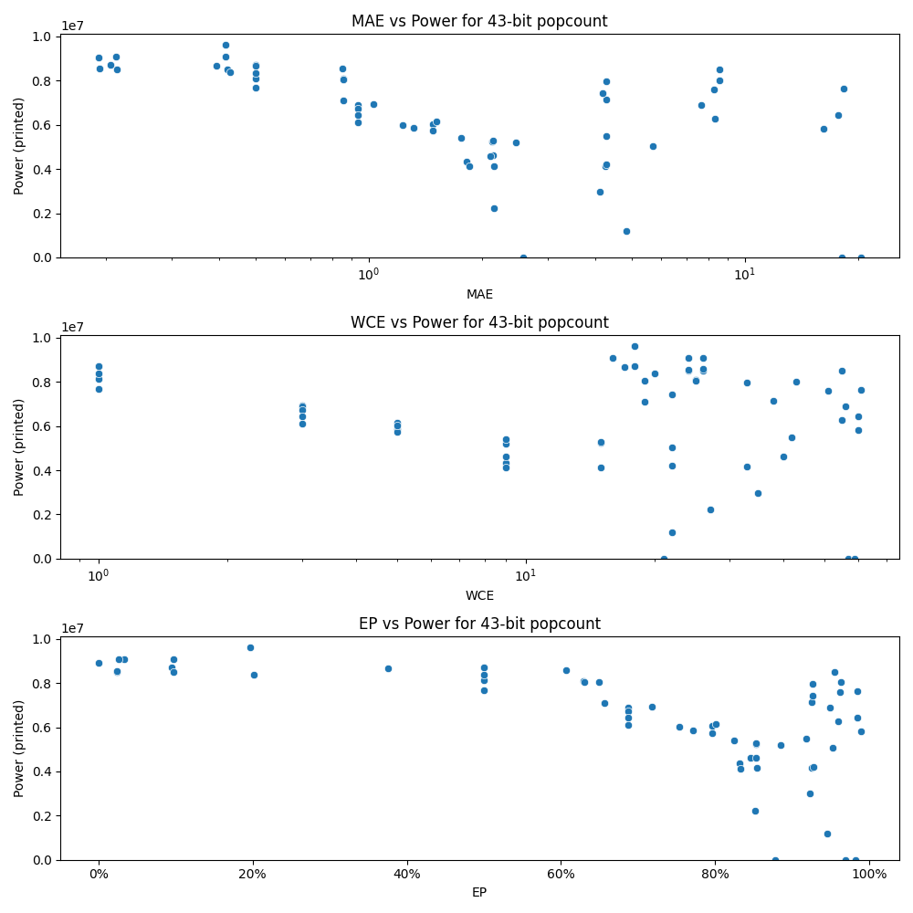

# Generated 43 bit popcount circuit
- __Circuit__: popcount (43 bit to 6.0 bit)

## Parameters of selected circuit
| Circuit         |       MAE |   WCE |        EP |        Area |      Power |       Delay | Download                                                               |
|:----------------|----------:|------:|----------:|------------:|-----------:|------------:|:-----------------------------------------------------------------------|
| popcount43_8a76 |  0.191561 |    24 | 0.0327942 | 1.53505e+08 | 9.064e+06  | 9.06078e+07 | [v](popcount43_8a76.v) [c](popcount43_8a76.c) [py](popcount43_8a76.py) |
| popcount43_fkb8 |  0.213743 |    24 | 0.0231812 | 1.51588e+08 | 8.4993e+06 | 8.76773e+07 | [v](popcount43_fkb8.v) [c](popcount43_fkb8.c) [py](popcount43_fkb8.py) |
| popcount43_ndly |  0.213038 |    16 | 0.0262114 | 1.5226e+08  | 9.0826e+06 | 8.76245e+07 | [v](popcount43_ndly.v) [c](popcount43_ndly.c) [py](popcount43_ndly.py) |
| popcount43_pcew |  0.205957 |    18 | 0.094877  | 1.56486e+08 | 8.718e+06  | 9.54275e+07 | [v](popcount43_pcew.v) [c](popcount43_pcew.c) [py](popcount43_pcew.py) |
| popcount43_1jih |  0.192784 |    24 | 0.0235275 | 1.50534e+08 | 8.557e+06  | 8.95109e+07 | [v](popcount43_1jih.v) [c](popcount43_1jih.c) [py](popcount43_1jih.py) |
| popcount43_8e70 |  0.417475 |    18 | 0.196205  | 1.53187e+08 | 9.6273e+06 | 9.46106e+07 | [v](popcount43_8e70.v) [c](popcount43_8e70.c) [py](popcount43_8e70.py) |
| popcount43_x0ig |  0.421322 |    26 | 0.0977218 | 1.46558e+08 | 8.52e+06   | 9.3229e+07  | [v](popcount43_x0ig.v) [c](popcount43_x0ig.c) [py](popcount43_x0ig.py) |
| popcount43_kt68 |  0.429474 |    20 | 0.201938  | 1.54605e+08 | 8.3941e+06 | 9.20057e+07 | [v](popcount43_kt68.v) [c](popcount43_kt68.c) [py](popcount43_kt68.py) |
| popcount43_rf8y |  0.415608 |    26 | 0.0972068 | 1.51278e+08 | 9.0948e+06 | 9.13283e+07 | [v](popcount43_rf8y.v) [c](popcount43_rf8y.c) [py](popcount43_rf8y.py) |
| popcount43_u4y8 |  0.394139 |    17 | 0.37591   | 1.53892e+08 | 8.6797e+06 | 9.73677e+07 | [v](popcount43_u4y8.v) [c](popcount43_u4y8.c) [py](popcount43_u4y8.py) |
| popcount43_qr0w |  0.858719 |    25 | 0.62946   | 1.41314e+08 | 8.0922e+06 | 8.60289e+07 | [v](popcount43_qr0w.v) [c](popcount43_qr0w.c) [py](popcount43_qr0w.py) |
| popcount43_lk6c |  0.856966 |    19 | 0.656489  | 1.36661e+08 | 7.1007e+06 | 9.36767e+07 | [v](popcount43_lk6c.v) [c](popcount43_lk6c.c) [py](popcount43_lk6c.py) |
| popcount43_k7gg |  0.853318 |    26 | 0.607065  | 1.37485e+08 | 8.5704e+06 | 8.95201e+07 | [v](popcount43_k7gg.v) [c](popcount43_k7gg.c) [py](popcount43_k7gg.py) |
| popcount43_pvlz |  0.856478 |    25 | 0.630114  | 1.38304e+08 | 8.0531e+06 | 9.11918e+07 | [v](popcount43_pvlz.v) [c](popcount43_pvlz.c) [py](popcount43_pvlz.py) |
| popcount43_uu1t |  0.856785 |    19 | 0.648879  | 1.43633e+08 | 8.0496e+06 | 9.36987e+07 | [v](popcount43_uu1t.v) [c](popcount43_uu1t.c) [py](popcount43_uu1t.py) |
| popcount43_drxe |  2.14706  |    40 | 0.846091  | 9.33356e+07 | 4.6073e+06 | 8.94818e+07 | [v](popcount43_drxe.v) [c](popcount43_drxe.c) [py](popcount43_drxe.py) |
| popcount43_n0m7 |  2.1492   |    27 | 0.85229   | 4.20164e+07 | 2.221e+06  | 6.90104e+07 | [v](popcount43_n0m7.v) [c](popcount43_n0m7.c) [py](popcount43_n0m7.py) |
| popcount43_8rfj |  2.12767  |    15 | 0.852768  | 1.13612e+08 | 5.2366e+06 | 8.91013e+07 | [v](popcount43_8rfj.v) [c](popcount43_8rfj.c) [py](popcount43_8rfj.py) |
| popcount43_3u4r |  2.13914  |    15 | 0.853693  | 1.15554e+08 | 5.291e+06  | 9.1079e+07  | [v](popcount43_3u4r.v) [c](popcount43_3u4r.c) [py](popcount43_3u4r.py) |
| popcount43_364m |  2.14966  |    15 | 0.854645  | 9.60959e+07 | 4.1453e+06 | 8.75642e+07 | [v](popcount43_364m.v) [c](popcount43_364m.c) [py](popcount43_364m.py) |
| popcount43_m84b |  4.11732  |    35 | 0.922641  | 5.95142e+07 | 2.9841e+06 | 8.24343e+07 | [v](popcount43_m84b.v) [c](popcount43_m84b.c) [py](popcount43_m84b.py) |
| popcount43_gyzx |  4.29213  |    42 | 0.918515  | 1.16773e+08 | 5.4966e+06 | 9.45382e+07 | [v](popcount43_gyzx.v) [c](popcount43_gyzx.c) [py](popcount43_gyzx.py) |
| popcount43_x0m0 |  4.26101  |    33 | 0.925905  | 8.36056e+07 | 4.1478e+06 | 7.74669e+07 | [v](popcount43_x0m0.v) [c](popcount43_x0m0.c) [py](popcount43_x0m0.py) |
| popcount43_r54b |  4.29536  |    38 | 0.925179  | 1.20648e+08 | 7.136e+06  | 9.05581e+07 | [v](popcount43_r54b.v) [c](popcount43_r54b.c) [py](popcount43_r54b.py) |
| popcount43_8jxs |  4.29711  |    33 | 0.926473  | 1.375e+08   | 7.9568e+06 | 9.0531e+07  | [v](popcount43_8jxs.v) [c](popcount43_8jxs.c) [py](popcount43_8jxs.py) |
| popcount43_yvh9 |  8.59387  |    55 | 0.955609  | 1.56386e+08 | 8.4915e+06 | 1.03809e+08 | [v](popcount43_yvh9.v) [c](popcount43_yvh9.c) [py](popcount43_yvh9.py) |
| popcount43_fpy7 |  7.65074  |    56 | 0.949638  | 1.2063e+08  | 6.8898e+06 | 7.99305e+07 | [v](popcount43_fpy7.v) [c](popcount43_fpy7.c) [py](popcount43_fpy7.py) |
| popcount43_rd8v |  8.29401  |    51 | 0.962806  | 1.39889e+08 | 7.61e+06   | 8.98273e+07 | [v](popcount43_rd8v.v) [c](popcount43_rd8v.c) [py](popcount43_rd8v.py) |
| popcount43_m1ll |  8.56872  |    43 | 0.963949  | 1.45661e+08 | 8.0264e+06 | 1.00478e+08 | [v](popcount43_m1ll.v) [c](popcount43_m1ll.c) [py](popcount43_m1ll.py) |
| popcount43_8zlx |  8.33128  |    55 | 0.959529  | 1.21999e+08 | 6.2675e+06 | 9.36069e+07 | [v](popcount43_8zlx.v) [c](popcount43_8zlx.c) [py](popcount43_8zlx.py) |
| popcount43_i82g | 18.1428   |    57 | 0.982535  | 0           | 0          | 0           | [v](popcount43_i82g.v) [c](popcount43_i82g.c) [py](popcount43_i82g.py) |
| popcount43_slfj | 20.4106   |    59 | 0.96888   | 0           | 0          | 0           | [v](popcount43_slfj.v) [c](popcount43_slfj.c) [py](popcount43_slfj.py) |
| popcount43_ison | 17.724    |    60 | 0.984776  | 1.17934e+08 | 6.4488e+06 | 1.05647e+08 | [v](popcount43_ison.v) [c](popcount43_ison.c) [py](popcount43_ison.py) |
| popcount43_vvig | 16.2141   |    60 | 0.989881  | 1.02513e+08 | 5.8245e+06 | 7.08943e+07 | [v](popcount43_vvig.v) [c](popcount43_vvig.c) [py](popcount43_vvig.py) |
| popcount43_y0eq | 18.3586   |    61 | 0.985268  | 1.36052e+08 | 7.6229e+06 | 1.1935e+08  | [v](popcount43_y0eq.v) [c](popcount43_y0eq.c) [py](popcount43_y0eq.py) |
| popcount43_wh1b |  0        |     0 | 0         | 1.57849e+08 | 8.9164e+06 | 9.25896e+07 | [v](popcount43_wh1b.v) [c](popcount43_wh1b.c) [py](popcount43_wh1b.py) |
| popcount43_toq1 |  0.5      |     1 | 0.5       | 1.53366e+08 | 8.1155e+06 | 9.24028e+07 | [v](popcount43_toq1.v) [c](popcount43_toq1.c) [py](popcount43_toq1.py) |
| popcount43_bbwh |  0.5      |     1 | 0.5       | 1.56258e+08 | 8.7016e+06 | 9.22073e+07 | [v](popcount43_bbwh.v) [c](popcount43_bbwh.c) [py](popcount43_bbwh.py) |
| popcount43_6vut |  0.5      |     1 | 0.5       | 1.52397e+08 | 8.6944e+06 | 9.42306e+07 | [v](popcount43_6vut.v) [c](popcount43_6vut.c) [py](popcount43_6vut.py) |
| popcount43_1nvs |  0.5      |     1 | 0.5       | 1.50943e+08 | 7.6706e+06 | 9.05682e+07 | [v](popcount43_1nvs.v) [c](popcount43_1nvs.c) [py](popcount43_1nvs.py) |
| popcount43_rhut |  0.5      |     1 | 0.5       | 1.47727e+08 | 8.365e+06  | 9.1233e+07  | [v](popcount43_rhut.v) [c](popcount43_rhut.c) [py](popcount43_rhut.py) |
| popcount43_pzzt |  0.9375   |     3 | 0.6875    | 1.34595e+08 | 6.1041e+06 | 9.03713e+07 | [v](popcount43_pzzt.v) [c](popcount43_pzzt.c) [py](popcount43_pzzt.py) |
| popcount43_44e0 |  1.03125  |     3 | 0.71875   | 1.37433e+08 | 6.9243e+06 | 9.11805e+07 | [v](popcount43_44e0.v) [c](popcount43_44e0.c) [py](popcount43_44e0.py) |
| popcount43_uw70 |  0.9375   |     3 | 0.6875    | 1.41262e+08 | 6.8842e+06 | 8.99359e+07 | [v](popcount43_uw70.v) [c](popcount43_uw70.c) [py](popcount43_uw70.py) |
| popcount43_iuph |  0.9375   |     3 | 0.6875    | 1.43654e+08 | 6.7166e+06 | 8.93557e+07 | [v](popcount43_iuph.v) [c](popcount43_iuph.c) [py](popcount43_iuph.py) |
| popcount43_8xtn |  0.9375   |     3 | 0.6875    | 1.3442e+08  | 6.4297e+06 | 8.87249e+07 | [v](popcount43_8xtn.v) [c](popcount43_8xtn.c) [py](popcount43_8xtn.py) |
| popcount43_9y3x |  1.48438  |     5 | 0.796875  | 1.29593e+08 | 6.05e+06   | 8.92625e+07 | [v](popcount43_9y3x.v) [c](popcount43_9y3x.c) [py](popcount43_9y3x.py) |
| popcount43_36wk |  1.51367  |     5 | 0.800781  | 1.22569e+08 | 6.1504e+06 | 9.06701e+07 | [v](popcount43_36wk.v) [c](popcount43_36wk.c) [py](popcount43_36wk.py) |
| popcount43_h1re |  1.31683  |     5 | 0.771118  | 1.21952e+08 | 5.8684e+06 | 9.26621e+07 | [v](popcount43_h1re.v) [c](popcount43_h1re.c) [py](popcount43_h1re.py) |
| popcount43_gwfe |  1.48437  |     5 | 0.796875  | 1.2498e+08  | 5.7331e+06 | 9.246e+07   | [v](popcount43_gwfe.v) [c](popcount43_gwfe.c) [py](popcount43_gwfe.py) |
| popcount43_diju |  1.23047  |     5 | 0.753906  | 1.30691e+08 | 6.0067e+06 | 9.08299e+07 | [v](popcount43_diju.v) [c](popcount43_diju.c) [py](popcount43_diju.py) |
| popcount43_b9g2 |  1.82225  |     9 | 0.83144   | 9.31807e+07 | 4.3519e+06 | 9.05326e+07 | [v](popcount43_b9g2.v) [c](popcount43_b9g2.c) [py](popcount43_b9g2.py) |
| popcount43_a2om |  2.46735  |     9 | 0.884949  | 1.05483e+08 | 5.1924e+06 | 8.93272e+07 | [v](popcount43_a2om.v) [c](popcount43_a2om.c) [py](popcount43_a2om.py) |
| popcount43_oaqi |  2.10407  |     9 | 0.853338  | 9.96281e+07 | 4.6042e+06 | 8.46974e+07 | [v](popcount43_oaqi.v) [c](popcount43_oaqi.c) [py](popcount43_oaqi.py) |
| popcount43_omew |  1.8495   |     9 | 0.833581  | 9.26196e+07 | 4.123e+06  | 8.9034e+07  | [v](popcount43_omew.v) [c](popcount43_omew.c) [py](popcount43_omew.py) |
| popcount43_jtpx |  1.76579  |     9 | 0.824894  | 1.04466e+08 | 5.4201e+06 | 9.06407e+07 | [v](popcount43_jtpx.v) [c](popcount43_jtpx.c) [py](popcount43_jtpx.py) |
| popcount43_zk3b |  4.85013  |    22 | 0.945404  | 3.36042e+07 | 1.1953e+06 | 6.21624e+07 | [v](popcount43_zk3b.v) [c](popcount43_zk3b.c) [py](popcount43_zk3b.py) |
| popcount43_0kbs |  2.5701   |    21 | 0.877614  | 0           | 0          | 0           | [v](popcount43_0kbs.v) [c](popcount43_0kbs.c) [py](popcount43_0kbs.py) |
| popcount43_o2ui |  4.29568  |    22 | 0.927535  | 8.42837e+07 | 4.2094e+06 | 8.74744e+07 | [v](popcount43_o2ui.v) [c](popcount43_o2ui.c) [py](popcount43_o2ui.py) |
| popcount43_dmw9 |  5.7009   |    22 | 0.953309  | 1.03601e+08 | 5.0507e+06 | 7.29918e+07 | [v](popcount43_dmw9.v) [c](popcount43_dmw9.c) [py](popcount43_dmw9.py) |
| popcount43_nt54 |  4.20091  |    22 | 0.926565  | 1.27605e+08 | 7.4235e+06 | 9.44927e+07 | [v](popcount43_nt54.v) [c](popcount43_nt54.c) [py](popcount43_nt54.py) |

## Parameters 
