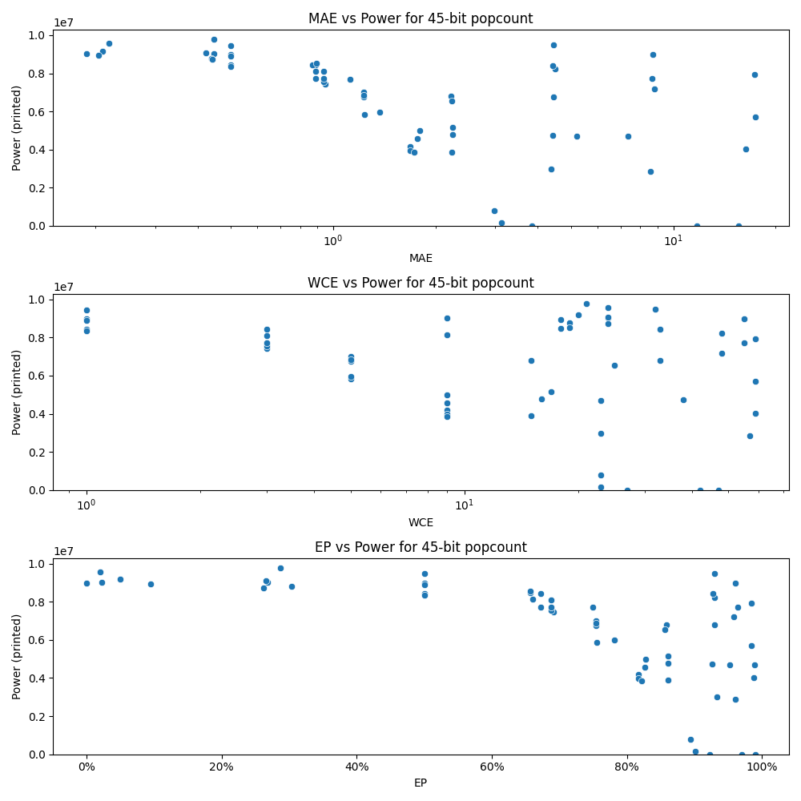

# Generated 45 bit popcount circuit
- __Circuit__: popcount (45 bit to 6.0 bit)

## Parameters of selected circuit
| Circuit         |       MAE |   WCE |        EP |        Area |           Power |       Delay | Download                                                               |
|:----------------|----------:|------:|----------:|------------:|----------------:|------------:|:-----------------------------------------------------------------------|
| popcount45_dw1a |  0.220079 |    24 | 0.0201712 | 1.57155e+08 |      9.5634e+06 | 9.05376e+07 | [v](popcount45_dw1a.v) [c](popcount45_dw1a.c) [py](popcount45_dw1a.py) |
| popcount45_1frw |  0.210505 |    20 | 0.049777  | 1.57219e+08 |      9.1747e+06 | 9.09849e+07 | [v](popcount45_1frw.v) [c](popcount45_1frw.c) [py](popcount45_1frw.py) |
| popcount45_tr07 |  0.204515 |    18 | 0.0948043 | 1.58591e+08 |      8.9311e+06 | 8.76327e+07 | [v](popcount45_tr07.v) [c](popcount45_tr07.c) [py](popcount45_tr07.py) |
| popcount45_3en5 |  0.188786 |    24 | 0.0219553 | 1.54685e+08 |      9.0311e+06 | 8.80987e+07 | [v](popcount45_3en5.v) [c](popcount45_3en5.c) [py](popcount45_3en5.py) |
| popcount45_32ck |  0.446884 |     9 | 0.268458  | 1.57445e+08 |      9.0192e+06 | 9.20692e+07 | [v](popcount45_32ck.v) [c](popcount45_32ck.c) [py](popcount45_32ck.py) |
| popcount45_bu7o |  0.422802 |    24 | 0.265871  | 1.54966e+08 |      9.0832e+06 | 8.58952e+07 | [v](popcount45_bu7o.v) [c](popcount45_bu7o.c) [py](popcount45_bu7o.py) |
| popcount45_2tig |  0.438644 |    19 | 0.303874  | 1.56206e+08 |      8.7918e+06 | 8.98467e+07 | [v](popcount45_2tig.v) [c](popcount45_2tig.c) [py](popcount45_2tig.py) |
| popcount45_bxzw |  0.443094 |    24 | 0.261679  | 1.54673e+08 |      8.7291e+06 | 9.54385e+07 | [v](popcount45_bxzw.v) [c](popcount45_bxzw.c) [py](popcount45_bxzw.py) |
| popcount45_59um |  0.446964 |    21 | 0.287391  | 1.58807e+08 |      9.7858e+06 | 9.10279e+07 | [v](popcount45_59um.v) [c](popcount45_59um.c) [py](popcount45_59um.py) |
| popcount45_yweh |  0.890625 |     3 | 0.671875  | 1.49035e+08 |      8.4204e+06 | 9.40985e+07 | [v](popcount45_yweh.v) [c](popcount45_yweh.c) [py](popcount45_yweh.py) |
| popcount45_co4v |  0.890625 |     3 | 0.671875  | 1.52812e+08 |      7.7068e+06 | 9.2481e+07  | [v](popcount45_co4v.v) [c](popcount45_co4v.c) [py](popcount45_co4v.py) |
| popcount45_1o1g |  0.888474 |     9 | 0.660792  | 1.44913e+08 |      8.1246e+06 | 9.25147e+07 | [v](popcount45_1o1g.v) [c](popcount45_1o1g.c) [py](popcount45_1o1g.py) |
| popcount45_i3jr |  0.8702   |    18 | 0.656656  | 1.51774e+08 |      8.4579e+06 | 9.02588e+07 | [v](popcount45_i3jr.v) [c](popcount45_i3jr.c) [py](popcount45_i3jr.py) |
| popcount45_jpe6 |  0.894805 |    19 | 0.657361  | 1.50956e+08 |      8.535e+06  | 8.80247e+07 | [v](popcount45_jpe6.v) [c](popcount45_jpe6.c) [py](popcount45_jpe6.py) |
| popcount45_ryt4 |  2.23487  |    15 | 0.8604    | 1.01246e+08 |      3.8818e+06 | 9.08698e+07 | [v](popcount45_ryt4.v) [c](popcount45_ryt4.c) [py](popcount45_ryt4.py) |
| popcount45_aaui |  2.24926  |    17 | 0.861194  | 1.15845e+08 |      5.1629e+06 | 9.06494e+07 | [v](popcount45_aaui.v) [c](popcount45_aaui.c) [py](popcount45_aaui.py) |
| popcount45_chxf |  2.24407  |    16 | 0.86033   | 9.56408e+07 |      4.7741e+06 | 8.82014e+07 | [v](popcount45_chxf.v) [c](popcount45_chxf.c) [py](popcount45_chxf.py) |
| popcount45_67ay |  2.21635  |    15 | 0.858733  | 1.34196e+08 |      6.793e+06  | 1.03094e+08 | [v](popcount45_67ay.v) [c](popcount45_67ay.c) [py](popcount45_67ay.py) |
| popcount45_kw8k |  2.23623  |    25 | 0.856563  | 1.34502e+08 |      6.5593e+06 | 8.97584e+07 | [v](popcount45_kw8k.v) [c](popcount45_kw8k.c) [py](popcount45_kw8k.py) |
| popcount45_qo5z |  4.49407  |    48 | 0.929592  | 1.5472e+08  |      8.2336e+06 | 1.01665e+08 | [v](popcount45_qo5z.v) [c](popcount45_qo5z.c) [py](popcount45_qo5z.py) |
| popcount45_q3ir |  4.43348  |    38 | 0.925888  | 9.56775e+07 |      4.7451e+06 | 9.33294e+07 | [v](popcount45_q3ir.v) [c](popcount45_q3ir.c) [py](popcount45_q3ir.py) |
| popcount45_49xp |  4.45661  |    33 | 0.929162  | 1.33285e+08 |      6.777e+06  | 9.2002e+07  | [v](popcount45_49xp.v) [c](popcount45_49xp.c) [py](popcount45_49xp.py) |
| popcount45_yndr |  4.41176  |    33 | 0.926965  | 1.52828e+08 |      8.4192e+06 | 1.04123e+08 | [v](popcount45_yndr.v) [c](popcount45_yndr.c) [py](popcount45_yndr.py) |
| popcount45_r9qv |  4.45314  |    32 | 0.92964   | 1.45803e+08 |      9.4848e+06 | 9.42024e+07 | [v](popcount45_r9qv.v) [c](popcount45_r9qv.c) [py](popcount45_r9qv.py) |
| popcount45_dokv |  3.84736  |    27 | 0.921989  | 0           |      0          | 0           | [v](popcount45_dokv.v) [c](popcount45_dokv.c) [py](popcount45_dokv.py) |
| popcount45_8dkw |  8.63711  |    55 | 0.963942  | 1.34929e+08 |      7.722e+06  | 9.40289e+07 | [v](popcount45_8dkw.v) [c](popcount45_8dkw.c) [py](popcount45_8dkw.py) |
| popcount45_pvta |  8.56247  |    57 | 0.95993   | 7.02925e+07 |      2.8699e+06 | 8.71063e+07 | [v](popcount45_pvta.v) [c](popcount45_pvta.c) [py](popcount45_pvta.py) |
| popcount45_bjh4 |  8.71862  |    55 | 0.961069  | 1.50788e+08 |      8.9738e+06 | 9.39687e+07 | [v](popcount45_bjh4.v) [c](popcount45_bjh4.c) [py](popcount45_bjh4.py) |
| popcount45_abpb |  8.78035  |    48 | 0.95866   | 1.34559e+08 |      7.1957e+06 | 9.98684e+07 | [v](popcount45_abpb.v) [c](popcount45_abpb.c) [py](popcount45_abpb.py) |
| popcount45_vpej | 15.541    |    47 | 0.990451  | 0           |      0          | 0           | [v](popcount45_vpej.v) [c](popcount45_vpej.c) [py](popcount45_vpej.py) |
| popcount45_dcjf | 11.7369   |    42 | 0.969712  | 0           |      0          | 0           | [v](popcount45_dcjf.v) [c](popcount45_dcjf.c) [py](popcount45_dcjf.py) |
| popcount45_4xwo | 17.442    |    59 | 0.984253  | 9.94987e+07 |      5.7063e+06 | 9.97091e+07 | [v](popcount45_4xwo.v) [c](popcount45_4xwo.c) [py](popcount45_4xwo.py) |
| popcount45_vd2y | 16.3641   |    59 | 0.987456  | 7.92724e+07 |      4.0361e+06 | 7.44278e+07 | [v](popcount45_vd2y.v) [c](popcount45_vd2y.c) [py](popcount45_vd2y.py) |
| popcount45_gtvy | 17.2922   |    59 | 0.983754  | 1.40507e+08 |      7.9451e+06 | 1.08687e+08 | [v](popcount45_gtvy.v) [c](popcount45_gtvy.c) [py](popcount45_gtvy.py) |
| popcount45_0xss |  0        |     0 | 0         | 1.58628e+08 |      8.9871e+06 | 9.25896e+07 | [v](popcount45_0xss.v) [c](popcount45_0xss.c) [py](popcount45_0xss.py) |
| popcount45_ykwv |  0.5      |     1 | 0.5       | 1.63516e+08 |      9.4599e+06 | 9.4396e+07  | [v](popcount45_ykwv.v) [c](popcount45_ykwv.c) [py](popcount45_ykwv.py) |
| popcount45_gfdi |  0.5      |     1 | 0.5       | 1.60142e+08 |      8.9748e+06 | 9.18417e+07 | [v](popcount45_gfdi.v) [c](popcount45_gfdi.c) [py](popcount45_gfdi.py) |
| popcount45_vht4 |  0.5      |     1 | 0.5       | 1.51905e+08 |      8.4226e+06 | 8.94864e+07 | [v](popcount45_vht4.v) [c](popcount45_vht4.c) [py](popcount45_vht4.py) |
| popcount45_gugs |  0.5      |     1 | 0.5       | 1.54016e+08 |      8.898e+06  | 9.31052e+07 | [v](popcount45_gugs.v) [c](popcount45_gugs.c) [py](popcount45_gugs.py) |
| popcount45_32il |  0.5      |     1 | 0.5       | 1.59705e+08 |      8.3404e+06 | 9.28566e+07 | [v](popcount45_32il.v) [c](popcount45_32il.c) [py](popcount45_32il.py) |
| popcount45_tul9 |  1.125    |     3 | 0.75      | 1.41652e+08 |      7.6961e+06 | 8.99323e+07 | [v](popcount45_tul9.v) [c](popcount45_tul9.c) [py](popcount45_tul9.py) |
| popcount45_ihcw |  0.949219 |     3 | 0.691406  | 1.3823e+08  |      7.4447e+06 | 9.24607e+07 | [v](popcount45_ihcw.v) [c](popcount45_ihcw.c) [py](popcount45_ihcw.py) |
| popcount45_5rcq |  0.9375   |     3 | 0.6875    | 1.45116e+08 |      8.0943e+06 | 9.17722e+07 | [v](popcount45_5rcq.v) [c](popcount45_5rcq.c) [py](popcount45_5rcq.py) |
| popcount45_9fvu |  0.9375   |     3 | 0.6875    | 1.41529e+08 |      7.5628e+06 | 9.29932e+07 | [v](popcount45_9fvu.v) [c](popcount45_9fvu.c) [py](popcount45_9fvu.py) |
| popcount45_d0z7 |  0.9375   |     3 | 0.6875    | 1.40093e+08 |      7.7165e+06 | 9.44288e+07 | [v](popcount45_d0z7.v) [c](popcount45_d0z7.c) [py](popcount45_d0z7.py) |
| popcount45_fw2v |  1.23047  |     5 | 0.753906  | 1.4241e+08  |      7.004e+06  | 9.22692e+07 | [v](popcount45_fw2v.v) [c](popcount45_fw2v.c) [py](popcount45_fw2v.py) |
| popcount45_hdos |  1.23901  |     5 | 0.755615  | 1.20546e+08 |      5.8504e+06 | 9.24282e+07 | [v](popcount45_hdos.v) [c](popcount45_hdos.c) [py](popcount45_hdos.py) |
| popcount45_0rrp |  1.23047  |     5 | 0.753906  | 1.30816e+08 |      6.7699e+06 | 9.20086e+07 | [v](popcount45_0rrp.v) [c](popcount45_0rrp.c) [py](popcount45_0rrp.py) |
| popcount45_08zn |  1.23047  |     5 | 0.753906  | 1.29368e+08 |      6.8592e+06 | 9.46483e+07 | [v](popcount45_08zn.v) [c](popcount45_08zn.c) [py](popcount45_08zn.py) |
| popcount45_ozss |  1.36841  |     5 | 0.781982  | 1.29741e+08 |      5.9776e+06 | 9.21203e+07 | [v](popcount45_ozss.v) [c](popcount45_ozss.c) [py](popcount45_ozss.py) |
| popcount45_hpgt |  1.68765  |     9 | 0.816575  | 8.03269e+07 |      4.1739e+06 | 8.73212e+07 | [v](popcount45_hpgt.v) [c](popcount45_hpgt.c) [py](popcount45_hpgt.py) |
| popcount45_g3u7 |  1.68765  |     9 | 0.816575  | 8.19804e+07 |      3.9667e+06 | 8.87049e+07 | [v](popcount45_g3u7.v) [c](popcount45_g3u7.c) [py](popcount45_g3u7.py) |
| popcount45_o6j8 |  1.7306   |     9 | 0.821348  | 8.28843e+07 |      3.8616e+06 | 8.90516e+07 | [v](popcount45_o6j8.v) [c](popcount45_o6j8.c) [py](popcount45_o6j8.py) |
| popcount45_z5m3 |  1.79591  |     9 | 0.82808   | 9.98479e+07 |      4.9788e+06 | 9.19889e+07 | [v](popcount45_z5m3.v) [c](popcount45_z5m3.c) [py](popcount45_z5m3.py) |
| popcount45_x69s |  1.77318  |     9 | 0.825987  | 9.86001e+07 |      4.5576e+06 | 8.9665e+07  | [v](popcount45_x69s.v) [c](popcount45_x69s.c) [py](popcount45_x69s.py) |
| popcount45_xsod |  7.34282  |    23 | 0.989412  | 9.40957e+07 |      4.7028e+06 | 9.01016e+07 | [v](popcount45_xsod.v) [c](popcount45_xsod.c) [py](popcount45_xsod.py) |
| popcount45_xey9 |  4.37596  |    23 | 0.932675  | 5.75569e+07 |      2.9934e+06 | 6.70099e+07 | [v](popcount45_xey9.v) [c](popcount45_xey9.c) [py](popcount45_xey9.py) |
| popcount45_0xd7 |  2.97587  |    23 | 0.894228  | 1.72473e+07 | 799580          | 4.44644e+07 | [v](popcount45_0xd7.v) [c](popcount45_0xd7.c) [py](popcount45_0xd7.py) |
| popcount45_dtro |  3.12993  |    23 | 0.901238  | 3.01589e+06 | 161710          | 9.54013e+06 | [v](popcount45_dtro.v) [c](popcount45_dtro.c) [py](popcount45_dtro.py) |
| popcount45_0cyp |  5.19936  |    23 | 0.951784  | 9.45156e+07 |      4.6834e+06 | 9.89916e+07 | [v](popcount45_0cyp.v) [c](popcount45_0cyp.c) [py](popcount45_0cyp.py) |

## Parameters 
