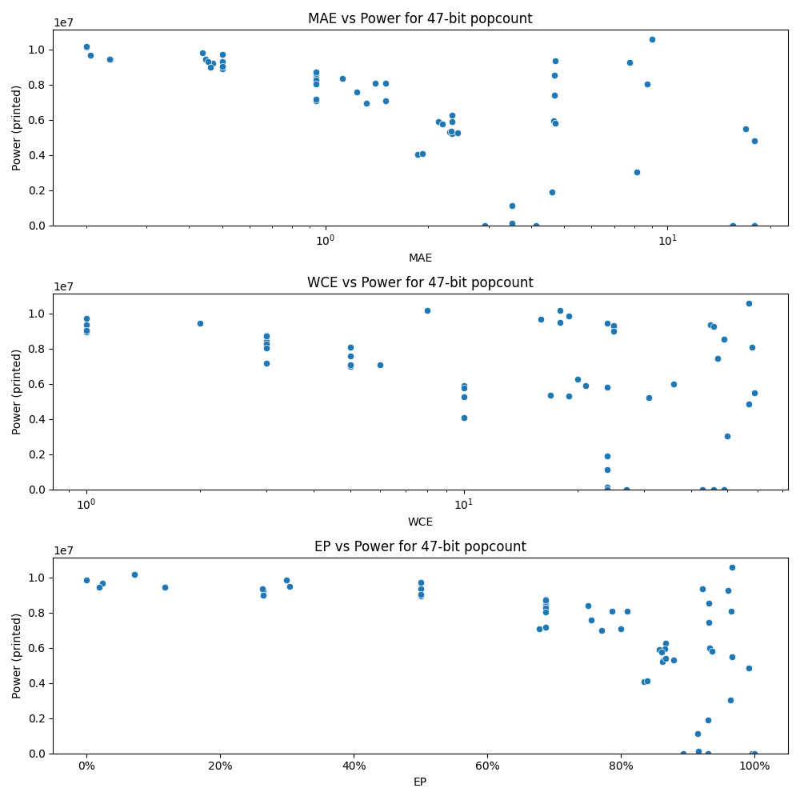

# Generated 47 bit popcount circuit
- __Circuit__: popcount (47 bit to 6.0 bit)

## Parameters of selected circuit
| Circuit         |       MAE |   WCE |        EP |             Area |           Power |            Delay | Download                                                               |
|:----------------|----------:|------:|----------:|-----------------:|----------------:|-----------------:|:-----------------------------------------------------------------------|
| popcount47_6pdo |  0.20552  |    16 | 0.0238247 |      1.59127e+08 |      9.6809e+06 |      9.02249e+07 | [v](popcount47_6pdo.v) [c](popcount47_6pdo.c) [py](popcount47_6pdo.py) |
| popcount47_0nni |  0.234973 |    24 | 0.0197032 |      1.59167e+08 |      9.4372e+06 |      9.14361e+07 | [v](popcount47_0nni.v) [c](popcount47_0nni.c) [py](popcount47_0nni.py) |
| popcount47_wy3e |  0.200682 |    18 | 0.0717096 |      1.57571e+08 |      1.0152e+07 |      8.75243e+07 | [v](popcount47_wy3e.v) [c](popcount47_wy3e.c) [py](popcount47_wy3e.py) |
| popcount47_1q1a |  0.234375 |     2 | 0.117188  |      1.64593e+08 |      9.4576e+06 |      9.2223e+07  | [v](popcount47_1q1a.v) [c](popcount47_1q1a.c) [py](popcount47_1q1a.py) |
| popcount47_obk4 |  0.200389 |     8 | 0.0717096 |      1.61373e+08 |      1.0163e+07 |      9.11958e+07 | [v](popcount47_obk4.v) [c](popcount47_obk4.c) [py](popcount47_obk4.py) |
| popcount47_jgny |  0.44686  |    18 | 0.304029  |      1.54377e+08 |      9.4752e+06 |      8.79956e+07 | [v](popcount47_jgny.v) [c](popcount47_jgny.c) [py](popcount47_jgny.py) |
| popcount47_eh0n |  0.468995 |    25 | 0.264301  |      1.58445e+08 |      9.2395e+06 |      9.01662e+07 | [v](popcount47_eh0n.v) [c](popcount47_eh0n.c) [py](popcount47_eh0n.py) |
| popcount47_38zt |  0.454259 |    25 | 0.263671  |      1.58059e+08 |      9.3333e+06 |      8.85514e+07 | [v](popcount47_38zt.v) [c](popcount47_38zt.c) [py](popcount47_38zt.py) |
| popcount47_0s17 |  0.438468 |    19 | 0.299597  |      1.6461e+08  |      9.8376e+06 |      8.94035e+07 | [v](popcount47_0s17.v) [c](popcount47_0s17.c) [py](popcount47_0s17.py) |
| popcount47_rfza |  0.462497 |    25 | 0.264406  |      1.54221e+08 |      8.9817e+06 |      8.88506e+07 | [v](popcount47_rfza.v) [c](popcount47_rfza.c) [py](popcount47_rfza.py) |
| popcount47_7mmw |  0.9375   |     3 | 0.6875    |      1.51782e+08 |      8.5347e+06 |      9.2945e+07  | [v](popcount47_7mmw.v) [c](popcount47_7mmw.c) [py](popcount47_7mmw.py) |
| popcount47_3cv4 |  0.9375   |     3 | 0.6875    |      1.5175e+08  |      8.3948e+06 |      9.23477e+07 | [v](popcount47_3cv4.v) [c](popcount47_3cv4.c) [py](popcount47_3cv4.py) |
| popcount47_5c6z |  0.9375   |     3 | 0.6875    |      1.65032e+08 |      8.7432e+06 |      9.247e+07   | [v](popcount47_5c6z.v) [c](popcount47_5c6z.c) [py](popcount47_5c6z.py) |
| popcount47_8vow |  0.939758 |     6 | 0.677902  |      1.40569e+08 |      7.074e+06  |      9.19599e+07 | [v](popcount47_8vow.v) [c](popcount47_8vow.c) [py](popcount47_8vow.py) |
| popcount47_ywt5 |  0.9375   |     3 | 0.6875    |      1.49941e+08 |      8.6186e+06 |      9.43999e+07 | [v](popcount47_ywt5.v) [c](popcount47_ywt5.c) [py](popcount47_ywt5.py) |
| popcount47_atj4 |  2.3151   |    19 | 0.863499  |      1.08258e+08 |      5.2993e+06 |      9.69044e+07 | [v](popcount47_atj4.v) [c](popcount47_atj4.c) [py](popcount47_atj4.py) |
| popcount47_hpsm |  2.34411  |    31 | 0.86233   |      1.00565e+08 |      5.2051e+06 |      9.07048e+07 | [v](popcount47_hpsm.v) [c](popcount47_hpsm.c) [py](popcount47_hpsm.py) |
| popcount47_3avo |  2.34735  |    20 | 0.866275  |      1.35837e+08 |      6.2727e+06 |      9.07316e+07 | [v](popcount47_3avo.v) [c](popcount47_3avo.c) [py](popcount47_3avo.py) |
| popcount47_igin |  2.33859  |    17 | 0.86628   |      1.12274e+08 |      5.3742e+06 |      9.17612e+07 | [v](popcount47_igin.v) [c](popcount47_igin.c) [py](popcount47_igin.py) |
| popcount47_qvhs |  2.34932  |    21 | 0.865511  |      1.1979e+08  |      5.9216e+06 |      9.26723e+07 | [v](popcount47_qvhs.v) [c](popcount47_qvhs.c) [py](popcount47_qvhs.py) |
| popcount47_c2jp |  4.65071  |    36 | 0.932656  |      1.08001e+08 |      5.9709e+06 |      9.16565e+07 | [v](popcount47_c2jp.v) [c](popcount47_c2jp.c) [py](popcount47_c2jp.py) |
| popcount47_8o2d |  4.68307  |    47 | 0.931451  |      1.44538e+08 |      7.4262e+06 |      1.1027e+08  | [v](popcount47_8o2d.v) [c](popcount47_8o2d.c) [py](popcount47_8o2d.py) |
| popcount47_rv5u |  4.68769  |    49 | 0.931821  |      1.5225e+08  |      8.5501e+06 |      1.00615e+08 | [v](popcount47_rv5u.v) [c](popcount47_rv5u.c) [py](popcount47_rv5u.py) |
| popcount47_paq7 |  4.69593  |    45 | 0.921536  |      1.60668e+08 |      9.3522e+06 |      9.44856e+07 | [v](popcount47_paq7.v) [c](popcount47_paq7.c) [py](popcount47_paq7.py) |
| popcount47_um3q |  4.14092  |    27 | 0.930441  |      0           |      0          |      0           | [v](popcount47_um3q.v) [c](popcount47_um3q.c) [py](popcount47_um3q.py) |
| popcount47_i2df |  8.12771  |    50 | 0.964124  |      6.18651e+07 |      3.0303e+06 |      6.31906e+07 | [v](popcount47_i2df.v) [c](popcount47_i2df.c) [py](popcount47_i2df.py) |
| popcount47_90i7 |  7.75055  |    46 | 0.959917  |      1.46891e+08 |      9.2747e+06 |      8.48685e+07 | [v](popcount47_90i7.v) [c](popcount47_90i7.c) [py](popcount47_90i7.py) |
| popcount47_42no |  9.01882  |    57 | 0.966351  |      1.65801e+08 |      1.059e+07  |      9.65561e+07 | [v](popcount47_42no.v) [c](popcount47_42no.c) [py](popcount47_42no.py) |
| popcount47_rnq7 |  8.72586  |    58 | 0.964657  |      1.47977e+08 |      8.0641e+06 |      1.03583e+08 | [v](popcount47_rnq7.v) [c](popcount47_rnq7.c) [py](popcount47_rnq7.py) |
| popcount47_31yb | 15.5004   |    43 | 0.999746  |      0           |      0          |      0           | [v](popcount47_31yb.v) [c](popcount47_31yb.c) [py](popcount47_31yb.py) |
| popcount47_oyl3 | 15.5091   |    46 | 0.996364  |      0           |      0          |      0           | [v](popcount47_oyl3.v) [c](popcount47_oyl3.c) [py](popcount47_oyl3.py) |
| popcount47_1dls | 18.0012   |    49 | 0.999277  |      0           |      0          |      0           | [v](popcount47_1dls.v) [c](popcount47_1dls.c) [py](popcount47_1dls.py) |
| popcount47_87fa | 17.964    |    57 | 0.991192  |      1.00407e+08 |      4.8365e+06 |      7.14953e+07 | [v](popcount47_87fa.v) [c](popcount47_87fa.c) [py](popcount47_87fa.py) |
| popcount47_cwk9 | 16.9197   |    59 | 0.966301  |      1.02331e+08 |      5.5069e+06 |      9.22336e+07 | [v](popcount47_cwk9.v) [c](popcount47_cwk9.c) [py](popcount47_cwk9.py) |
| popcount47_vbyc |  0        |     0 | 0         |      1.62663e+08 |      9.8607e+06 |      9.24143e+07 | [v](popcount47_vbyc.v) [c](popcount47_vbyc.c) [py](popcount47_vbyc.py) |
| popcount47_n5fq |  0.5      |     1 | 0.5       |      1.63123e+08 |      9.7212e+06 |      9.25806e+07 | [v](popcount47_n5fq.v) [c](popcount47_n5fq.c) [py](popcount47_n5fq.py) |
| popcount47_xke7 |  0.5      |     1 | 0.5       |      1.55804e+08 |      8.9256e+06 |      9.24846e+07 | [v](popcount47_xke7.v) [c](popcount47_xke7.c) [py](popcount47_xke7.py) |
| popcount47_1327 |  0.5      |     1 | 0.5       |      1.585e+08   |      9.0411e+06 |      9.06683e+07 | [v](popcount47_1327.v) [c](popcount47_1327.c) [py](popcount47_1327.py) |
| popcount47_isr1 |  0.5      |     1 | 0.5       |      1.60438e+08 |      9.335e+06  |      9.25379e+07 | [v](popcount47_isr1.v) [c](popcount47_isr1.c) [py](popcount47_isr1.py) |
| popcount47_1c9x |  0.5      |     1 | 0.5       |      1.59484e+08 |      9.0474e+06 |      9.20642e+07 | [v](popcount47_1c9x.v) [c](popcount47_1c9x.c) [py](popcount47_1c9x.py) |
| popcount47_mkw4 |  1.125    |     3 | 0.75      |      1.52307e+08 |      8.3828e+06 |      9.09747e+07 | [v](popcount47_mkw4.v) [c](popcount47_mkw4.c) [py](popcount47_mkw4.py) |
| popcount47_93ay |  0.9375   |     3 | 0.6875    |      1.47805e+08 |      8.2546e+06 |      9.23438e+07 | [v](popcount47_93ay.v) [c](popcount47_93ay.c) [py](popcount47_93ay.py) |
| popcount47_efog |  0.9375   |     3 | 0.6875    |      1.48907e+08 |      8.0537e+06 |      9.28251e+07 | [v](popcount47_efog.v) [c](popcount47_efog.c) [py](popcount47_efog.py) |
| popcount47_0air |  0.9375   |     3 | 0.6875    |      1.46394e+08 |      7.1795e+06 |      8.86804e+07 | [v](popcount47_0air.v) [c](popcount47_0air.c) [py](popcount47_0air.py) |
| popcount47_f0br |  0.9375   |     3 | 0.6875    |      1.5423e+08  |      8.7173e+06 |      9.53647e+07 | [v](popcount47_f0br.v) [c](popcount47_f0br.c) [py](popcount47_f0br.py) |
| popcount47_66ru |  1.31592  |     5 | 0.770996  |      1.32986e+08 |      6.9749e+06 |      9.27322e+07 | [v](popcount47_66ru.v) [c](popcount47_66ru.c) [py](popcount47_66ru.py) |
| popcount47_nxa9 |  1.40335  |     5 | 0.786072  |      1.39038e+08 |      8.0691e+06 |      9.03772e+07 | [v](popcount47_nxa9.v) [c](popcount47_nxa9.c) [py](popcount47_nxa9.py) |
| popcount47_tqcf |  1.23901  |     5 | 0.755615  |      1.3028e+08  |      7.579e+06  |      9.18971e+07 | [v](popcount47_tqcf.v) [c](popcount47_tqcf.c) [py](popcount47_tqcf.py) |
| popcount47_leqn |  1.50085  |     5 | 0.799255  |      1.33284e+08 |      7.0677e+06 |      9.05501e+07 | [v](popcount47_leqn.v) [c](popcount47_leqn.c) [py](popcount47_leqn.py) |
| popcount47_4syl |  1.50391  |     5 | 0.808594  |      1.401e+08   |      8.0773e+06 |      9.48423e+07 | [v](popcount47_4syl.v) [c](popcount47_4syl.c) [py](popcount47_4syl.py) |
| popcount47_wc8n |  2.43224  |    10 | 0.878232  |      1.10842e+08 |      5.2847e+06 |      9.03499e+07 | [v](popcount47_wc8n.v) [c](popcount47_wc8n.c) [py](popcount47_wc8n.py) |
| popcount47_ojal |  2.13691  |    10 | 0.856515  |      1.07965e+08 |      5.9127e+06 |      9.09207e+07 | [v](popcount47_ojal.v) [c](popcount47_ojal.c) [py](popcount47_ojal.py) |
| popcount47_qayx |  2.20096  |    10 | 0.861018  |      1.05258e+08 |      5.776e+06  |      8.42207e+07 | [v](popcount47_qayx.v) [c](popcount47_qayx.c) [py](popcount47_qayx.py) |
| popcount47_ubuz |  1.86165  |    10 | 0.834037  |      9.46392e+07 |      4.0612e+06 |      9.19638e+07 | [v](popcount47_ubuz.v) [c](popcount47_ubuz.c) [py](popcount47_ubuz.py) |
| popcount47_y3ia |  1.92693  |    10 | 0.839595  |      9.23485e+07 |      4.1026e+06 |      9.08396e+07 | [v](popcount47_y3ia.v) [c](popcount47_y3ia.c) [py](popcount47_y3ia.py) |
| popcount47_ouyh |  3.51086  |    24 | 0.915421  |      2.35397e+06 | 133290          |      8.19905e+06 | [v](popcount47_ouyh.v) [c](popcount47_ouyh.c) [py](popcount47_ouyh.py) |
| popcount47_hhto |  2.9251   |    24 | 0.892746  | 228420           |    878.448      | 565707           | [v](popcount47_hhto.v) [c](popcount47_hhto.c) [py](popcount47_hhto.py) |
| popcount47_1pl8 |  3.51924  |    24 | 0.914797  |      2.51232e+07 |      1.1371e+06 |      5.43153e+07 | [v](popcount47_1pl8.v) [c](popcount47_1pl8.c) [py](popcount47_1pl8.py) |
| popcount47_cbgb |  4.59324  |    24 | 0.929865  |      4.20885e+07 |      1.9004e+06 |      6.98258e+07 | [v](popcount47_cbgb.v) [c](popcount47_cbgb.c) [py](popcount47_cbgb.py) |
| popcount47_joj2 |  4.71548  |    24 | 0.935865  |      1.08241e+08 |      5.8009e+06 |      8.46595e+07 | [v](popcount47_joj2.v) [c](popcount47_joj2.c) [py](popcount47_joj2.py) |

## Parameters 
