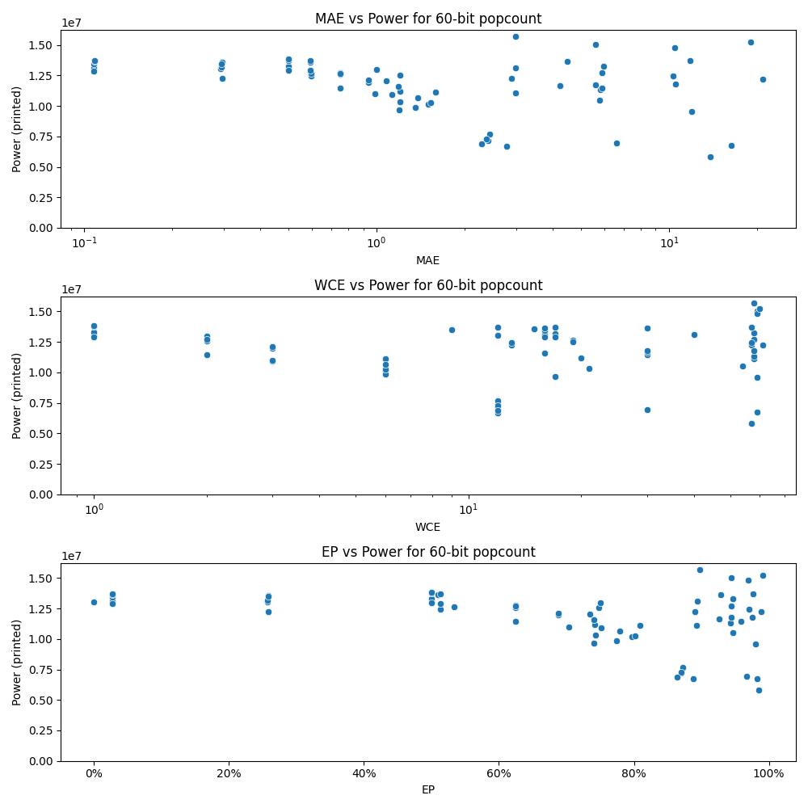

# Generated 60 bit popcount circuit
- __Circuit__: popcount (60 bit to 6.0 bit)

## Parameters of selected circuit
| Circuit         |       MAE |   WCE |        EP |        Area |      Power |       Delay | Download                                                               |
|:----------------|----------:|------:|----------:|------------:|-----------:|------------:|:-----------------------------------------------------------------------|
| popcount60_zfmb |  0.108042 |    16 | 0.02689   | 2.06176e+08 | 1.3117e+07 | 9.58584e+07 | [v](popcount60_zfmb.v) [c](popcount60_zfmb.c) [py](popcount60_zfmb.py) |
| popcount60_8mjt |  0.108042 |    16 | 0.02689   | 2.08596e+08 | 1.3455e+07 | 9.72382e+07 | [v](popcount60_8mjt.v) [c](popcount60_8mjt.c) [py](popcount60_8mjt.py) |
| popcount60_jksz |  0.108284 |    16 | 0.0269347 | 2.0752e+08  | 1.3617e+07 | 9.7695e+07  | [v](popcount60_jksz.v) [c](popcount60_jksz.c) [py](popcount60_jksz.py) |
| popcount60_h3x0 |  0.108042 |    16 | 0.02689   | 2.0293e+08  | 1.288e+07  | 9.10187e+07 | [v](popcount60_h3x0.v) [c](popcount60_h3x0.c) [py](popcount60_h3x0.py) |
| popcount60_z3nr |  0.108162 |    12 | 0.0269197 | 2.10387e+08 | 1.3706e+07 | 9.72689e+07 | [v](popcount60_z3nr.v) [c](popcount60_z3nr.c) [py](popcount60_z3nr.py) |
| popcount60_xq33 |  0.295714 |    15 | 0.258755  | 2.05921e+08 | 1.3578e+07 | 9.67524e+07 | [v](popcount60_xq33.v) [c](popcount60_xq33.c) [py](popcount60_xq33.py) |
| popcount60_xqn2 |  0.292064 |    12 | 0.257131  | 2.01883e+08 | 1.3031e+07 | 9.12202e+07 | [v](popcount60_xqn2.v) [c](popcount60_xqn2.c) [py](popcount60_xqn2.py) |
| popcount60_ogfi |  0.293776 |    17 | 0.25712   | 2.04755e+08 | 1.3168e+07 | 9.06147e+07 | [v](popcount60_ogfi.v) [c](popcount60_ogfi.c) [py](popcount60_ogfi.py) |
| popcount60_8zvz |  0.294807 |     9 | 0.258755  | 2.05542e+08 | 1.348e+07  | 9.24324e+07 | [v](popcount60_8zvz.v) [c](popcount60_8zvz.c) [py](popcount60_8zvz.py) |
| popcount60_83zg |  0.296875 |    13 | 0.258755  | 1.99006e+08 | 1.2263e+07 | 9.03807e+07 | [v](popcount60_83zg.v) [c](popcount60_83zg.c) [py](popcount60_83zg.py) |
| popcount60_j35k |  0.594905 |    13 | 0.513497  | 2.02816e+08 | 1.2441e+07 | 9.21533e+07 | [v](popcount60_j35k.v) [c](popcount60_j35k.c) [py](popcount60_j35k.py) |
| popcount60_fmq7 |  0.591129 |    15 | 0.509674  | 1.99164e+08 | 1.3605e+07 | 9.54529e+07 | [v](popcount60_fmq7.v) [c](popcount60_fmq7.c) [py](popcount60_fmq7.py) |
| popcount60_dk5t |  0.596938 |    19 | 0.533252  | 2.05328e+08 | 1.2662e+07 | 9.17643e+07 | [v](popcount60_dk5t.v) [c](popcount60_dk5t.c) [py](popcount60_dk5t.py) |
| popcount60_xsgj |  0.594816 |    17 | 0.513467  | 2.04491e+08 | 1.3703e+07 | 9.72445e+07 | [v](popcount60_xsgj.v) [c](popcount60_xsgj.c) [py](popcount60_xsgj.py) |
| popcount60_78vq |  0.594816 |    17 | 0.513467  | 2.00838e+08 | 1.2904e+07 | 9.66713e+07 | [v](popcount60_78vq.v) [c](popcount60_78vq.c) [py](popcount60_78vq.py) |
| popcount60_srcc |  1.19048  |    17 | 0.740825  | 1.70609e+08 | 9.6793e+06 | 9.28724e+07 | [v](popcount60_srcc.v) [c](popcount60_srcc.c) [py](popcount60_srcc.py) |
| popcount60_z2go |  1.19853  |    21 | 0.743236  | 1.77391e+08 | 1.0313e+07 | 9.23801e+07 | [v](popcount60_z2go.v) [c](popcount60_z2go.c) [py](popcount60_z2go.py) |
| popcount60_pa1f |  1.19972  |    19 | 0.747761  | 1.92732e+08 | 1.2538e+07 | 9.79686e+07 | [v](popcount60_pa1f.v) [c](popcount60_pa1f.c) [py](popcount60_pa1f.py) |
| popcount60_eb0s |  1.19917  |    20 | 0.741881  | 1.81855e+08 | 1.1187e+07 | 9.49045e+07 | [v](popcount60_eb0s.v) [c](popcount60_eb0s.c) [py](popcount60_eb0s.py) |
| popcount60_rt7q |  1.18846  |    16 | 0.740817  | 1.90955e+08 | 1.1567e+07 | 9.46514e+07 | [v](popcount60_rt7q.v) [c](popcount60_rt7q.c) [py](popcount60_rt7q.py) |
| popcount60_7abq |  2.98909  |    40 | 0.894114  | 2.16849e+08 | 1.3116e+07 | 1.0408e+08  | [v](popcount60_7abq.v) [c](popcount60_7abq.c) [py](popcount60_7abq.py) |
| popcount60_w7la |  2.99183  |    58 | 0.897276  | 2.49503e+08 | 1.5714e+07 | 1.19977e+08 | [v](popcount60_w7la.v) [c](popcount60_w7la.c) [py](popcount60_w7la.py) |
| popcount60_i82k |  2.99034  |    58 | 0.893102  | 1.94502e+08 | 1.1096e+07 | 1.10431e+08 | [v](popcount60_i82k.v) [c](popcount60_i82k.c) [py](popcount60_i82k.py) |
| popcount60_nfeq |  2.89945  |    57 | 0.89065   | 2.20619e+08 | 1.224e+07  | 1.08706e+08 | [v](popcount60_nfeq.v) [c](popcount60_nfeq.c) [py](popcount60_nfeq.py) |
| popcount60_8nyr |  5.97783  |    58 | 0.947012  | 2.2807e+08  | 1.3269e+07 | 1.15524e+08 | [v](popcount60_8nyr.v) [c](popcount60_8nyr.c) [py](popcount60_8nyr.py) |
| popcount60_t4x7 |  5.83475  |    58 | 0.943329  | 1.99776e+08 | 1.1305e+07 | 1.14035e+08 | [v](popcount60_t4x7.v) [c](popcount60_t4x7.c) [py](popcount60_t4x7.py) |
| popcount60_w1oh |  5.88619  |    58 | 0.943737  | 2.3306e+08  | 1.2731e+07 | 1.16986e+08 | [v](popcount60_w1oh.v) [c](popcount60_w1oh.c) [py](popcount60_w1oh.py) |
| popcount60_fzb6 |  5.59208  |    59 | 0.944411  | 2.50841e+08 | 1.5037e+07 | 1.12451e+08 | [v](popcount60_fzb6.v) [c](popcount60_fzb6.c) [py](popcount60_fzb6.py) |
| popcount60_0807 |  5.79071  |    54 | 0.946169  | 1.78338e+08 | 1.0498e+07 | 1.00891e+08 | [v](popcount60_0807.v) [c](popcount60_0807.c) [py](popcount60_0807.py) |
| popcount60_nlhx | 11.9388   |    59 | 0.980116  | 1.54406e+08 | 9.5638e+06 | 8.50285e+07 | [v](popcount60_nlhx.v) [c](popcount60_nlhx.c) [py](popcount60_nlhx.py) |
| popcount60_o35x | 11.7891   |    57 | 0.976325  | 2.2775e+08  | 1.3717e+07 | 1.07798e+08 | [v](popcount60_o35x.v) [c](popcount60_o35x.c) [py](popcount60_o35x.py) |
| popcount60_v09d | 10.4601   |    59 | 0.969931  | 2.32777e+08 | 1.4801e+07 | 1.15784e+08 | [v](popcount60_v09d.v) [c](popcount60_v09d.c) [py](popcount60_v09d.py) |
| popcount60_hbpm | 10.2946   |    57 | 0.970445  | 2.05983e+08 | 1.2426e+07 | 1.08711e+08 | [v](popcount60_hbpm.v) [c](popcount60_hbpm.c) [py](popcount60_hbpm.py) |
| popcount60_lbv2 | 10.5134   |    58 | 0.974994  | 2.14457e+08 | 1.1768e+07 | 1.03286e+08 | [v](popcount60_lbv2.v) [c](popcount60_lbv2.c) [py](popcount60_lbv2.py) |
| popcount60_bdnq | 16.36     |    59 | 0.98269   | 1.25957e+08 | 6.7522e+06 | 1.10829e+08 | [v](popcount60_bdnq.v) [c](popcount60_bdnq.c) [py](popcount60_bdnq.py) |
| popcount60_t869 | 13.7925   |    57 | 0.98551   | 1.17792e+08 | 5.8186e+06 | 7.16447e+07 | [v](popcount60_t869.v) [c](popcount60_t869.c) [py](popcount60_t869.py) |
| popcount60_b4a6 | 20.8619   |    61 | 0.988191  | 1.95613e+08 | 1.2222e+07 | 9.81886e+07 | [v](popcount60_b4a6.v) [c](popcount60_b4a6.c) [py](popcount60_b4a6.py) |
| popcount60_k9gj | 18.9698   |    60 | 0.990539  | 2.40702e+08 | 1.5211e+07 | 1.31902e+08 | [v](popcount60_k9gj.v) [c](popcount60_k9gj.c) [py](popcount60_k9gj.py) |
| popcount60_c832 |  0        |     0 | 0         | 2.09178e+08 | 1.3023e+07 | 9.32724e+07 | [v](popcount60_c832.v) [c](popcount60_c832.c) [py](popcount60_c832.py) |
| popcount60_2ben |  0.5      |     1 | 0.5       | 2.05708e+08 | 1.304e+07  | 9.29414e+07 | [v](popcount60_2ben.v) [c](popcount60_2ben.c) [py](popcount60_2ben.py) |
| popcount60_r8ux |  0.5      |     1 | 0.5       | 2.05491e+08 | 1.3275e+07 | 9.14262e+07 | [v](popcount60_r8ux.v) [c](popcount60_r8ux.c) [py](popcount60_r8ux.py) |
| popcount60_elnz |  0.5      |     1 | 0.5       | 2.05838e+08 | 1.3742e+07 | 9.13836e+07 | [v](popcount60_elnz.v) [c](popcount60_elnz.c) [py](popcount60_elnz.py) |
| popcount60_wye3 |  0.5      |     1 | 0.5       | 1.99443e+08 | 1.2934e+07 | 9.40626e+07 | [v](popcount60_wye3.v) [c](popcount60_wye3.c) [py](popcount60_wye3.py) |
| popcount60_6i61 |  0.5      |     1 | 0.5       | 2.0343e+08  | 1.3824e+07 | 9.51242e+07 | [v](popcount60_6i61.v) [c](popcount60_6i61.c) [py](popcount60_6i61.py) |
| popcount60_ssw6 |  0.75     |     2 | 0.625     | 1.88022e+08 | 1.1471e+07 | 9.23793e+07 | [v](popcount60_ssw6.v) [c](popcount60_ssw6.c) [py](popcount60_ssw6.py) |
| popcount60_c2z6 |  0.75     |     2 | 0.625     | 1.98133e+08 | 1.2743e+07 | 9.1832e+07  | [v](popcount60_c2z6.v) [c](popcount60_c2z6.c) [py](popcount60_c2z6.py) |
| popcount60_wftf |  0.75     |     2 | 0.625     | 1.91294e+08 | 1.2574e+07 | 9.09388e+07 | [v](popcount60_wftf.v) [c](popcount60_wftf.c) [py](popcount60_wftf.py) |
| popcount60_dyt0 |  1        |     2 | 0.75      | 2.01407e+08 | 1.2989e+07 | 9.29233e+07 | [v](popcount60_dyt0.v) [c](popcount60_dyt0.c) [py](popcount60_dyt0.py) |
| popcount60_2gdi |  0.75     |     2 | 0.625     | 1.91676e+08 | 1.2678e+07 | 9.22068e+07 | [v](popcount60_2gdi.v) [c](popcount60_2gdi.c) [py](popcount60_2gdi.py) |
| popcount60_yqc3 |  1.12793  |     3 | 0.750977  | 1.83035e+08 | 1.0921e+07 | 8.68885e+07 | [v](popcount60_yqc3.v) [c](popcount60_yqc3.c) [py](popcount60_yqc3.py) |
| popcount60_g5rx |  1.07812  |     3 | 0.734375  | 1.94156e+08 | 1.2034e+07 | 9.38735e+07 | [v](popcount60_g5rx.v) [c](popcount60_g5rx.c) [py](popcount60_g5rx.py) |
| popcount60_mfri |  0.9375   |     3 | 0.6875    | 1.91811e+08 | 1.1952e+07 | 8.93185e+07 | [v](popcount60_mfri.v) [c](popcount60_mfri.c) [py](popcount60_mfri.py) |
| popcount60_ayhq |  0.984375 |     3 | 0.703125  | 1.82422e+08 | 1.0982e+07 | 8.9882e+07  | [v](popcount60_ayhq.v) [c](popcount60_ayhq.c) [py](popcount60_ayhq.py) |
| popcount60_wubf |  0.9375   |     3 | 0.6875    | 1.93218e+08 | 1.2107e+07 | 9.28526e+07 | [v](popcount60_wubf.v) [c](popcount60_wubf.c) [py](popcount60_wubf.py) |
| popcount60_jhqe |  1.59229  |     6 | 0.809326  | 1.78263e+08 | 1.1123e+07 | 1.01203e+08 | [v](popcount60_jhqe.v) [c](popcount60_jhqe.c) [py](popcount60_jhqe.py) |
| popcount60_17wq |  1.5022   |     6 | 0.797485  | 1.70754e+08 | 1.0157e+07 | 9.50642e+07 | [v](popcount60_17wq.v) [c](popcount60_17wq.c) [py](popcount60_17wq.py) |
| popcount60_w0el |  1.35352  |     6 | 0.774414  | 1.77037e+08 | 9.8738e+06 | 9.22204e+07 | [v](popcount60_w0el.v) [c](popcount60_w0el.c) [py](popcount60_w0el.py) |
| popcount60_s1kh |  1.53219  |     6 | 0.801786  | 1.79473e+08 | 1.0265e+07 | 9.14811e+07 | [v](popcount60_s1kh.v) [c](popcount60_s1kh.c) [py](popcount60_s1kh.py) |
| popcount60_ao2z |  1.38428  |     6 | 0.779541  | 1.86825e+08 | 1.064e+07  | 9.03711e+07 | [v](popcount60_ao2z.v) [c](popcount60_ao2z.c) [py](popcount60_ao2z.py) |
| popcount60_himl |  2.39643  |    12 | 0.870484  | 1.29789e+08 | 7.1705e+06 | 7.81152e+07 | [v](popcount60_himl.v) [c](popcount60_himl.c) [py](popcount60_himl.py) |
| popcount60_o8y4 |  2.43742  |    12 | 0.872298  | 1.39808e+08 | 7.6771e+06 | 9.64489e+07 | [v](popcount60_o8y4.v) [c](popcount60_o8y4.c) [py](popcount60_o8y4.py) |
| popcount60_7lcj |  2.37587  |    12 | 0.869442  | 1.3515e+08  | 7.2771e+06 | 8.89623e+07 | [v](popcount60_7lcj.v) [c](popcount60_7lcj.c) [py](popcount60_7lcj.py) |
| popcount60_5k35 |  2.78881  |    12 | 0.888423  | 1.30952e+08 | 6.7089e+06 | 8.09079e+07 | [v](popcount60_5k35.v) [c](popcount60_5k35.c) [py](popcount60_5k35.py) |
| popcount60_4u6h |  2.28229  |    12 | 0.863838  | 1.34424e+08 | 6.8587e+06 | 8.80878e+07 | [v](popcount60_4u6h.v) [c](popcount60_4u6h.c) [py](popcount60_4u6h.py) |
| popcount60_00rl |  6.61847  |    30 | 0.967426  | 1.34428e+08 | 6.9546e+06 | 7.67251e+07 | [v](popcount60_00rl.v) [c](popcount60_00rl.c) [py](popcount60_00rl.py) |
| popcount60_p2ih |  4.47525  |    30 | 0.928409  | 2.28586e+08 | 1.3657e+07 | 9.84175e+07 | [v](popcount60_p2ih.v) [c](popcount60_p2ih.c) [py](popcount60_p2ih.py) |
| popcount60_eq85 |  5.87757  |    30 | 0.958063  | 1.91914e+08 | 1.1443e+07 | 9.41464e+07 | [v](popcount60_eq85.v) [c](popcount60_eq85.c) [py](popcount60_eq85.py) |
| popcount60_ci36 |  4.24042  |    30 | 0.925888  | 1.92975e+08 | 1.1667e+07 | 1.07675e+08 | [v](popcount60_ci36.v) [c](popcount60_ci36.c) [py](popcount60_ci36.py) |
| popcount60_61qc |  5.6103   |    30 | 0.944827  | 2.06208e+08 | 1.1757e+07 | 1.06813e+08 | [v](popcount60_61qc.v) [c](popcount60_61qc.c) [py](popcount60_61qc.py) |

## Parameters 
